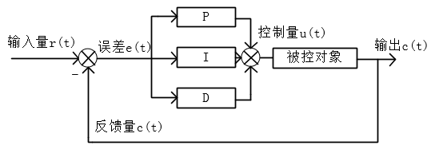

<script type="text/x-mathjax-config">
    MathJax.Hub.Config({
        tex2jax: {
        skipTags: ['script', 'noscript', 'style', 'textarea', 'pre'],
        inlineMath: [['$','$']]
        }
    });
</script>

<script src='https://cdnjs.cloudflare.com/ajax/libs/mathjax/2.7.5/latest.js?config=TeX-MML-AM_CHTML' async></script>


```
<script src="https://cdn.mathjax.org/mathjax/latest/MathJax.js?config=TeX-AMS-MML_HTMLorMML" type="text/javascript"></script>
```


# 控制算法

[TOC]

## PID控制

### PID控制器原理

PID控制器是比例控制器（Proportional，P）、积分控制器（Integral，I）、微分控制器（Derivative，D ）的组合，广泛的用于工业过程控制。

PID特点：

- 不基于模型，不用建立被控对象的数学模型
- 参数少，容易调节
- 可以满足众多的控制对象

#### PID结构图和数学表达式

PID结构图如下：



PID数学表达式为：$u(t) = K_{p}[e(t) + \frac{1}{T_{i}}\int_{0}^{t}e(t)dt+T_{d}\frac{de(t)}{dt}]$

其中：

- $e(t)$表示控制系统的误差信号，$e(t) = r(t)-c(t)$，输入-输出
- $Kp$表示比例控制器系数（比例增益）。越大，比例控制（P）作用越强
- $Ti$表示积分时间常数。越小，积分控制器（I）作用越强
- $Td$表示微分时间常数。越大，微分控制器（D）作用越强
- $u(t)$表示控制量，作用于被控对象

**PID** 控制的基本原理是：基于误差而消除误差（给定值和当前值的偏差），根据表达式中的三项，有：

- P：直接乘误差，纠正当前误差（现在）
- I：累计误差值，消除稳态误差、提高控制精度（过去）
- D：误差微分，加快响应（将来、趋势）

根绝误差的现在、过去和将来，消除误差。所以说是**基于误差而消除误差**。


#### 参数整定方法

（据说专业的人把调参叫做**整定**）

根据实际的控制系统，选择不同的组合方式，可以单独使用P，或者PD等等。PID的调参过程，完全靠经验。

调参方法为：先调 $Kp$ ，再调  $Kd$，最后调 $Ki$。如果PD控制时，系统输出能够较快、较准的跟踪输入，并且稳态无误差很小（在要求范围内），那么就不用加 I 控制器了。如果稳态误差较大，在加入 I 控制器，调  $Ki$。

调参具体过程为：

1.  $Kp$：从小变大，可以以2倍的形式变化。比如，一开始为1，输出小于输入。那就试2，输出小于输入。尝试4，输出大于输入，震荡有超调。那么可以确定参数应该在2~4之间，尝试3....这种类似折半的尝试，知道找到一个输出能较好的跟踪输入，超调又不大的参数。
2. $Kd$：增大可以使响应变快，本来是5s才能跟上输入，增大$Kd$后，3s就能跟踪上了，但是可能会引起震荡，可能还需要降低$Kp$。
3. $Ki$：如果PD控制不理想，比如有稳态误差，那就增大$Ki$消除稳态误差。同时可能还需要微调$Kp$、$Kd$

#### 位置式

数字PID控制算法分为位置式和增量式。

位置式数学表达式：$u(k) = K_{p}e(k) + K_{i}\sum_{i=0}^{k}e(i)+K_{d}[e(k) - e(k-1)]$

其中：

- $Kp$ 表示比例系数，比例控制器增益。越大，比例控制器作用越强
- $Ki$ 表示积分系数，积分控制器增益。越大，积分控制器作用越强（区别于积分时间常数）
- $Kd$ 表示微分系数，微分控制器增益。越大，微分控制器作用越强（区别于微分时间常数），微分项也可以写成两次误差之差再必上采样时间间隔，但是作用不大，只用$Kd$ 一个参数即可实现了
- $\sum_{i=0}^{k}e(i)$ 表示误差的累加和

```tip
注意：

位置式PID的数学式和上面公式略有差异，控制器的作用强度都是正比于控制器系数的，也比较符合认知。
```

位置式PID是当前系统的实际位置，与想要达到的预期位置的偏差，进行PID控制。因为有误差积分 ∑e(i)，一直累加。也就是当前的输出u(k)与过去的所有状态都有关系，用到了误差的累加值；（误差e会有误差累加），输出的u(k)对应的是执行机构的实际位置，一旦控制输出出错(**控制对象的当前的状态值出现问题** )，u(k)的大幅变化会引起系统的大幅变化。

并且位置式PID在积分项达到饱和时，误差仍然会在积分作用下继续累积，一旦误差开始反向变化，系统需要一定时间从饱和区退出，所以在u(k)达到最大和最小时，要停止积分作用，并且要有**积分限幅**和**输出限幅**

**所以在使用位置式PID时，一般我们直接使用PD控制**。**而位置式 PID 适用于执行机构不带积分部件的对象，如舵机和平衡小车的直立和温控系统的控制**

```tip
位置式PID优缺点：

优点：
位置式PID是一种非递推式算法，可直接控制执行机构（如平衡小车），u(k)的值和执行机构的实际位置（如小车当前角度）是一一对应的，因此在执行机构不带积分部件的对象中可以很好应用

缺点：
每次输出均与过去的状态有关，计算时要对e(k)进行累加，运算工作量大。

```

#### 增量式

当执行机构需要的不是控制量的绝对值，而是控制量的增量（例如去驱动步进电动机）时，需要用PID的“增量算法”。

增量式PID数学表达式为：$\Delta u(k) = u(k) - u(k-1)= K_{p}[e(k)-e(k-1)]+K_{i}e(k)+K_{d}[e(k)-2e(k-1)+e(k-2)]$

中间省略了推导过程。

所以：$u(k) = u(k-1)+ K_{p}[e(k)-e(k-1)]+K_{i}e(k)+K_{d}[e(k)-2e(k-1)+e(k-2)]$

其中：

- 比例P，$e(k)-e(k-1)$ 表示本次误差-上次误差
- 积分I，$e(k)$ 表示误差
- 微分D，$e(k)-e(k-1)+e(k-2)$ 表示本次误差-2*上次误差+上上次误差

```tip
增量式PID根据公式可以很好地看出，一旦确定了参数，只要使用前后三次测量值的偏差， 即可由公式求出控制增量
```

而得出的控制量$\Delta u(k)$对应的是近几次位置误差的增量，而不是对应与实际位置的偏差   没有误差累加，也就是说，增量式PID中不需要累加。控制增量Δu(k)的确定仅与**最近3次的采样值**有关，容易通过加权处理获得比较好的控制效果，并且在系统发生问题时，增量式不会严重影响系统的工作

```tip
总结

增量型 PID，是对位置型 PID 取增量，这时控制器输出的是相邻两次采样时刻所计算的位置值之差，得到的结果是增量，即在上一次的控制量的基础上需要增加（负值意味减少）控制量。

优点：
1.误动作时影响小，必要时可用逻辑判断的方法去掉出错数据。
2.手动/自动切换时冲击小，便于实现无扰动切换。当计算机故障时，仍能保持原值。
3.算式中不需要累加。控制增量Δu(k)的确定仅与最近3次的采样值有关。

缺点：
1.积分截断效应大，有稳态误差；
2.溢出的影响大。有的被控对象用增量式则不太好；

 
```


```tip
增量式与位置式区别：

1.增量式算法不需要做累加，控制量增量的确定仅与最近几次偏差采样值有关，计算误差对控制 量计算的影响较小。而位置式算法要用到过去偏差的累加值，容易产生较大的累加误差。 

2.增量式算法得出的是控制量的增量，例如在阀门控制中，只输出阀门开度的变化部分，误动作 影响小，必要时还可通过逻辑判断限制或禁止本次输出，不会严重影响系统的工作。 而位置式的输出直接对应对象的输出，因此对系统影响较大。

3.增量式PID控制输出的是控制量增量，并无积分作用，因此该方法适用于执行机构带积分部件的对象，如步进电机等，而位置式PID适用于执行机构不带积分部件的对象，如电液伺服阀。

4.在进行PID控制时，位置式PID需要有积分限幅和输出限幅，而增量式PID只需输出限幅
```


### 改进的PID

#### 积分限幅

#### 积分分离

#### 变速机分


## ADRC

不依赖数学模型、克服PID的缺点、

PID的缺点：1.误差的取值；2.PID的线性组合；3.误差微分信号提取

安排过渡过程TD，最速跟踪微分器的离散形式：


其中，是期望输入信号，为步长，是独立于的参数，且适当的大于步长


非线性误差反馈控制率NLSEF：


状态扩张观测器ESO


参数整定

TD参数：快速因子r，滤波因子h0。r越大，跟踪速度越快，但噪声放大越厉害；h0越大，滤波效果越好，但跟踪信号的相位损失越大。r和h0协调调整

ESO参数：六个。一般取0.5，取0.25；是状态误差反馈增益，实际系统取0.01，主要影响ESO收敛速度，参数越大对扰动估计的滞后越小，收敛速度越快。但如果取值过大，会出现观测器的震荡现象，对噪声的移植的作用也相对减弱。当知控制周期h确定时，取，，，则ESO可以很好的估计范围扰动。

由于扩张状态观测器对扰动的估计和补偿作用，在扰动幅值不大、变化不是很剧烈的情况下，完全可以实现精确补偿。所以可在假设扰动为零的情况下，对控制器的和进行初始值设定，整定原则如下

：是k还是


## Backstepping

使用Backstepping方法必须满足一个前提条件：系统的状态方程能够表达为严格的反馈形式，所以Backstepping方法也是基于被控对象数学模型的方法。Backstepping方法的原理基于Lyapunov稳定性原理，由前往后逐步设计控制器，又叫反步法。

严格反馈的微分方程表示如下：


其中，为系统的状态变量，为系统的控制输入，fi 、gi 为光滑的非线性函数，其中 gi不等于0。

在证明Backstepping方法的稳定性时，首先利用虚拟控制，定义由n个误差变量组成的误差系统：


其中，是每一步的虚拟控制量，在每一步构造一个Lyapunov函数，使得每一个状态分量具有适当的渐进性。

第一步，对于一阶系统，定义Lyapunov函数：


对Lyapunov函数进行求导：


根剧Lyapunov判别法，取，且，即可有，则系统稳定。

   第二步，对于二阶系统：


定义二阶系统的Lyapunov函数：


对二阶系统的Lyapunov函数求导有：


而：


所以最终：


所以，取虚拟控制量，且，即有：


从而使二阶系统稳定。

同理对于n阶系统，可以取虚拟控制量，，，即最终控制量u：


n阶系统的话Lyapunov函数及其导数如下：


所以整个系统是稳定的。

注意：写代码时，只需要往里套就行了。反步法的参数个数和系统的阶数相等，如果是，但是也收控制量的数目影响。


假设有一个二阶系统：


控制一个量，不用管是形式如何，只写出控制量u如下：


其中为控制量的期望的导数，如果是恒值控制系统，此项为0；为参数，均大于零：


 仿真代码：

```python
#
```


## 积分型Backstepping


## 自适应Backstepping

### 原理阐述

对于模型已知系统，可以使用Backstepping控制。因为Backstepping设计控制器时，需要被控对象的数学模型，所以，当被控对象有未知参数等，导致不能确定精确的数学模型时，就不能用时候Backstepping了。

这里假设对象中有一个未知参数，正常使用Backstepping设计控制器，然后去估计这个参数，从而进行控制。

假设有如下系统：


$$
\left\{
    \begin{array}{l}
            \dot{x_1} = x_2 \\ 
            \dot{x_2} = f(x_1,x_2) + bu \\
            y = x_1
        \end{array}
\right.       \tag{1}
$$


其中，$f$为非线性函数，其中有一个未知参数，$b$为控制增益，$u$为控制率（对象的输入），这里先当作1。

设有如下误差变量：


$$
\left\{
    \begin{array}{l}
            e_1 = x_{1d}-x_1 \\ 
            e_2 = v_1(x_1) -x_2
        \end{array}
\right.          \tag{2}
$$


其中，$x_1$为系统的输出，$x_{1d}$ 为 $x_1$ 的期望，即跟踪目标，$e_1$ 为跟踪误差。$v_1(x_1)$ 为虚拟控制量，即 $x_2$ 的期望（想要 $ x_1$ 稳定，需要取虚拟控制量 $v_1(x_1)$，同时 $x_1$ 的输入是 $x_2$ ）,在计算出最终控制量。

对于(2)式中的式 $e_1$ 求导，有 $\dot e_1 =\dot x_{1d}-\dot x_1$，定义 Lyapunov 函数 $V_1(e_1) = \frac{1}{2}e_1^2 >0$，并求导有：


$$
\dot V_1(e_1) = e_1 \dot  e_1 = e_1(\dot x_{1d}-\dot x_1)=e_1(\dot x_{1d}-x_2)                   \tag{3}
$$


如果$\dot V_1(e_1) < 0$，$x_1$即稳定，取虚拟控制量如下，即可满足条件：


$$
v_1(x_1)=x_{2d} = \dot x_{1d}+k_1e_1 (k_1>0)     \tag{4}
$$


这个虚拟控制量的取法为让$\dot x_{1d}-x_2 = -k_1e_1$，这样就可以保证$\dot V_1(e_1)  = -k_1e_1^2<0$

所以有


$$
\begin{align}

\dot e_1 =& \dot x_{1d}-x_2  \\
  =&  \dot x_{1d} - ( v_1(x_1) - e_2 ) \\
  =&  \dot x_{1d} -  \dot x_{1d} - k_1e_1 +e_2 \\
  =&   -k_1e_1 +e_2
\end{align}               \tag{5}
$$


再取 Lyapunov 函数$V_2(e_1,e_2) = \frac{1}{2}e_1^2 +  \frac{1}{2}e_2^2 >0$，对其求导有：


$$
\begin{align}

\dot V_2(e_1,e_2) =& e_1 \dot e_1 + e_2 \dot e_2 \\
  =& e_1(-k_1e_1 + e_2) + e_2 \dot e_2 \\
  =& -k_1 e_1^2 + e_2(e_1+\dot e_2) \\
  =& -k_1 e_1^2 +e_2(e_1 + \dot v_1(x_1)- \dot x_2) \\
  =& -k_1 e_1^2 +e_2(e_1 + \dot v_1(x_1)- f(x_1,x_2) - u)
\end{align}  \tag{6}
$$


如果 $V_2(e_1,e_2)<0$ ，$x_2$即稳定，即 $x_2$ 可以跟踪虚拟控制$v_1(x_1)$，进而 $x_1$稳定，取下式满足这个条

件：


$$
u =\dot v_1(x_1) + e_1 +k_2e_2-f  				  \tag{7}
$$


其中取法为：$e_1 + \dot v_1(x_1)- f(x_1,x_2) - u = -k_2e_2^2$，解出 $u$ 即可。

设计思路流程总结如下：

> 系统输出：输出是$y = x_1$,控制$x_1$稳定即可
>
> 对象输入：控制量$u$，$u$先更新$x_2$，$x_2$在更新$x_1$
>
> 控制$x_1$稳定：定一个误差变量$e_1$，控制$x_1$稳定，由Lyapunov稳定性定理，只要取一个虚拟控制$v_1(x_1)$就能使$x_1$稳定，即这个虚拟控制$x_1(x_1)$是控制$x_1$的输入，即是$x_2$的期望值
>
> 控制$x_2$稳定：定一个误差变量$e_2$，控制$x_2$稳定，由Lyapunov稳定性定理，只要取一个虚拟控制$v_2(x_1,x_2)$就能使$x_2$稳定，即这个虚拟控制$v_2(x_1,x_2)$是控制$x_2$的输入
>
> 因为是二阶系统，所以这个$v_2(x_1,x_2)$即是这个被控对象的输入$u$，即控制量。最终系统稳定


假设系统状态方程如下：
$$
\left\{
    \begin{array}{l}
            \dot{x_1} = x_2 \\ 
            \dot{x_2} = -ax_1 -bx_2 + u \\
            y = x_1
        \end{array}
\right.    \tag{8}
$$
其中，如果$a, b$均已知，可以直接设计控制器，进行控制。但是如果$f(x_1,x_2)=-ax_1-b_2$中的 $a$ 是未知的，就不能直接设计控制器，可以对未知参数$a$进行估计。

对 $a$ 进行估计，估计值为 $\hat{a}$ ，估计误差为$\tilde{a}$，即$\tilde{a} = a - \hat{a}$，假设未知参数$a$是恒值，或变化率很慢，接近为零，所以估计值误差的变化率如下：
$$
\dot{\tilde{a}} =\dot a -\dot{\hat{a}}  = -\dot{\hat{a}}   \tag{9}
$$
为了方便表示，这里估计误差表示为$e_3 = \tilde{a}$

定义 Lyapunov 函数$V_3(e_1,e_2,e_3) = \frac{1}{2}e_1^2 +  \frac{1}{2}e_2^2+\frac{1}{2}e_3^2 >0$，对其求导有：
$$
\begin{align}

\dot V_2(e_1,e_2,e-3) =& e_1 \dot e_1 + e_2 \dot e_2+ e_3 \dot e_3 \\
  =& e_1(-k_1e_1 + e_2) + e_2 \dot e_2 -\dot{\hat{a}} e_3   \\
  =& -k_1 e_1^2 + e_2(e_1+\dot e_2) -\dot{\hat{a}} e_3  \\
  =& -k_1 e_1^2 +e_2(e_1 + \dot v_1(x_1)- \dot x_2) -\dot{\hat{a}} e_3 \\
  =& -k_1 e_1^2 +e_2(e_1 + \dot v_1(x_1)- f(x_1,x_2) - u)-\dot{\hat{a}} e_3 \\
  =& -k_1 e_1^2 +e_2(e_1 + \dot v_1(x_1)+ ax_1+bx_2 - u)-\dot{\hat{a}} e_3 \\
  =& -k_1 e_1^2 +e_2(e_1 + \dot v_1(x_1)+ (\tilde{a} +\hat{a})x_1+bx_2 - u)-\dot{\hat{a}} e_3   \\ 
  =& -k_1 e_1^2 +e_2(e_1 + \dot v_1(x_1)+\hat{a} x_1 + bx_2 - u)-\dot{\hat{a}} e_3  + e_2 \tilde{a}  \\
  =& -k_1 e_1^2 +e_2(e_1 + \dot v_1(x_1)+\hat{a} x_1 + bx_2 - u)-\dot{\hat{a}} e_3  + e_2 e_3  \\
  =& -k_1 e_1^2 +e_2(e_1 + \dot v_1(x_1)+\hat{a} x_1 + bx_2 - u)+e_3 (e_2-\dot{\hat{a}}) \\
\end{align}  \tag{10}
$$
$a$ 的估计值$\hat{a}$的自适应率为$\dot{\hat{a}} = e_2$，取控制率有
$$
u =\dot v_1(x_1) + e_1 +k_2e_2-f  				  \tag{7}
$$


### 参数已知仿真

$a = 1, b = 2$

系统模型：

```python
################    二阶线性系统    #######################
# 系统数学模型如下：
# x1导 = x2
# x2导  = -a*x1 - b*x2 + u    (a,b>0)
# y = x1
# 系统描述：可用李雅普诺夫第二法，证明是该系统是稳定的；或者将状态方程
#           写成传递函数，再判断极点都在左半平面
# 
class SecondOrder1():
    # 参数：a,b>0，dt为控制周期
    def __init__(self, a, b, dt):
        self.x1 = 0
        self.x2 = 0 
        self.a = a  
        self.b = b
        self.dt = dt
        
        
    def getY(self, u):
        self.x2 = (-self.a*self.x1 - self.b*self.x2 + u)*self.dt + self.x2
        self.x1 = self.x2 * self.dt + self.x1

        return self.x1,self.x2


```

控制器：

```python
# --------  Backsteping  ----------------------
# 说明：针对的是二阶系统，且状态可反馈
# 被控对象模型如下：
# x1导 = f1(x1) + g1(x1)x2
# x2导 = f2(x1, x2) + g2(x1, x2)u
#
#
class SecBackstepping():
    # alpha1, alpha2为可调参数，dt为控制周期
    def __init__(self,alpha1, alpha2, dt):
        self.alpha1 = alpha1
        self.alpha2 = alpha2
        
        self.v1 = 0
        self.x1d = 0
        
        self.x1 = 0
        self.x2 = 0
        
        self.dt = dt
    
    # r，y表示期望输入和当前输出，
    def getU(self, r, y,x2):
        
        self.x1 = y
        self.x2 = x2
        z1 = r - y
        
        dx1d = (r - self.x1d)/self.dt
        self.x1d = r
        
        
        # 针对的系统数学模型如下：数学模型不同时，还需要修改此处
        # x1导 = x2
        # x2导  = -a*x1 - b*x2 + u    (a,b>0)
        # y = x1
        # 所以：f1 = 0, g1 = 1, f2 = -a*x1 - b*x2, g2 = 1
        
        f1 = 0
        g1 = 1
        f2 = -self.x1 - 2*self.x2
        g2 = 1 
        
        v1 = 1/g1*(dx1d - f1 + self.alpha1*z1)
        
        z2 = v1 - self.x2

        dv1 = (v1-self.v1)/self.dt
        self.v1 = v1

        ret = 1/g2*(dv1-f2+self.alpha2*z2 + g1*z1)
        return ret

```

测试程序：

```python
# -*- coding: utf-8 -*-
"""
Created on Tue Jun 15 21:56:12 2021

@author: zhang
"""

import numpy as np
import matplotlib.pyplot as plt

import ControlSystem as consys
import ControlMethod as conmed


#----------- 测试backstepping，和一个简单的二阶系统

# 控制周期
dt = 0.01

# 设置仿真开始、结束时间
start_time = 0  # 起始时间，一般是0
end_time   = 30   # 仿真持续时间，单位：秒 s

# 设置横轴时间轴坐标，0,1dt,2dt,...,ndt，不用修改
data_num = int((end_time - start_time) / dt)  # 仿真数据个数
time = np.linspace(start_time, end_time-dt, data_num)  # 整数个

# 设置输入、输出。输入输出的数据个数应与横轴坐标个数相同
r = np.sin(time)       # 根据横轴坐标，设置相应的纵轴坐标
y = [0]                # 设置初始输出为0，一个列表，存所有的输出值

data_u = [0]

# 创建被控对象模型
a, b =1, 2
demoSystem = consys.SecondOrder1(a, b, dt)

# 刚开始u很大，然后逐渐降低
alpha1 = 4   # alpha1增大，提高增益，滞后
alpha2 = 3    # 增大使系统超前，不太明显
demoMethodBackstepping = conmed.SecBackstepping(alpha1, alpha2, dt)

x2 = 0

# 设置循环次数：横轴坐标个数
for i in range(len(r)): 
    # 很久之前写的，数据个数的问题，使用了一个很恶心的方法解决了
    if i != 0:
        u = demoMethodBackstepping.getU(r[i],y[i-1],x2)  
        out,x2 = demoSystem.getY(u)
        y.append(out)
        data_u.append(u)


fig, ax = plt.subplots()

ax.plot(time, r, label='r', color = 'r')
ax.plot(time, y, label='y', color = 'g', linestyle="--")
#ax.plot(time, data_u, label='u', color = 'b', linestyle="-.")

ax.text(end_time/2-6,1, "alpha1="+str(alpha1), size=12, ha='center', va='center')
ax.text(end_time/2+3,1, "alpha2="+str(alpha2), size=12, ha='center', va='center')
ax.set_title('Test Backstepping')

ax.legend()
plt.show()
 
```

仿真结果如下：


前期控制量$u$很大...

### 参数估计仿真


## SMC


## 常用公式

长式等号对齐
$$
\begin{align}

=& \\
  =&  \\
  =&
\end{align}
$$


