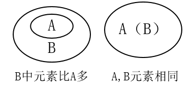
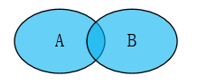
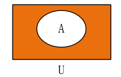
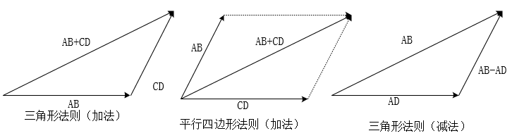
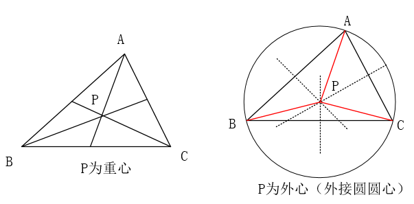
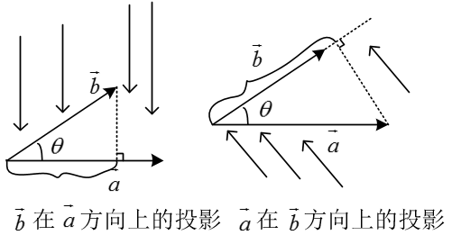

# 高中数学

[TOC]

## 集合与函数

### 集合的概念

#### 集合的定义

　　一般地，把研究对象统称为**元素**(element)，把一些元素组成的总体叫做**集合**(set，简称为**集**)。通常，使用小写字母a,b,c...等表示元素，使用大写字母A,B,C...等表示集合。

#### 常见数集

|       集合       |                   描述                   |        举例        |
| :--------------: | :--------------------------------------: | :----------------: |
| $N^{*}$或$N_{+}$ |      正整数集：所有正整数组成的集合      |     1,2,3,4...     |
|       $N$        | 自然数(非负整数)：全体非负整数组成的集合 |     0,1,2,4...     |
|       $Z$        |        整数集：全体整数组成的集合        | ...，-1，0,1，.... |
|       $Q$        |         有理数集：全体有理数组成         |                    |
|       $R$        |           实数集：全体实数组成           |                    |

#### 元素与集合的关系

　　元素与集合的关系有且仅有属于和不属于两种，并且二者必居其一。不存在模棱两可，可能属于也可能不属于的情况(三要素的确定性)

- 属于：元素a属于集合A，符号表示为 $a\in A$，该符号具有方向性，左边的元素，右边是集合，例如$A\in a$是错误的表示形式
- 不属于：元素a不属于集合A，符号表示为$a\notin A$

#### 集合的表示

使用花括号{}表示集合：

- 自然语言：使用自然语言描述，例：高一二班全体同学
- 列举法：把每一个元素都写在花括号里面，元素之间使用逗号，隔开，适用于元素个数少，且不好用数学语言(公式、表达式)描述的集合。例如：$｛1,2,10,11｝$
- 描述法：使用一个字母表示这个集合中的元素，再加上描述该元素的数学表达式(共同特征)，中间使用竖线隔开。例如：$｛x\mid 1<x<2｝$，表示为全体大于1且小鱼2的实数。如果元素有其他约束，在表达式后面加上即可：$｛x\mid 1<x<10, x\in Z｝$表示1到10之间的整数
- 区间法：使用区间的形式表示，和描述法有些类似，$｛x\mid 1<x<2｝$ 表示为$(1, 2)$
- 韦恩图(Venn diagram)：不太严格的意义下用以表示集合的一种草图。草图，用圈/方框等表示集合，点等表示集合中的元素。Venn 图表示的元素一般是有限个的，如果元素个数无限且连续可以使用数轴法
- 数轴法：使用数轴表示

列举一些描述法：

- $A = \lbrace x  \mid   f(x) = 0\rbrace$：表示方程$f(x) = 0 $的解集

- $A = \lbrace x  \mid  y = f(x)\rbrace$：表示方程$y= f(x) $的x的范围（定义域）

- $A = \lbrace y  \mid  y = f(x)\rbrace$：表示方程$y= f(x)$的y的范围（值域）

- $A = \lbrace (x, y)\mid y = f(x) \rbrace$：表示方程$y= f(x)$的图像上所有的点

  

#### 集合三要素

　　集合三要素指的是：任何一个集合，都要满足的条件(三条)。如果不满足(即使是一条)，那就不是集合。

- 确定性：指a要么属于A，要么不属于A。不存在模棱两可的情况，必有一个明确的判断依据。例如
  - 张三一米八，是高个子：错，没有明确高个子范围
  - 张三一米八，身高高于等于一米八的算是高个子，张三是高个子：对
- 互异性：集合中没有相同的元素。例如：$｛1,2,2｝$为错误的，因为有两个相同的元素
- 无序性：集合中元素的顺序对集合没有影响，一个集合的元素可以写成不同顺序。例如：$｛1,2,3｝$和$｛1,3,2｝$表示同一个集合。

#### 集合的分类

　　集合可以根据元素的个数或元素的种类分类(或者其他因素)

- 根据元素个数分为：空集和非空集
  - 空集：不含有任何元素的集合，符号表示为：$\varnothing$(发音fai)
  - 非空集：集合中有元素的集合
- 根据元素种类可以分为：数集、点集等等

  - 数集：集合中的元素是数，例：$｛1,2,3,4｝$
  - 点集：集合中的元素是点，例：$｛（1,2）， （2,3）｝$

注意：$\varnothing$和$｛0｝$是不同的集合

### 集合的基本关系

#### 子集

　　一般地，对于两个集合A,B,如果集合A中任意一个元素都是集合B中的元素，我们就说这两个集合有包含关系，称集合A为集合B的**子集**，记作：$A\subseteq B$(或$B\supseteq A$)。读作：A含于B或B包含A。

　　使用数学语言描述子集关系：${\forall}a\in A,都有a \in B，则A\subseteq B$，对A中任意元素，都属于B，则A是B的子集。

　　根据定义，有两种情况：B中元素比A中多、A和B中元素完全一样，使用venn图表示如下：

其中：A可以是空集

　　$A\subseteq B$，A是B的子集，有以下三种可能情况：

- A和B都非空，A是B的一部分
- A和B相同(相等、同一集合)，所以有“任何一个集合都是它自身的子集”
- A是空集

#### 真子集

　　如果$A\subseteq B$，但是存在元素$x\in B$，且$x\notin A$，我们称集合A是集合B的真子集，记作：$ A\subsetneqq B$（或$B\supsetneqq A$）

　　集合B的元素必然比集合A的元素多。

#### 相等集合

　　A、B中的元素完全一样，则A与B相等，记作：$A=B$。

　　严格表述为：A是B的子集，且B也是A的子集，则$A=B$

#### 空集的扩展

　　空集：空集是不含有任何元素的集合，有如下规定结论：

- 空集是任何集合的子集（空集是空集的子集）
- 空集是任何非空集合的真子集

**一些结论：**

　　如果一个集合有n的元素，则：

- 有$2^{n}$个子集（包括空集和自身）
- 有$2^{n}-1$个真子集（包括空集，不包括自身）
- 有$2^{n}-1$个非空子集（不包括空集，包括自身）
- 有$2^{n}-2$个非空真子集（不包括空集，不包括自身）

　　以上结论可以列举出，如下列出集合$｛1,2｝$的子集、真子集：

- 子集：$\varnothing$，$｛1｝$，$｛2｝$，$｛1,2｝$共4个
- 真子集：$\varnothing$，$｛1｝$，$｛2｝$共3个，排除掉自己本身
- 非空子集：$｛1｝$，$｛2｝$，$｛1,2｝$共３个，去掉空集
- 非空真子集：$｛1｝$，$｛2｝$共２个，排除掉自己本身和空集

### 集合的基本运算

#### 并集

　　一般地，由所有属于集合A或属于集合B的元素所组成的集合，称为集合A与B的并集，记作：$A \cup B$，读作“A并B”。

即：$A \cup B=\lbrace x\mid x\in A, 或 x\in B\rbrace$

venn图表示如下：

一些结论如下：

- $A\cup B = B \cup A$（交换律）
- $(A\cup B )A\cap C = (A\cap C)\cup(B\cap C) $（分配率）
- $A\cup A= A$
- $A\cup \varnothing = \varnothing \cup A = A$
- 若$A\subseteq B$，则$A\cup B = B$
- 若$A\cup B = B$，则$A\subseteq B$

#### 交集

　　一般地，由属于A且属于B的所有元素组成的集合，称为A与B的交集，记作：$A \cap B$，读作“A交B”，即：$A \cap B=\lbrace x \mid x\in A,且x\in B\rbrace$

venn图如下：

一些结论如下：

- $A \cap B = B \cap A$（交换律）
- $(A\cap B )A\cup C = (A\cup C)\cap(B\cup C) $（分配率）
- $A \cap A= A$
- $A\cap \varnothing = \varnothing \cap A = \varnothing$
- 若$A\subseteq B$，则$A \cap B = A$
- 若$A \cap B = A$，则$A\subseteq B$
- $A \cap B \subseteq A\cup B$

#### 补集

　　一般地，如果一个集合含有我们所研究问题中所涉及的所有元素，那么就称这个集合为**全集**，通常记作$U$。对于一个集合A，由全集$U$中不属于A的所有元素组成的集合称为A相对于全集$U$的**补集**，简称为集合A的补集，记作：$\complement_UA$，即：$\complement_UA=\lbrace x\mid x\in U,且x\notin A\rbrace$,

就是在U中把A挖掉，剩下的部分，venn图如下：

一些结论如下：

- $(\complement_UA)\cap A = \varnothing$
- $(\complement_UA)\cup A = U$ 
- $\complement_UU = \varnothing$
- $\complement_U \varnothing = U$
- $\complement_U(\complement_UA) = A$
- $(\complement_UA)\cup(\complement_UB) = \complement_U(A\cap B)$
- $(\complement_UA)\cap(\complement_UB) = \complement_U(A\cup B)$
- $(\complement_UA)\cup(\complement_UA)\cup(\complement_UA)=\complement_U(A\cap B\cap C)$

#### 相关结论

- 一般地，对任意两个有限集合A、B，有：$card(A\cup B)=card(A)+card(b)-card(A\cap B)$，card(A)表示集合A中元素个数

- 一般地，对任意两个有限集合A、B，有：

  $card(A\cup B\cup C)=card(A)+card(B)+card(C)-card(A\cap B)-card(A\cap C)-card(B\cap C)+card(A\cap B\cap C)$

  

  

### 函数

#### 函数定义

## 平面向量

### 平面向量的概念及其线性运算

#### 相关概念

**1.**向量：既有大小，又有方向的量。向量的大小叫向量的长度（或模），使用两个$\vert$夹住。例如向量$ \vec{a}$的长度/模为$\vert \vec{a} \vert$,向量$\vec{AB}$的长度/模为$\vert\vec{AB} \vert$

**2.**零向量：长度为零的向量，方向可以使任意的。记作$\vec{0}$,可以理解为一个点。零向量平行(共线)于任一向量

**3.**单位向量：长度为1个单位的向量，非零向量$\vec{a}$的单位向量为$\pm \frac{\vec{a}}{\vert\vec{a} \vert}$,单位向量不一定是相等的

**4.**平行向量：方向相同或相反的非零向量

**5.**共线向量：方向相同或相反的非零向量又叫共线向量，即$\vec{a} // \vec{b}$。平行向量也称为共线向量，两个概念之间没有区别

**6.**相等向量：长度相等且方向相同的向量。向量只有相等和不等，不能比较大小

**7.**相反向量：长度相等且方向相反的向量。零向量的相反向量为零向量，$\vec{a}$的相反向量为$-\vec{a}$，$\vec{AB}$的相反向量为$-\vec{BA}$

**8.**向量的表示：几何表示法、字母表示法、坐标法

- 几何表示法：用有向线段表示向量的三个要素（起点、方向、长度）。例如起始点是A点，终止点是B点，则这个向量表示为$\vec{AB}$
- 字母表示法：使用小写a,b,c..等字母,在字母上加上一个箭头，表示一个向量，例如：$\vec{a}、\vec{b}$。
- 坐标法：使用平面向量的坐标表示法

**9.**向量的平移：向量平行移动不改变这个向量，仍是原向量。只有大小或者方向改变了，向量才变化

#### 向量的线性运算

**1.**加法：求两个向量和的运算，满足交换律和结合律，$\vec{a} + \vec{b} = \vec{b} + \vec{a}$；$(\vec{a} + \vec{b}) +\vec{c}= \vec{a} + (\vec{b} +\vec{c})$。两个向量相加有三种情况:

- 首尾连接：三角形法则。补上一条边，构成三角形，和为补的这条线段坐标是的向量，方向为一个首指向另一个尾。如果是几何表示法，则结果为第一个向量的首指向最后一个向量的尾，例如：$\vec{AB}+\vec{BC}=\vec{BC}$，如果是多个都是首尾连接，也满足这个形式

- 首首连接：平行四边形法则。以这两个向量为邻边做一个平行四边形，对角线即为这两个向量的和向量（与首点连接的对角线）

- 非首尾，也非首首连接：移动其中一个向量与另一个成为首尾连接，或者首首连接的形式

  

三角形法则和平行四边形法则，本质上可以相互转化（注意上面的向量$\vec{AB}$不是没有箭头，是画图工具不能输入箭头）

**2.**减法：两个向量的差，即一个加上另一个向量的相反向量，$\vec{a}-\vec{b} = \vec{a}+(-\vec{b})$。使用三角形法则。指向性：共起点、连终点，减号后边的向量指向减号前边的向量，例如：$\vec{AB}-\vec{AC}=\vec{CB}$

**3.**数乘：实数$\lambda $与向量$\vec{a}$乘积的运算，$\lambda  \vec{a}$仍为向量，有如下性质：

- $ \vert \lambda  \vec{a} \vert$ = $ \vert   \lambda  \vert   \vert \vec{a} \vert$
- $ \lambda (\mu  \vec{a} )$ = $ (\lambda \mu)   \vec{a} $
- $ (\lambda +\mu  )\vec{a} $ = $\lambda  \vec{a} +\mu  \vec{a}$
- $ \lambda (\vec{a}+\vec{b}) $=$ \lambda \vec{a}+\lambda\vec{b}$
- 当$\lambda >0$时，$\lambda  \vec{a} $的方向与$\vec{a}$的方向相同
- 当$\lambda <0$时，$\lambda  \vec{a} $的方向与$\vec{a}$的方向相反
- 当$\lambda =0$时，$\lambda  \vec{a} =\vec{0}$，即使为0，也是向量，零向量

常用结论：

- $\Delta ABC$中：
  - D为BC中点，则$\vec{AD} = \frac{1}{2}(\vec{AB} +\vec{AC} )$(构造一个平行四边形)

  - 重心：中线的交点，重心到顶点的距离是到相应边上中点距离的两倍，即：$\vec{PG} = \frac{1}{3}(\vec{PA}+\vec{PB}+\vec{PC})$$\Leftrightarrow$G为重心。当$\vec{PA}+\vec{PB}+\vec{PC} = 0$$\Leftrightarrow$P为重心。当

  - $\vert \vec{PA}  \vert =\vert  \vec{PB}  \vert =\vert  \vec{PC}  \vert $$\Leftrightarrow$P为外心

    
- 由向量加法、减法的集合意义，可得向量不等式：$\vert  \vert  \vec{a} \vert - \vert \vec{b} \vert \vert \leqslant \vert  \vec{a} \pm \vec{b}  \vert  \leqslant \vert  \vec{a} \vert  + \vert  \vec{b} \vert $

#### 共线向量定理

定理：向量$ \vec{a}$($ \vec{a} \neq \vec{0}$)与$\vec{b}$共线，当且仅当有唯一一个实数$\lambda$,使$\vec{b}=\lambda \vec{a}$。

说明：

- 定理中限定了$ \vec{a} \neq \vec{0}$，因为如果$ \vec{a} = \vec{0}$:

  - 当$ \vec{b} \neq \vec{0}$,$ \vec{a}$与$ \vec{b}$共线，但是$\lambda$不存在

  - 当$ \vec{b} =\vec{0}$,$ \vec{a}$与$ \vec{b}$共线，这时$\lambda$不唯一

    因此要限定$ \vec{a} \neq \vec{0}$的目的是保证$\lambda$存在且唯一

- $\vec{a} // \vec{b}\Leftrightarrow \vec{b}=\lambda \vec{a}($$\vec{a} \neq \vec{0}$)，是判断两个向量共线的主要依据；证明三点共线问题，可用向量共线解决，但是要注意向量共线与三点共线的区别联系，当两向量共线且有公共点时，才能得出三点共线

- 三点共线的等价关系，一下条件均是等价的(要会证明，或者记住结论)

  - A、P、B三点共线
  - $ \vec{AP} = t\vec{AB}(t \neq0)$
  - $\vec{OP}=(1-t)\vec{OA}+t\vec{OB}$(O为平面内异域A、P、B的任一点，$t \neq 0$)
  - $\vec{OP}=x\vec{OA}+y\vec{OB}$(O为平面内异于A、P、B的任一点，$x+y = 1,x \in R,y \in R,x \neq 0,y \neq 0$)

### 平面向量基本定理及坐标表示

**1.**平面向量基本定理：如果$ \vec{e_1},\vec{e_2}$,是同一平面内的两个不共线向量，那么对于这一平面内的任意向量$\vec{a}$,有且只有一对实数$\lambda_1,\lambda_2$,使$\vec{a} = \lambda_1  \vec{e_1}+\lambda_2  \vec{e_2}$，不共线的向量$ \vec{e_1},\vec{e_2}$叫做基底

- 基底向量是不共线向量，所以都是非零向量
- 同一平面内任意两个不共线向量都可以作为基底，即同一平面内基底不唯一
- 基底确定后，平面内任一向量的表示都是唯一的

**2.**平面向量的坐标表示：在平面直角坐标系中，分别取x轴和y轴方向相同的两个单位向量$ \vec{i},\vec{j}$作为基底，对于平面内的一个向量$ \vec{a}$,由平面向量基本定理可知，有且只有一对实数x,y使得$\vec{a} = x  \vec{i}+y\vec{j}$，则有序数对$(x,y)$,叫做向量$\vec{a}$的坐标，记作：$\vec{a} = (x, y)$，这个式子叫做向量$\vec{a}$的坐标表示

- 平面向量的坐标表示建立向量的几何运算与代数运算之间的关系

**3.**坐标计算：

- 已知点$A(x_1,y_1),B(x_2,y_2)$,则$\vec{AB}=(x_2-x_1,y_2-y_1)$
- 已知$a=(x_1,y_1),b=(x_2,y_2)$,则$\vec{a}\pm\vec{b}=(x_2\pm x_1,y_1\pm y_2)$
- $\lambda \vec{a} = (\lambda x_1,\lambda y_1)$

*.解题方法：

- 基底法：先选择一组基底，优先选模和夹角已知的不共线向量，在根据其他条件解题
- 几何法：将向量用有向线段表示，利用几何性质解题
- 坐标法：建立平面直角坐标系，将向量坐标化，利用向量的坐标解决问题

### 平面向量的数量积

1.向量夹角的定义：已知两个非零向量$\vec{a}$和$\vec{b}$,作$\vec{OA} = \vec{a}$,$\vec{OB} = \vec{b}$，则$\ang{AOB}=\theta(0^\circ \leqslant \theta \leqslant 180^\circ )$叫做向量$\vec{a}$与$\vec{b}$的夹角。

- 当$\theta = 0^\circ$时，$\vec{a}$与$\vec{b}$同向
- 当$\theta = 180^\circ$时，$\vec{a}$与$\vec{b}$反向
- 当$\theta = 90^\circ$时，$\vec{a}$与$\vec{b}$垂直，记作：$\vec{a}\perp\vec{b}$

注意：求解向量夹角时，必须把两向量平移到共起点，如$\Delta ABC$中，$\vec{AB}$与$\vec{BC}$的夹角不是B，而是B的补角

**2.**数量积：已知两个非零向量$\vec{a}$与$\vec{b}$，把$\vert \vec{a}\vert\vert\vec{b}\vert \cos \theta$叫做$\vec{a}$与$\vec{b}$的数量积(或内积，结果是一个数)，记作$\vec{a} \cdot  \vec{b}=$,其中$c\theta$是$\vec{a}$与$\vec{b}$的夹角

- 规定：零向量与任一向量的数量积为0
- $0^\circ \leqslant \theta<90^\circ$时，$\vec{a} \cdot  \vec{b}>0$
- $0^\circ=90^\circ$时，$\vec{a} \cdot  \vec{b}=0$
- $90^\circ < \theta\leqslant 180^\circ$时，$\vec{a} \cdot  \vec{b}<0$

**3.**数量积的几何意义：$\vert\vec{b}\vert \cos \theta$叫做向量$\vec{a}$在$\vec{b}$方向上($\vec{b}$在$\vec{a}$方向上)的**投影**(结果是一个数)。$\vert\vec{b}\vert \cos \theta   = \frac{\vec{a} \cdot  \vec{b} }{\vert\vec{a}\vert} $，注意正负

**4.**数量积的运算

- $\vec{a} \cdot  \vec{b}  = \vec{b} \cdot  \vec{a} $（交换律）
- $(\lambda \vec{a}) \cdot  \vec{b}  =\lambda ( \vec{a} \cdot  \vec{b})  = \vec{a} \cdot  (\lambda  \vec{b})$（结合律）
- $(\vec{a} +\vec{b} )\cdot  \vec{c}  = \vec{a} \cdot  \vec{c}+\vec{b} \cdot  \vec{c} $（分配律）
- 若$\vec{a} 、\vec{b} 、  \vec{c} $是非零向量，且$\vec{a} \cdot  \vec{c}  = \vec{b} \cdot  \vec{c} $,不能得到$\vec{a} =\vec{b}  $,数量积不满足消去律
- $(\vec{a} \cdot \vec{b} )\cdot  \vec{c}  \neq \vec{a} \cdot ( \vec{b} \cdot  \vec{c}) $,数量积不满足结合律
- $(\vec{a} \pm\vec{b} )^2  = \vec{a}^2+\vec{b}^2 \pm 2\vec{a}\vec{b}$
- $(\vec{a} +\vec{b})(\vec{a} -\vec{b}) = \vec{a}^2-\vec{b}^2$

**5.**数量积性质：设$\vec{a}$与$\vec{b}$为非零向量，$\theta$是$\vec{a}$与$\vec{b}$的夹角，

**6.**数量积的坐标表示：已知非零向量$\vec{a} = (x_1,y_1)$,$\vec{b} = (x_2,y_2)$

- $\vec{a} \cdot  \vec{b}  = x_1x_2+y_1y_2$

- $ \cos \theta  = \frac{x_1x_2+y_1y_2} {\sqrt{(x_1^2+y_1^2)   }\sqrt{(x_2^2+y_2^2)   }}$ $\theta $为$\vec{a}$与$\vec{b}$的夹角

- $\vert \vec{a} \vert  = \sqrt{x_1^2+y_1^2}$

- 若$\vec{a}\perp\vec{b}$，则$\vec{a} \cdot  \vec{b} =\vert \vec{a}\vert\vert\vec{b}\vert \cos 0^\circ = x_1x_2+y_1y_2=0$

- $\vec{a}//\vec{b}$等价于$\vec{a} = \lambda \vec{b}(\vec{b} \neq \vec{0})$等价于$x_1y_2-x_2y_1=0$等价于$x_1y_2=x_2y_1$等价于$\frac{x_1}{{x_2}} = \frac{y_1}{{y_2}}$等价于$\frac{x_1}{{y_1}} = \frac{x_2}{{y_2}}$

  

