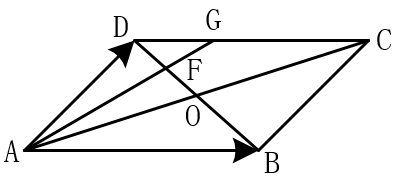

# 高中数学练习题

[TOC]

## 集合与函数

### 做题要点

关键字：

- 最多、至多：最多、至多2个，可能情况：0个、1个、2个
- 最少、至少：最少、至少2个，可能情况2个、3个...，不可能是0、1个
- 仅有、恰有：仅有、恰有2个，只能是2个
- 

范围：

- Z，R等集合约束

读题：

- 注意集合类型：点集、数集
- 注意元素的表示符号：是用x还是用的y

### 题型（待完善）

**1.**直接给出多个集合的列举描述形式（不含有未知数），问：它们之间的交集、并集、补集等运算之后得到的集合中的元素都有那些？

　　解法：直接运算，用笔勾画没有的元素和圈上有的元素。例题如下：

- 设全集$U=\lbrace 1,2,3,4,5,6  \rbrace$ ，集合$P = \lbrace 1,2,3,4 \rbrace$,$Q=\lbrace 3,4,5 \rbrace$，则$P \cup(\complement_UQ) = $

  A.$\lbrace 1,2,3,4,6  \rbrace$ B.$\lbrace 1,2,3,4,5  \rbrace$  C.$\lbrace 1,2,5  \rbrace$  D.$\lbrace 1,2 \rbrace$ 

**2.**不直接给出集合的具体元素都是多少，而是以含有未知数的复杂表达式来描述，问它们之间的交集、并集、补集等运算之后得到的集合中的元素都有那些？（涉及到解一元二次方程）

　　解法：先求出表达式中未知数的值或者范围，确定集合具体形式。如果集合中的元素是可以一一列举出来的，那么归位第１种题型；如果元素是无穷的，则使用数轴表示法较好。例题如下：

- 已知集合$A=\lbrace x \mid x^2+3x-10 \leqslant0 \rbrace$,集合$B = \lbrace x \mid x^2+x-12 =0 \rbrace$，则$A \cap B是多少？$（$\lbrace x \mid  4\leqslant x < 2  \rbrace$）

  扩展：一元二次、一元多次方程、不等式、绝对值不等式的解法，草图画法（穿根法）

**3.**给出几个集合，但是没有直接给出集合描述，带有未知变量需要求解方程，并且集合中还有一个参数（未知的），又已知集合之间的一些关系，问：这个未知数的范围。例题如下：

　　解法：求出集合的描述，然后根据关系，求解参数范围

- 已知集合$A = \lbrace x \mid x<a \rbrace$,$B = \lbrace x \mid 1\leqslant x <2 \rbrace$,且$A \cup(\complement_UB) = R$,则实数a的取值范围是多少？（$\lbrace a\mid  a \geqslant 2 \rbrace$）

**4.**给出几个集合（直接或者间接），问：它们之间存在那种关系（交集、并集、补集等等）

　　解法：各个选项间差异较大，一般一个一个排除。例题如下：

- 已知集合$A = \lbrace x \mid x^2-x-2<0  \rbrace$ ,$A = \lbrace x \mid  -1<x<1  \rbrace$,则      B

  A.$ A\subsetneqq B$      B.$ B\subsetneqq A$      C.$A=B$    D.$A \cap B = \varnothing$

### 解题方法

### 集合基础练习题

**1.**已知集合$A=\lbrace m+2, 2m^2+m      \rbrace$ ,若$3 \in A$,则m的值为（-3/2）

**2.**已知集合$A=\lbrace  x \mid mx^2-3x+2= 0  \rbrace$ ，若A中之多一个元素，求实数m的取值范围（$A=\lbrace m  \mid  m = 0或m\geqslant \frac{9}{8}     \rbrace$）

**3.**已知集合$A=\lbrace  x\mid x^2-3x+2=0, x \in R \rbrace$,$B=\lbrace x  \mid 0<x<5,x \in N\rbrace$,则满足条件的$A \subseteq  B\subseteq C$的集合C的个数为（4个）

**4.**下列式子中，正确是有（1,2,4,6）：1) $\lbrace  a,b \rbrace\subseteq\lbrace  b,a\rbrace$；2) $\lbrace  a,b \rbrace=\lbrace  b,a \rbrace$；3) $\lbrace 0 \rbrace=\lbrace \varnothing \rbrace$；4) $0 \in\lbrace 0 \rbrace$；5) $\varnothing  \in \lbrace 0 \rbrace$；6) $\lbrace \varnothing \rbrace\subseteq \lbrace 0 \rbrace$

**5.**$M=\lbrace 1,2,3,4,5,6,7\rbrace$,$N\neq \varnothing $，$N\subseteq M$,若$a\in N$,则$8-a \in N$,则满足条件的集合N的个数为（15）

**6.**集合$\lbrace 1, a, \frac{b}{a} \rbrace= \lbrace 0, a^2, a+b  \rbrace$,则$a^{2021}+b^{2021}$的值为（-1）

**7.**已知集合$A=\lbrace x\mid x>a \rbrace$,$B=\lbrace x\mid x^2-3x+2>0 \rbrace$,若$A\subseteq B$，则实数a的取值范围是（$a \geqslant 2$）

**8.**已知集合$A=\lbrace x\mid x^2-2x-8 = 0 \rbrace$,$B=\lbrace x\mid x^2+ax+a^2-12=0 \rbrace$,当$B \subseteq A$时，求实数a的取值范围（$a<-4$或$a=-2$或$a\geqslant 4$）

**9.**已知集合$A =\lbrace  1,2,3  \rbrace$,$B = \lbrace x \mid (x+1)(x-2)<0, x \in Z   \rbrace$，则$A \cup B = $($A =\lbrace 0, 1,2,3  \rbrace$)

**10.**已知$A = \lbrace  x\leqslant  5  \rbrace$,$B = \lbrace  x \mid x>2a-1  \rbrace$,若$A \cup B = R$，求实数a的取值范围（$\lbrace a \mid a \leqslant 3 \rbrace$）

**11.**设集合$A = \lbrace -2, 0, 4   \rbrace$,$B = \lbrace m, m^2   \rbrace$,则使$A \cup B=A$成立的m的值为（m=-2）

**12.**设集合$A=\lbrace 1,2,3,4   \rbrace$,$B=\lbrace -1,0,2,3   \rbrace$,$C=\lbrace x \in Z \mid -1 \leqslant x<2  \rbrace$,则$(A \cup B)\cap C=$  ($\lbrace -1, 0, 1  \rbrace$)

**13.**设集合$A=\lbrace x >-1   \rbrace$,$B=\lbrace x \leqslant 2 \rbrace$,则$A \cap B = $   ($A = \lbrace x \mid -1<ｘ\leqslant ２\rbrace$)

**14.**设集合$A=\lbrace  1,2,4  \rbrace$,$A=\lbrace x \mid -4x+m = 0  \rbrace$,若$A\cap B = \lbrace  1  \rbrace$,则$B=$   （$\lbrace  1,3  \rbrace$）

**15.**已知集合$A=\lbrace x \mid x^2-3x-10   \rbrace$, $B=\lbrace x \mid  m+1 \leqslant x  \leqslant 2m- 1)  \rbrace$，若$A \cap B=B$,则实数m的范围是（$\lbrace m \mid m \leqslant3  \rbrace$）

### 集合巩固提高练习题(模拟题和真题)

**1.**设集合$A = \lbrace 0,2,4,6,8,10  \rbrace$,$B = \lbrace 4,8  \rbrace$,则$\complement_AB = $       C

　　A.$\lbrace 4,8  \rbrace$  B.$\lbrace  0,2,6 \rbrace$  C.$\lbrace  0,2,6,10 \rbrace$  D.$\lbrace  0,2,4,6,8,10 \rbrace$

**2.**设集合$U= \lbrace 1,2,3,4,5,6  \rbrace$，$A=\lbrace 1,3,5  \rbrace$,$B = \lbrace 3,4,5  \rbrace$,则$\complement_U(A \cup B)$

　　A.$\lbrace 2,6  \rbrace$  B.$\lbrace 3,6  \rbrace$  C.$\lbrace 1,3,4,5  \rbrace$  D.$\lbrace 1,2,4,6  \rbrace$

**3.** 设集合$A = \lbrace x \mid -2 \leqslant x \leqslant 2 \rbrace$ ,$Z$为整数集，则集合$A \cap Z$中元素的个数是   C

　　A.3  B.4   C.5   D.6

**4.**设集合$A = \lbrace x \mid x^2-4x+3 <0  \rbrace$ ,$B = \lbrace x \mid 2x-3>0  \rbrace$ 则$A \cap B=$    D

　　A.$(-3,-\frac{3}{2})$    B.$(-3, \frac{3}{2}) $  C.$(1, \frac{3}{2}) $    D.$(\frac{3}{2}, 3) $

## 平面向量

### 题型

1.向量间的位置关系，平行或垂直，可能给出位置关系，也可能不给

2.一个向量用两外几个向量的表示（表示之后还有数量积等关系）

3.共线问题

4.数量积

5.概念问题

6.其他类型（结合图形、取值范围等等）

### 基础题

**1.**判断四边形ABCD的形状

- $\vec{AD}=\vec{BC}$   
- $\vec{AB}=\vec{DC}$,且$\vert\vec{AB}\vert =\vert \vec{AD}\vert$

**2.**判断下列命题是否正确，并说明理由

- 若向量$\vec{a}$与$\vec{b}$同向，且$\vert \vec{a} \vert > \vert \vec{b} \vert$,则$\vec{a}>\vec{b}$
- 若向量$\vert\vec{a}\vert =\vert \vec{b}\vert$，则$\vec{a}$与$\vec{b}$的长度相等且方向相同或相反
- 对于任意向量$\vert\vec{a}\vert =\vert \vec{b}\vert$，若$\vec{a}$与$\vec{b}$方向相同，则$\vec{a}=\vec{b}$
- 因为零向量方向不确定，所以零向量与任一向量都不平行
- 若向量$\vec{a}$与$\vec{b}$平行，则向量$\vec{a}$与$\vec{b}$方向相同或者方向相反

**3.**若点O是$\triangle ABC$所在平面内的一点，且满足$\vert\vec{OB}-\vec{OC}\vert = \vert\vec{OB}+\vec{OC}-2\vec{OA}\vert $,则$\triangle ABC$的形状为？

**4.** 如图，平行四边形$ABCD$中，若$\vec{AB}=\vec{a}$,$\vec{AD}=\vec{b}$,设AC与BD相交于点O，F是线段OD的中点，AF的延长线交DC于点G，试用$\vec{a}$与$\vec{b}$表示$\vec{AG}$

**5.**设$\vec{a}$与$\vec{b}$不平行，向量$\lambda \vec{a}+\vec{b}$与$\vec{a}+2\vec{b}$平行，则实数$\lambda$为多少

**6.**如图所示，在$\triangle ABC$中，点O是BC的中点，过点O的直线分别交直线AB、AC于不同的两点M、N，若$\vec{AB}=m\vec{AM}$，$\vec{AC}=m\vec{AN}$，则m+n的值是多少

**7.**如图，经过$\triangle ABC$的重心G的直线与OA、OB分别交于点P、Q，设$\vec{OP} = m\vec{OA}$,$\vec{OQ} = n\vec{OB}$,$m,n \in R$,则$\frac{1}{m}+\frac{1}{n}$的值为多少

**8.**在梯形ABCD中，AB//CD，AB=2CD，M、N分别为CD、BC的中点，若$\vec{AB} = \lambda \vec{AM}+\mu\vec{AN}$,则$\lambda+\mu$等于多少

**9.**已知点M是$\triangle ABC$的边BC的中点，点E在边AC上，且$\vec{EC} =2\vec{AE}$，则向量$\vec{EM}=$

A.$\frac{1}{2}\vec{AC}+\frac{1}{3}\vec{AB}$  B.$\frac{1}{2}\vec{AC}+\frac{1}{6}\vec{AB}$  C.$\frac{1}{6}\vec{AC}+\frac{1}{2}\vec{AB}$  D.$\frac{1}{6}\vec{AC}+\frac{3}{2}\vec{AB}$

**10.**已知$\vert \vec{a} \vert = 8$,$\vec{e}$为单位向量，$\vec{a}$与$\vec{e}$的夹角为$150^\circ$,则$\vec{a}$在$\vec{e}$方向上的投影为多少

**11.**已知$\vert \vec{a} \vert = 6$，$\vert \vec{b} \vert =3$，$\vec{a} \cdot  \vec{b}=-12$,则向量$\vec{a}$在$\vec{b}$方向上的投影为

**12.**已知$\vert \vec{a} \vert = 3$，$\vert \vec{b} \vert = 6$，

- 当$\vec{a}//\vec{b}$时，$\vec{a} \cdot  \vec{b}=？$
- 当$\vec{a}\perp\vec{b}$时，$\vec{a} \cdot  \vec{b}=？$
- $\vec{a}$与$\vec{b}$的夹角是$60^\circ$时，$\vec{a} \cdot  \vec{b}=？$

**13.**已知等边三角形$\triangle ABC$的边长为2，若$\vec{BC}=3\vec{BE}$，$\vec{AD}=\vec{DC}$，则$\vec{BD} \cdot  \vec{AE}=?$

**14.**如图，在平行四边形ABCD中，$AP\perp BD$，垂足为P，且AP=3，则$\vec{AP}\cdot  \vec{AC}$

**15.**已知向量$\vec{a} = (m,4)$,$\vec{b} = (3,-2)$,且$\vec{a}//\vec{b}$,则m=？

**16.**设向量$\vec{a} = (m,1)$,$\vec{b} = (1,2)$,且$\vert \vec{a}+\vec{b} \vert^2=\vert \vec{a} \vert^2+\vert \vec{b} \vert^2$，则m=？

**17.**已知向量$\vec{a} = (1,m)$,$\vec{b} = (3,-2)$,且$(\vec{a}+\vec{b})\perp \vec{b}$ ，则m=?

**18.**设D为$\triangle ABC$所在的平面内一点，$\vec{BC}=3\vec{CD}$,则

A.$\vec{AD} = -\frac{1}{3}\vec{AB}+\frac{4}{3}\vec{AC}$  B.$\vec{AD} = \frac{1}{3}\vec{AB}-\frac{4}{3}\vec{AC}$   

C.$\vec{AD} = \frac{4}{3}\vec{AB}+\frac{1}{3}\vec{AC}$     C.$\vec{AD} = \frac{4}{3}\vec{AB}-\frac{1}{3}\vec{AC}$

**19.**平行四边形ABCD，$\vert \vec{AB} \vert=6$,$\vert \vec{AD} \vert=4$,若点M、N满足$\vec{BM}=3\vec{MC}$，$\vec{DN}=2\vec{NC}$，则$\vec{AM} \cdot  \vec{NM}=？$

