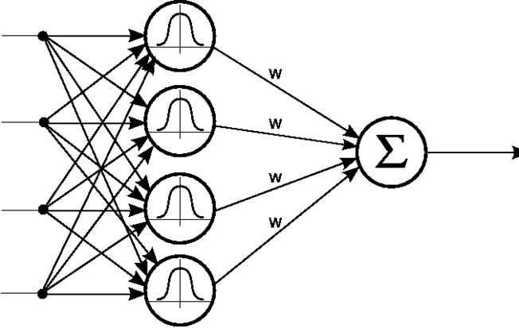
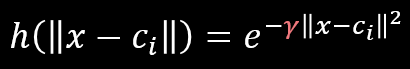
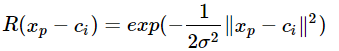
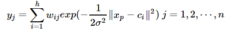

[TOC]

# 神经网络入门

(1)sigmoid函数(处处可导)
(2)tanh函数(处处可导)
(3)ReLU函数(综合性能优良，普适性较高，目前最为常用的激励函数)

## 梯度下降

梯度下降：$w = w-lr*G$。其中，$lr$ 为学习律，$G$ 为梯度，$w$ 为参数

# RBF神经网络

RBF Network 通常只有三层：

- 输入层
- 中间层：计算输入 x 矢量与样本矢量 c 欧式距离的 Radial Basis Function (RBF) 的值。中间层采用 RBF Kernel 对输入作非线性变换，以便输出层训练线性分类器
- 输出层：计算它们的线性组合

从输入空间到隐层空间的变换是非线性的，而从隐层空间到输出层空间变换是线性的

RBF Kernel ：

径向基神经网络的激活函数可表示为：

其中xp为第p个输入样本，ci为第i个中心点，h为隐含层的结点数，n是输出的样本数或分类数。径向基神经网络的结构可得到网络的输出为：

