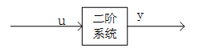
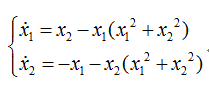
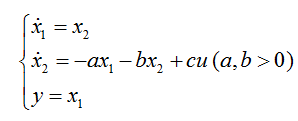
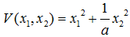
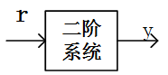
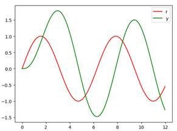
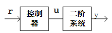
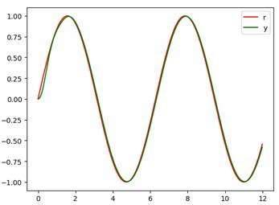

# 现代控制理论基础

状态方程

状态方程是被控对象的数学模型，状态方程和李雅普诺夫稳定性定理结合可以判断这个被控系统是否稳定。假设被控对象的状态方程如下：
$$
\left\{
    \begin{array}{l}
            \dot{x_1} = x_2 \\ 
            \dot{x_2} = f(x_1,x_2) + bu \\
            y = x_1
        \end{array}
\right.          \tag{1}
$$

- 这是一个二阶系统，两个状态变量x1,x2
- 输出y为x1，
- u为输入
- f表示要给函数

这个系统的表示如下图，如果这是一个稳定系统，y是可以跟踪u的，如果u是一个正弦信号的话，那么x1必然也是一个正弦信号。可是如果这个系统不稳定，那么y可能跟踪不上u，所以需要设计一个控制器，使输出能跟踪输入。

至于这个系统到底是不是一个稳定的系统，可以使用李雅普诺夫第二定理来证明，但是此定理只能证明系统是稳定的，不能证明不是稳定的。而且可能需要多次尝试不同的李函数，才能确定他是稳定的

Lyapunov稳定性定理

L定理源于他的博士论文，有两种定理，第一定理和第二定理，判断一个控制系统是否稳定的方法。，本节主要讲解第二定理。

李雅普诺夫第二定理（直接发）基本思路是：不求解系统的运动方程，而是借助一个李雅普诺夫函数（以下简称“李函数”）来直接对系统平衡状态的稳定性做出判断。他是从能量观点进行稳定性分析的，如果一个系统被激励后，其存储的的能量随着时间的推移逐渐衰减，达到平衡状态时，能量将达最小值，那么这个平衡状态是渐进稳定的。反之如果系统不断的从外界吸收能量，储能越来越大，那么这个平衡状态就是不稳定的。如果系统的储能既不增加、也不消耗，那么这个平衡状态就是李雅普诺夫意义下的稳定。

 注意：
	1）实际系统很难找到一个统一的能量函数
	2）虚构一个广义的能量函数，成为李雅普诺夫函数（李函数）根据他的一阶导数的正负来判断系统的稳定性
	3）只要找到一个正定的标量函数 ，而 是负定的，这个系统就是稳定的， 就是李函数（李函数是大于零且递减的）

下面以一个例子来演示如何使用李第二稳定性定理，假设控制系统的状态方程如下：

解答：

- 先求出系统的平衡点，即： 且 时， 和 的值。很明显在这个系统中原点（ =0， =0）是唯一的平衡状态
- 选取标量函数 ，使 正定， 负定，如果选的 不行，那么就重新选。这里选择 （正定），则 （负定）
- 所以是一个李函数，由于当 时， ，所以系统在原点处的平衡状态是大围渐进稳定的

一个综合演示

有如下被控系统：

这是一个稳定的系统，Lyapunov函数为

可证明稳定性。

如果把输入信号直接加到系统，系统也是可以稳定工作的，如下图：

但是，可能存在赋值、相位、周期的偏差，仿真文件“Lya_no_con_demo.py”仿真结果如下：（仿真文件需要重新查代码，看是否正确）

可以看到将输出信号直接加到这个经过李方法证明稳定的系统上，输出在大致上可以跟踪输入的。但是不够稳定，所以这就需要加入矫正装置，如下图

上面的状态方程中的u是指对控对象的输入，如没有控制器一般指的就是外界输入，如果有控制器，这个u就是控制器的输出，控制器的输入是r，是外界的输入。

不管是稳定系统还是不稳定系统，我们最终的期望都是希望输出完全的跟踪输入。可是实际上，输出是不可能完全的跟踪输入的，所以对于一个控制对象，那个控制器能跟踪的越好，那个控制器的性能就是越强悍。在上一个仿真的基础之上加入PID控制器，仿真文件“Lya_con_demo.py”，结果如下：

可以看到，输出信号较好的跟踪上了输入信号。

