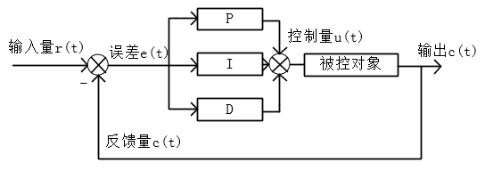

# PID控制器原理和应用

[TOC]

## PID控制器原理

PID控制器是比例控制器（Proportional，P）、积分控制器（Integral，I）、微分控制器（Derivative，D ）的组合，广泛的用于工业过程控制。

PID特点：

- 不基于模型，不用建立被控对象的数学模型
- 参数少，容易调节
- 可以满足众多的控制对象

### PID结构图和数学表达式

PID结构图如下：



PID数学表达式为：$u(t) = K_{p}[e(t) + \frac{1}{T_{i}}\int_{0}^{t}e(t)dt+T_{d}\frac{de(t)}{dt}]$

其中：

- $e(t)$表示控制系统的误差信号，$e(t) = r(t)-c(t)$，输入-输出
- $Kp$表示比例控制器系数（比例增益）。越大，比例控制（P）作用越强
- $Ti$表示积分时间常数。越小，积分控制器（I）作用越强
- $Td$表示微分时间常数。越大，微分控制器（D）作用越强
- $u(t)$表示控制量，作用于被控对象

**PID** 控制的基本原理是：基于误差而消除误差（给定值和当前值的偏差），根据表达式中的三项，有：

- P：直接乘误差，纠正当前误差（现在）
- I：累计误差值，消除稳态误差、提高控制精度（过去）
- D：误差微分，加快响应（将来、趋势）

根绝误差的现在、过去和将来，消除误差。所以说是**基于误差而消除误差**。


### 参数整定方法

（据说专业的人把调参叫做**整定**）

根据实际的控制系统，选择不同的组合方式，可以单独使用P，或者PD等等。PID的调参过程，完全靠经验。


调参方法为：先调 $Kp$ ，再调  $Kd$，最后调 $Ki$。如果PD控制时，系统输出能够较快、较准的跟踪输入，并且稳态无误差很小（在要求范围内），那么就不用加 I 控制器了。如果稳态误差较大，在加入 I 控制器，调  $Ki。

 

调参具体过程为：

1.  $Kp$：从小变大，可以以2倍的形式变化。比如，一开始为1，输出小于输入。那就试2，输出小于输入。尝试4，输出大于输入，震荡有超调。那么可以确定参数应该在2~4之间，尝试3....这种类似折半的尝试，知道找到一个输出能较好的跟踪输入，超调又不大的参数。
2. $Kd$：增大可以使响应变快，本来是5s才能跟上输入，增大$Kd$后，3s就能跟踪上了，但是可能会引起震荡，可能还需要降低$Kp$。
3. $Ki$：如果PD控制不理想，比如有稳态误差，那就增大$Ki$消除稳态误差。同时可能还需要微调$Kp$、$Kd$


### 位置式

数字PID控制算法分为位置式和增量式。

位置式数学表达式：$u(k) = K_{p}e(k) + K_{i}\sum_{i=0}^{k}e(i)+K_{d}[e(k) - e(k-1)]$

其中：

- $Kp$ 表示比例系数，比例控制器增益。越大，比例控制器作用越强
- $Ki$ 表示积分系数，积分控制器增益。越大，积分控制器作用越强（区别于积分时间常数）
- $Kd$ 表示微分系数，微分控制器增益。越大，微分控制器作用越强（区别于微分时间常数），微分项也可以写成两次误差之差再必上采样时间间隔，但是作用不大，只用$Kd$ 一个参数即可实现了
- $\sum_{i=0}^{k}e(i)$ 表示误差的累加和

```tip
注意：

位置式PID的数学式和上面公式略有差异，控制器的作用强度都是正比于控制器系数的，也比较符合认知。
```

位置式PID是当前系统的实际位置，与想要达到的预期位置的偏差，进行PID控制。因为有误差积分 ∑e(i)，一直累加。也就是当前的输出u(k)与过去的所有状态都有关系，用到了误差的累加值；（误差e会有误差累加），输出的u(k)对应的是执行机构的实际位置，一旦控制输出出错(**控制对象的当前的状态值出现问题** )，u(k)的大幅变化会引起系统的大幅变化。

并且位置式PID在积分项达到饱和时，误差仍然会在积分作用下继续累积，一旦误差开始反向变化，系统需要一定时间从饱和区退出，所以在u(k)达到最大和最小时，要停止积分作用，并且要有**积分限幅**和**输出限幅**

**所以在使用位置式PID时，一般我们直接使用PD控制**。**而位置式 PID 适用于执行机构不带积分部件的对象，如舵机和平衡小车的直立和温控系统的控制**


```tip
位置式PID优缺点：

优点：
位置式PID是一种非递推式算法，可直接控制执行机构（如平衡小车），u(k)的值和执行机构的实际位置（如小车当前角度）是一一对应的，因此在执行机构不带积分部件的对象中可以很好应用

缺点：
每次输出均与过去的状态有关，计算时要对e(k)进行累加，运算工作量大。

```


### 增量式

当执行机构需要的不是控制量的绝对值，而是控制量的增量（例如去驱动步进电动机）时，需要用PID的“增量算法”。


增量式PID数学表达式为：$\Delta u(k) = u(k) - u(k-1)= K_{p}[e(k)-e(k-1)]+K_{i}e(k)+K_{d}[e(k)-2e(k-1)+e(k-2)]$

中间省略了推导过程。

所以：$u(k) = u(k-1)+ K_{p}[e(k)-e(k-1)]+K_{i}e(k)+K_{d}[e(k)-2e(k-1)+e(k-2)]$

其中：

- 比例P，$e(k)-e(k-1)$ 表示本次误差-上次误差
- 积分I，$e(k)$ 表示误差
- 微分D，$e(k)-e(k-1)+e(k-2)$ 表示本次误差-2*上次误差+上上次误差

```tip
增量式PID根据公式可以很好地看出，一旦确定了参数，只要使用前后三次测量值的偏差， 即可由公式求出控制增量
```

而得出的控制量$\Delta u(k)$对应的是近几次位置误差的增量，而不是对应与实际位置的偏差   没有误差累加，也就是说，增量式PID中不需要累加。控制增量Δu(k)的确定仅与**最近3次的采样值**有关，容易通过加权处理获得比较好的控制效果，并且在系统发生问题时，增量式不会严重影响系统的工作

```tip
总结

增量型 PID，是对位置型 PID 取增量，这时控制器输出的是相邻两次采样时刻所计算的位置值之差，得到的结果是增量，即在上一次的控制量的基础上需要增加（负值意味减少）控制量。


优点：
1.误动作时影响小，必要时可用逻辑判断的方法去掉出错数据。
2.手动/自动切换时冲击小，便于实现无扰动切换。当计算机故障时，仍能保持原值。
3.算式中不需要累加。控制增量Δu(k)的确定仅与最近3次的采样值有关。


缺点：
1.积分截断效应大，有稳态误差；
2.溢出的影响大。有的被控对象用增量式则不太好；

 
```


```tip
增量式与位置式区别：

1.增量式算法不需要做累加，控制量增量的确定仅与最近几次偏差采样值有关，计算误差对控制 量计算的影响较小。而位置式算法要用到过去偏差的累加值，容易产生较大的累加误差。 

2.增量式算法得出的是控制量的增量，例如在阀门控制中，只输出阀门开度的变化部分，误动作 影响小，必要时还可通过逻辑判断限制或禁止本次输出，不会严重影响系统的工作。 而位置式的输出直接对应对象的输出，因此对系统影响较大。

3.增量式PID控制输出的是控制量增量，并无积分作用，因此该方法适用于执行机构带积分部件的对象，如步进电机等，而位置式PID适用于执行机构不带积分部件的对象，如电液伺服阀。

4.在进行PID控制时，位置式PID需要有积分限幅和输出限幅，而增量式PID只需输出限幅
```


## 改进的PID


### 积分限幅


### 积分分离


### 变速机分