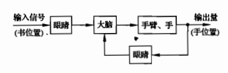

# 自动控制理论基础

[TOC]

## 经典控制理论

### 自动控制系统基本概念

#### 开环与闭环

- 开环指的没有反馈
- 闭环有反馈

例如人控制手去拿书，方块图如下：

在整个过程中，如果睁开眼，并且用眼睛看书的位置，再调整手的位置，这就是闭环。如果没有用眼睛看，就是开环

#### 反馈控制（闭环控制）

**反馈控制原理**：在反馈控制系统中，控制装置对被控对象施加的控制作用，是取自被控量的反馈信息，用来不断修正被控量与输入量之间的偏差，从而实现对被控对象进行控制的任务。反馈控制的原理就是按偏差控制的原理。

反馈：把输出量送回输入端，并与输入量（输入信号）相比较（做减法）产生偏差信号的过程。例如：$e(t) = c(t)-r(t)$

- 负反馈：若反馈的信号与输入信号相减，使产生的偏差越来越小，称为负反馈。即$e$越来越小
- 正反馈：$e$越来越大

#### 闭环系统稳定性

当闭环系统的传递函数极点全部在s平面的左半平面时，系统稳定。极点是传递函数的分母=0时的解，又是求解复杂。考虑使用劳斯判据

#### 劳斯判据

对于一个高次方程来说求根较为复杂，使用劳斯判据可以判断根是不是都是正的，对于闭环系统，使用劳斯判据判断出分母的根的分布情况，如果全为正数，则系统稳定

