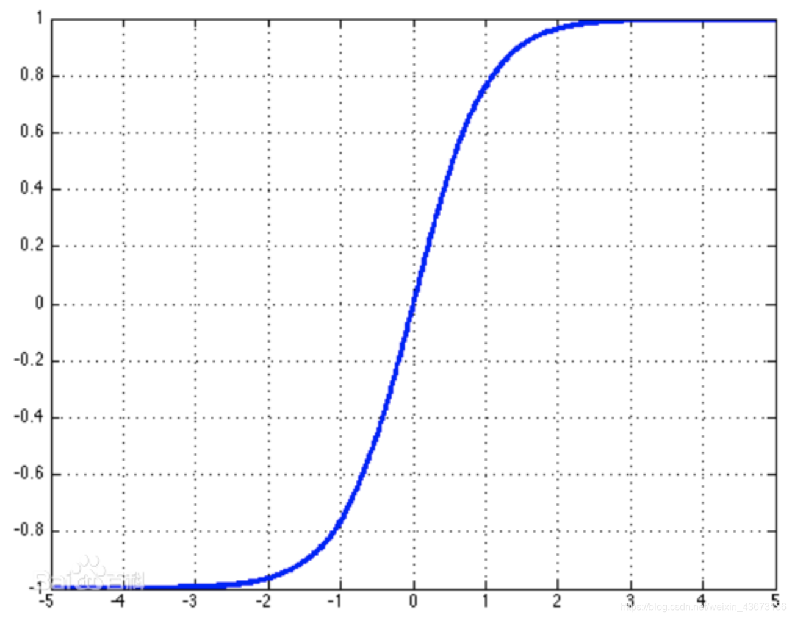
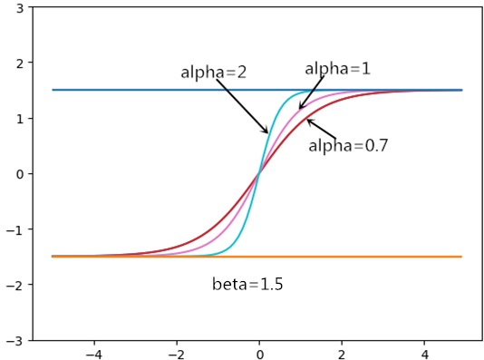
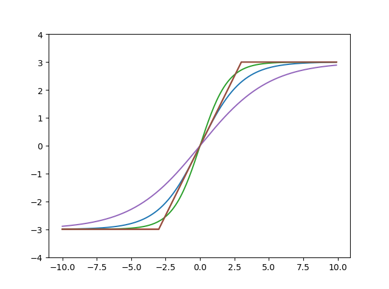

[TOC]

# 准备向导师请教的问题

## 1. 仿真与实验的问题

计算机仿真有以下几种类型：

- 数值仿真：虚拟控制器+虚拟对象，使用matlab simulink等工具仿真
- 基于带物理引擎的仿真软件仿真：例如CoppeliaSim
- 半实物仿真：
  - 虚拟控制器+实际对象：快速控制原型(RCP)仿真系统
  - 实际控制器+虚拟对象：硬件在回路(HiL)仿真系统

这些仿真方法，那个在学术界认可度更？那个在工程届认可度更高？

实物仿真：学术界和工程界认可度都高（哈哈）

# 研究内容

### 导师安排的任务

- 熟悉M300四旋翼无人机及其机载H20T可见光与红外传感器，
- 熟悉云冠2机载计算机及其图像处理与运动控制算法的应用。

### 可能用到的方法

- RBF
- 反步法
- 滑模、积分滑模
- 自适应
- 凸优化理论

### 目前的问题

	- 建模不确定性
	- 编队、协同控制（容错协同控制）
	- 干扰：风效应（外部干扰）
	- 传感器故障
	- 执行器故障（容错控制）
	- 执行器饱和（输入饱和）：如何处理
	- 执行器迟滞饱和
	- 路径规划
	- 状态约束（姿态受限）
	- 扰动观测器DOBC：设计一个观测器，估计未知扰动
	- 有限时间稳定性

### 正在看

- 执行器故障：持续故障（有限次），间歇性故障（随机故障）
  - 效率损失：器件老化等，实际输出比期望输出小
  - 偏差故障：
  - 完全失效：完全失去动力，停转
  - 电机转，桨没了
- 执行器饱和
- 输入饱和：输入大到一定程序，已知保持为输入最大值
- 不确定项：RBF估计

### 森林火灾的检测、检测、灭火方面要解决的问题

无人机的种类：检测机、灭火机

要具备的共能、需要完成的任务

- 无人机能安全稳定的飞行
- 多个无人机能够协同飞行，相互配合检测
- 能够准确的检测到起火点，并且判断火势，呼叫灭火机
- 灭火机能飞到起火点，抛洒、投射灭火材料
- 等待救援队到场再次检查

# 二阶系统

$$
\left\{\begin{aligned}
\dot x_1 =& x_2 \\ 
\dot x_2 =& f(x_1,x_2) +u \\ 
 y =& x_1
\end{aligned}\right.
$$

如何使用RBF逼近$f(x_1, x_2)$呢？

# 四旋翼无人机

说明：建立四旋翼无人机数学模型，写清一步一步的推导过程。其中，机型是十字型，即x、y坐标轴是指向两个旋翼的，如下图：

## 基础知识

### 电机和螺旋桨的转速、升力、扭矩的关系

转速与升力的关系：$F = c \omega^2$。$F$ 为升力，$c_T$ 为旋翼升力系数，$\omega$ 为电机的转速

转速与扭矩的关系：$M = c_M\omega^2$。$M$ 为扭矩，$c_T$ 为扭矩系数，$\omega$ 为电机的转速

### 力和力矩公式

力 $F$ 、力矩 $M$ 、力臂 $l$ 之间的关系如下：
$$
M=lF
$$

### 力矩和角加速度公式

力矩 $M$ 、角加速度 $a$ 、转动惯量  $I$ 之间的关系如下：
$$
M=Ia
$$

### 欧拉力矩公式

角速度$\omega$，转动惯量矩阵 $I$ ，欧拉方程如下：
$$
M=I \dot \omega + \omega\times (I \omega)
$$

### 坐标系

机体的飞行姿态与位置，都是矢量，在不同的坐标系（参照物），使用两个坐标系的旋转矩阵，可以实现相互转化

机体坐标系：是固定于机体上的，随着机体运动而运动

全局坐标系（惯性系）：可是认为是绝对静止的，就是大地上的

### 姿态角与旋转矩阵

其中，以 x 轴正方向为前进方向，采用Z-Y-X顺序欧拉角，姿态角有如下说明：

- 滚转角（roll）：机体绕x轴之间的夹角，用 $\phi$ 表示
- 俯仰角（pitch）：机体绕y轴之间的夹角，用 $\theta$ 表示
- 偏航角（yaw）：机体绕z轴的夹角，用 $\psi$ 表示

欧拉角向量有$[\phi \quad \theta \quad \psi]$，则旋转矩阵如下：

$$
R_{(Z,\psi)} = \begin{bmatrix}
\cos \psi   &    -\sin \psi  &    0\\ 
\sin \psi &      \cos \psi     &    0\\ 
0 &    0   &    1
\end{bmatrix}  \\

R_{(Y,\theta)} = \begin{bmatrix}
\cos \theta   &   0  &   \sin \theta\\ 
0 &     1    &    0\\ 
 -\sin \theta&    0  &    \cos \theta
\end{bmatrix}  \\

R_{(X,\phi)} = \begin{bmatrix}
1  &   0  &    0\\ 
0 &      \cos \phi     &    -\sin \phi \\ 
0 &   \sin \phi   &    \cos \phi
\end{bmatrix}
$$

机体坐标系相对于全局坐标系（惯性系）的旋转矩阵为：$_B^WR = R_{(Z,\psi)} R_{(Y,\theta)} R_{(X,\phi)}   $，使用Python的符号计算库 `sympy` ，可以快速地计算矩阵相乘的结果，源文件名字为 `rotationMatrix.py`，结果如下：

$$
_B^WR  =      
\begin{bmatrix}
\cos \psi \cos \theta  & -\cos \phi \sin \psi + \cos \psi \sin \phi \sin \theta & \cos \phi \cos \psi \sin \theta + \sin \phi \sin \psi\\ 

\cos \theta  \sin \psi &  \cos \phi \cos \psi + \sin \phi \sin \psi \sin \theta  &  \cos \phi \sin \psi \sin \theta - \cos \psi \sin \phi\\
-\sin \theta		 &  \cos \theta  \sin \phi				   	 		 & \cos \phi \cos \theta 
\end{bmatrix}
$$

有了 $_B^WR$ 就可以把一个矢量在机体系和全局系中转换了。例如旋翼无人机的速度在机体系中表示为 $V_B$，则在全局系中表示为 $V_W=_B^WRV_B$  

### 机体角速度与欧拉角速度变换

Z-Y-X欧拉角为 $[\phi \;\theta \; \psi]^T$，欧拉角速度为 $[\dot\phi \; \dot\theta \; \dot\psi]^T$，机体绕机体系三个轴的角速度为 $[\omega_x \; \omega_y \;\omega_z]^T$，他们是不想等的。利用欧拉定理

$$
\begin{bmatrix}
\omega_x\\ 
\omega_y\\ 
\omega_z\\
\end{bmatrix} = R_{(X,\phi)}R_{(Y,\theta)}\begin{bmatrix}
0\\ 
0\\ 
\dot \psi  \\
\end{bmatrix}    +R_{(X,\phi)}\begin{bmatrix}
\dot \phi\\ 
0\\ 
0  \\
\end{bmatrix}=\begin{bmatrix}
\dot\phi + \dot\psi\sin\theta\\ 
\cos\phi\dot\theta - \cos\theta\dot\psi\sin\psi\\ 
\cos\phi\cos\theta\dot\psi + \dot\theta\sin\psi  \\
\end{bmatrix}=

\begin{bmatrix}

1 & 0 & -\sin \theta\\ 
0 & \cos\phi & \cos\theta\sin \phi\\ 
0 & -\sin \phi & \cos\theta\cos\phi
\end{bmatrix}
$$

所以机体角速度与欧拉角速度关系如下：

$$
\begin{bmatrix}
\dot\phi\\ 
\dot\theta\\ 
\dot\psi  \\
\end{bmatrix}=\begin{bmatrix}
1 & \sin \phi \tan \theta & \cos \phi \tan \theta\\ 
0 & \cos \theta  & -\sin \theta\\ 
0 & \sin \theta /\cos \theta &  \cos \phi /\cos \theta 
\end{bmatrix}\begin{bmatrix}
\omega_x\\ 
\omega_y\\ 
\omega_z\\
\end{bmatrix}
$$

当机体的欧拉角较小时（小角度飞行），近似有如下：

$$
\begin{bmatrix}
1 & \sin \phi \tan \theta & \cos \phi \tan \theta\\ 
0 & \cos \theta  & -\sin \theta\\ 
0 & \sin \theta /\cos \theta &  \cos \phi /\cos \theta 
\end{bmatrix}=\begin{bmatrix}
1 & 0& 0\\ 
0 & 1  & 0\\ 
0 & 0 &  1 
\end{bmatrix}
$$

即 $[\omega_x \; \omega_y \;\omega_z]^T \approx  [\phi \;\theta \; \psi]^T$

## 受力分析

建模中的诸多假设与合理的忽略，这里不作说明，直接使用。

在机体坐标系下，机体受四个旋翼的拉力，分别为$F_1,F_2,F_3,F_4$，机体受的拉力为

$$
F_B=\begin{bmatrix}
0 \\ 
0 \\ 
F_1+F_2+F_3+F_4 \\
\end{bmatrix}
$$

其中，第一个 0为在x轴方向的分力，第二个 0为在y轴上的分力，$F_1+F_2+F_3+F_4$为在 z轴上的分力

根据旋转矩阵可以把机体受的力在全局系中表示出来，$F_W= _B^WRF_B$，表示如下：

$$
F_W=\begin{bmatrix}
F_x\\ 
F_y\\ 
F_z\\
\end{bmatrix}=\begin{bmatrix}
(F_1+F_2+F_3+F_4)(\cos \phi \cos \psi \sin \theta + \sin \phi \sin \psi) \\ 
(F_1+F_2+F_3+F_4)(\cos \phi \sin \psi \sin \theta - \cos \psi \sin \phi) \\ 
(F_1+F_2+F_3+F_4)(\cos \phi \cos \theta) - mg \\
\end{bmatrix}
$$

$F_x,F_y,F_z$ 表示相应坐标系下的力

## 位置模型

用 $x,y,z$ 表示机体在全局坐标系下的位置，由牛顿第二定律 $F_合=ma$，令$U_1 = F_1+F_2+F_3+F_4$ ，有：

$$
\left\{\begin{aligned}
\ddot{x} =& F_x/m=U_1(\cos \phi \cos \psi \sin \theta + \sin \phi \sin \psi)/m \\ 
\ddot{y} =& F_y/m=U_1(\cos \phi \sin \psi \sin \theta - \cos \psi \sin \phi)/m \\ 
\ddot{z} =& F_z/m=U_1(\cos \phi \cos \theta)/m - g \\

\end{aligned}\right.
$$

机体以小角度运动时，$\sin \theta \approx \theta,\sin \phi\approx \phi$，注意这里都是弧度制

> 当 $\theta = 10^{\circ}\approx 0.174 rad$，$\sin \theta \approx0.174 \approx $弧度制的角度

所以位置模型简化如下：

$$
\left\{\begin{aligned}
\ddot{x} =&U_1(\theta\cos \phi \cos \psi  + \phi \sin \psi)/m \\ 
\ddot{y} =&U_1(\psi  \theta\cos \phi - \phi \cos \psi )/m \\ 
\ddot{z} =&U_1(\cos \phi \cos \theta)/m - g \\
U_1 =& F_1+F_2+F_3+F_4 \\

\end{aligned}\right.
$$
设 $V_x,V_y,V_z$为机体相对于全局系的线速度
$$
\begin{bmatrix}
\dot x\\ 
\dot y\\ 
\dot z\\
\end{bmatrix}=_B^WR\begin{bmatrix}
\dot V_x\\ 
\dot V_y\\ 
\dot V_z\\
\end{bmatrix} = \begin{bmatrix}
V_x\cos \psi \cos \theta + V_y(-\cos \phi \sin \psi + \cos \psi \sin \phi \sin \theta) + V_z(\cos \phi \cos \psi \sin \theta + \sin \phi \sin \psi)\\ 
V_x(\cos \theta  \sin \psi)+V_y(\cos \phi \cos \psi + \sin \phi \sin \psi \sin \theta)+V_z(\cos \phi \sin \psi \sin \theta - \cos \psi \sin \phi) \\ 
-V_x\sin \theta+V_y \cos \theta  \sin \phi+V_z\cos \phi \cos \theta  \\
\end{bmatrix}
$$

## 姿态模型

姿态模型有两种表示形式，一种是力矩、角加速度、力之间的关系；另一种是用欧拉方程推导出来的。

机体的转动惯量矩阵如下：

$$
I=\begin{bmatrix}
I_x & 0 &  0 \\ 
0 & I_y & 0 \\ 
0 & 0 &  I_z 
\end{bmatrix}
$$

其中，$I_x,I_y,I_z$ 为机体绕x,y,z轴旋转时的转动惯量，$I_x  \approx I_y$

### 第一种姿态模型

根据力矩与加速度关系如下：
$$
M=Ia=\begin{bmatrix}
I_x & 0 &  0 \\ 
0 & I_y & 0 \\ 
0 & 0 &  I_z 
\end{bmatrix}\begin{bmatrix}
\dot\omega_x\\ 
\dot\omega_y\\ 
\dot\omega_z\\
\end{bmatrix}=\begin{bmatrix}
I_x\dot\omega_x\\ 
I_y\dot\omega_y\\ 
I_z\dot\omega_z\\
\end{bmatrix}
$$
其中 $I$ 为转动惯量，$a$ 为角加速度。

力与力矩之间的关系如下：
$$
M=lF
$$
其中 $l$ 表示机体质心与各个螺旋桨之间的长度， 所以角加速度有：
$$
\left\{\begin{aligned}
\dot\omega_x =& l(F_4-F_2)/I_x \\ 
\dot\omega_y =& l(F_3-F_1)/I_y\\ 
\dot\omega_z =& (F_1-F_2+F_3-F_4)/I_z\\
\end{aligned}\right.
$$
因为是“十”字型的结构，所以可以有如下设置：

-  $U_1=F_1+F_2+F_3+F_4$ 为垂直输入控制量
- $U_2=F_4-F_2$ 为翻滚输入控制量 X
- $U_3=F_3-F_1$ 为俯仰输入控制量
- $U_4=F_1-F_2+F_3-F_4$ 为偏航输入控制量

所以：
$$
\left\{\begin{aligned}
\dot\omega_x =& lU_2/I_x \\ 
\dot\omega_y =& lU_3/I_y\\ 
\dot\omega_z =& U_4/I_z\\
\end{aligned}\right.
$$

### 第二种姿态模型

使用欧拉方程推导，欧拉方程如下：
$$
M=I \dot \omega + \omega\times (I \omega)
$$
其中，$\omega$ 为角速度， $I$ 为转动惯量矩阵，则：

$$
\omega\times (I \omega)=\begin{bmatrix}
\omega_z \omega_y(I_z-I_y)\\ 
\omega_x \omega_z(I_x-I_z)\\ 
\omega_x \omega_y(I_y-I_x)
\end{bmatrix}
$$
其中，使用了向量的叉乘计算方法，有向量 $ \pmb a = (a_x,a_y,a_z), \pmb b = (b_x,b_y,b_z)$，$ \pmb c = \pmb a \times  \pmb b $，$ \pmb c $的表示如下：
$$
\pmb c  =  \pmb a \times  \pmb b = \begin{bmatrix}
i &  j  &   k \\ 
a_x & a_y & a_z \\ 
b_x & b_y & b_z
\end{bmatrix}=(a_yb_z-a_zb_y)i+(a_zb_x-a_xb_z)j+(a_xb_y-a_yb_x)k
$$

$$
\pmb c =\begin{bmatrix}
a_yb_z-a_zb_y \\ 
a_zb_x-a_xb_z \\ 
a_xb_y-a_yb_x
\end{bmatrix}
$$

所以，欧拉方程中的力矩 $M$，表示如下：
$$
M=\begin{bmatrix}
I_x \dot \omega_x +\omega_z\omega_y(I_z-I_y) \\ 
I_y \dot \omega_y +\omega_x \omega_z(I_x-I_z)\\ 
I_y \dot \omega_z +\omega_z \omega_y(I_y-I_x)
\end{bmatrix}
$$

又因为 $M=lF$，所以有：

$$
\left\{\begin{aligned}
\dot \omega_x =& lU_2/I_x +\omega_z\omega_y(I_y-I_z)/I_x \\ 
\dot \omega_y =& lU_3/I_y +\omega_z\omega_x(I_z-I_x)/I_y\\

\dot \omega_z =& U_4/I_z +\omega_x\omega_y(I_x-I_y)/I_z\\
\end{aligned}\right.
$$

公式中的角速度应该是欧拉角的角速度，前面假设过欧拉角的角速度约等于机体角速度，这里不做区分

当旋翼在悬停或慢速飞行时，角度变化率（角速度）总是很小所以交叉项 $\omega_z\omega_y$等几乎为0，所以上式简写为：
$$
\left\{\begin{aligned}
\dot \omega_x =& lU_2/I_x  \\ 
\dot \omega_y =& lU_3/I_y \\

\dot \omega_z =& U_4/I_z \\
\end{aligned}\right.
$$
即与第一种方法相同。可以看出，第一种方法是由欧拉方程的简化来的

$$
\left\{\begin{aligned}
\dot\omega_x =& lU_2/I_x \\ 
\dot\omega_y =& lU_3/I_y\\ 
\dot\omega_z =& U_4/I_z\\
\end{aligned}\right.
$$

## 数学模型整理

$[\phi \quad \theta \quad \psi]$

### 位置模型

$$
\left\{\begin{aligned}
\ddot{x} =&U_1(\theta\cos \phi \cos \psi  + \phi \sin \psi)/m \\ 
\ddot{y} =&U_1(\psi  \theta\cos \phi - \phi \cos \psi )/m \\ 
\ddot{z} =&U_1(\cos \phi \cos \theta)/m - g \\
U_1 =& F_1+F_2+F_3+F_4 \\

\end{aligned}\right.
$$

写成状态空间、矩阵形式如下：

**x方向位置**：
$$
\left\{\begin{aligned}
\ddot{x}_1 =& x_2 \\
\dot x_2 =& U_1(\theta\cos \phi \cos \psi  + \phi \sin \psi)/m \\ 
\end{aligned}\right.
$$
其中，$x_1,x_2$ 分别为x轴方向的位置，和方向的线速度。所以，矩阵形式如下：
$$
\begin{bmatrix}
\ddot{x}_1\\ 
\dot{x}_2\\ 

\end{bmatrix} = \begin{bmatrix}
0 & 1  \\ 
0 & 0  \\

\end{bmatrix} \begin{bmatrix}
x_1\\ 
x_2\\ 

\end{bmatrix} + \begin{bmatrix}
0 &  0 \\ 
0 &  U_1(\theta\cos \phi \cos \psi  + \phi \sin \psi)/m \\ 

\end{bmatrix}\begin{bmatrix}
U_1\\ 
U_2\\ 

\end{bmatrix}
$$
**y方向位置**：
$$
\left\{\begin{aligned}
\ddot{y}_1 =& y_2 \\
\dot y_2 =& U_1(\psi  \theta\cos \phi - \phi \cos \psi )/m \\ 
\end{aligned}\right.
$$
其中，$y_1,y_2$ 分别为y轴方向的位置，和方向的线速度。所以，矩阵形式如下：
$$
\begin{bmatrix}
\ddot{y}_1\\ 
\dot{y}_2\\ 

\end{bmatrix} = \begin{bmatrix}
0 & 1  \\ 
0 & 0  \\

\end{bmatrix} \begin{bmatrix}
y_1\\ 
y_2\\ 

\end{bmatrix} + \begin{bmatrix}
0 &  0 \\ 
0 &  U_1(\psi  \theta\cos \phi - \phi \cos \psi )/m \\ 

\end{bmatrix}\begin{bmatrix}
U_1\\ 
U_2\\ 

\end{bmatrix}
$$
**z方向位置**：
$$
\left\{\begin{aligned}
\ddot{z}_1 =& y_2 \\
\dot z_2 =& U_1(\theta\cos \phi \cos \psi  + \phi \sin \psi)/m \\ 
\end{aligned}\right.
$$
其中，$z_1,z_2$ 分别为y轴方向的位置，和方向的线速度。所以，矩阵形式如下：
$$
\begin{bmatrix}
\ddot{z}_1\\ 
\dot{z}_2\\ 

\end{bmatrix} = \begin{bmatrix}
0 & 1  \\ 
0 & 0  \\

\end{bmatrix} \begin{bmatrix}
z_1\\ 
z_2\\ 

\end{bmatrix} + \begin{bmatrix}
0 &  0 \\ 
0 &  U_1(\cos \phi \cos \theta)/m - g \\ 

\end{bmatrix}\begin{bmatrix}
U_1\\ 
U_2\\ 

\end{bmatrix}
$$

$$
\begin{bmatrix}
\ddot{x}\\ 
\dot{x}\\ 
\ddot{y}\\
\dot{y}\\
\ddot{z}\\
\dot{z}\\
\end{bmatrix} = \begin{bmatrix}
0 & 0 & 0 & 0 & 0 & 0 \\ 
0 & 0 & 0 & 0 & 0 & 0 \\
0 & 0 & 0 & 0 & 0 & 0 \\
0 & 0 & 0 & 0 & 0 & 0 \\
0 & 0 & 0 & 0 & 0 & 0 \\
0 & 0 & 0 & 0 & 0 & 0 \\
\end{bmatrix} \begin{bmatrix}
\dot{x}\\ 
{x}\\ 
\dot{y}\\
{y}\\
\dot{z}\\
{z}\\
\end{bmatrix}
$$

### 姿态模型

$[\phi \quad \theta \quad \psi]$

**绕x轴：**
$$
\begin{bmatrix}
\ddot{\omega}_x\\ 
\dot{\omega}_x\\ 

\end{bmatrix} = \begin{bmatrix}
0 & 1  \\ 
0 & 0  \\

\end{bmatrix} \begin{bmatrix}
\omega_x\\ 
\omega_x\\ 

\end{bmatrix} + \begin{bmatrix}
0 &  0 \\ 
0 &  U_1(\cos \phi \cos \theta)/m - g \\ 

\end{bmatrix}\begin{bmatrix}
U_1\\ 
U_2\\ 

\end{bmatrix}
$$

$$
\left\{\begin{aligned}
\dot \omega_x =& lU_2/I_x +\omega_z\omega_y(I_y-I_z)/I_x \\ 
\dot \omega_x =& lU_3/I_y +\omega_z\omega_x(I_z-I_x)/I_y\\

\dot \omega_x =& U_4/I_z +\omega_x\omega_y(I_x-I_y)/I_z\\
\end{aligned}\right.
$$

$$
\left\{\begin{aligned}
\dot\omega_x =& lU_2/I_x \\ 
\dot\omega_y =& lU_3/I_y\\ 
\dot\omega_z =& U_4/I_z\\
\end{aligned}\right.
$$
因为是“十”字型的结构，所以可以有如下设置：

-  $U_1=F_1+F_2+F_3+F_4$ 为垂直输入控制量
-  $U_2=F_4-F_2$ 为翻滚输入控制量
-  $U_3=F_3-F_1$ 为俯仰输入控制量
-  $U_4=F_1-F_2+F_3-F_4$ 为偏航输入控制量

综上，将模型理想化并且简化，姿态控制如下：
$$
\left\{\begin{aligned}
\dot\omega_x =& l(F_4-F_2)/I_x = \tau_\phi /I_x \\ 
\dot\omega_y =& l(F_3-F_1)/I_y = \tau_\phi  \ /I_y\\ 
\dot\omega_z =& (F_1-F_2+F_3-F_4)/I_z = \tau_\psi /I_z\\
\end{aligned}\right.
$$

## 论文准备

$[\phi \quad \theta \quad \psi]$，十字型

### 姿态模型

简化后的姿态模型如下：
$$
\left\{\begin{aligned}
\dot\omega_x =& l(F_4-F_2)/I_x = \tau_\phi /I_x \\ 
\dot\omega_y =& l(F_3-F_1)/I_y = \tau_\phi  \ /I_y\\ 
\dot\omega_z =& c_m(F_1-F_2+F_3-F_4)/I_z = \tau_\psi /I_z\\
\end{aligned}\right.
$$

第三个好像有点问题，差一个系数[看这里](https://zhuanlan.zhihu.com/p/46839430)

姿态模型的输入是三个轴的转矩$\tau_\phi,\tau_\theta ,\tau_\psi$，即位置控制器的输出$u_x,u_y,u_z$（要注意位置控制器的输入和姿态控制器的输入对应的问题），转矩与转速的关系如下：
$$
\begin{bmatrix}
F \\ 
\tau_\phi\\ 
\tau_\theta \\
\tau_\psi\\

\end{bmatrix} = \begin{bmatrix}
c_t & c_t & c_t & c_t  \\ 
0 & -lc_t & 0 & lc_t  \\
-lc_t & 0 &lc_t & 0   \\
c_m & -c_m & c_m & -c_m  \\

\end{bmatrix} \begin{bmatrix}
\omega_1^2\\ 
\omega_2^2\\ 
\omega_3^2\\
\omega_4^2\\

\end{bmatrix}
$$
$c_t,c_m$分别为升力系数和转矩系数，F是4个旋翼产生的总推力，当系统处于悬停状态时，总推力F与四旋翼无人机的重力G相等。使用python的符号计算库，求这个4阶矩阵的逆矩阵，关系如下：
$$
\begin{bmatrix}
\omega_1^2\\ 
\omega_2^2\\ 
\omega_3^2\\
\omega_4^2\\

\end{bmatrix} = \begin{bmatrix}
c_t & c_t & c_t & c_t  \\ 
0 & -lc_t & 0 & lc_t  \\
-lc_t & 0 &lc_t & 0   \\
c_m & -c_m & c_m & -c_m  \\

\end{bmatrix}^{-1}\begin{bmatrix}
F \\ 
\tau_\phi\\ 
\tau_\theta \\
\tau_\psi\\

\end{bmatrix}
$$
所以
$$
\begin{bmatrix}
\omega_1^2\\ 
\omega_2^2\\ 
\omega_3^2\\
\omega_4^2\\

\end{bmatrix} = \begin{bmatrix}
\frac{1}{4c_t} & 0 & -\frac{1}{2lc_t} &  \frac{1}{4c_m}  \\ 
\frac{1}{4c_t} & -\frac{1}{2lc_t}  & 0  & -\frac{1}{4c_m}    \\
\frac{1}{4c_t} & 0 &  \frac{1}{2lc_t} &   \frac{1}{4c_m}   \\
\frac{1}{4c_t} & \frac{1}{2lc_t}  & 0 & - \frac{1}{4c_m}    \\

\end{bmatrix}\begin{bmatrix}
F \\ 
\tau_\phi\\ 
\tau_\theta \\
\tau_\psi\\

\end{bmatrix}
$$
展开后
$$
\left\{\begin{aligned}
\omega_1^2 =& \frac{1}{4c_t}F -\frac{1}{2lc_t}\tau_\theta +  \frac{1}{4c_m}\tau_\psi \\ 
\omega_2^2 =& \frac{1}{4c_t} F -\frac{1}{2lc_t}\tau_\phi -\frac{1}{4c_m}\tau_\psi \\ 
\omega_3^2 =& \frac{1}{4c_t} F+ \frac{1}{2lc_t}\tau_\theta + \frac{1}{4c_m}\tau_\psi  \\
\omega_4^2 =& \frac{1}{4c_t} F+ \frac{1}{2lc_t}\tau_\phi - \frac{1}{4c_m}\tau_\psi  \\
\end{aligned}\right.
$$
以x轴通道为例，$\dot\omega_x = l(F_4-F_2)/I_x = \tau_\phi /I_x $，状态方程如下：
$$
\left\{\begin{aligned}
\dot x_1 =& x_2 \\ 
\dot x_2 =& \tau_\phi /I_x \\ 
\end{aligned}\right.
$$

### 位置模型

$$
\left\{\begin{aligned}
\ddot{x} =& F_x/m=U_1(\cos \phi \cos \psi \sin \theta + \sin \phi \sin \psi)/m \\ 
\ddot{y} =& F_y/m=U_1(\cos \phi \sin \psi \sin \theta - \cos \psi \sin \phi)/m \\ 
\ddot{z} =& F_z/m=U_1(\cos \phi \cos \theta)/m - g \\

\end{aligned}\right.
$$

位置模型可以再理想简化，当小角度飞行时，$\sin \theta \approx \theta,\sin \phi\approx \phi,\cos\theta \approx 1$，注意这里都是弧度制
$$
\left\{\begin{aligned}
\ddot{x} =& F_x/m=U_1(\theta +  \phi  \psi)/m \\ 
\ddot{y} =& F_y/m=U_1(\psi  \theta -  \phi)/m \\ 
\ddot{z} =& F_z/m=U_1/m - g \\

\end{aligned}\right.
$$
算了，还是别简化了，也不太麻烦

### 故障模型

故障出现的时机：持续性故障，间断、随机性故障

#### 失效故障

失效故障是电机达不到期望的转速，或者达到了，也不能提供期望的升力

- 电机输入电压低（达不到期望转速）
- 桨叶受损

饱和

### 不确定性和扰动

使用RBF神经网络逼近不确定性，估计扰动

### 输入饱和

例如，姿态控制中，输入是力矩，而力矩是有限的（有界）

当输入u大到一定程度，就保持其最大值。低到一定程度时，就保持其最小值
$$
u =\left\{\begin{aligned}
u_{max}& , u>u_{max}  \\ 
u&,u_{min}\leqslant u\leqslant u_{max} \\ 
u_{min} &, u<u_{min}\\
\end{aligned}\right.
$$
使用双曲正切函数逼近饱和函数，解决输入饱和问题。双曲正切函数表达式和图像如下：
$$
tanh x = \frac{sinh x}{cosh x} = \frac{e^x - e^{-x}}{e^x + e^{-x}}
$$

使用时，讲双曲正切函数做一定的变换，以满足控制器的增益和变化率可调。形式如下：
$$
f(x) = \beta tanh (\alpha x) = \beta \frac{e^{\alpha x} - e^{- \alpha x}}{e^{\alpha x} + e^{- \alpha x}}
$$
式中，$\alpha$为自变量系数因子（平滑系数），越大，中间部分越陡；越小，中间部分越平滑，决定函数达到临界值的速度。，$\beta$为幅值因子（幅值系数），越大，上下界越大。如下图所示。

确保了对控制输出的平滑要求。

[注] 上图程序文件`tanh.py`

### 输出受限

例如姿态角只能在$[-30,30]$之间

执行器 故障

### 故障诊断

判别当前发生了那种故障

# 全向飞行平台

## 控制方法

PID、分数阶PID、滑模、分数阶滑模、反步法、分数阶、自适应、微分平坦、H无穷、RBF神经网络、扰动观测器

