# 文征明《琵琶行》

[TOC]

## 说明

文征明的行书《琵琶行》有两种

- 其一落款有“时年八十有八”，是为88岁（1557年）所书。网络常见版本，其首页有四个章，从上到下为方、圆、圆、方。
- 其二落款有“甲寅腊月”，是为甲寅年所书。文征明生卒年1470-1559，经历过的甲寅年有1494年（24岁）和1554年（84岁），推测应是1554年（84岁）所书。但是网络贴说是其71岁所书，1540所作，但是1540是庚子年，与落款“甲寅腊月”相差甚多。不厌书法APP所收为此版本，首页有两个章。

下为落款“时年八十有八”版。

## 1

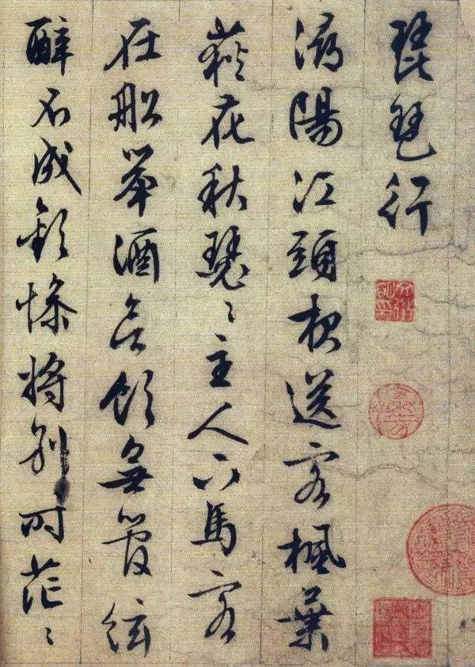

## 2

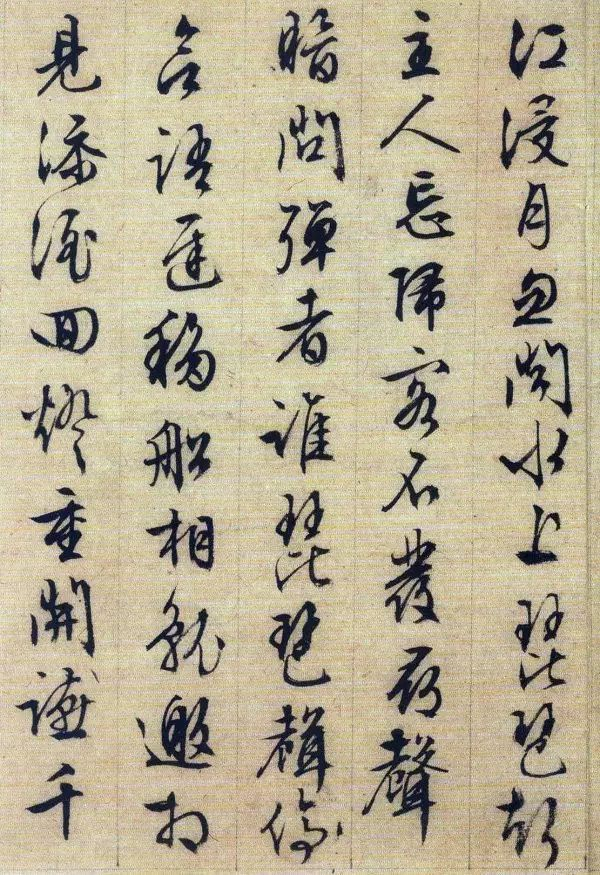

## 3

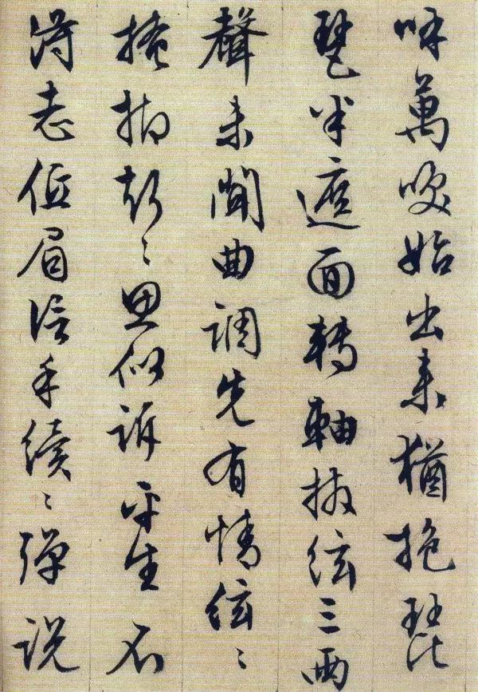

## 4

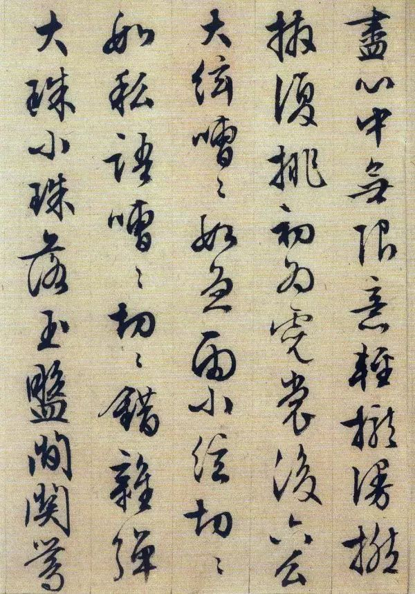

## 5

## 6

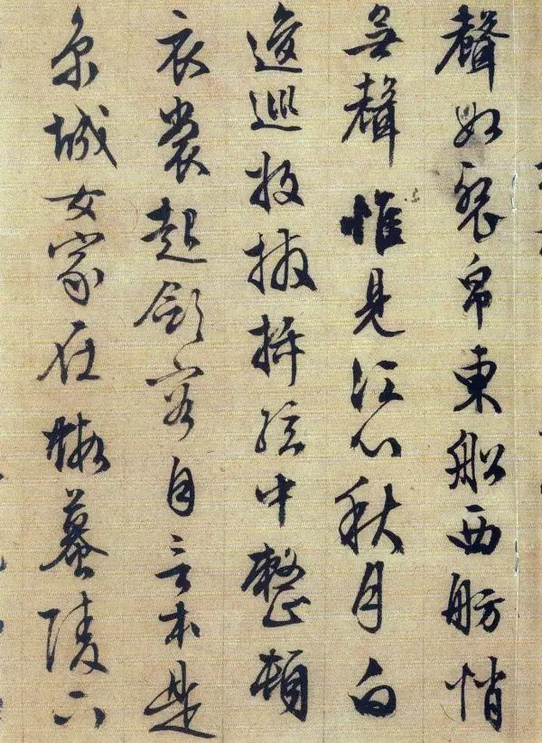

## 7

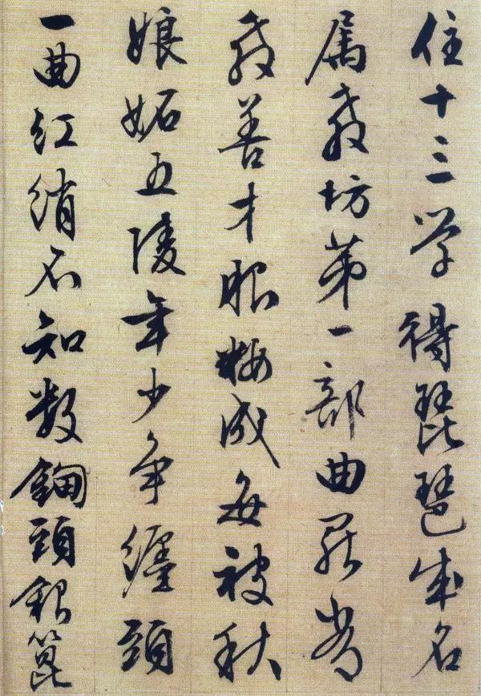

## 8

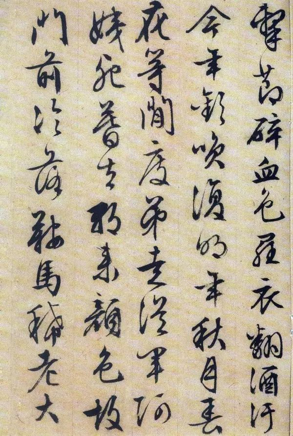

## 9

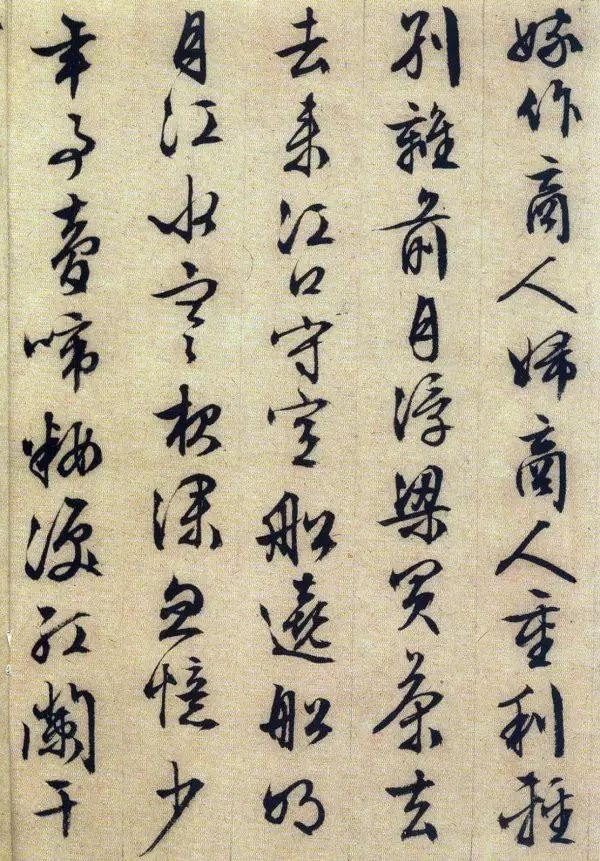

## 10

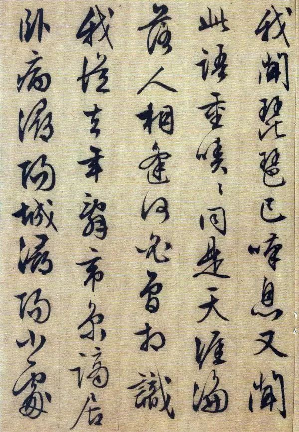

## 11

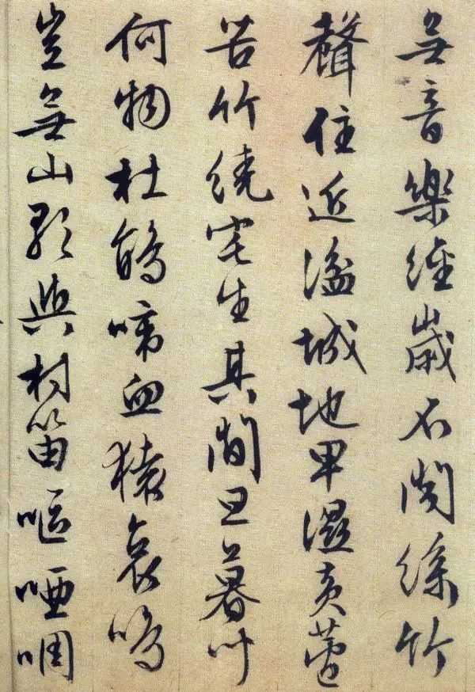

## 12

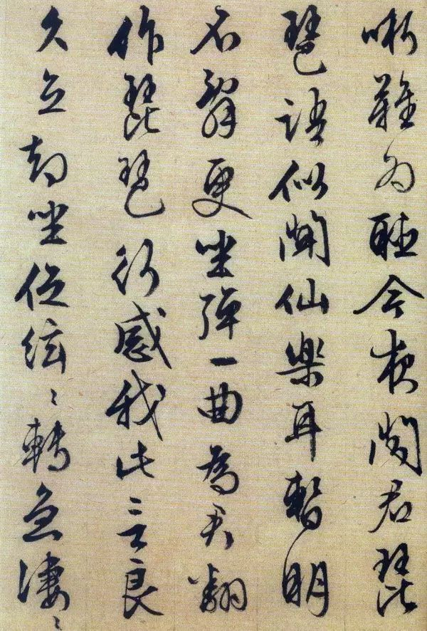

## 13

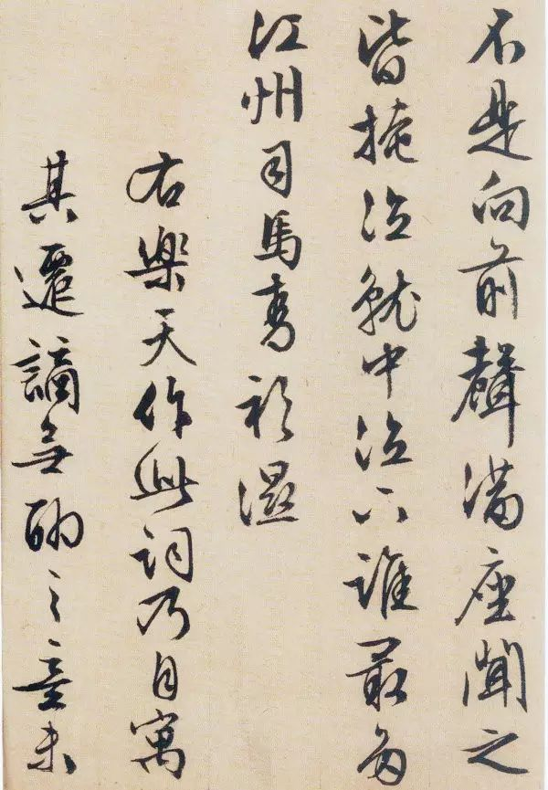

## 14

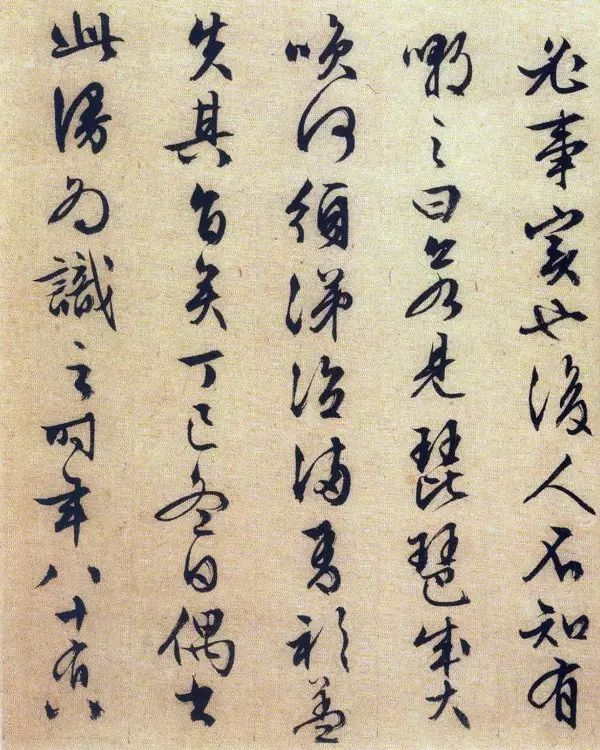

## 15

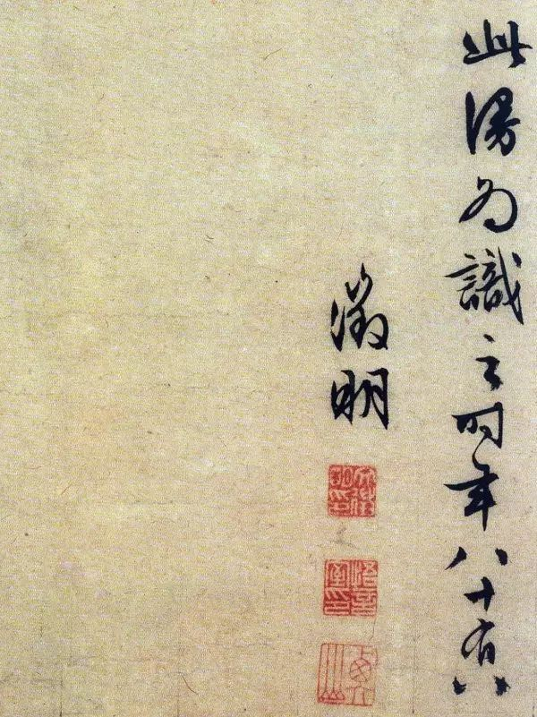

