# 赵孟頫《洛神赋》

本作最后落款“大德四年四月廿五日为盛逸民书 子昂”，是公元1300年，赵孟頫四十七岁时所书。现藏于（天津艺术博物馆），赵孟頫传世《洛神赋》最完整版本之一。字体大小约为1.9cm。

[洛神赋单字](https://www.jianshu.com/p/bd413570c3bd)(此单字和本贴是同一版本)

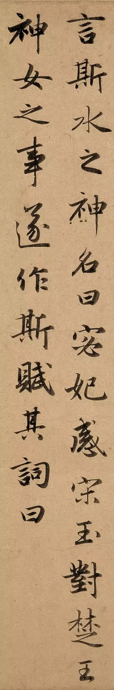
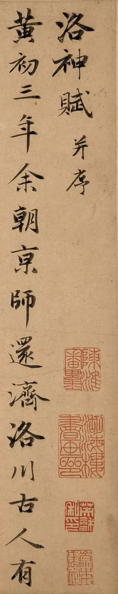

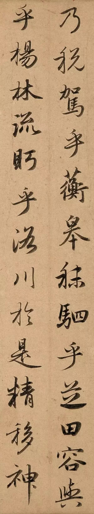

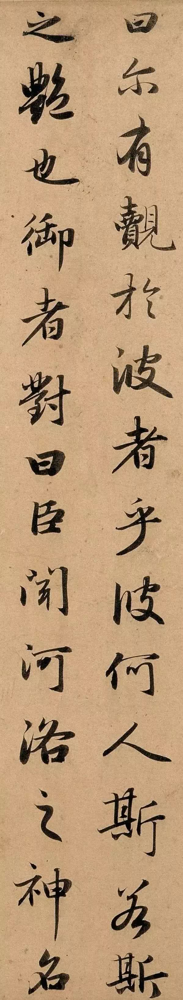
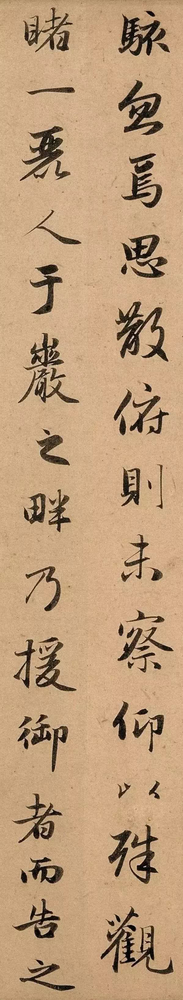

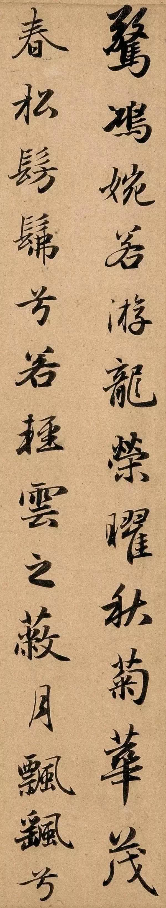
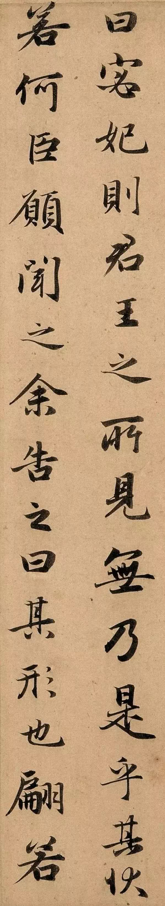

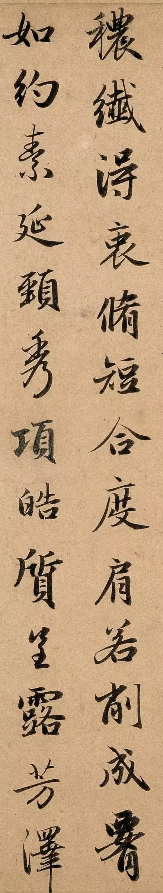
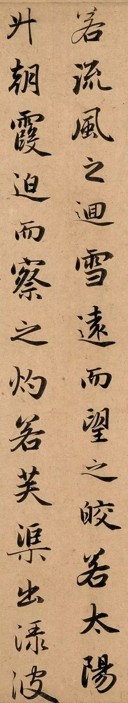

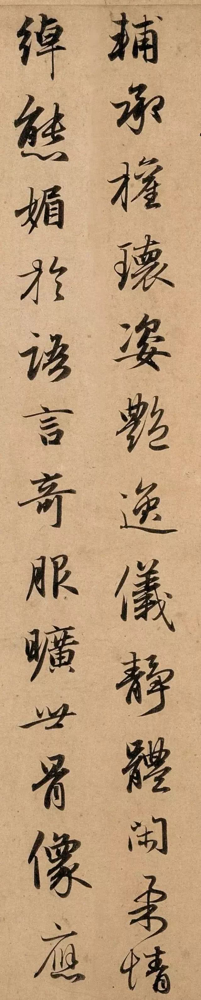
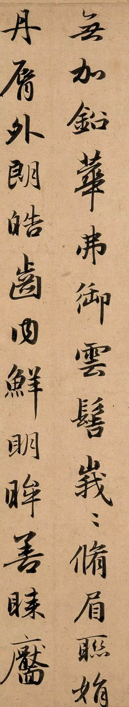

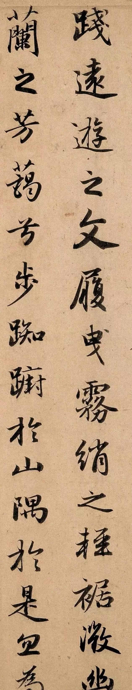
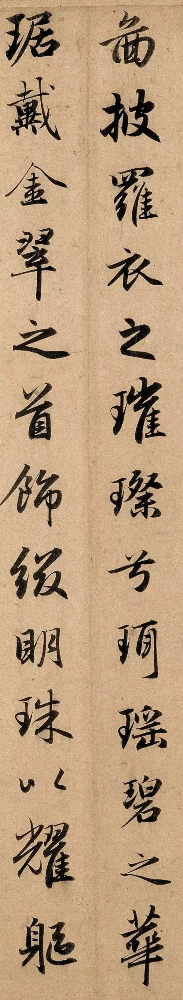

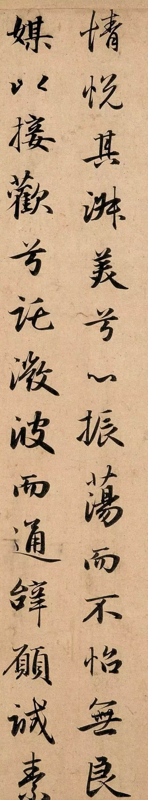
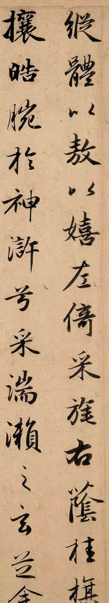

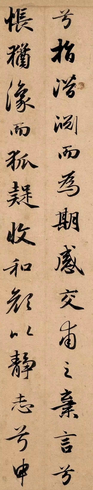
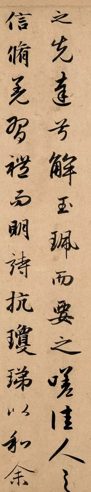

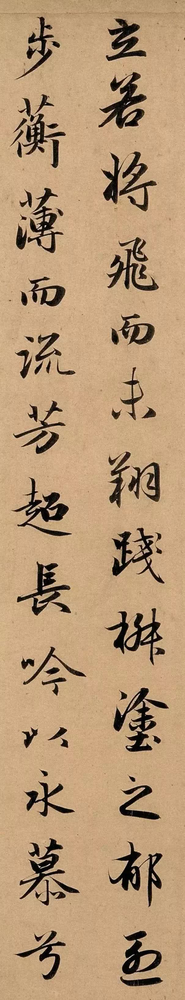
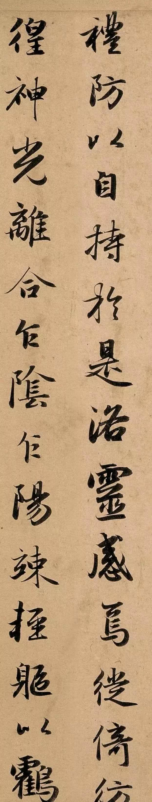

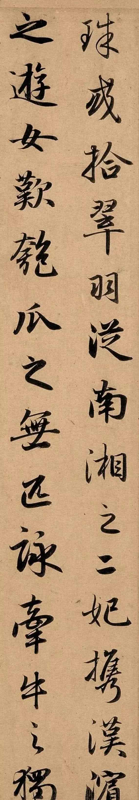

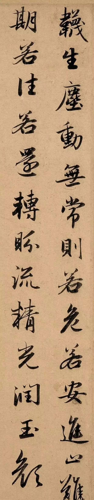
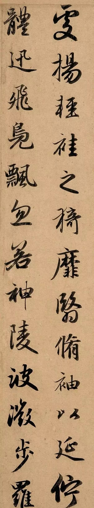

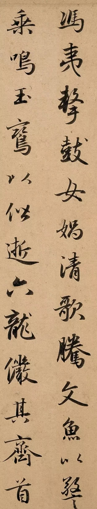
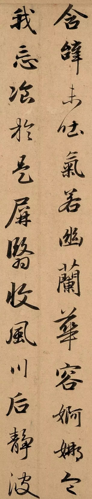

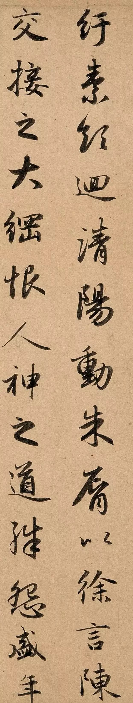
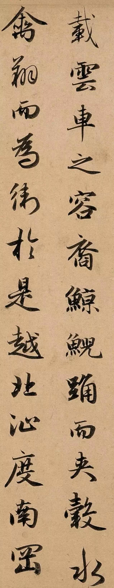

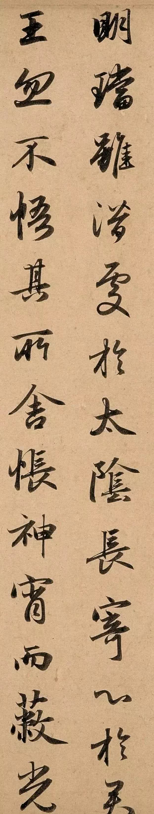
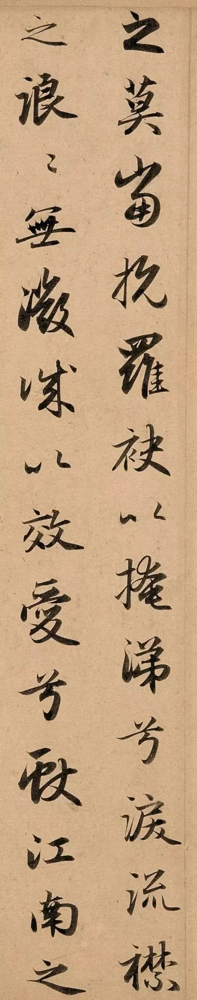

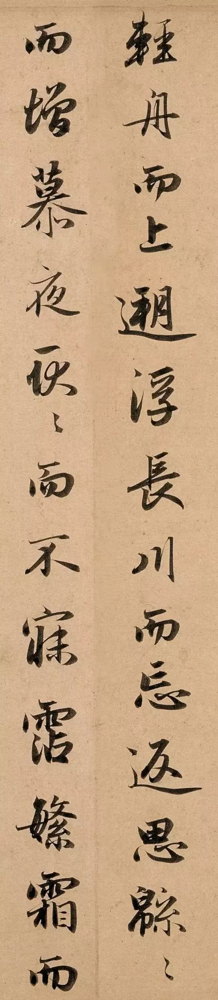
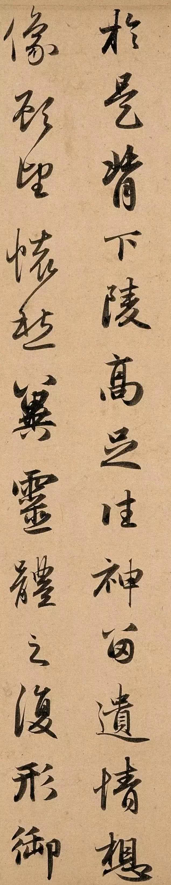

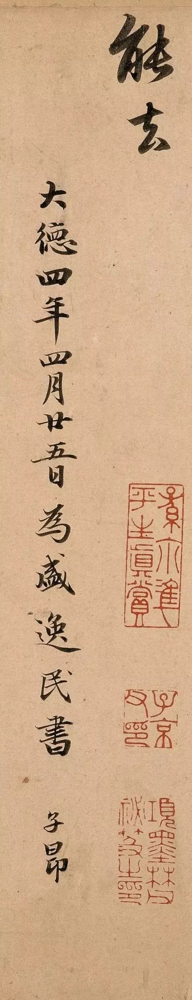
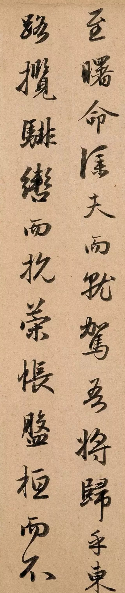

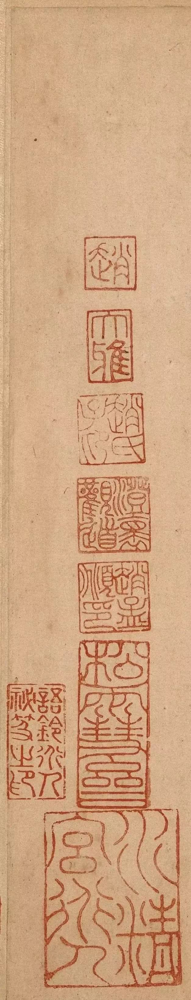

