# 汉官印

[TOC]

## 说明

本笔记的印稿来源于不厌书法，文字部分来源于公众号三个小布丁。本笔记仅作为自己学习使用，不涉及商业用途。

## 三封左尉 28mm

汉官印。四等分，规范平稳，横画多于竖画，直线较多，曲线较少。摹刻时以练习直线为主，注意每个字之内、线与线的间距，线条粗细要均匀。像楷书里的第一步，基础里的基础。

    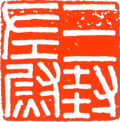
    
    

    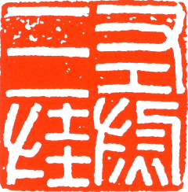
    
    

## 校尉之印 28mm

    
    
    

    
    
    

西汉中央政府铸印，印字下方有一小拐弯，这是秦官印的特征。线条均匀平滑，无刀凿痕迹；线与线之间的距离基本均等。校字上部有个小缺。竖画较多，主要用于练习竖画，也是基本笔画练习。

## 骑司马印 28mm

    
    
    

    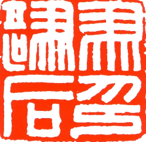
    
    

西汉官印，印字末笔仍有一个小弯（此小弯东汉以后即消失）。横竖笔画均等，骑字笔画多。注意两个不同的“马”。

## 武陵尉印 28mm

    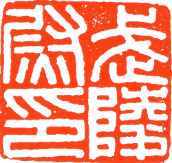
    
    

    
    
    

汉官印，临刻此印，多了“武”字里的曲线，临时应当注意处理。“印”字仍有最末的小尾巴。

## 淮阳王玺 28mm

    
    
    

    
    
    

此印为汉玉印中的典范，三密一疏的典型布局。临摹注意线条粗细基本均一，基本整齐。体验为何不失重，应注意“淮阳玺”三字有斜笔画。

## 阿阳长印 28mm

    
    
    

    
    
    

西汉中期官印。文字笔画较西汉初期更方正，更平整，同时文字也更加丰满、雄壮，渐有满白风气。注意两个耳朵的变化与统一。

## 白马令印 29mm

    
    
    

    
    
    

## 北地牧师骑丞 28mm

    
    
    

    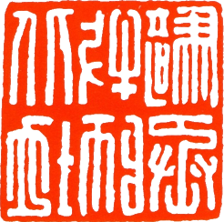
    
    

## 别部司马 28mm

    
    
    

    
    
    

## 昌县马丞印 28mm

    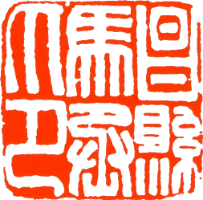
    
    

    
    
    

## 常乐苍龙曲侯 28mm

    
        
    

    
        
    

## 成皋丞印 28mm

    
    
    

    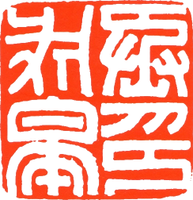
    
    

## 承令之印 27mm

    
    
    

    
    
    

## 楚御府印 26mm

    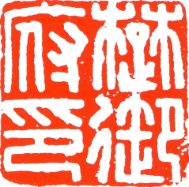
    
    

    
    
    

## 祠官 28mm

    
    
    

    
    
    

## 大将长史 28mm

    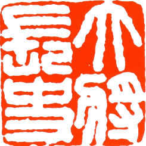
        
    

    
        
    

## 大医司马 28mm

    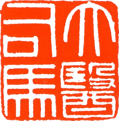
    
    

    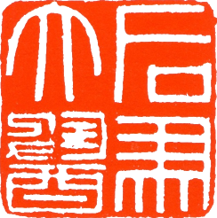
    
    

## 弹尉张宫 26mm

    
        
    

    
        
    

## 帝印 28mm

    
    
    

    
    
    

## 滇王之印 28mm

    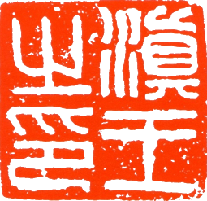
    
    

    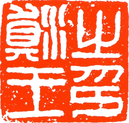
    
    

## 东光采空丞 28mm

    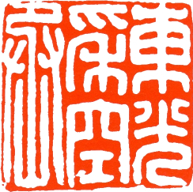
    
    

    
    
    

## 东平陆马丞 28mm

    
    
    

    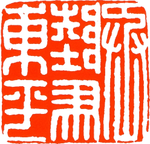
    
    

## 东武亭侯 29mm

    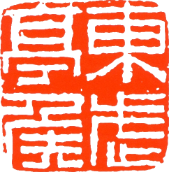
    
    

    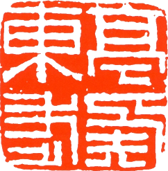
    
    

## 杜昌里印 27mm

    
    
    

    
    
    

## 方除长印 28mm

    
        
    

    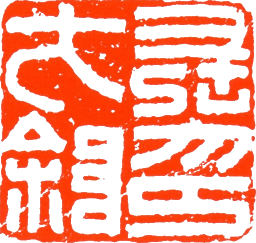
        
    

## 方俗司马 28mm

    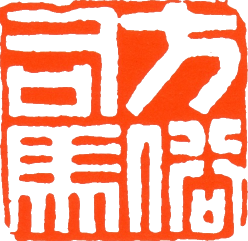
    
    

    
    
    

## 高乐长印 27mm

    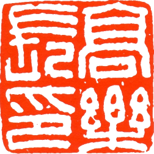
    
    

    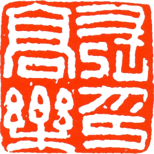
    
    

## 高柳塞尉 28mm

    
    
    

    
    
    

## 戈居丞印 28mm

一方工整的汉印，仔细体会：为什么这四个字，戈字那么简单，但并不觉得整个印重心不稳定，为什么？丞字，左右两只小手，为何长短不一样？印字末尾的小尾巴，为何没有了？

    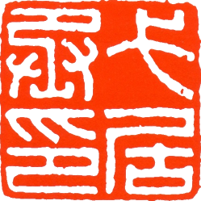
    
    

    
    
    

## 谷成令印 29mm

    
    
    

    
    
    

## 故且兰徒丞 29mm

    
        
    

    
        
    

## 关内侯印 28mm

    
    
    

    
    
    

## 关内侯印 29mm

    
        
    

    
        
    

## 馆陶家丞 27mm

    
    
    

    
    
    

## 广汉大将军章 29mm

    
        
    

    
        
    

## 广陵王玺 29mm

    
        
    

    
        
    

## 柜长之印 27mm

    
        
    

    
        
    

## 汉氏称园丞印 28mm

    
        
    

    
        
    

## 汉委奴国王29mm

    
        
    

    
        
    

## 横海侯印 29mm

    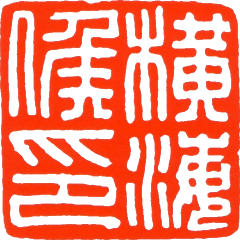
    
    

    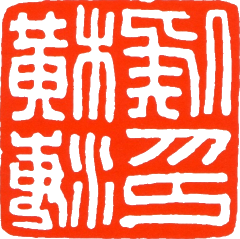
    
    

## 侯丞之印 28mm

    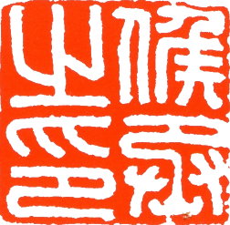
    
    

    
    
    

## 护军印章 28mm

    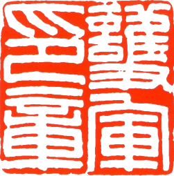
        
    

    
        
    

## 皇后之玺 33mm

    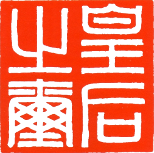
    
    

    
    
    

## 黄室私官右丞 28mm

    
        
    

    
        
    

## 棘阳县宰印 29mm

    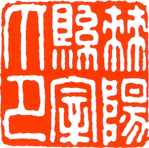
        
    

    
        
    

## 祭尊 29mm

    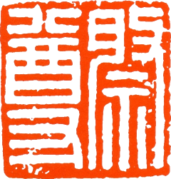
    
    

    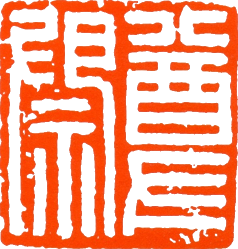
    
    

## 假司马印 28mm

    
        
    

    
        
    

## 监军司马 28mm

    
    
    

    
    
    

## 九原丞印 31mm

    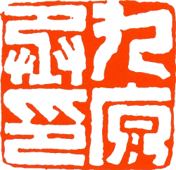
        
    

    
        
    

## 雎陵家丞 27mm

    
    
    

    
    
    

## 军侯之印 28mm

    
        
    

    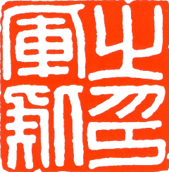
        
    

## 军假司马 27mm

    
        
    

    
        
    

## 军曲侯印 27mm

    
        
    

    
        
    

## 军曲侯印 29mm

    
        
    

    
        
    

## 军曲侯之印 27mm

    
    
    

    
    
    

## 军司马印 29mm

    
        
    

    
        
    

## 康武男家丞 29mm

    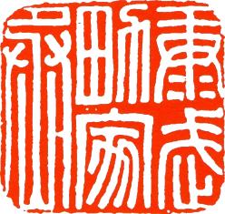
    
    

    
    
    

## 狼邪令印 28mm

    
    
    

    
    
    

## 琅邪尉丞 27mm

    
        
    

    
        
    

## 离石长印 30mm

    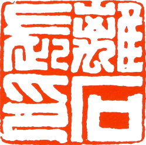
    
    

    
    
    

## 利成长印 29mm

    
    
    

    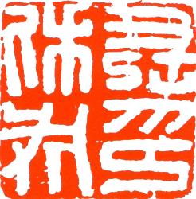
    
    

## 利成长印 29mm

    
    
    

    
    
    

## 临邛长印 29mm

    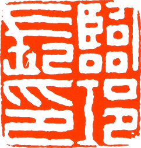
    
    

    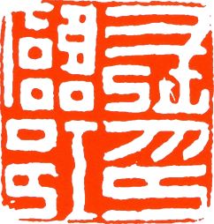
    
    

## 灵右尉印 28mm

    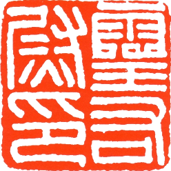
        
    

    
        
    

## 雒阳令印 29mm

    
        
    

    
        
    

## 彭城丞印 30mm

    
        
    

    
        
    

## 偏将军印章 27mm

    
        
    

    
        
    

## 偏将军印章 29mm

    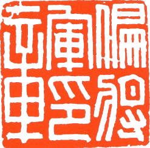
    
    

    
    
    

## 平安长印 29mm

    
        
    

    
        
    

## 平东将军章 29mm

    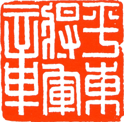
        
    

    
        
    

## 骑督之印 28mm

    
    
    

    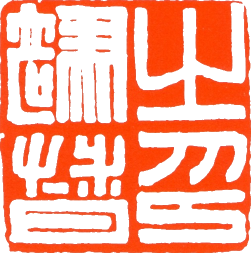
    
    

## 器俯之印 27mm

    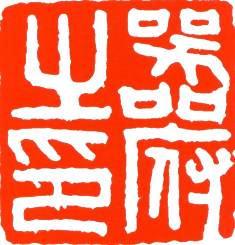
    
    

    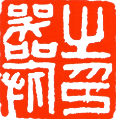
    
    

## 千人督印 28mm

    
    
    

    
    
    

## 汝南尉印 28mm

    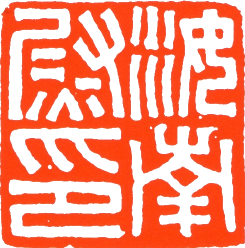
    
    

    
    
    

## 山阳尉丞 28mm

    
    
    

    
    
    

## 山阳尉印 28mm

    
        
    

    
        
    

## 上林尉印 27mm

    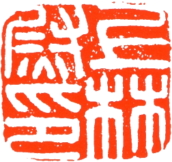
    
    

    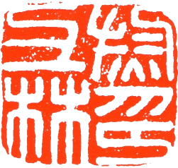
    
    

## 上虞马丞印 27mm

    
    
    

    
    
    

## 守丞之印 29mm

    
    
    

    
    
    

## 庶乐则宰印 27mm

    
        
    

    
        
    

## 朔宁王太后玺 30mm

金印，规范挺拔，三字繁，三字简，注意各站位置“太”与“大”相通。注意：“后”字的曲线！“王”字的横线的上拱！

    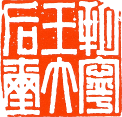
    
    

    
    
    

    

## 遂久令印 30mm

    
        
    

    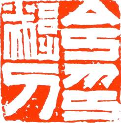
        
    

## 太医丞印 30mm

    
        
    

    
        
    

## 外里祭尊 26mm

    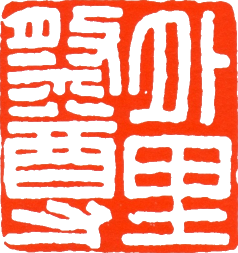
    
    

    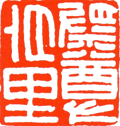
    
    

## 未央厩丞 27mm

    
    
    

    
    
    

## 文帝行玺 36mm

    
        
    

    
        
    

    

## 五原车令 28mm

    
    
    

    
    
    

## 武进长印 28mm

    
    
    

    
    
    

## 西安丞印 28mm

    
    
    

    
    
    

## 湘成侯印 30mm

    
    
    

    
    
    

## 武陵尉印 28mm

汉官印，临刻此印，多了“武”字里的曲线，临时应当注意处理。“印”字仍有最末的小尾巴。

    
    
    

    
    
    

## 校尉千人 28mm

    
    
    

    
    
    

## 校尉之印 28mm1

    
    
    

    
    
    

## 校尉之印 28mm3

    
    
    

    
    
    

## 校尉之印 28mm4

    
    
    

    
    
    

## 新成顺德单右集之印 30mm

    
    
    

    
    
    

## 新成左祭酒 26mm

    
    
    

    
    
    

## 新西河左佰长 28mm

六字印里的典范新，指的新莽政府，是汉中期王莽的政权。当时的政府颁发给地方少数民族的官印，六字六等分。西、长、左，圆转笔画，注意体会。

    
    
    

    
    
    

## 信阳长印 28mm

    
    
    

    
    
    

## 阳秩男则相 28mm

    
    
    

    
    
    

## 夷道左尉 29mm

    
        
    

    
        
    

## 渔阳右尉 28mm

    
    
    

    
    
    

## 张掖尉丞 29mm

    
    
    

    
    
    

## 长史之印 27mm

    
    
    

    
    
    

## 长水司马 29mm

    
    
    

    
    
    

## 中司马印 29mm

    
    
    

    
    
    

## 左冯翊丞 29mm

    
    
    

    
    
    

## 左司空 28mm

    
    
    

    
    
    

## 左校令印 27mm

    
    
    

    
    
    

