# 汉官印

[TOC]

汉印大致要完成的练习量是500方

## 阿阳长印 28mm

    
    
    

    
    
    

## 常乐苍龙曲侯 28mm

    
        
    

    
        
    

## 大将长史 28mm

    
        
    

    
        
    

## 戈居丞印 28mm

一方工整的汉印，仔细体会：为什么这四个字，戈字那么简单，但并不觉得整个印重心不稳定，为什么？丞字，左右两只小手，为何长短不一样？印字末尾的小尾巴，为何没有了？

    
    
    

    
    
    

## 故且兰徒丞 29mm

    
        
    

    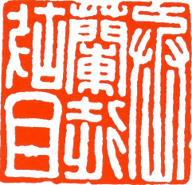
        
    

## 关内侯印 29mm

    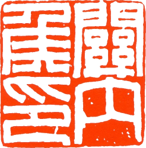
        
    

    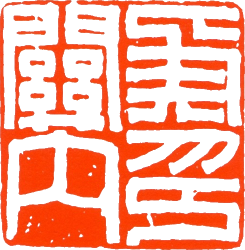
        
    

## 广汉大将军章 29mm

    
        
    

    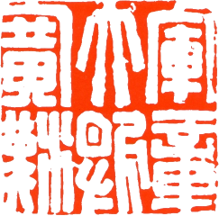
        
    

## 广陵王玺 29mm

    
        
    

    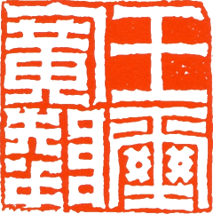
        
    

## 汉委奴国王29mm

    
        
    

    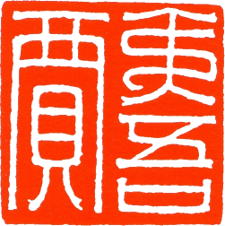
        
    

## 护军印章 28mm

    
        
    

    
        
    

## 淮阳王玺 28mm

此印为汉玉印中的典范，三密一疏的典型布局。临摹注意线条粗细基本均一，基本整齐。体验为何不失重，应注意“淮阳玺”三字有斜笔画。

    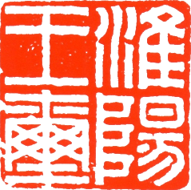
    
    

    
    
    

## 皇后之玺 33mm

    
    
    

    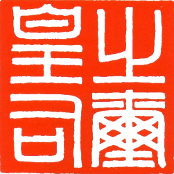
    
    

## 黄室私官右丞 28mm

    
        
    

    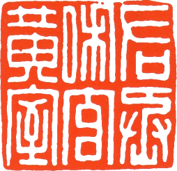
        
    

## 棘阳县宰印 29mm

    
        
    

    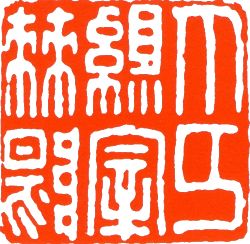
        
    

## 假司马印 28mm

    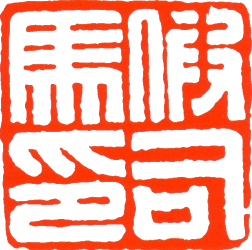
        
    

    
        
    

## 九原丞印 31mm

    
        
    

    
        
    

## 军曲侯印 27mm

    
        
    

    
        
    

## 琅邪尉丞 27mm

    
        
    

    
        
    

## 灵右尉印 28mm

    
        
    

    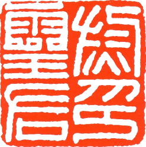
        
    

## 雒阳令印 29mm

    
        
    

    
        
    

## 彭城丞印 30mm

    
        
    

    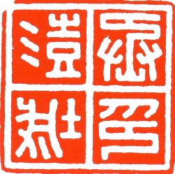
        
    

## 偏将军印章 27mm

    
        
    

    
        
    

## 平安长印 29mm

    
        
    

    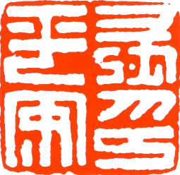
        
    

## 平东将军章 29mm

    
        
    

    
        
    

## 骑司马印 28mm

西汉官印，印字末笔仍有一个小弯（此小弯东汉以后即消失）。横竖笔画均等，骑字笔画多。注意两个不同的“马”。

    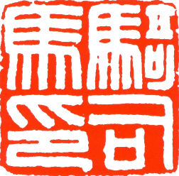
    
    

    
    
    

## 三封左尉 28mm

汉官印，四等分，规范平稳，横画多于竖画，直线较多，曲线较少。摹刻时以练习直线为主，注意每个字之内、线与线的间距，线条粗细要均匀。像楷书里的第一步，基础里的基础。

    
    
    

    
    
    

## 山阳尉印 28mm

    
        
    

    
        
    

## 庶乐则宰印 27mm

    
        
    

    
        
    

## 朔宁王太后玺 30mm

金印，规范挺拔，三字繁，三字简，注意各站位置“太”与“大”相通。注意：“后”字的曲线！“王”字的横线的上拱！

    
    
    

    
    
    

    

## 遂久令印 30mm

    
        
    

    
        
    

## 太医丞印 30mm

    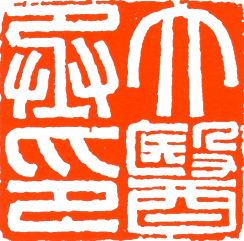
        
    

    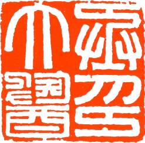
        
    

## 文帝行玺 36mm

    
        
    

    
        
    

    

## 武陵尉印 28mm

汉官印，临刻此印，多了“武”字里的曲线，临时应当注意处理。“印”字仍有最末的小尾巴。

    
    
    

    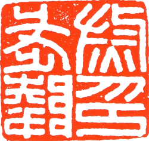
    
    

## 校尉之印 28mm

西汉中央政府铸印，印字下方有一小拐弯，这是秦官印的特征。线条均匀平滑，无刀凿痕迹；线与线之间的距离基本均等。校字上部有个小缺。竖画较多，主要用于练习竖画，也是基本笔画练习。

    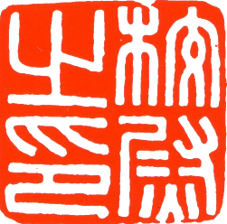
    
    

    
    
    

## 新西河左佰长 28mm

六字印里的典范新，指的新莽政府，是汉中期王莽的政权。当时的政府颁发给地方少数民族的官印，六字六等分。西、长、左，圆转笔画，注意体会。

    
    
    

    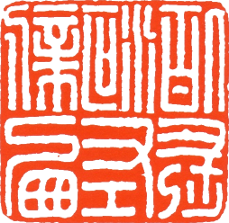
    
    

## 夷道左尉 29mm

    
        
    

    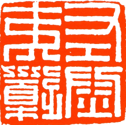
        
    

