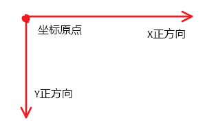
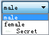
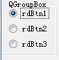
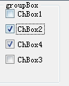
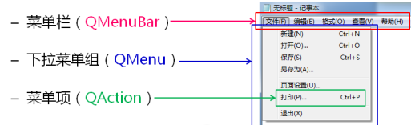
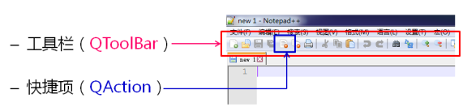

# Qt详细指南

[TOC]


### Qt的基础知识

#### Qt中的坐标系

Qt的界面中的坐标系定义为：屏幕左上角为坐标原点，水平向右为X轴正方向，竖直向下为Y轴正方向。对于组件来说，左上角是其坐标原点




#### 信号和槽的概念

Qt使用信号和槽的方式实现对象之间的通信，当某个对象的某些事件发生时，对应的信号会被发送。可以将一个对象的信号和另一个对象的槽连接，当信号发送后，Qt自动调用相连接的槽函数。信号和事件是差不多的概念（暂时这么认为），信号什么时候发生是不一定的（可能是用户操作触发的），但是只要发生了就会调用与之相连接的槽函数。如上面这个例子:

```cpp
public slots:
    void BtnOK_Clicked();   // 声明槽函数
```

```cpp
 // 绑定信号和槽函数
connect(&BtnOK, SIGNAL(clicked()), this, SLOT(BtnOK_Clicked()));  
```

connect是连接信号和槽的函数，参数如下：

- 参数1：发送方，某个对象的指针
- 参数2：发送方发送信号的类型，clicked()是点击信号，使用SIGNAL()做类型转换（类似这个操作）
- 参数3：接收方，this表示，接收方是发送方的父对象
- 参数4：槽函数，这个类中声明的函数，槽函数声明时必须加入slots关键字


**信号和槽的概念**

Qt提供了信号和槽来处理模块之间的通信和事件，信号与槽不仅可以处理GUI上用户操作触发的事件，也可以实现模块之间的通信。

信号与槽是一种用于对象之间的通信的机制，QT中的组件拥有多种预设信号（SIGNAL），槽（SLOT）也提供多种虚函数（virtual），可供用户重写并使用，信号用于处理发生的使劲啊，槽则指定从信号处接收的时间函数，可以将信号和槽视作一个管道，发射某个事件，信号把它发射，槽指定了一个处理这个事件的函数。

**Qt中信号的本质**

- 信号只是一个特殊的成员函数：返回值void，且只能声明不能定义
- 信号必须使用signals关键字进行声明：函数属性自动为protected，只能通过**emit**关键字调用函数（发射信号）


信号关键字 `signals` 来声明， 它的形式类似于一个函数， 但是返回值只能是 void
类型，并且信号只需要声明即可， 千万不要在.cpp 文件中去实现在头文件中声明的信号。

发射信号的关键字是`emit`

槽是一种可以用来连接到信号的成员函数， 信号发射时，它所连接的相应的槽将被执行。槽实际上也可以作为普通的成员函数来使用，它可以被直接调用，public slots 的槽才可以被其他类所直接调用

信号和槽的演示

在按钮的槽函数中，发射一个信号，这个信号绑定一个槽函数

```cpp
#ifndef MAINWINDOW_H
#define MAINWINDOW_H

#include <QMainWindow>
#include <QPushButton>


class MainWindow : public QMainWindow
{
    Q_OBJECT
public:
    QPushButton *btn;

public slots:
    void btn_clicked();
    void my_slot();

signals:
    void my_signal();
    
public:
    MainWindow(QWidget *parent = 0);
    ~MainWindow();
};

#endif // MAINWINDOW_H

```

```cpp
#include "mainwindow.h"
#include <QDebug>

MainWindow::MainWindow(QWidget *parent)
    : QMainWindow(parent)
{
    btn = new QPushButton("signal", this);

    connect(btn, SIGNAL(clicked()), this, SLOT(btn_clicked()));
    connect(this, SIGNAL(my_signal()), this, SLOT(my_slot()));

}
void MainWindow::my_slot()
{
    qDebug()<<"void MainWindow::my_slot()....";
}

void MainWindow::btn_clicked()
{
    emit my_signal();
    qDebug()<<"you emit a signal....";
}

MainWindow::~MainWindow()
{
}

```


#### Qt对象之间的关系

先定义一个指针，在使用new实例化他， 则指针是在栈中创建的，他指向的是堆空间，在不用的时候，需要delete，否则内存泄漏。Qt对象之间存在特殊的关系：对象之间存在父子关系

- 每一个对象都保存有他所有子对象的指针
- 每一个子对象都有一个指向其父对象的指针

也就是说，只要一个对象和另一个对象存在父子关系，那么他们两个可以通过各自内部的指针找到对方。

Qt中，可以指定某对象的父对象，如下代码：

```c++
    QObject* f = new QObject(); 
    QObject* s1 = new QObject();

    s1->setParent(f); // 设置对象s的父对象为f
```

使用对象的setParent函数，就可以指定父对象，f是父对象，s是子对象，在这个过程中，有如下操作

- 父对象f的子对象指针链表中加入了子对象s的指针
- 子对象s中保存了指向父对象f的指针

父对象f和子对象s，可以相互找到，在帮助文档中搜索QObject，找与之相关的信息，有如下

```c++
const QObjectList &QObject::children() const
```

这个函数是返回该对象的子对象的指针链表（一定要经常使用帮助文档），也有返回父对象指针的函数。Qt对象在销毁时，有如下操作

- 解除和父对象之间的父子关系，把自己从父对象的子对象链表中移除
- 同时销毁所有子对象，将子对象链表中的所有对象销毁

所以，在创建一个对象后，如果他有父对象，并且父对象有销毁函数（释放空间），这个对象就不用自己实现析构函数，会被父对象一起销毁。在Qt开发时，不仅要关注内存泄漏，还要注意是否被多次释放

总结如下：

- Qt对象之间存在父子关系
- 通过父子关系能够得到Qt对象树
- Qt对象销毁时，解除和父对象之间的父子关系
- Qt对象销毁时，将同时销毁所有的子对象

#### 用户界面和业务逻辑

在编写界面软件时，软件由用户界面和软件里面的业务逻辑组成，即用户看到的软件界面和软件的各种功能（用户的需求）。在设计软件时，要把用户界面和业务逻辑分离，把软件中的各个功能都单独地拆成模块，便于以后升级和修改维护。界面和逻辑之间使用接口交互

**模块的设计原则**

模块之间要强内聚、低耦合。即每个模块尽量实现单一的功能，和别的模块之间耦合性要低（关联性低）。尽量不要写多功能的模块。

**接口**

模块之间通过约定好接的接口进行交互。接口是一种协议、语法、格式等概念，严格来说

- 面向过程：接口是一组预定义的函数原型 
- 面向对象：接口是纯虚类，只有纯虚函数的类，使用virtual声明，并且函数=0的

#### 类的二阶构造

实例化对象时，不一定会成功地创建出一个完整的对象，因为在实例化的过程中可能存在申请系统资源失败的情况，或者其他导致实例化出的对象不完整、不能正常使用的问题。使用二阶构造可以避免这个问题。二阶构造：

- 第一阶段：执行与资源无关的操作
- 第二阶段：执行与资源有关的操作

更具体的见C++笔记，有详细的示例

#### 实例化对象的方法

**直接实例化对象**

h文件，类定义中，直接实例化对象：

```cpp
private:
    QPushButton btn1;
```

c文件，构造函数中：

```cpp
// 写法一：在构造函数的基类中，加入组件并声明父对象
Widget::Widget(QWidget *parent)
    : QWidget(parent), btn1(this)
{
    btn1.setText("btn1");
}
```

**实例化一个对象指针**

h文件，类定义中，直接实例化对象指针：

```cpp
private:
    QPushButton *btn1;
```

c文件，构造函数中，使用new分配对象：

```cpp
Widget::Widget(QWidget *parent)
    : QWidget(parent)
{
    btn1 = new QPushButton("btn1", this);
}
```

#### 三种基类的区别

- QWidget：是所有用户界面对象的基类。 窗口部件是用户界面的一个基本单元：它从窗口系统接收鼠标、键盘和其它事件，并且在屏幕上绘制自己。每一个窗口部件都是矩形的，并且它们按Z轴顺序排列。一个窗口部件可以被它的父窗口部件或者它前面的窗口部件盖住一部分。
- QDialog：提供一个有菜单条、锚接窗口（例如工具条）和一个状态条的主应用程序窗口。主窗口通常用在提供一个大的中央窗口部件（例如文本编辑或者绘制画布）以及周围菜单、工具条和一个状态条。QMainWindow常常被继承，因为这使得封装中央部件、菜单和工具条以及窗口状态条变得更容易，当用户点击菜单项或者工具条按钮时，槽会被调用。
- MainWindow：最普通的顶级窗口。一个不会被嵌入到父窗口部件的窗口部件叫做顶级窗口部件。通常情况下，顶级窗口部件是有框架和标题栏的窗口（尽管使用了一定的窗口部件标记，创建顶级窗口部件时也可能没有这些装饰。）在Qt中，QMainWindow和不同的QDialog的子类是最普通的顶级窗口

​      如果是主窗体，就选择QMainWindow，如果是顶级对话框，就选择QDialog，如果不确定，或者前两种情况都有，那么，就选择QWidget。

（来源于百度）


#### 定时器

见QStackedLayout栈式布局

#### 基础函数

```cpp
resize(30, 80); // 设置窗口大小
move(30, 30);   // 设置位置
setLayout();    // 参数为某个布局类型
setText("strxxxx"); // 设置显示的字符串 
```

#### 一个综合的例子

演示用户界面和业务逻辑分离的。功能：实现一个加法器，输入两个数，点击按钮后显示和。把这个加法器封装成一个模块，只要包含头文件，实力一个对象，再调用显示函数就可显示出界面并且具有加法器的功能。

- 抽象类文件iadd.h：有两个纯虚函数，一个是计算函数，一个返回结果函数
- 界面文件addui.c/h：实现各个组件的创建、设置位置、大小等等。在创建按钮组件时，创建成功之后要连接槽函数，发送方是按钮对象，信号是点击，接受方是这个对象，槽函数需要自己实现
- 逻辑功能文件addfun.c/h：基于抽象类，添加要给结果变量，并且实现抽象类的虚函数
- 计算器文件add.c/h：包含ui文件和逻辑文件

iadd.h文件，定义接口

```c++
#ifndef IADD_H
#define IADD_H
#include <QString>

//  定义一个接口,C++中的纯虚类
class IAdd
{
public:                              // virtual 声明并且=0的函数为纯虚函数
    virtual void calResult(const QString& str1,const QString& str2) = 0; // 计算结果
    virtual int getResult() = 0;   // 读取结果
};

#endif // IADD_H
```

addui.h

```c++
#ifndef ADDUI_H
#define ADDUI_H

#include <QWidget>
#include <QLineEdit>
#include <QPushButton>
#include<iadd.h> // 包含接口的纯虚类

class AddUI : public QWidget
{
   Q_OBJECT
private:

    QLineEdit* num1_edit;
    QLineEdit* num2_edit;
    QLineEdit* num3_edit;
    QPushButton* add_button;
    IAdd* m_cal;
private slots:
    void onButtonClicked();
public:
    bool construct();
    void setCalculator(IAdd* cal);
    void show();
    static AddUI* NewInstance();
    AddUI();
    ~AddUI();
};

#endif // ADDUI_H
```

addui.c

```c++
#include<addui.h>
#include<qdebug.h>


// 构造函数
AddUI::AddUI(): QWidget(NULL, Qt::WindowCloseButtonHint)
{
    m_cal = NULL;  // 初始化是一个空抽象类
}

bool AddUI::construct()
{
    bool ret = true;

    num1_edit = new QLineEdit(this);
    num2_edit = new QLineEdit(this);
    num3_edit = new QLineEdit(this);

    if ( num1_edit != NULL )
    {
        num1_edit->move(20, 20);
        num1_edit->resize(30, 30);
        num1_edit->setAlignment(Qt::AlignRight);
    }
    else
        ret = false;
    if ( num2_edit != NULL )
    {
        num2_edit->move(80, 20);
        num2_edit->resize(30, 30);
        num2_edit->setAlignment(Qt::AlignRight);
    }
    else
        ret = false;
    if ( num3_edit != NULL )
    {
        num3_edit->move(150, 20);
        num3_edit->resize(30, 30);
        num3_edit->setAlignment(Qt::AlignRight);
    }
    else
        ret = false;

    add_button = new QPushButton(this);
    if ( add_button != NULL )
    {
        add_button->resize(40, 40);
        add_button->move(20,80);
        add_button->setText("ok");

        connect(add_button, SIGNAL(clicked()), this, SLOT(onButtonClicked()));
    }
    else
        ret = false;
    return ret;
}

AddUI* AddUI::NewInstance()
{
    AddUI* ret = new AddUI();

    if ( ret == NULL || !ret->construct())
    {
        delete ret;
        ret = NULL;
    }
    return ret;
}

void AddUI::show()
{
    QWidget::show();
    setFixedSize(width(), height());
}

void AddUI::onButtonClicked()
{
    QPushButton* btn = dynamic_cast<QPushButton*>(sender());

    if( btn != NULL )
    {
        m_cal->calResult(num1_edit->text(),num2_edit->text());
        num3_edit->setText(QString::number(m_cal->getResult()));
    }
}

void AddUI::setCalculator(IAdd* cal)
{
    m_cal = cal;
}
AddUI::~AddUI()
{
}
```

addfun.h

```c++
#ifndef ADDFUN_H
#define ADDFUN_H
#include <QString>

#include<iadd.h>

class AddFun:public IAdd
{
protected:
    int m_result;  // 结果数据,
public:
    AddFun();
    ~AddFun();

    void calResult(const QString& str1,const QString& str2);
    int getResult();  // 对象不能直接访问protected成员
};

#endif // ADDFUN_H
```

addfun.c

```c++
#include<addfun.h>

void AddFun::calResult(const QString& str1,const QString& str2)
{
    int n1;
    int n2;
    int n3;

    n1 = str1.toInt();
    n2 = str2.toInt();
    m_result = n1+n2;
}

int AddFun::getResult()
{
    return m_result;
}

AddFun::~AddFun()
{
}

AddFun::AddFun()
{
}
```

add.h

```c++
#ifndef ADD_H
#define ADD_H

#include<addui.h>
#include<addfun.h>
class Add
{
protected:
    AddUI* m_ui;
    AddFun m_cal;

public:
    Add();
    ~Add();
    bool construct();
    static Add* NewInstance();
    void show();
};

#endif // ADD_H
```

add.c

```c++
#include<qdebug.h>
#include<add.h>

Add::Add()
{
}
Add::~Add()
{
    delete m_ui;
}


void Add::show()
{
    m_ui->show();
}

bool Add::construct()
{
    m_ui = AddUI::NewInstance();

    if( m_ui != NULL )
    {
        m_ui->setCalculator(&m_cal);
    }
    return (m_ui != NULL);
}
Add* Add::NewInstance()
{
    Add* ret = new Add();
    if( (ret == NULL) || !ret->construct() )
    {
        delete ret;
        ret = NULL;
    }
    return ret;
}
```

main.cpp

```c++
#include "widget.h"
#include <QApplication>

#include<add.h>
#include<qdebug.h>

int main(int argc, char *argv[])
{
    QApplication a(argc, argv);

    Add* cal = Add::NewInstance();  // 二阶构造，实例化对象，不会出错

    int ret = -1;
    if( cal != NULL )
    {
        cal->show();
        ret = a.exec();
        delete cal;
    }
    return ret;
}
```


### Qt基本组件

#### QPushButton 按钮

QPushButton 可以提供一个按钮， 按下（单击）按钮可以使程序执行某些函数（槽函数），按钮是矩形的，显示一个文本内容，或者一个图片。

定义一个按钮

```cpp
// 先不设置显示内容，父对象是窗口对象
QPushButton *button = new QPushButton(this); 

// 设置显示Download
QPushButton *button = new QPushButton("Download", this); 

// 一般在类中声明，在构造函数中分配空间，设置属性
QPushButton *btn1;  // 类中声明

btn1 = new QPushButton("btn1", this); // 构造函数中分配

```

设置按钮：

```cpp
button->setParent(this);    // 设置父对象，如果在实例化时候没有指定的，再使用此函数
button->setText("button");  // 设置按钮显示的字符串：button
button->resize(50, 20);     // 设置大小，宽（x方向右），高（y方向下）,
button->move(100, 100);     // 设置位置，x方向右，y方向下，组件右上角的位置（原点）

```

连接槽函数：

```cpp
connect(button, SIGNAL(clicked()), this, SLOT(BtnOK_Clicked()));
```

**知识点**

- QPushButton 可以显示字符串或者一个小图标：`setText()`和`setIcon()`
- QPushButton 能发出多种信号：`clicked()`、`pressed()`、`released()`等等
- 默认按钮：默认按钮是当用户在对话框中按回车键时激活的按钮。对话框中的命令按钮默认为自动默认按钮，即当它们收到键盘输入焦点时自动成为默认按钮。使用`setAutoDefault()`函数设置
- 键盘按键触发鼠标左键点击：按下空格键就相当于鼠标左键点击按钮（需要配置）
- QToolButton 类可以实现更特殊的按钮，可以设置按钮的外形样式，矩形，圆角等等

#### QLabel 标签

QLabel 标签，可以显示文本信息、图片等。与QMovie 输出的影像链接，可以实时输出多媒体影像，例如从从视频或者摄像头输出的数据保存为 QByteArray 数据类型，可以输出到 QLabel 组件

**知识点**

- `text()` 读取的当前显示的内容，返回QString数据
- `setPixmap()` 设置显示一个图片，参数是QPixmap &，QPixmap 的引用 QPixmap 类是用于在GUI上描绘图形的API，QLabel组件利用成员函数`setPixmap()`将使用QPixmap描绘的图像显示到GUI

**构造函数指定字符串**

```
QLabel *lbl = new QLabel("lbl", this);
```

**setText 函数指定字符串**

```
QLabel *lbl = new QLabel(this);
lbl->setText("lbl");
```

**显示一个图片**

显示图片时，注意图片的路径，代码如下：

```c++
QLabel *lbl = new QLabel(this);

QImage *img = new QImage;  // 新建一个image对象

//将图像资源载入对象img，注意路径
img->load("C://Users//Mr_zhang//Desktop//img1.png");

// QPixmap::fromImage将图片转换为QPixmap
lbl->setPixmap(QPixmap::fromImage(*img));
```


#### QComboBox下拉菜单

下拉菜单选中一个后，都会触发信号`currentIndexChanged(int)`，可以绑定一个槽函数，下拉菜单的选项名字前可以有一个图标



**知识点**

- `addItem("male")`   加入一个选项，显示字符串：male
- `addItem(QIcon("路径"), "Secret")` 加入一个选项Secret，名字前显示一个图片
- 索引：每个选项的索引唯一，按照添加的顺序，从0开始编号
- 信号：索引改变信号`currentIndexChanged(int)`，把索引值传递给槽函数
- `currentText()`  返回当前选项的名字，字符串
- `removeItem(index)`  删除编号为index的选项 
- `count()`   返回下拉菜单中选项的个数
- `currentIndex()`     返回当前选中的选项索引

**代码示例**

```c++
Widget::Widget(QWidget *parent)
    : QWidget(parent)
{
    comBox = new QComboBox(this);

    comBox->addItem("male");  // 向下拉菜单加入一个选项
    comBox->addItem("female");

    // 名字之前可以有一个图标
    comBox->addItem(QIcon("C://Users//Mr_zhang//Desktop//img1.png"), "Secret");

    connect(comBox, SIGNAL(currentIndexChanged(int)), this, SLOT(comBox_currentIndexChanged(int)));

    resize(480, 320);

}

// 槽函数的参数是索引，信号传递过来的
void Widget::comBox_currentIndexChanged(int index)
{
    qDebug()<<index;  // 打印索引
}
```

#### QRadioButton 多选一按钮

单选按钮，多个单选按钮中只能选择一个，但是必须放入**groupbox**中，类似单选题。



**知识点**

- 信号：`toggled()`信号，对于多选按钮中的每一个按钮，选中或者取消选中（选中其他按钮）都会触发这个信号
- `isChecked()`函数：判断其中的某个按钮，是否被选中了，可以在配合一个**QPushButton**，检测某个是否被选中

**示例代码**

```c++
Widget::Widget(QWidget *parent)
    : QWidget(parent)
{
    // 实例化三个QRadioButton
    QRadioButton *rdBtn1 = new QRadioButton("rdBtn1", this);
    QRadioButton *rdBtn2 = new QRadioButton("rdBtn2", this);
    QRadioButton *rdBtn3 = new QRadioButton("rdBtn3", this);

    rdBtn1->setChecked(true); // 设置为默认选项

    QGroupBox *groupBox = new QGroupBox(this);

    groupBox->setTitle("QGroupBox");
    groupBox->resize(80, 80);

    QVBoxLayout *vbox = new QVBoxLayout(this);    // 垂直管理器
    vbox->addWidget(rdBtn1);
    vbox->addWidget(rdBtn2);   // 将三个QRadioButton放到垂直管理器之中
    vbox->addWidget(rdBtn3);

    vbox->addStretch(1);
    groupBox->setLayout(vbox);   // 将垂直管理器加入到groupBox
    setLayout(vbox);      // 启用垂直管理器
    connect(rdBtn1, SIGNAL(toggled(bool)), this, SLOT(test_slot()));

}

// 某个按钮选中或者取消选中
void Widget::test_slot()
{
    qDebug()<<"void Widget::test_slot()"; 
}
```


#### QCheckBox 复选框

多选多，也要放在**QGroupBox**中



**知识点**

- `isChecked()`函数判断复选框中某个选项是否被选中了

**示例代码**

h文件，类定义

```c++
class Widget : public QWidget
{
    Q_OBJECT

private:
    QComboBox *comBox;
    QCheckBox *ChBox1;
    QCheckBox *ChBox2;
    QCheckBox *ChBox3;
    QCheckBox *ChBox4;
    QPushButton *BtnOK;

public slots:
    void test_slot();


public:
    Widget(QWidget *parent = 0);
    ~Widget();
};
```

cpp文件，构造函数和槽函数

```c++
Widget::Widget(QWidget *parent)
    : QWidget(parent)
{
    BtnOK = new QPushButton (this);
    BtnOK->setText("BtnOK");
    BtnOK->resize(50, 20);  // xy方向的像素，绝对大小
    BtnOK->move(100, 200);    // xy方向的位置，绝对定位

    // h文件中的指针，QCheckBox *ChBox1; 在这里使用new分配对象
    ChBox1 = new QCheckBox("ChBox1",this);
    ChBox2 = new QCheckBox("ChBox2",this);
    ChBox4 = new QCheckBox("ChBox3",this);
    ChBox3 = new QCheckBox("ChBox4",this);

    QGroupBox *groupBox = new QGroupBox(this);

    groupBox->setTitle("groupBox");

    QVBoxLayout *vbox = new QVBoxLayout(this);   // 水平布局管理
    groupBox->resize(90, 120);

    vbox->addWidget(ChBox1);
    vbox->addWidget(ChBox2);
    vbox->addWidget(ChBox3);
    vbox->addWidget(ChBox4);

    vbox->addStretch(1);
    groupBox->setLayout(vbox);   // 水平布局管理加入到QGroupBox中
    setLayout(vbox);

    connect(BtnOK, SIGNAL(clicked()), this, SLOT(test_slot()));
    resize(480, 320);

}

void Widget::test_slot()
{
    // ChBox1是类中的指针
    if ( ChBox1->isChecked() )        // 判断是选中了那些复选框
        qDebug()<<"ChBox1.isChecked()"<<endl;
    if ( ChBox2->isChecked() )
        qDebug()<<"ChBox2.isChecked()"<<endl;
    if ( ChBox3->isChecked() )
        qDebug()<<"ChBox3.isChecked()"<<endl;
    if ( ChBox4->isChecked() )
        qDebug()<<"ChBox4.isChecked()"<<endl;
}
```


#### QLineEdit、QTextEdit、QPlainTextEdit文本编辑组件

Qt中常用的文本编辑组件的内置功能：

- 键弹出式菜单
- 快捷键功能，复制、粘贴、剪切等等

QT中的文本编辑组件有：

- QLineEdit：单行文本编辑组件
- QTextEdit：多行富文本编辑组件，支持多媒体效果（视频、音频）
- QPlainTextEdit：多行普通文本编辑组件

QLineEdit，编辑文本时，提供信号，并把编辑的QLineEdit组件文件和QString字符串作为参数传递给槽，每改变一次发射一次信号`textChanged(QString)`。

**知识点**

- `setEchoMode(QLineEdit::Password)`  设置模式
  - QLineEdit::Normal    默认，原样显示
  - QLineEdit::NoEcho  隐藏文本，光标位置不变
  - QLineEdit::Password  显示黑色原点
  - QLineEdit::PasswordEchoOnEdit   编辑文本和默认一样，移动焦点显示*，但是看着和默认没什么区别

**示例代码**

代码1：QLineEdit

```c++
Widget::Widget(QWidget *parent)
    : QWidget(parent)
{
    BtnOK = new QPushButton("BtnOK", this);
    BtnOK->resize(50, 20);  // xy方向的像素，绝对大小
    BtnOK->move(100, 100);    // xy方向的位置，绝对定位

    lineEdit = new QLineEdit(this);
    lineEdit->setEchoMode(QLineEdit::PasswordEchoOnEdit);
    connect(lineEdit, SIGNAL(textChanged(QString)), this, SLOT(lineEdit_textChanged(QString)));
    connect(BtnOK, SIGNAL(clicked()), this, SLOT(BtnOK_Clicked()));
    resize(480, 320);
}

void Widget::lineEdit_textChanged(QString str)
{
    qDebug()<<str;
}
```

代码2

```c++
MainWindow::MainWindow(QWidget *parent) : QMainWindow(parent),
  lineEdit(this), plainEdit(this), textEdit(this)
{
    resize(600, 420);

    lineEdit.move(20, 20);
    lineEdit.resize(560, 100);
    lineEdit.insert("QLineEdit");   // 单行文本
    lineEdit.insert("\n");
    lineEdit.insert("");
	// 单行文本不能插入图片
      
    plainEdit.move(20, 130);
    plainEdit.resize(560, 130);
    plainEdit.insertPlainText("QPlainTextEdit");
    plainEdit.insertPlainText("\n");
    plainEdit.insertPlainText("");

    textEdit.move(20, 270);
    textEdit.resize(560, 130);
    textEdit.insertPlainText("QTextEdit");
    textEdit.insertPlainText("\n");
    textEdit.insertHtml("");
}
```


#### QCommandLinkButton

继承自QPushButton，和QPushButton功能相同，风格样式多一些

```c++
    CmdBtn = new QCommandLinkButton(
                "vision",    // 按钮标签
                "vision pro", // 描述性标签，可以没有
                this);
```

#### Qt中的调色板

Qt中的调色板主要功能是设置各个组建的颜色，背景色等等，调色板是存储组件颜色信息的数据结构，组件外观所使用的颜色都定义于调色板中

QPalette类包含了组件状态的颜色组，QPalette对象包含了3个状态的颜色描述

- 激活颜色组（Active）：组件**获得焦点**使用的颜色搭配方案
- 非激活颜色组（Inactive）：组件**失去焦点**使用的颜色方案
- 失效颜色组（Disabled）：组件处于**不可使用状态**的颜色方案

QPalette中的颜色组定义了组细节的颜色值，QPalette::ColorRole中的常量值用于标识组件细节


小结：

- QPalette是Qt中的标识颜色信息的数据结构
- 窗口组件内部拥有QPalette对象
- 重新设置组件调色板的值能够改变特定区域的颜色
- QPalette对象是定制组件外观的重要角色

**代码示例**

weight.h

```c
#ifndef WIDGET_H
#define WIDGET_H

#include <QtGui/QWidget>
#include <QPushButton>
#include <QLineEdit>
#include <QLabel>

class Widget : public QWidget
{
    Q_OBJECT
    
    QPushButton m_button;
    QLineEdit m_edit;
    QLabel m_label;
protected slots:
    void onButtonClicked();
public:
    Widget(QWidget *parent = 0);
    ~Widget();
};

#endif // WIDGET_H

```

weight.cpp

```c++
#include "Widget.h"
#include <QPalette>

Widget::Widget(QWidget *parent)
    : QWidget(parent), m_button(this), m_edit(this), m_label(this)
{
    m_label.move(10, 10);
    m_label.resize(150, 25);
    m_label.setText("Test");

    m_edit.move(10, 45);
    m_edit.resize(150, 25);

    m_button.move(10, 80);
    m_button.resize(150, 25);
    m_button.setText("Test");

    connect(&m_button, SIGNAL(clicked()), this, SLOT(onButtonClicked()));

    QPalette p = m_button.palette();

    p.setColor(QPalette::Active, QPalette::ButtonText, Qt::red);
    p.setColor(QPalette::Inactive, QPalette::ButtonText, Qt::red);

    m_button.setPalette(p);

    p = m_edit.palette();

    p.setColor(QPalette::Inactive, QPalette::Highlight, Qt::blue);
    p.setColor(QPalette::Inactive, QPalette::HighlightedText, Qt::white);

    m_edit.setPalette(p);
}

void Widget::onButtonClicked()
{
    QPalette p = m_label.palette();

    p.setColor(QPalette::Active, QPalette::WindowText, Qt::green);
    p.setColor(QPalette::Inactive, QPalette::WindowText, Qt::green);

    m_label.setPalette(p);
}

Widget::~Widget()
{
    
}
```

main.cpp

```c++
int main(int argc, char *argv[])
{
    QApplication a(argc, argv);
    Widget w;
    w.show();
    
    return a.exec();
}
```


#### QLCDNumber

QLCDNumber组件可以在程序上输出文本，只显示数字，也可以以数字时钟的形式显示数字，QLCDNumber显示事件时，同时使用 ：字符

**重要函数**

- QLCDNumber(uint numDigits, QWidget *parent = Q_NULLPTR)  构造函数，第一个参数是显示数字的位
- display("14:23:45")    显示的内容，参数一个字符串

**示例代码**

```c++
LCD = new QLCDNumber(8, this); // 显示的数字位数
LCD->resize(200, 100);

LCD->display("14:23:45");
```


#### QDate和QDateEdit

QDateEdit是用于显示和编辑日期的控件，QDate提供显示日期的功能，QDate是用于显示年月日的空间，而且除了提供用于显示日期函数的之外，还有可以编辑日期的多种成员函数

**QDate重要函数**

- QDate::currentDate()   返回系统的时间，返回类型为QDate
- year()    返回年份数，int类型
- month()    返回月份数，int
- day()    返回日期数，int
- isValid(2002, 5, 17)   判断2002年5月17是否是正确的日期，正确返回真值，错误返回假值
- QDate(int y, int m, int d)  构造函数，y年m月d日，如果日期是非法的，isValid() 返回假值
- setDate(int year, int month, int day)  设置年月日，日期正确返回真值，其他返回假值
- dayOfWeek()        返回日期的星期数，int类型
- dayOfYear()          返回当年过去的天数，int类型
- daysInMonth()    返回本月的天数，int类型
- daysInYear()        返回本年的天数，int类型
- bool QDate::isLeapYear(int year) 判断是否是闰年，闰年返回真值，否则返回假值
- QDate是日期的数据结构，年月日的显示有多种比如 2020/4/4，2020/04/04
  - d          显示日1-31
  - dd        显示两位数的日01-31
  - ddd      显示三个字母的星期Mon-Sun
  - dddd    显示完整的星期（Monday-Sunday）
  - M          显示月1-12
  - MM       显示两位数的月01-12
  - MMM    显示三个字母的月Jan-Dec
  - MMMM 显示完整的月Jannuary-December
  - yy         显示两位数的年00-99
  - yyyy     显示四位数的年2020

**QDateEdit重要函数**

- setMinimumDate(const QDate &min)    设置最小的日期，参数是QDate类型
- setMaximumDate(const QDate &max)   设置最大的日期
- setDate(const QDate &date)   设置日期

**代码示例**

```c++
Widget::Widget(QWidget *parent)
    : QWidget(parent)
{
    BtnOK = new QPushButton("BtnOK", this);
    BtnOK->resize(50, 20);  // xy方向的像素，绝对大小
    BtnOK->move(100, 100);    // xy方向的位置，绝对定位

    dt1 = new QDate();  // 创建一个对象
    qDebug()<<dt1->isNull()<<endl; // true，新建的是空的

    *dt1 = QDate::currentDate(); //返回类型为QDate，
    Dte = new QDateEdit(this);
    connect(BtnOK, SIGNAL(clicked()), this, SLOT(BtnOK_Clicked()));

    resize(480, 320);
}


void Widget::BtnOK_Clicked()
{
    int year = dt1->year();
    int month = dt1->month();
    int day = dt1->day();

    Dte->setDate(*dt1);  // 设置显示为当前的日期

    int day_of_week = dt1->dayOfWeek();
    int day_of_year = dt1->dayOfYear();

    qDebug()<<year<<"年"<<month<<"月"<<day<<"日";
    qDebug()<<"星期"<<day_of_week;
    qDebug()<<"今年过去了"<<day_of_year<<"天";

    int day_in_month = dt1->daysInMonth(); // 本月天数
    qDebug()<<day_in_month;

    int day_in_year = dt1->daysInYear();
    qDebug()<<day_in_year;
}
```

**小结**

#### QTime和QTimeEdit

QTime类可以显示并编辑时、分、秒、毫秒，可以显示当前系统时钟，当前时间到特定时间的跨度，还可以比较时间。

QTimeEdit组件可以把从QTime中读取到的时间显示到GUI，

**QTime重要函数**

- QTime()    普通构造函数

- QTime(int h, int m, int s = 0, int ms = 0)  构造函数，设置时、分、秒、毫秒

- QTime QTime::currentTime()   静态成员函数，返回系统当前时间，QTime类型

- hour()   返回时，int类型，0-23，事件不合法返回-1，minute(), second(), and msec()函数类似

- QTime::fromString()

  ```c++
  QTime time = QTime::fromString("1.30", "m.s");// time is 00:01:30.000
  ```

- void QTime::start()  计时函数

  ```
  QTime t;
  t.start();   // 开始计时
  some_lengthy_task();
  qDebug("Time elapsed: %d ms", t.elapsed());  // 实现即时多久
  ```

**QTimeEdit重要函数**

- QTimeEdit(QWidget *parent = Q_NULLPTR)    构造函数，参数为父对象
- QTimeEdit(const QTime &time, QWidget *parent = Q_NULLPTR)  显示一个QTime指定的数据

**示例代码**

```c++
Widget::Widget(QWidget *parent)
    : QWidget(parent)
{
    BtnOK = new QPushButton("BtnOK", this);
    BtnOK->resize(50, 20);  // xy方向的像素，绝对大小
    BtnOK->move(100, 100);    // xy方向的位置，绝对定位

    Tim = new QTime();
    *Tim = QTime::currentTime(); //  系统当前时间
    TimEdit = new QTimeEdit(*Tim, this); // 设置为Tim的时间
    
    connect(BtnOK, SIGNAL(clicked()), this, SLOT(BtnOK_Clicked()));

    resize(480, 320);
}

void Widget::BtnOK_Clicked()
{
    qDebug()<<"........."<<endl;

}
```

**小结**


#### QDateTime和QDateTimeEdit

QDateTime类用于编辑日期和事件并提供GUI，通过QDateTimeEdit组件显示其得到的日期和时间，2020/4/4 11:28

QDateTimeEdit组件不仅可以使用QDateTime类，也可以使用QDate和QTime类显示日期和时间

**QDateTime重要函数**

- QDateTime QDateTime::currentDateTime() 静态成员函数，返回当前系统时间，类型QDateTime ，其他相关函数：currentDateTimeUtc(), QDate::currentDate(), QTime::currentTime(), and toTimeSpec().

**QDateTimeEdit重要函数**

- QDateTimeEdit(const QDateTime &datetime, QWidget *parent = Q_NULLPTR)  构造函数

**示例代码**

```
DTim = new QDateTime();
*DTim = QDateTime::currentDateTime();
DTimEdit = new QDateTimeEdit(*DTim, this);
```

**小结**

#### QDial

QDial组件提供了圆形volume调节器之类的用户界面，利用成员数指定范围。QDial组件继承自QAbstractSlider，与Slider组件类似，利用信号和槽设置QDial的范围或编辑设置值。

使用鼠标点击或者拖拽改变数据，将发射信号valueChanged(int)，点击时，发射一次；拖拽时，发射很多次

**重要函数**

- setRange(0,50)  // 指定范围
- setNotchesVisible(true)    // 显示刻度
- value()   返回当前值，int类型

**示例代码**

```
Widget::Widget(QWidget *parent)
    : QWidget(parent)
{
    BtnOK = new QPushButton("BtnOK", this);
    BtnOK->resize(50, 20);  // xy方向的像素，绝对大小
    BtnOK->move(100, 100);    // xy方向的位置，绝对定位

    dl = new QDial(this);
    dl->setRange(0,50);  // 指定范围
    dl->setNotchesVisible(true); // 显示刻度

    connect(dl, SIGNAL(valueChanged(int)), this, SLOT(dl_changedData()));
    connect(BtnOK, SIGNAL(clicked()), this, SLOT(BtnOK_Clicked()));

    resize(480, 320);
}

void Widget::dl_changedData()
{
    int value = dl->value();
    qDebug()<<value;
}
```

**小结**


#### QSpinBox和QDoubleSpinBox

QSpinBox提供GUI，该界面可以使用上下按钮编辑int数据类型的整数值。QDoubleSpinBox编辑的是double类型的数据值，这两个组件功能上位移的区别就是处理的数据类型不同。

利用上下按钮编辑默认值。发射信号valueChanged(int)，按下一次（改变一次数据）就发射一次

**重要函数**

- setPrefix("$ "); // 前缀
- setSuffix(" km");  // 后缀
- setValue(30);  设置显示的数据，超过最大值则为最大值，低于最小值则为最小值
- void setMaximum(int max)  设置最大值，类似的有设置最小值

**示例代码**

```c++
Widget::Widget(QWidget *parent)
    : QWidget(parent)
{
    BtnOK = new QPushButton("BtnOK", this);
    BtnOK->resize(50, 20);  // xy方向的像素，绝对大小
    BtnOK->move(100, 100);    // xy方向的位置，绝对定位

    spinBox = new QSpinBox(this);
    dSpinBox = new QDoubleSpinBox(this);
    dSpinBox->move(50, 1);

    spinBox->setPrefix("$ "); // 前缀
    dSpinBox->setSuffix(" km");  // 后缀
    dSpinBox->setValue(30);

    connect(spinBox, SIGNAL(valueChanged(int)), this, SLOT(spinBox_valueChanged()));
    connect(BtnOK, SIGNAL(clicked()), this, SLOT(BtnOK_Clicked()));

    resize(480, 320);
}
void Widget::spinBox_valueChanged()
{
    int val = spinBox->value();
    qDebug()<<val;
}
```

**小结**

#### QFocusFrame

QFocusFrame可以控制其他组件外的Paintable区域，例如在组件外使用外层线（outer Line）时，就可以使用他。QFocusFrame也常用于使用QStyle类空间。

**重要函数**

**示例代码**

```
ff = new QFocusFrame(this);
ff->setWidget(BtnOK);   // 添加一个
ff->setAutoFillBackground(true);

```

**小结**

功能还不是很明确

#### QFontComboBox

QFontComboBox组件提供GUI，该界面上选择字体，如果要向用户提供字体选择界面，可以使用它提供的字体列表，该组件按照罗马字母顺序排列字体。如果选择了新的字体，会调用currentFontChanger()信号事件，通过相似的信号返回QFontComboBox控件的字体索引。


**重要函数**

- QFont currentFont() const 返回当前选中的字体，类型QFont

**示例代码**

```c++
Widget::Widget(QWidget *parent)
    : QWidget(parent)
{
    BtnOK = new QPushButton("BtnOK", this);
    BtnOK->resize(50, 20);  // xy方向的像素，绝对大小
    BtnOK->move(100, 100);    // xy方向的位置，绝对定位

    fontBox = new QFontComboBox(this);
    
    connect(BtnOK, SIGNAL(clicked()), this, SLOT(BtnOK_Clicked()));
    resize(480, 320);
}
void Widget::BtnOK_Clicked()
{
    qDebug()<<".........";
    QFont font = fontBox->currentFont();
    qDebug()<<font;
}
```

**小结**


#### QMenu和QMenuBar菜单栏

QMenu和QMenuBar是菜单栏组件。QMenu可以创建“File”、“Save”、“Print”等等上级菜单，且将QAction类创建的菜单添加为下级菜单，虽然最后下级菜单要连接到QAction组件，但是Qt可以将QMenu放置到下级菜单，以制作类似树形结构子树的多个Depth菜单树。

**QMenu的重要函数**

- addAction() 没有下级菜单，直接连接到要执行的功能，参数是QAction类
- addMenu()  关联到下级菜单们可以将QMenu创建的组件和QMenuBar连接，完成菜单，参数是QMenu对象

下拉菜单中，每一个可选项都是一个QAction类，被点击时发射信号triggered(bool)

**示例代码**

```c++
Widget::Widget(QWidget *parent)
    : QWidget(parent)
{
    BtnOK = new QPushButton("BtnOK", this);
    BtnOK->resize(50, 20);  // xy方向的像素，绝对大小
    BtnOK->move(100, 100);    // xy方向的位置，绝对定位

    mBar  = new QMenuBar(this);  // 菜单栏
    mFile = new QMenu("File(&F)", this);  // 创建一个File菜单,(&F)显示为(F)
    mEdit = new QMenu("Edit", this);  // 创建一个Edit菜单
    mTree = new QMenu("mTree", this); // 子菜单

    QAction *newAddAction  = new QAction("New", this);
    QAction *saveAddAction = new QAction("Save", this);
    QAction *exitAddAction = new QAction("Exit", this);

    newAddAction->setShortcut(Qt::CTRL | Qt::Key_N); // 设置快捷键
    newAddAction->setStatusTip("new a file");

    mFile->addAction(newAddAction);
    mFile->addAction(saveAddAction);
    mFile->addAction(exitAddAction);

    QAction *treeAddAction  = new QAction("tree", this);
    mTree->addAction(treeAddAction);

    QAction *FindAddAction  = new QAction("Find", this);
    mEdit->addAction(FindAddAction);
    mEdit->addMenu(mTree);  // 添加一个子菜单

    mBar->addMenu(mFile);
    mBar->addMenu(mEdit);  // QMenu加入到菜单栏

    connect(newAddAction, SIGNAL(triggered(bool)), this, SLOT(fileNew_clicked()));

    connect(BtnOK, SIGNAL(clicked()), this, SLOT(BtnOK_Clicked()));
    resize(480, 320);
}
void Widget::fileNew_clicked()
{
    qDebug()<<"fileNew_clicked()";
}
```

点击File下拉菜单的New，会执行槽函数fileNew_clicked()，按CTRL+N也相当于点击New，

**小结**

QMenuBar是整个菜单栏，QMenu是菜单栏中的一个可以下拉的下拉菜单组，QAction是下拉菜单中的一个选项菜单项。使用过程如下：

1. 创建一个菜单栏QMenuBar对象，就有了一个可以承载File、Tool、Edit等等下拉菜单组的对象

   ```c++
   mBar  = new QMenuBar(this);  // 菜单栏
   ```

2. 创建一个下拉菜单组QMenu对象，File组

   ```c++
   mFile = new QMenu("File(&F)", this);  // 创建一个File菜单,(&F)显示为(F)
   ```

3. 创建多个菜单项QAction对象，也可以设置一个快捷键（可以不设置）

   ```c++
   QAction *newAddAction  = new QAction("New", this);
   newAddAction->setShortcut(Qt::CTRL | Qt::Key_N); // 设置快捷键
   ```

4. 把菜单项加入到下拉菜单组，或者把下拉菜单组加入到下拉菜单组

   ```c++
   mFile->addAction(newAddAction);
   mEdit->addMenu(mTree);  // 添加一个子菜单
   ```

5. 下拉菜单组加入到菜单栏

   ```c++
   mBar->addMenu(mFile);
   ```

#### QTookBar工具栏

QTookBar组件提供工具栏相关GUI，每个工具按钮都是一个QAction类，点击按钮会发射信号triggered(bool)

**重要函数**

- addAction()    可以布局菜单栏按钮
- setShortcut()   设置快捷键

**示例代码**

```c++
Widget::Widget(QWidget *parent)
    : QWidget(parent)
{
    QToolBar *toolBar = new QToolBar(this);
    QAction *action1 = new QAction(QIcon("C://Users//Mr_zhang//Desktop//img1.png"),"action1");

    toolBar->addAction(action1); // 添加

    connect(action1, SIGNAL(triggered(bool)), this, SLOT(trigger()));
    connect(BtnOK, SIGNAL(clicked()), this, SLOT(BtnOK_Clicked()));
    resize(480, 320);
}
void Widget::trigger()
{
    qDebug()<<"trigger()";
}
```

**小结**

使用工具栏：

1. 创建一个工具栏对象

   ```c++
   QToolBar *toolBar = new QToolBar(this);
   ```

2. 创建一个快捷项对象

   ```c++
    QAction *action1 = new QAction(QIcon("C://Users//Mr_zhang//Desktop//img1.png"),"action1");
   ```

3. 把快捷项加入到工具栏

   ```c++
   toolBar->addAction(action1); // 添加
   ```

#### QProgressBar

QProgressBar是进度条组件，可以设置程序下载文件的进度，可以横向，也可以竖向显示。可从左到右也可以从右到左

**重要函数**

- setValue(40)    设置进度比例

**示例代码**

```c++
progBar = new QProgressBar(this);
progBar->setValue(40);  // 设置比例
```

**小结**


#### QSlider

QSlider组件提供可在指定范围内编辑最小值和最大值的GUI，和QScrollBar相似。鼠标拖拽时候，会改变数值，发射信号valueChanged(int)，向槽函数传递当前的数值，int类型

**重要函数**

- setMaximum(300);  设置最大值，也有可以设置最小值setMinimum(20)
- setRange(20, 100);   设置最小值和最大值

**示例代码**

```c++
Widget::Widget(QWidget *parent)
    : QWidget(parent)
{
    slider = new QSlider(this); // 参数1表示竖直还是水平

    connect(slider, SIGNAL(valueChanged(int)), this, SLOT(slider_valueChanged(int)));
 
    resize(480, 320);
}

void Widget::slider_valueChanged(int val)
{
    qDebug()<<val;
}
```

#### QTabWidget多页面切换组件

Qt中的多页面切换组件QTabWidget：

- 能够在同一个窗口中自由切换不同页面的内容
- 是一个容器类型的组件，同时提供有好的页面切换方式

QTabWidget的使用：

- 在应用程序中创建QTabWidget的对象
- 讲其他QWidget对象加入该对象中
- 在QTabWidget对象中接加入一个组件将生成一个新的页面
- QTabWidget对象每次只能加入一个QWidget对象

分配多个控件或窗口大小有限时，选项卡（Tab）比较实用，利用QTabWidget动态移动页面。选项卡从0开始编号，每次点击选项卡就发射信号currentChanged(int)，将编号创递给槽函数

步骤：

1. 创建容器类型的组件对象
2. 将多个子组件在容器对象中布局
3. 将容器对象加入QTabWidget中生成新的页面

QTabWidget高级用法：

- 设置Tab标签的位置（North，South，West，East）
- 设置Tab的外观（Rounded，Triangular）
- 设置Tab的可关闭模式

QTabWidget组件中预定义的信号

- void currentChanged( int index )：当前显示的页面发生变化，index为新的下标
- void tabCloseRequested( int index )：位置为index页面的关闭按钮被电机发出关闭请求

**重要函数**

- addTab()   向QTabWidget添加选项卡
- currentIndex()   获取当前选中的选项卡编号，int类型

**示例代码**

```c++
Widget::Widget(QWidget *parent)
    : QWidget(parent)
{
    BtnOK = new QPushButton("BtnOK", this);
    BtnOK->resize(50, 20);  // xy方向的像素，绝对大小
    BtnOK->move(100, 100);    // xy方向的位置，绝对定位

    tab = new QTabWidget(this);
    QWidget *w1 = new QWidget;
    QWidget *w2 = new QWidget;
    QWidget *w3 = new QWidget;

    QPushButton *btn1 = new QPushButton("btn1", w1);
    QPushButton *btn2 = new QPushButton("btn2", w1);

    btn1->move(10,10);
    btn2->move(10,40);

    tab->addTab(w1, QIcon("C://Users//Mr_zhang//Desktop//img1.png"), "w1");
    tab->addTab(w2, "w2");
    tab->addTab(w3, "w3");

    tab->resize(300,80);

    connect(tab, SIGNAL(currentChanged(int)), SLOT(tab_currentChanged(int)));
    connect(BtnOK, SIGNAL(clicked()), this, SLOT(BtnOK_Clicked()));
    resize(480, 320);
}
void Widget::tab_currentChanged(int num)
{
    qDebug()<<num;
}

void Widget::BtnOK_Clicked()
{
    int index = tab->currentIndex();
    qDebug()<<index;
}
```

**小结**

#### QScrollBar

QScrollBar用于显示组件上不能显示的区域，与Slider相似，但是QScrollBar组件可以在底端或右端使用Add-on，在难以完全显示窗口区域的GUI上，使用QScrollBar组件可以在将其移动到特定区域位置。

代码示例

- QScrollBar::QScrollBar(Qt::Orientation orientation, QWidget *parent = Q_NULLPTR)  构造函数，参数1可以选择垂直还是水平放置

#### QSizeGrip

QSizeGrip用于改变父窗口的大小，例如改变父窗口区域内声明的子窗口大小

#### QWiget

之前介绍的组件都是继承自QWidget的，创建自定义组件时，要创建的空间也可以继承QWidget，QWidget既可以时父窗口也可以是子窗口。若：QWidget *parent=0，parent为0，则QWidget是父窗口，否则是子窗口，如果没有明示，parent默认为0，构造函数声明如下：

```c++
Widget(QWidget *parent = 0);// parent为0，Widget是父窗口
```

**重要函数**

- virtual void QWidget::paintEvent()  : 发生鼠标或键盘等事件时，如果发生QWidget区域的绘制事件或重新绘制（repaint）事件，该函数可以发送请求，是virtual声明的，可以重新定义使用
- virtual void QWidget::resizeEvent() ：可以调整QWidget大小，如是使用resize()就会调用调整大小事件（resizeEvent），virtual声明的
- void QWidget::KeyPressEvent()
- void QWidget::KeyRealeaseEvent()
- void QWidget::focusInEvent()
- void QWidget::focusOutEvent()
- void QWidget::paintEvent()

=发生键盘事件时，可以使用Qt::key常量查看发生的是那个按键事件，或者是否存在Ctrl同时按下，

当QWidget被成员函数close()关闭时，可以通过成员函数closeEvent()重新定义

#### QTabBar

QTabBar是在有选项卡的对话框中使用Tab组件，选择选项卡可以发射信号，功能和QTabWidget相似。

QTabBar每个选项卡都可以显示文本，也可以加入图标。可以指定颜色区分选项卡显示的文本。点击不同选项卡会发射信号currentChanged(int)，将选项卡编号传递给槽函数，选项卡从0开始编号

**重要函数**

- setTabText()    设置选项卡的文本
- setTabIcon()    设置选项卡的图标
- setTabToolTip()  添加提示框
- setTabTextColor()   设置文本颜色
- setShape()  指定选项卡的样式
- addTab()  添加选项卡

**示例代码**

```c++
Widget::Widget(QWidget *parent)
    : QWidget(parent)
{
    QTabBar *tabBar = new QTabBar(this);
    tabBar->addTab("Tab1");
    tabBar->addTab("Tab2");
    tabBar->addTab("Tab3");
    tabBar->addTab("Tab4");

    connect(tabBar, SIGNAL(currentChanged(int)), this, SLOT(tabBar_currentChanged(int)));

    connect(BtnOK, SIGNAL(clicked()), this, SLOT(BtnOK_Clicked()));
    resize(480, 320);
}
void Widget::tabBar_currentChanged(int i)
{
    qDebug()<<i;
}
```

#### QToolBox

QToolBox组件提供GUI，将各个组件项目分别置于不同的选项卡，可以布置多个纵向选项卡。各个选项卡的项目可以指定文本，也可以使用图表。选中某个选项卡发射信号currentChanged(int)

**重要函数**

- itemText()   获得QString类型数据
- itemIcon()   返回QIcon类型的数据
- addItem()   现价选项卡项目
- insertItem()、removeItem()  向选项卡添加和删除
- currentIndex() 返回当前项目组价你的索引，并且提供信号让用户了解选项卡，可以使用信号currentChanged()获取所选中的索引值

**示例代码**

```c++
Widget::Widget(QWidget *parent)
    : QWidget(parent)
{
    QToolBox *toolbox = new QToolBox(this);
    QHBoxLayout *hlay = new QHBoxLayout(this);

    QPushButton *btn1 = new QPushButton("btn1", this);
    QPushButton *btn2 = new QPushButton("btn2", this);
    QPushButton *btn3 = new QPushButton("btn3", this);
    toolbox->addItem(btn1, "A");
    toolbox->addItem(btn2, "B");
    toolbox->addItem(btn3, "C");

    hlay->addWidget(toolbox);
    setLayout(hlay);
    
    resize(480, 320);
}
```


#### QToolButton

QToolButton提供GUI，一般用于QToolBar组件，可以显示文本，但是一般使用图标显示

**重要函数**

见示例代码

**示例代码**

```c++
Widget::Widget(QWidget *parent)
    : QWidget(parent)
{
    QToolBar *toolBar = new QToolBar(this);

    QToolButton *tooBnt = new QToolButton;
    tooBnt->setIcon(QIcon("C://Users//Mr_zhang//Desktop//img1.png")); // 设置图标
    toolBar->addSeparator(); // 图标之间的分隔符
    toolBar->addWidget(tooBnt);
    toolBar->addSeparator();
    
    resize(480, 320);
}
```


### 布局管理器

**绝对定位**：绝对定位是程序中固定了组件的大小和位置，程序运行时候是不可以根据父窗口大小实时缩放的。他是一种直接在像素级别指组件具体位置和大小的方法，使用的函数如下：

- `move(x, y)`，设置组件的位置
- `resize(x, y)`，设置组件的大小

**布局管理器**：提供相关的类，对界面组件进行布局管理

- 能够自动排列窗口中的组件
- 窗口变化后自动更新界面内组件的大小

- QLayout是Qt 中布局管理器的抽象基类，通过继承QLayout类可以实现功能各异且互补的布局管理器
- 布局管理器不是界面组件，而是界面部件的定位策略
- 同一个布局管理器中的组件拥有相同的父组件
- 设置布局管理器的同时隐式的指定了父子关系
- 任意容器组件均可以设置布局管理器
- 组件之间的父子关系是Qt中内存管理的重要方式

Qt提供的布局管理器有：

- QVBoxLayout水平/垂直布局（有选项做区别）
- QVBoxLayout垂直布局
- QVBoxLayout水平布局
- QGridLayou网格布局
- QFormLayout表单布局
- QStackedLayout栈式布局


- 绝对定位的布局方式无法适应窗口的变化
- Qt 提供了相关的类对界面组件进行布局管理
- Qt 预定义了功能各异且互补的布局管理器
- 布局管理器能够相互嵌套形成更复杂的布局

#### QVBoxLayout垂直布局

 垂直布局，组件上下的方式排列。布局管理器可以嵌套，形成更加复杂的布局方式，支持比例系数的概念。

**知识点**

- `setMinimumSize(160, 50)`   设置组件最小尺寸
- `setSizePolicy(QSizePolicy::Expanding, QSizePolicy::Expanding)`   设置组件相对于父窗口的变化策略
- `addWidget(&btn1)` 添加要管理的组件
- `setSpacing(60)`   设置每个组件之间的距离
- `setLayout(layout)`  启动某个布局

**代码示例**

代码1单一的垂直布局

```c++
Widget::Widget(QWidget *parent)
    : QWidget(parent),btn1(this),btn2(this),btn3(this),btn4(this)
{
    testVBoxLayout();
}

// 垂直布局
void Widget::testVBoxLayout()
{
    // 定义一个垂直布局管理器
    QVBoxLayout* layout = new QVBoxLayout();

    btn1.setText("btn1");
    // x,y 方向都跟着父窗口变化
    btn1.setSizePolicy(QSizePolicy::Expanding, QSizePolicy::Expanding);
    // 设置组件的最小尺寸
    btn1.setMinimumSize(160, 50);

    btn2.setText("btn2");
    btn2.setSizePolicy(QSizePolicy::Expanding, QSizePolicy::Expanding);
    btn2.setMinimumSize(160, 50);

    btn3.setText("btn3");
    btn3.setSizePolicy(QSizePolicy::Expanding, QSizePolicy::Expanding);
    btn3.setMinimumSize(160, 50);

    // 每个组件之间的距离
    layout->setSpacing(60);
    // 向这个垂直布局管理器中加入要管理的组件
    layout->addWidget(&btn1);
    layout->addWidget(&btn2);
    layout->addWidget(&btn3);

    // 把这个布局管理器加入到布局中
    setLayout(layout);
}
```

代码1嵌套布局

```c++
void Widget::testVHBoxLayout()
{
    // 两个水平，一个垂直
    QHBoxLayout* hLayout1 = new QHBoxLayout();
    QHBoxLayout* hLayout2 = new QHBoxLayout();
    QVBoxLayout* vLayout = new QVBoxLayout();

    btn1.setText("btn1");
    btn1.setSizePolicy(QSizePolicy::Expanding, QSizePolicy::Expanding);

    btn2.setText("btn2");
    btn2.setSizePolicy(QSizePolicy::Expanding, QSizePolicy::Expanding);

    btn3.setText("btn3");
    btn3.setSizePolicy(QSizePolicy::Expanding, QSizePolicy::Expanding);

    btn4.setText("btn4");
    btn4.setSizePolicy(QSizePolicy::Expanding, QSizePolicy::Expanding);

    // 一个水平布局管理btn1和2
    hLayout1->setSpacing(60);
    hLayout1->addWidget(&btn1);
    hLayout1->addWidget(&btn2);

    // 一个水平布局管理btn3和4
    hLayout2->setSpacing(60);
    hLayout2->addWidget(&btn3);
    hLayout2->addWidget(&btn4);

    // 一个垂直布局管理两个水平布局
    vLayout->setSpacing(20);
    vLayout->addLayout(hLayout1); 
    vLayout->addLayout(hLayout2);

    // 启动这个垂直布局
    setLayout(vLayout);
}
```

#### QHBoxLayout水平布局

同QVBoxLayout垂直布局

#### QGridLayou网格布局

QGridLayou可以将组件布局为网格状，以网格的方式对组件进行管理，组件可以根据需要跨越多个网络（合并单元格），支持比例系数的概念

**知识点**

- `addWidget(&btn1, 0, 0)`    在0行0列添加按钮组件
- `addWidget(&btn1, 0, 0, 2, 1)`   在0行，0列添加按钮，占用2行，1列

**代码示例**

```c++
void Widget::testGridLayout1()
{
    // 网格布局管理器
    QGridLayout* layout = new QGridLayout();

    btn1.setText("btn1");
    btn1.setSizePolicy(QSizePolicy::Expanding, QSizePolicy::Expanding);

    btn2.setText("btn2");
    btn2.setSizePolicy(QSizePolicy::Expanding, QSizePolicy::Expanding);

    btn3.setText("btn3");
    btn3.setSizePolicy(QSizePolicy::Expanding, QSizePolicy::Expanding);

    btn4.setText("btn4");
    btn4.setSizePolicy(QSizePolicy::Expanding, QSizePolicy::Expanding);

    layout->setSpacing(30);
    // 这是网格管理器要管理的组件，和组价你的位置
    layout->addWidget(&btn1, 0, 0);  // 0行0列
    layout->addWidget(&btn2, 1, 0);  // 1行0列
    layout->addWidget(&btn3, 0, 1);
    layout->addWidget(&btn4, 1, 1);
    
    // 合并单元格，依次指定：行数、列数、占用的行数、占用的列数
    layout->addWidget(&btn1, 0, 0, 2, 1); // 放在0行，0列，占用2行，1列
    layout->addWidget(&btn2, 0, 1, 2, 1);
    layout->addWidget(&btn3, 2, 0, 1, 2);
    layout->addWidget(&btn4, 3, 0, 1, 2); // 到这是第四行了，所以是3
   
    setLayout(layout);
}
```

#### QFormLayout表单布局

QFormLayout 布局管理器以表单（Form）的方式管理界面组件，表单中的标签和组件是对应的关系。举例：登陆界面，标签（账户）对应组件（账户输入框），标签（密码）对应组件（密码输入框）

表单布局支持嵌套，其他布局管理可以作为子布局被表单管理，表单布局是嵌入式产品中最常用的布局方式，有些情况比表格布局方便很多

**重要函数**

- `addRow("Name:",    nameEdit)`   向表单中添加一项，参数是标签名字、组件

**代码示例**

```c++
Widget::Widget(QWidget *parent)
    : QWidget(parent, Qt::WindowCloseButtonHint)
{
    QLineEdit* nameEdit = new QLineEdit();
    QLineEdit* mailEdit = new QLineEdit();
    QLineEdit* addrEdit = new QLineEdit();
    // 定义一个表单布局
    QFormLayout* layout = new QFormLayout();
	// 表单中接入一行，参数：标签字符串，组件
    layout->addRow("Name:",    nameEdit);
    layout->addRow("Email:",   mailEdit);
    layout->addRow("Address:", addrEdit);
        
    layout->setRowWrapPolicy(QFormLayout::WrapLongRows);
    //layout->setLabelAlignment(Qt::AlignRight);
    layout->setSpacing(10);

    setLayout(layout);
    setWindowTitle("FTP");
}
```


#### QStackedLayout栈式布局

栈式布局管理器是一比较特殊的管理器，栈式布局其实就多个组件放在一起，然后只显示一个，特点如下：

- 所有组件在垂直与屏幕的方向上被管理，每次只有只有一个组件显示在屏幕上。最顶层被现实
- 组件大小一致且充满父组件的显示区，能够自由切换需要显示的组件
- 不能直接嵌套其他布局管理器

栈式布局管理器管理的内容是有编号的，从0开始，通过函数setCurrentIndex(编号)函数调用。那么如何实现012的循环呢？

1. 最简单的是，取出当前的值，判断是什么，然后加1，如果是2就   为0
2. （当前值+1）%总个数，    （0+1）%3=1， （1+1）%3=2， （2+1）%3=0·

**计时器QTimer**

- 用于每隔一定的时间触发一个消息
- 计时器的消息最终会被转化为函数调用

即定时器每个时间间隔都会调用指定的函数，用法如下

1. 编写计时器消息处理函数
2. 在程序中创建计时器对象
3. 连接计时器消息和消息处理函数
4. 设置计时器时间间隔，并启动计时器

**重要函数**

- `currentIndex()`    获得当前顶层的编号
- `setCurrentIndex(编号)`  设置顶层的编号

**代码示例**

代码1 使用定时器轮流切换顶层组件

```c++
Widget::Widget(QWidget *parent)
    : QWidget(parent), Btn1(this), Btn2(this), Btn3(this), Btn4(this)
{
    QStackedLayout* sLayout = new QStackedLayout();
    QHBoxLayout* hLayout = new QHBoxLayout();
    QWidget* widget = new QWidget();
    QTimer* timer = new QTimer();

    Btn1.setText("Btn1");
    Btn2.setText("Btn2");
    Btn3.setText("Btn3");
    Btn4.setText("Btn4");

    Btn2.setParent(widget);
    Btn3.setParent(widget);

    // 水平管理2和3
    hLayout->addWidget(&Btn2);
    hLayout->addWidget(&Btn3);

    // 2和3设置为水平
    widget->setLayout(hLayout);

    // 栈式管理 1 和 23 和 4
    sLayout->addWidget(&Btn1);   // 0
    sLayout->addWidget(widget);  // 1
    sLayout->addWidget(&Btn4);   // 2

    sLayout->setCurrentIndex(2); // 设置初始要显示的
    setLayout(sLayout); // 启动布局管理
    // 计时器超出时间，就调用槽函数
    connect(timer, SIGNAL(timeout()), this, SLOT(timerTimeout()));

    timer->start(2000); // 2000ms，停止并且重启计时器
}
void Widget::timerTimeout()
{
    // 返回当前使用的布局管理器
    QStackedLayout* sLayout = dynamic_cast<QStackedLayout*>(layout());
    
    // 下面这句报错
    //QStackedLayout* sLayout = new QStackedLayout();
    if( sLayout != NULL )
    {
        // index为栈式管理器的编号索引，实现0 1 2的循环
        int index = (sLayout->currentIndex() + 1) % sLayout->count();
        sLayout->setCurrentIndex(index);
    }
}
```

代码2 向导用户界面

练习开发一个向导用户界面，在同一个界面上展现不同的向导页面，主要如下：

- 在同一个界面上展现不同的向导页面
- 通过“上一步”、“下一步”按钮进行切换
- 不同页面上的元素组件和组件排布不相同
- 页面中的组件通过布局管理器进行排布

widget.h

```c++
class Widget : public QWidget
{
    Q_OBJECT

private:
    QPushButton preBtn;
    QPushButton nextBtn;
    QLabel fLbl1;
    QLabel fLbl2;
    QLabel fLbl3;
    QLabel fLbl4;
    QLineEdit sLineEdit;
    QPushButton tPushBtn1;
    QPushButton tPushBtn2;
    QStackedLayout sLayout;

    QWidget* get1stPage();
    QWidget* get2ndPage(); // 注意类型
    QWidget* get3rdPage();
private slots:
    void onPreBtnClicked();
    void onNextBtnClicked();

public:
    Widget(QWidget *parent = 0);
    ~Widget();
};
```

widget.c

```c++
Widget::Widget(QWidget *parent)
    : QWidget(parent)
{
    // 一个水平，一个垂直管理器
    QVBoxLayout* vLayout = new QVBoxLayout();
    QHBoxLayout* hLayout = new QHBoxLayout();

    preBtn.setText("Pre Page");
    nextBtn.setText("Next Page");

	//上一页，下一页按钮的槽函数
    connect(&preBtn, SIGNAL(clicked()), this, SLOT(onPreBtnClicked()));
    connect(&nextBtn, SIGNAL(clicked()), this, SLOT(onNextBtnClicked()));

    // 水平管理两个按钮
    hLayout->addWidget(&preBtn);
    hLayout->addWidget(&nextBtn);

    // 栈式布局管理器管理三个页面。管理的是QWidget对象
    sLayout.addWidget(get1stPage());
    sLayout.addWidget(get2ndPage());
    sLayout.addWidget(get3rdPage());

    // 垂直管理水平布局和栈式布局
    vLayout->addLayout(&sLayout);
    vLayout->addLayout(hLayout);
	// 开始垂直管理，     垂直管理是最外层
    setLayout(vLayout);
}
QWidget* Widget::get1stPage()
{
    QWidget* ret = new QWidget();
    QGridLayout* layout = new QGridLayout();

    fLbl1.setText("This");
    fLbl2.setText("is");
    fLbl3.setText("1st");
    fLbl4.setText("page");
    layout->addWidget(&fLbl1, 0, 0);
    layout->addWidget(&fLbl2, 0, 1);
    layout->addWidget(&fLbl3, 1, 0);
    layout->addWidget(&fLbl4, 1, 1);
    ret->setLayout(layout);

    return ret;
}

QWidget* Widget::get2ndPage()
{
    // 创建一个QWidget对象，用于返回被管理
    QWidget* ret = new QWidget();
    QFormLayout* layout = new QFormLayout();
    sLineEdit.setText("This is 2rd page");
    layout->addRow("Hint:", &sLineEdit);
    ret->setLayout(layout);
    return ret;
}

QWidget* Widget::get3rdPage()
{
    QWidget* ret = new QWidget();
    QVBoxLayout* layout = new QVBoxLayout();
    tPushBtn1.setText("This is");
    tPushBtn2.setText("3rd page");
    layout->addWidget(&tPushBtn1);
    layout->addWidget(&tPushBtn2);
    ret->setLayout(layout);

    return ret;
}

void Widget::onPreBtnClicked()
{
    int index = ((sLayout.currentIndex() - 1) + 3) % 3;
    sLayout.setCurrentIndex(index);
}

void Widget::onNextBtnClicked()
{
    int index = (sLayout.currentIndex() + 1) % 3;
    sLayout.setCurrentIndex(index);
}
```

#### 布局管理器的比例系数

默认情况下以等比例的方式更新组件的大小，也可以自定义组件大小更新时的比例系数等等。需要注意的是，组件的初始大小是独立与布局管理器设定的，不能保证组件的大小适中符合比例系数


### 数据类型

#### QString

C 不支持真正意义上的字符串，使用字符数组和一组函数实现字符串操作。C++ 中可以通过类完成字符串类型的定义。

Qt中字符串类:

- 采用unicode编码
- 使用隐式共享技术来节省内存和不必要的数据拷贝
- 扩平台使用，不用考虑字符串的平台兼容性
- QString 直接支持字符串和数字的相互转换
- QString 直接支持字符串的大小比较
- QString 直接支持不同字符编码的相互转换
- QString 直接支持std::string和std::wstring的相互转换

#### QMap

QMap是一个以升序键顺序存储键值对的数据结构

- QMap原型为calss QMap<K,T>模版
- QMap中的键值对根据Key进行了排序
- QMap中的Key类型必须重载operator <

QMap通过Key获取Value时：

- 当Key存在：返回对应的Value
- 当Key不存在：返回值类型所对应的 0 值

插入键值对时：

- 当Key存在：更新Value的值
- 当Key不存在：插入新的键值对

**QMap示例代码**

```cpp
#include <QCoreApplication>
#include <QDebug>
#include <QMap>

int main(int argc, char *argv[])
{
    QCoreApplication a(argc, argv);

    QMap<QString, int> map; // 新建一个，key是QStringleixng ,value是int类型的QMap数据

    map.insert("key1", 1); // 插入一个键值对
    map.insert("key8", 8);
    map.insert("key3", 3);

    QList<QString> kList = map.keys(); // 获得key数据

    for(int i=0; i<kList.count(); i++)
    {
        qDebug() << kList[i];   // 打印key数据，打印时，key升序
    }

    QList<int> vList = map.values();  // 获得bvalue数据

    for(int i=0; i<vList.count(); i++)
    {
        qDebug() << vList[i]; // 打印value数据
    }

    return a.exec();
}
```

#### QHash

QHash是 Qt 中的哈希数据结构

- QHash原型为calss QHash<K, T>模版
- QHash中的键值对在内部无序排列
- QHash中的Key类型必须重载operator ==
- QHash中的Key对象必须重载全局哈希函数 qHash()

- QMap和QHash的接口相同，可直接替换使用
- QHash的查找速度明显快鱼QMap
- QHash占用的存储空间明显多于QMap
- QHash以任意的方式存储数据元素
- QMap以Key顺序存储数据元素
- QHash的键类型必须提供operator ==()和qHash()函数
- QMap的键类型必须提供operator < ()函数

**示例代码**

```cpp
#include <QCoreApplication>
#include <QDebug>
#include <QHash>


int main(int argc, char *argv[])
{
    QCoreApplication a(argc, argv);

    QHash<QString, int> hash;

    hash.insert("key2", 2);
    hash.insert("key1", 1);
    hash.insert("key0", 0);

    QList<QString> kList = hash.keys();

    for(int i=0; i<kList.count(); i++)
    {
        qDebug() << kList[i];
    }

    QList<int> vList = hash.values();

    for(int i=0; i<vList.count(); i++)
    {
        qDebug() << vList[i];
    }

    hash["key4"] = 4;  // 没有key4的key，新建再插入

    QHash<QString, int>::const_iterator i; // 整个数据

    for(i=hash.constBegin(); i!=hash.constEnd(); ++i)
    {
        qDebug() << i.key() << " : " << i.value();
    }

    return a.exec();
}
```


### 对话框

#### 对话框概念及演示

对话框提供了允许用户输入值的GUI，对话框是与用户进行简短交互的顶层窗口，QDialog是Qt中所对话框窗口的基类，QDialog是继承于QWidget，是一种容器类型的组件。QDialog和QWidget是有区别的：

- QDialog作为一种专用的交互窗口存在
- QDialog不能作为子部件嵌入到其他容器中
- QDialog是定制了窗口样式的特殊的QWidget

对话框分为模态对话框和非模态对话框：

- 模态对话框（QDialog::exec()，像文本编辑器关闭时，提示是否保存）
  - 显示后无法与父窗口进行交互
  - 是一种**阻塞式**的对话框调用方式
- 非模态对话框（QDialog::show()，像文本编辑器关闭时，提示是否保存）
  - 显示后独立存在，同时可以与父窗口进行交互
  - 是一种**非阻塞**式的对话框调用方式

一般情况下：

- 模态对话框用于必须依赖用户选择的场合，像消息提示、文件选择、打印设置等等
- 非模态对话框用于特殊功能的设置场合，像查找操作，属性设置等等

一些技巧

- 在栈上创建模态对话框是最简单的常用方式
- 一般，模态模态对话框需要在堆上创建
- 通过QDialog::setModal函数可以创建混合特性的对话框(（参数是true或者false）
- 非模态对话框需要指定Qt::WA_DeleteOnClose属性（对话框关闭时，就会自动释放，不产生内存泄漏）

相关特性

- 只有模态对话框才有返回值的概念，返回值表示交互的结果
- QDialog::exec()的返回值为交互的结果
  - void QDialog::done(int i) 关闭对话框并将参数作为交互结果
  - QDialog::Accepted    用户操作成功
  - QDialog::Rejected     用户操作失败

**代码示例**

功能：实现一个界面，有三个按钮，分别对应模态对话框、非模态对话框、混合对话框

mDialogUI.h ， 关键代码如下

```c++
class Dialog : public QDialog
{
    Q_OBJECT

protected:
    QPushButton ModalBtn;
    QPushButton NormalBtn;
    QPushButton MixedBtn;
protected slots:
    void ModalBtn_Clicked();
    void NormalBtn_Clicked();
    void MixedBtn_Clicked();
public:
    Dialog(QWidget *parent = 0); 
    ~Dialog();
};
```

文件：mDialogUI.c ， 关键代码如下

```c++
// 必须要有, ModalBtn(this), NormalBtn(this), MixedBtn(this)
// 否则什么都不显示，先记住
Dialog::Dialog(QWidget *parent)
    : QDialog(parent), ModalBtn(this), NormalBtn(this), MixedBtn(this)
{
    ModalBtn.setText("模态 Dialog");
    ModalBtn.move(20, 20);
    ModalBtn.resize(100, 30);

    NormalBtn.setText("非模态 Dialog");
    NormalBtn.move(20, 70);
    NormalBtn.resize(100, 30);

    MixedBtn.setText("混合 Dialog");
    MixedBtn.move(20, 120);
    MixedBtn.resize(100, 30);

    // 接收方是这个dialog，就是自己，槽函数就是这个类的成员函数
    connect(&ModalBtn, SIGNAL(clicked()), this, SLOT(ModalBtn_Clicked()));
    connect(&NormalBtn, SIGNAL(clicked()), this, SLOT(NormalBtn_Clicked()));
    connect(&MixedBtn, SIGNAL(clicked()), this, SLOT(MixedBtn_Clicked()));

    resize(140, 170); // size of ui
}

// 模态
void Dialog::ModalBtn_Clicked()
{
    qDebug() << "ModalBtn_Clicked() Begin";
    QDialog dialog(this); // 父对象是这个ui界面
    dialog.exec();        // 如果不对这个模态对话框操作，就卡在这里
    qDebug() << "ModalBtn_Clicked() End";
}
void Dialog::NormalBtn_Clicked()
{
    qDebug() << "NormalBtn_Clicked() Begin";
    // 在堆上new一个对话框，否则，这个对话框一闪而过，函数执行完了就会销毁所有栈的变量
    QDialog* dialog = new QDialog(this);
    // 这句是必须的，函数执行完不会销毁堆上的空间，这句保证关闭对话框时，释放堆空间
    dialog->setAttribute(Qt::WA_DeleteOnClose);
    dialog->show();
    qDebug() << "NormalBtn_Clicked() End";
}
// 混合对话框，既有会卡住，等待用户操作，也会执行函数内部全部代码
// 现象是模态的，代码内部是非模态
void Dialog::MixedBtn_Clicked()
{
    qDebug() << "MixedBtn_Clicked() Begin";
    // 堆上创建
    QDialog* dialog = new QDialog(this);
    // 这句是必须的
    dialog->setAttribute(Qt::WA_DeleteOnClose);
    dialog->setModal(true);
    dialog->show();
    qDebug() << "MixedBtn_Clicked() End";
}
```

main.cpp

```c++
int main(int argc, char *argv[])
{
    QApplication a(argc, argv);
    Dialog dlg;
    int r = dlg.exec();
    if( r == QDialog::Accepted )
    {
        qDebug() << "Accepted";
    }
    else if( r == QDialog::Rejected )
    {
        qDebug() << "Rejected";
    }
    else
    {
        qDebug() << r;
    }
    return r;
}
```

.exec函数是进入消息循环

#### 实现一个登陆对话框

开发一个可以在不同的项目中复用的对话框。

需求：可复用、获取用户名和密码、随即验证码

需要的组件：按钮、对话框、文本编辑框、标签组件

获取用户输入的用户名和密码（如何在两个不同的对话框之间传递数据）

> 通过附加的成员变量和成员函数完成不同的对话框之间的数据传递（数据是私有变量，再用要给公有成员函数返回相关数据）

**示例代码**

文件qlogindialog.h的功能是创建登录界面的类，设置类成员变量和成员函数，先根据要求选出需要使用的组件，在画出登陆界面的草图，

```c++
#ifndef QLOGINDIALOG_H
#define QLOGINDIALOG_H
#include<QDialog>
#include<QLineEdit>
#include<QLabel>
#include<QPushButton>
#include<QString>
class QLoginDialog : public QDialog
{
    Q_OBJECT
private:
    QLabel UserLabel;
    QLabel PwdLabel;
    QLineEdit UserLineEdit;
    QLineEdit PwdLineEdit;
    QPushButton LoginBtn;
    QPushButton CancelBtn;
    QString m_user;
    QString m_pwd;
private slots:
    void LoginBtn_clicked();
    void CancelBtn_clicked();
public:
    QLoginDialog(QWidget *parent = 0);
    ~QLoginDialog();
    QString getUser();
    QString getPwd();
};
#endif // QLOGINDIALOG_H

```

文件qlogindialog.c用来实现 .h文件中的类成员函数和相关功能的

```c++
#include<QDebug>
#include<qlogindialog.h>

QLoginDialog::~QLoginDialog()
{
}

QLoginDialog::QLoginDialog(QWidget *parent): QDialog(parent, Qt::WindowCloseButtonHint),
    UserLabel(this), PwdLabel(this), UserLineEdit(this), PwdLineEdit(this), LoginBtn(this), CancelBtn(this)
{
    // 设置组件的文字内容，位置，大小，
    UserLabel.setText("User ID:");
    UserLabel.move(20, 30);
    UserLabel.resize(60, 25);

    UserLineEdit.move(85, 30);
    UserLineEdit.resize(180, 25);

    PwdLabel.setText("Password:");
    PwdLabel.move(20, 65);
    PwdLabel.resize(60, 25);

    PwdLineEdit.move(85, 65);
    PwdLineEdit.resize(180, 25);
    // 输入密码时候显示原点，保护措施
    PwdLineEdit.setEchoMode(QLineEdit::Password);// ****

    CancelBtn.setText("Cancel");
    CancelBtn.move(85, 110);
    CancelBtn.resize(85, 30);
    LoginBtn.setText("Login");
    LoginBtn.move(180, 110);
    LoginBtn.resize(85, 30);

    setWindowTitle("Login");
    setFixedSize(285, 170);     // 设置这个GUI的大小

    connect(&LoginBtn,  SIGNAL(clicked()), this, SLOT(LoginBtn_clicked()));
    connect(&CancelBtn, SIGNAL(clicked()), this, SLOT(CancelBtn_clicked()));
}

void QLoginDialog::LoginBtn_clicked()
{
    qDebug()<<"LoginBtn_clicked() begin"<<endl;
    m_user = UserLineEdit.text().trimmed(); // 去掉开头和结尾的空格（空白字符）
    m_pwd  = PwdLineEdit.text();
    done(Accepted);       // 如果点击了login按钮，对话框就返回一个Accepted
    qDebug()<<"LoginBtn_clicked() end"<<endl;
}
void QLoginDialog::CancelBtn_clicked()
{
    qDebug() << "CancelBtn_clicked() Begin";
    done(Rejected);
    qDebug() << "CancelBtn_clicked() End";
}

QString QLoginDialog::getUser()
{
    return m_user;
}
QString QLoginDialog::getPwd()
{
    return m_pwd;
}
```

注意：类把账户和密码设计成了private，那么外部需要读取，就的有要给public的函数，返回。

widget.h文件

```c++
#ifndef WIDGET_H
#define WIDGET_H
#include <QWidget>
#include <QPushButton>
class Widget : public QWidget
{
    Q_OBJECT

private:
    QPushButton TestLogin;  // 加入测试登录对话框的按钮
private slots:
    void TestLogin_clicked(); // 测试按钮的槽函数
public:
    Widget(QWidget *parent = 0); // parent为0，Widget是父窗口
    ~Widget();
};
#endif // WIDGET_H
```

向widget.h文件中加入测试代码，初始的GUI仅是一个框，显示一个按钮，点击这个按钮后就会弹出登录对话框。

widget.cpp文件

```c++
#include "widget.h"
#include<QDebug>

#include<qlogindialog.h>
// 注意要加入TestLogin(this)
Widget::Widget(QWidget *parent)
    : QWidget(parent), TestLogin(this)
{
    TestLogin.setText("登录");
    setFixedSize(200,200);
    connect(&TestLogin, SIGNAL(clicked()), this, SLOT(TestLogin_clicked()));
}

void Widget::TestLogin_clicked()
{
    QLoginDialog LoginDlg;    // 创建一个刚才写好的登录对话框
    if ( LoginDlg.exec() == QDialog::Accepted)  // 如果发生了Accepted就打印账号和密码（）其实就是上面的点击了login
    {
        qDebug()<<"User ID:"<<LoginDlg.getUser()<<endl;
        qDebug()<<"Password:"<<LoginDlg.getPwd()<<endl;
    }
}
Widget::~Widget()
{
}
```

现在有两个UI界面，一个是widget，要给是login，login是弹出然输入后关闭的，但是还没有死，需要获取数入的账户信息，获取账户信息是widget中做的，其实也是在widget中创建的，此时就可以把账户信息发送后服务器验证了。

还需要完成/优化的

- 如果没有输入，或者有什么格式不正确应该有提示等等

#### 标准话框

Qt提供了一些标准对话框，标准对话框的设计模式：

- GUI界面部件产生数据对象
- 业务逻辑中的其他对象使用这些数据对象
- GUI与业务逻辑通过数据对象连接

标准对话框继承与QDialog类，所以标准对话框的使用方式和QDialog对话框是一样的，

> 面向对象的可替代性原则：每一个出现父类对象的地方，都可以用子类对象代替，每一个子类对象的使用方式和父类对象是一致的

Qt的标准对话框遵循相同的使用方式

1. 定义对话框
2. 设置对话框属性
3. 调用.exec()函数 ，如果用户点击了确定就获取返回值，

标准对话框有：

- QInputDialog      用户可以输入值的对话框
- QColorDialog      用户选择指定颜色的对话框
- QFileDialog          提供选择文件或目录的GUI的对话框
- QFontDialog        可以选择字体的对话框
- QMessageBox     模式对话框，通过主窗口的传送用户所选项目的返回值
- QProgressDialog 显示百分比进度的对话框
- QPrintDialog         打印设置对话框

##### QInputDialog输入对话框

预定义输入对话框QInputDialog类，用于需要临时进行数据输入的场合，输入值可以是整数、实数、QString字符串

重要函数

- getInt

示例代码

```c++
void Widget::InputBtn_clicked()    // 按钮的槽函数
{
    QInputDialog dlg(this);

    dlg.setWindowTitle("QInputDialog");          // 设置名字
    dlg.setLabelText("please input int data:");  // 设置显示的信息
    dlg.setInputMode(QInputDialog::TextInput);   // 设置输入模式

    if ( dlg.exec() == QInputDialog::Accepted )  // 点击了确定按钮后执行下面的代码
    {
        qDebug()<<dlg.textValue();               // 打印输出的内容
    }
}
```

##### QColorDialog颜色对话框

QColorDialog用于选择颜色，颜色对话框使用起来相对简单，步骤如下

1. 创建颜色对话框对象
2. 设置对话框标题
3. 设置对话框内初始的颜色
4. 用户点击确定之后，可以读取选中的颜色的RGB数值，0-1,

Qt中的QColor类用来在程序中表示颜色的概念，QColor支持多种颜色表示方式

- RGB：红、绿、蓝为基准的三色模型
- HSV：以色调、饱和度、明度为基准的六角锥体模型
- CMYK：以天蓝、品红、黄色、黑为基准的全彩印刷色模型

这三种的颜色表示方式可以通过公式转换。

代码如下

```c++
void Widget::ColorBtn_clicked()
{
    QColorDialog dlg(this);
    dlg.setWindowTitle("color edit");
    dlg.setCurrentColor(Qt::red); // 设置初始颜色

    if ( dlg.exec() == QColorDialog::Accepted )
    {
        QColor color = dlg.selectedColor();
        qDebug()<<color;
        qDebug()<<color.red();
        qDebug()<<color.green();
        qDebug()<<color.blue();
    }
}
```

##### QFileDiaog

 提供选择文件或目录的GUI的对话框，文件对话框常用于以下情形

- 程序需要打开要给外部文件Open Mode
- 程序需要将当前的内容存储于用户指定的外部文件中

文件对话框使用流程

1. 创建
2. 设置模式：打开、保存
3. 设置文件的模式：显示存在的文件
4. 调用exec()函数，并且判断返回值
5. 如果选中了某文件，可以获得他的路径

文件类型过滤器：在文件对话框后可以通过后缀定义过滤器

代码示例

示例1打开文件

```c++
void Widget::OpenFileBtn_clicked()
{
    QFileDialog FileDlg(this);
    FileDlg.setAcceptMode(QFileDialog::AcceptOpen); // 设置为打开模式
    FileDlg.setFileMode(QFileDialog::ExistingFiles); // 可以开打多个文件

    // 文件过滤器
    QStringList filters;
    filters << "All files  (*)"
            << "C files    (*.c)"
            << "Cpp files  (*.cpp)"
            << "Text files (*.txt)";
    FileDlg.setNameFilters(filters);
    if ( FileDlg.exec() == QFileDialog::Accepted ) // 点击ok 就返回Accepted
    {
        QStringList fs = FileDlg.selectedFiles(); // 返回链表
        for (int i = 0; i < fs.count(); i++)
        {
            qDebug()<<fs[i];
        }
    }
}
```

打开文件对话框中，可以选择如下：

- 选择可以的打开的文件数，一个还是多个
- 对话框中有文件类型过滤器
- 如果用户点击了确定，exec()函数就会返回一个Accepted
- 可以获得用户选中的文件路径链表

示例2保存文件

```c++
void Widget::SaveFileBtn_clicked()
{
    QFileDialog dlg(this);
    dlg.setAcceptMode(QFileDialog::AcceptSave);

    // 文件过滤器
    QStringList filters;
    filters << "All files  (*)"
            << "C files    (*.c)"
            << "Cpp files  (*.cpp)"
            << "Text files (*.txt)";
    dlg.setNameFilters(filters);
    if ( dlg.exec() == QFileDialog::Accepted )
    {
        QStringList fs = dlg.selectedFiles();

        for(int i=0; i<fs.count(); i++)
        {
            qDebug() << fs[i];
        }
    }
}
```

这段代码只是演示了保存文件，没有具体的保存功能，需要向问价写入具体内容

##### QFontDialog

 可以选择字体的对话框，QFontDialog类实现，用于选择字体

```c++
void Widget::FontBtn_clicked()
{
    QFontDialog dlg(this);
    dlg.setWindowTitle("QFontDialog");
    dlg.setCurrentFont(QFont("Courier New", 10, QFont::Bold));
    if( dlg.exec() == QFontDialog::Accepted ) // 以模态的方式显示对话框
    {
        qDebug() << dlg.selectedFont();
    }
}
```

返回的是QFont类的数据，可以查阅帮助文档

##### QMessageBox

模式对话框（消息对话框），通过主窗口的传送用户所选项目的返回值，有三个按钮“确定所有”，“确定”，“取消”，可以通过exec()函数的返回值判断用户点击了那个。exec()模态调用消息对话框是应用程序最常见的界面元素，主要用于

- 为用户提示重要信息
- 强制用户进行操作选择（未保存文档，关闭文档时弹出提示是否保存）

```c++
void Widget::MsgBtn_clicked()
{
    qDebug()<<"MsgBtn_clicked begin"<<endl;
    QMessageBox msgDlg(this);

    msgDlg.setWindowTitle("QMessageBox");
    msgDlg.setText("this is a QMessageBox Dialog!");
    msgDlg.setIcon(QMessageBox::Information);
    msgDlg.setStandardButtons(QMessageBox::Ok | QMessageBox::Cancel | QMessageBox::YesToAll);
    // 可以这么写吗，但是这样只能判断是否点击了ok,另外两个又不能点击
    // 获取不到msgDlg.exec() 的返回值，那么就是用swithch来直接判断
    // int i = msgDlg.exec(); 也能获得返回值，
    // 还是使用的switch直接判断
    if (msgDlg.exec() == QMessageBox::Ok )
    {
        qDebug()<<"click ok"<<endl;
    }
    switch(msgDlg.exec())
    {
        case QMessageBox::Ok:
           qDebug()<<"click ok"<<endl;
           break;
       case QMessageBox::YesToAll:
          qDebug()<<"click YesToAll"<<endl;
          break;
       case QMessageBox::Cancel:
          qDebug()<<"click Cancel"<<endl;
          break;
       default: break;
    }
    qDebug()<<"MsgBtn_clicked end"<<endl;
}
```

##### QProgressDialog

显示百分比进度的对话框，进度条是需要实时显示的，创建另一个线程去进行下载任务，下载一部分修改一下进度条的数值。QProgressDialog类实现，一般在需要用户等待时使用，比如：系统更新，软件下载，等等。用户不能进行其他操作，只能等待。

代码如下

```c++
void Widget::ProgressBtn_clicked()
{
    QProgressDialog dlg(this);

    dlg.setWindowTitle("Updating...");
    dlg.setLabelText("Downloading update from server...");
    dlg.setMinimum(0);
    dlg.setMaximum(100);
    dlg.setValue(35);

    // create a new thread，在这里下载

    dlg.exec(); // 模态调用
}
```

##### QPrintDialog

打印设置对话框，QPrintDialog类实现，打印功能：先弹出打印对话框，选择一些参数，确定

打印的文件一般是文档或者图片，需要在.pro文件中加入如下代码

```
QT += printsupport
```

QPrinter类

- QPrinter类是打印设备及其参数的封装
- QPrinter类中封装了系统中打印设备的驱动接口
- QPrinter类以相同的方式使用系统中的不同打印设备

其他：

- QTextDocument类是文本文档的类

```c++
#include <QtPrintSupport/QPrintDialog>
#include <QTextDocument>
#include<QtPrintSupport/QPrinter>
void Widget::PrintBtn_clicked()
{
    QPrintDialog dlg(this);
    dlg.setWindowTitle("Print Dialog Test");
    if( dlg.exec() == QPrintDialog::Accepted )
    {
        QPrinter* p = dlg.printer();
        QTextDocument td;
        //td.setPlainText("Printer object test!");
        td.setHtml("<h1>Print html object test</hl>");
        p->setOutputFileName("D:\\test.pdf");
        td.print(p);
    }
}
```


### 主窗口ing

主窗口：

- 主窗口是与用户进行长时间交互的顶层窗口
- 程序的绝大多数功能由主窗口提供
- 主窗口通常是应用程序启动后显示的第一个窗口
- 整个程序由一个主窗口和多个对话框组成

Qt中的主窗口：

- Qt开发平台中直接支持主窗口的概念
- QMainWindow 是Qt中主窗口的基类
- QMainWindow 继承于 QWidget 是一种容器类型的组件

**QMainWindow** 中封装了：菜单栏、工具栏、中心组件、停靠组件、状态栏。是一种容器类型的组件，是顶层的组件，只能以窗口的形式存在，不能作为其他组件的子组件

#### 菜单栏

**QMenu** 和 **QMenuBar** 类在主窗口创建菜单栏



**知识点**

- QMenu 类可以创建“File”、“Save”、“Print”等等一级菜单
- QMenuBar 创建菜单栏，
- `setShortcut`设置快捷键
- QAction对象被单击可以发出信号：`triggered(bool)`，可以连接槽函数，调用相应的逻辑函数

创建菜单过程如下：

1. 创建菜单栏对象QMenuBar

   ```cpp
   QMenuBar *mBar  = new QMenuBar(this);  // 菜单栏
   ```

2. 创建一个下拉菜单组QMenu对象，File组 

   ```cpp
   QMenu *mFile = new QMenu("File(&F)", this);
   ```

3. 创建菜单项QAction对象，也可以设置一个快捷键（可以不设置） 

   ```cpp
   QAction *newAddAction  = new QAction("New", this);
   ```

4. 菜单项加入到下拉菜单组，或者把下拉菜单组加入到其他下拉菜单组

   ```cpp
   mFile->addAction(newAddAction);
   ```

5. 下拉菜单组加入到菜单栏

   ```cpp
   mBar->addMenu(mFile);
   ```

**示例代码**

```cpp
Widget::Widget(QWidget *parent)
    : QWidget(parent)
{

    QMenuBar *mBar  = new QMenuBar(this);  // 菜单栏
    QMenu *mFile = new QMenu("File(&F)", this);  // 创建一个File菜单,(&F)显示为(F)
    QMenu *mEdit = new QMenu("Edit", this);  // 创建一个Edit菜单
    QMenu *mTree = new QMenu("Tool", this);

    QAction *newAddAction  = new QAction("New", this);
    QAction *saveAddAction = new QAction("Save", this);
    QAction *exitAddAction = new QAction("Exit", this);

    newAddAction->setShortcut(Qt::CTRL | Qt::Key_N); // 设置快捷键ctrl+n
    newAddAction->setStatusTip("new a file");

    mFile->addAction(newAddAction);
    mFile->addAction(saveAddAction);
    mFile->addAction(exitAddAction);

    QAction *treeAddAction  = new QAction("tree", this);
    mTree->addAction(treeAddAction);

    QAction *FindAddAction  = new QAction("Find", this);
    mEdit->addAction(FindAddAction);
    mEdit->addMenu(mTree);  // 添加一个子菜单

    mBar->addMenu(mFile);
    mBar->addMenu(mEdit);  // QMenu加入到菜单栏

    connect(newAddAction, SIGNAL(triggered(bool)), this, SLOT(test_slot()));

    resize(480, 320);
}

void Widget::test_slot()
{
    qDebug()<<"void Widget::fileNew_clicked()";
}
```

#### 工具栏

QTookBar组件提供工具栏相关GUI，每个工具按钮都是一个QAction类，点击按钮会发射信号triggered(bool) 

Qt提供的工具栏的类：工具栏QToolBar、快捷项QAction。QToolBar类的成员函数`addToolBar()` 向主菜单添加工具栏



创建工具过程如下：

1. 创建一个工具栏对象 QToolBar

   ```cpp
   QToolBar *toolBar = new QToolBar(this);
   ```

2. 创建一个快捷项对象 QAction 

   ```cpp
    QAction *action1 = new QAction(QIcon("C://Users//Mr_zhang//Desktop//img1.png"),"action1");
   ```

3. 把快捷项加入到工具栏 

   ```cpp
   toolBar->addAction(action1); // 添加
   ```

**示例代码**

```cpp
Widget::Widget(QWidget *parent)
    : QWidget(parent)
{

    QToolBar *toolBar = new QToolBar(this);
    QAction *action1 = new QAction(QIcon("C://Users//Mr_zhang//Desktop//img1.png"),"action1");

    toolBar->addAction(action1); // 添加

    connect(action1, SIGNAL(triggered(bool)), this, SLOT(test_slot()));

    resize(480, 320);
}

void Widget::test_slot()
{

    qDebug()<<"void Widget::fileNew_clicked()";
}
```


#### 中心组件

使用成员函数setCentralWidget()可以向主窗口添加中心组建

#### 锚接组件

锚接组件可以在主窗口内，也可以布局到窗口外，使用成员函数addDockWidget()向主窗口添加锚接组件

#### 状态栏

状态栏用于向用户显示主窗口信息，主窗口可以布局QStatusBar组件，使用成员函数setStatusBar()添加状态栏。状态栏的概念：

- 状态栏是应用程序中输出简要信息的区域
- 状态栏一般位于窗口的最底部
- 状态栏中的消息类型：实时消息（当前状态）、永久消息（版本号）、进度消息（进度提示，百分比提示）

Qt提供的相关类组件：状态栏QStatusBar，任意组件QWidget。QStatusBar本质是一个容器类组件，可以在QStatusBar里面防止任意的Qt组件。

状态栏设计原则：

- 坐标你的区域用于输出实时消息
- 右边的区域用于设置永久消息
- addWidget在状态栏左半部分添加组建
- addPermanentWidget在状态栏右半部分添加组件

示例代码

```c++
MainWindow::MainWindow(QWidget *parent) : QMainWindow(parent)
{ 
    QStatusBar* sb = statusBar();     // 创建一个状态栏对戏那个
    QLabel* l = new QLabel("Label");
    QLineEdit* e = new QLineEdit();
    QPushButton* b = new QPushButton("Button");

    sb->addPermanentWidget(l);
    sb->addPermanentWidget(e);
    sb->addPermanentWidget(b);          // 加入实时消息和永久消息

    sb->showMessage("Version 1.0");
}
```

小结：

- QStatusBar是Qt中创建的状态栏组件
- QStatusBar中可以添加任意的QWidget
- QStatusBar有自己的内置设计原则，实时的在左半部分，永久的显示在右半部分
- QStatusBar可以定制出各种样式的状态栏


### 模型视图设计模式

#### 模型视图设计介绍

模型和视图设计模式的核心思想：

- 模型（数据）与视图（显示）相分离
- 模型对外提供标准接口存取数据（不关心数据如何显示）
- 视图自定义数据的显示方式（不关心数据如何组织存储）

模型和视图的工作机制：

- 当数据发生改变时，模型发出信号通知视图
- 当用户与视图进行交互时，视图发出信号提供交互信息

在Qt中，不管模型以什么结构组织数据，都必须为每一个数据提供独一无二的索引，视图通过索引访问模型中的具体结构

Qt中内置支持模型视图的开发方式，模型用于组织数据源，不关心数据的显示方式。而视图用于定义数据的显示方式，不关系数据的组织方式。

**示例代码**

Widget.h

```c++
#include <QtGui/QWidget>
#include <QFileSystemModel>
#include <QTreeView>

class Widget : public QWidget
{
    Q_OBJECT
    
    QFileSystemModel m_fsModel;
    QTreeView m_treeView;
public:
    Widget(QWidget *parent = 0);
    ~Widget();
};
```

Widget.cpp

```c++
#include "Widget.h"
#include <QDir>

Widget::Widget(QWidget *parent)
    : QWidget(parent)
{
    m_treeView.setParent(this);
    m_treeView.move(10, 10);
    m_treeView.resize(500, 300);

    m_fsModel.setRootPath(QDir::currentPath());
    m_treeView.setModel(&m_fsModel);
    m_treeView.setRootIndex(m_fsModel.index(QDir::currentPath()));
}
```


#### 模型中的索引

模型中的索引是数据与视图分离的重要机制，模型中的数据使用唯一的索引来访问。索引在需要时由模型实时创建，使用空索引作为父节点表示顶层数据元素，特殊的 6

QModelIndex是Qt中的模型索引类，包含具体数据的访问途径和一个指向模型的指针。

线性模型可以使用(row, column)作为数据索引，但是不通用。模型中数据的索引通用方式是三元组(row, column, parent)。

**示例代码**

Widget.h

```c++
#include <QPlainTextEdit>
#include <QFileSystemModel>

class Widget : public QWidget
{
    Q_OBJECT
    
    QPlainTextEdit m_edit;
    QFileSystemModel m_fsm;
protected slots:
    void onDirectoryLoaded(const QString& path);
public:
    Widget(QWidget *parent = 0);
    ~Widget();
};

```

Widget.cpp

```c++
#include "Widget.h"
#include <QDir>
#include <QModelIndex>
#include <QByteArray>
#include <QBuffer>
#include <QTextStream>

Widget::Widget(QWidget *parent)
    : QWidget(parent)
{
    m_edit.setParent(this);
    m_edit.move(10, 10);
    m_edit.resize(500, 300);

    connect(&m_fsm, SIGNAL(directoryLoaded(QString)), this, SLOT(onDirectoryLoaded(QString)));

    m_fsm.setRootPath(QDir::currentPath());
}

void Widget::onDirectoryLoaded(const QString& path)
{
    QModelIndex root = m_fsm.index(path);
    QByteArray array;
    QBuffer buffer(&array);

    if( buffer.open(QIODevice::WriteOnly) )
    {
        QTextStream out(&buffer);

        out << m_fsm.isDir(root) << endl;
        out << m_fsm.data(root).toString() << endl;
        out << root.data().toString() << endl;
        out << &m_fsm << endl;
        out << root.model() << endl;
        out << m_fsm.filePath(root) << endl;
        out << m_fsm.fileName(root) << endl;
        out << endl;

        for(int i=0; i<m_fsm.rowCount(root); i++)
        {
            QModelIndex ci = m_fsm.index(i, 0, root);

            out << ci.data().toString() << endl;
        }

        out.flush();
        buffer.close();
    }

    if( buffer.open(QIODevice::ReadOnly) )
    {
        QTextStream in(&buffer);

        m_edit.insertPlainText(in.readAll());
        buffer.close();
    }
}
```

#### 不同的视图显示同一个模型中的数据

数据角色的概念：

- 模型中的数据在视图中的用途（显示方式）可能不同
- 模型必须为数据设置特定的数据角色（数据属性）
- 数据角色用于提示视图数据的作用
- 数据角色是不同视图与统一风格显示数据的标准

Qt中数据角色定义


数据角色的意义：

- 定义了数据在特定系统下的标准用途
- 不同的视图可以通过相同标准显示数据
- 数据角色只是一个附加的属性，这个属性代表推荐的数据显示方式
- 不同的视图完全可以自由解析或者忽略数据的角色信息

**小结**

- 模型中的数据有附加的属性
- 数据角色定义了数据显示的标准方式
- 数据角色用于提示视图数据的作用
- 视图可以自由解析或者忽略数据的角色信息

**示例代码**

Widget.h

```
#include <QTableView>
#include <QListView>
#include <QTreeView>
#include <QStandardItemModel>

class Widget : public QWidget
{
    Q_OBJECT
    
    QStandardItemModel m_model;
    QTableView m_tableView;
    QListView m_listView;
    QTreeView m_treeView;

    void initModel();
    void initView();
public:
    Widget(QWidget *parent = 0);
    ~Widget();
};

```

Widget.cpp

```
#include "Widget.h"
#include <QStandardItem>

Widget::Widget(QWidget *parent)
    : QWidget(parent, Qt::WindowContextHelpButtonHint)
{
    initModel();
    initView();

    m_tableView.setModel(&m_model);
    m_listView.setModel(&m_model);
    m_treeView.setModel(&m_model);
}

void Widget::initModel()
{
    QStandardItem* root = m_model.invisibleRootItem();
    QStandardItem* itemA = new QStandardItem();
    QStandardItem* itemB = new QStandardItem();
    QStandardItem* itemC = new QStandardItem();
    QStandardItem* itemChild = new QStandardItem();

    itemA->setData("A", Qt::DisplayRole);
    itemA->setData("Tip A", Qt::ToolTipRole);
    itemA->setData("Help A", Qt::WhatsThisRole);

    itemB->setData("B", Qt::DisplayRole);
    itemB->setData("Tip B", Qt::ToolTipRole);

    itemC->setData("C", Qt::DisplayRole);
    itemC->setData("Tip C", Qt::ToolTipRole);
    itemC->setData("Help C", Qt::WhatsThisRole);

    itemChild->setData("Child", Qt::DisplayRole);
    itemChild->setData("Tip Child", Qt::ToolTipRole);
    itemChild->setData("Help Child", Qt::WhatsThisRole);

    itemC->setChild(0, 0, itemChild);

    root->setChild(0, 0, itemA);
    root->setChild(0, 1, itemB);
    root->setChild(1, 0, itemC);
}

void Widget::initView()
{
    m_tableView.setParent(this);
    m_tableView.move(10, 10);
    m_tableView.resize(300, 100);

    m_listView.setParent(this);
    m_listView.move(10, 120);
    m_listView.resize(300, 100);

    m_treeView.setParent(this);
    m_treeView.move(10, 230);
    m_treeView.resize(300, 100);
}

```


#### 自定义模型类

QStandardItemModel是一个**通用的模型类**：

- 能够以任意的方式组织数据（线型，非线性）
- 数据组织的基本单位为数据项（QStandardItem）
- 每一个数据项能够存储多个具体数据（附加数据角色）
- 每一个数据项能够对数据状态进行控制（可编辑，可选...）

Qt中的辩题类型QVariant：

- QVariant是一个用于封装的类型
- QVariant能够表示大多数常见的值类型
- QVariant每次只能封装（保存）单一类型的值
- QVariant的意义在于能够设计“返回类型可变的函数”

工程中常用的模型设计：

- 解析数据源中的数据（数据库，网络，串口等等）
- 将解析后的数据存入QStandardItem对象中
- 根据数据间的关系在QStandardItemModel对象中组织数据
- 选择合适的视图显示数据值

**小结**

- QStandardItemModel是一个通用的模型类
- QStandardItemModel能够以任意的方式组织数据
- 使用QVariant能够这几“返回类型可变的函数”
- 工程中常用的数据应用架构为4层：数据层、数据表示层、数据组织层、数据显示层

**示例代码**

```c++
#include <QVariant>
#include <QPoint>
#include <QDebug>

QVariant func()
{
    QVariant ret;

    return ret;
}

int main(int argc, char *argv[])
{
    QCoreApplication a(argc, argv);

    QVariant v1(1);
    QVariant v2(3.14);
    QVariant v3("520");
    QVariant v4(QPoint(15, 15));
    QVariant v5;

    qDebug() << v1.type();
    qDebug() << v1.typeName();
    qDebug() << v1.toInt();

    qDebug() << endl;

    qDebug() << v2.type();
    qDebug() << v2.typeName();
    qDebug() << v2.toInt();
    qDebug() << v2.toDouble();
    qDebug() << v2.value<double>();

    qDebug() << endl;

    qDebug() << v3.type();
    qDebug() << v3.typeName();
    qDebug() << v3.toInt();
    qDebug() << v3.value<QString>();

    qDebug() << endl;

    bool ok = true;

    qDebug() << v4.type();
    qDebug() << v4.typeName();
    qDebug() << v4.toInt(&ok);
    qDebug() << ok;
    qDebug() << v4.toPoint();

    qDebug() << endl;

    qDebug() << v5.isValid();

    
    return a.exec();
}

```


##### DataSource类的设计与实现

设置数据源并读取数据，对数据进行解析后生成数据对象。

SourceInfo类的设计与实现：

- 封装数据源中的一组完整数据
- 提供返回具体数据值的接口函数

SourceInfoModel类的设计与实现：

- 使用标准模型类QStandardItemModel作为成员
- 以SourceInfo类对象为最小单位进行进行数据组织

**示例代码**

Widget文件

```c++
#include <QtGui/QWidget>

class Widget : public QWidget
{
    Q_OBJECT
    
public:
    Widget(QWidget *parent = 0);
    ~Widget();
};

```

```c++
#include "Widget.h"
#include "ScoreInfo.h"
#include "DataSource.h"
#include "ScoreInfoModel.h"
#include <QDebug>

Widget::Widget(QWidget *parent) : QWidget(parent)
{
    DataSource ds;
    ScoreInfoModel sim;

    if( ds.setDataPath("C:/Users/hp/Desktop/test.txt") )
    {
        qDebug() << "item cout: " << ds.count();

        QList<ScoreInfo> list = ds.fetchData();

        for(int i=0; i<list.count(); i++)
        {
            qDebug() << list[i].id();
            qDebug() << list[i].name();
            qDebug() << list[i].score();
            qDebug() << endl;

            sim.add(list[i]);
        }

        qDebug() << "test model:" << endl;

        for(int i=0; i<sim.count(); i++)
        {
            ScoreInfo info = sim.getItem(i);

            qDebug() << info.id();
            qDebug() << info.name();
            qDebug() << info.score();
            qDebug() << endl;
        }

        qDebug() << endl;
    }
    else
    {
        qDebug() << "data source read error";
    }
}

```

ScoreInfoModel

```c++
#include <QObject>
#include <QStandardItem>
#include <QTableView>
#include "ScoreInfo.h"

class ScoreInfoModel : public QObject
{
    Q_OBJECT

    QStandardItemModel m_model;
public:
    explicit ScoreInfoModel(QObject *parent = 0);
    bool add(ScoreInfo info);
    bool remove(int i);
    ScoreInfo getItem(int i);
    int count();
    void setView(QTableView& view);
};

```

```c++
#include "ScoreInfoModel.h"
#include <QStandardItem>
#include <QVariant>

ScoreInfoModel::ScoreInfoModel(QObject* parent) : QObject(parent)
{
}

bool ScoreInfoModel::add(ScoreInfo info)
{
    QStandardItem* root = m_model.invisibleRootItem();
    QStandardItem* item0 = new QStandardItem();
    QStandardItem* item1 = new QStandardItem();
    QStandardItem* item2 = new QStandardItem();
    bool ret = true;

    if( (root != NULL) && (item0 != NULL) && (item1 != NULL) && (item2 != NULL) )
    {
        item0->setData(info.id(), Qt::DisplayRole);
        item1->setData(info.name(), Qt::DisplayRole);
        item2->setData(info.score(), Qt::DisplayRole);

        item0->setEditable(false);
        item1->setEditable(false);
        item2->setEditable(false);

        int newRow = count();

        root->setChild(newRow, 0, item0);
        root->setChild(newRow, 1, item1);
        root->setChild(newRow, 2, item2);
    }
    else
    {
        ret = false;
    }

    return ret;
}

bool ScoreInfoModel::remove(int i)
{
    bool ret = true;

    if( (0 <= i) && (i < count()) )
    {
        m_model.removeRow(i);
    }
    else
    {
        ret = false;
    }

    return ret;
}

ScoreInfo ScoreInfoModel::getItem(int i)
{
    ScoreInfo ret;

    if( (0 <= i) && (i < count()) )
    {
        QModelIndex index0 = m_model.index(i, 0, QModelIndex());
        QModelIndex index1 = m_model.index(i, 1, QModelIndex());
        QModelIndex index2 = m_model.index(i, 2, QModelIndex());
        QVariant v0 = index0.data(Qt::DisplayRole);
        QVariant v1 = index1.data(Qt::DisplayRole);
        QVariant v2 = index2.data(Qt::DisplayRole);

        ret = ScoreInfo(v0.toString(), v1.toString(), v2.toInt());
    }

    return ret;
}

int ScoreInfoModel::count()
{
    return m_model.rowCount();
}

void ScoreInfoModel::setView(QTableView& view)
{
    view.setModel(&m_model);
}

```

ScoreInfo

```c++
class ScoreInfo : public QObject
{
    Q_OBJECT

    QString m_id;
    QString m_name;
    int m_score;
public:
    explicit ScoreInfo(QObject* parent = 0);
    explicit ScoreInfo(QString id, QString name, int score, QObject* parent = 0);
    ScoreInfo(const ScoreInfo& obj);
    ScoreInfo& operator= (const ScoreInfo& obj);
    QString id();
    QString name();
    int score();
    
};
```

```c++
#include "ScoreInfo.h"

ScoreInfo::ScoreInfo(QObject* parent) : QObject(parent)
{
    m_id = "NULL";
    m_name = "NULL";
    m_score = -1;
}

ScoreInfo::ScoreInfo(QString id, QString name, int score, QObject* parent)
{
    m_id = id;
    m_name = name;
    m_score = score;
}

ScoreInfo::ScoreInfo(const ScoreInfo& obj)
{
    m_id = obj.m_id;
    m_name = obj.m_name;
    m_score = obj.m_score;
}

ScoreInfo& ScoreInfo::operator= (const ScoreInfo& obj)
{
    if( this != &obj )
    {
        m_id = obj.m_id;
        m_name = obj.m_name;
        m_score = obj.m_score;
    }

    return *this;
}

QString ScoreInfo::id()
{
    return m_id;
}

QString ScoreInfo::name()
{
    return m_name;
}

int ScoreInfo::score()
{
    return m_score;
}

```

DataSource

```c++
#include <QObject>
#include <QList>
#include "ScoreInfo.h"

class DataSource : public QObject
{
    Q_OBJECT

    QList<ScoreInfo> m_data;
    bool parse(QString line, ScoreInfo& info);
public:
    explicit DataSource(QObject* parent = 0);
    bool setDataPath(QString path);
    QList<ScoreInfo> fetchData();
    int count();
};

```

```c++
#include "DataSource.h"
#include <QFile>
#include <QTextStream>
#include <QStringList>

DataSource::DataSource(QObject *parent) : QObject(parent)
{
}

bool DataSource::setDataPath(QString path)
{
    bool ret = true;
    QFile file(path);

    if( file.open(QIODevice::ReadOnly | QIODevice::Text) )
    {
        QTextStream in(&file);

        while( !in.atEnd() )
        {
            ScoreInfo info;

            if( parse(in.readLine(), info) )
            {
                m_data.append(info);
            }
        }

        file.close();
    }
    else
    {
        ret = false;
    }

    return ret;
}

bool DataSource::parse(QString line, ScoreInfo& info)
{
    bool ret = true;
    QStringList list = line.split(",", QString::SkipEmptyParts);

    if( list.count() == 3 )
    {
        QString id = list[0].trimmed();
        QString name = list[1].trimmed();
        QString score = list[2].trimmed();
        int value = score.toInt(&ret);

        if( ret && (0 <= value) && (value <=150) )
        {
            info = ScoreInfo(id, name, value);
        }
        else
        {
            ret = false;
        }
    }
    else
    {
        ret = false;
    }

    return ret;
}

QList<ScoreInfo> DataSource::fetchData()
{
    QList<ScoreInfo> ret = m_data;

    m_data.clear();

    return ret;
}

int DataSource::count()
{
    return m_data.count();
}

```

main.cpp

```c++
#include "Widget.h"

int main(int argc, char *argv[])
{
    QApplication a(argc, argv);
    Widget w;
    w.show();
    
    return a.exec();
}
```


##### 界面设计

右键上下文菜单的实现：

- 定义菜单对象QMenu
- 连接菜单中的QAction对象到槽函数
- 定义事件过滤器，并处理ContexMenu事件
- 在当前鼠标的为止打开菜单对象

**小结** 

- 数据源类DataSource用于抽象数据的来源
- 模型类Model用于从数据源获取数据并组织
- 视图类View用于显示模型中的数据
- 数据应用4层结构设计非常易于扩展和维护

**示例代码**

Widget

```c++
#include <QtGui/QWidget>
#include <QTableView>
#include <QPushButton>
#include <QMenu>
#include "ScoreInfoModel.h"

class Widget : public QWidget
{
    Q_OBJECT
    
    ScoreInfoModel m_model;
    QTableView m_view;
    QPushButton m_refreshBtn;
    QPushButton m_clearBtn;
    QPushButton m_scoreBtn;
    QMenu m_menu;
private slots:
    void onRefreshBtnClicked();
    void onClearBtnClicked();
    void onScoreBtnClicked();
    void onDeleteActionClicked();
public:
    Widget(QWidget* parent = 0);
    bool eventFilter(QObject* obj, QEvent* evt);
    ~Widget();
};

```

```c++
#include "Widget.h"
#include "ScoreInfo.h"
#include "DataSource.h"
#include <QMessageBox>
#include <QEvent>
#include <QDebug>

Widget::Widget(QWidget *parent) : QWidget(parent)
{
    m_view.setParent(this);
    m_view.move(10, 10);
    m_view.resize(345, 180);
    m_view.installEventFilter(this);

    m_refreshBtn.setParent(this);
    m_refreshBtn.move(10, 200);
    m_refreshBtn.resize(95, 30);
    m_refreshBtn.setText("Refresh");

    m_clearBtn.setParent(this);
    m_clearBtn.move(135, 200);
    m_clearBtn.resize(95, 30);
    m_clearBtn.setText("Clear");

    m_scoreBtn.setParent(this);
    m_scoreBtn.move(260, 200);
    m_scoreBtn.resize(95, 30);
    m_scoreBtn.setText("Score");

    m_menu.addAction("Delete");


    m_model.setView(m_view);

    connect(&m_refreshBtn, SIGNAL(clicked()), this, SLOT(onRefreshBtnClicked()));
    connect(&m_clearBtn, SIGNAL(clicked()), this, SLOT(onClearBtnClicked()));
    connect(&m_scoreBtn, SIGNAL(clicked()), this, SLOT(onScoreBtnClicked()));
    connect(m_menu.actions()[0], SIGNAL(triggered()), this, SLOT(onDeleteActionClicked()));

    onRefreshBtnClicked();
}

void Widget::onDeleteActionClicked()
{
    m_model.remove(m_view.currentIndex().row());
}

void Widget::onRefreshBtnClicked()
{
    DataSource ds;

    m_model.clear();

    if( ds.setDataPath("C:/Users/hp/Desktop/test.txt") )
    {
        m_model.add(ds.fetchData());
    }
    else
    {
        QMessageBox::critical(this, "Error", "Data source read error!", QMessageBox::Ok);
    }
}

void Widget::onClearBtnClicked()
{
    m_model.clear();
}

void Widget::onScoreBtnClicked()
{
    int min = 256;
    int max = 0;
    int average = 0;

    if( m_model.count() > 0 )
    {
        for(int i=0; i<m_model.count(); i++)
        {
            ScoreInfo info = m_model.getItem(i);

            if( info.score() < min )
            {
                min = info.score();
            }

            if( info.score() > max )
            {
                max = info.score();
            }

            average += info.score();
        }

        average /= m_model.count();

        QMessageBox::information(this, "Statistic", QString().sprintf("Min: %d\nMax: %d\nAverage: %d", min, max, average), QMessageBox::Ok);
    }
    else
    {
        QMessageBox::information(this, "Statistic", "No data record!", QMessageBox::Ok);
    }
}

bool Widget::eventFilter(QObject* obj, QEvent* evt)
{
    if( (obj == &m_view) && (evt->type() == QEvent::ContextMenu) )
    {
        m_menu.exec(cursor().pos());
    }

    return QWidget::eventFilter(obj, evt);
}

Widget::~Widget()
{
    
}

```

ScoreInfoModel

```c++
#include <QObject>
#include <QStandardItem>
#include <QTableView>
#include <QList>
#include "ScoreInfo.h"

class ScoreInfoModel : public QObject
{
    Q_OBJECT

    QStandardItemModel m_model;
public:
    explicit ScoreInfoModel(QObject *parent = 0);
    bool add(ScoreInfo info);
    bool add(QList<ScoreInfo> list);
    bool remove(int i);
    ScoreInfo getItem(int i);
    int count();
    void clear();
    void setView(QTableView& view);
};
```

```c++
#include "ScoreInfoModel.h"
#include <QStandardItem>
#include <QVariant>

ScoreInfoModel::ScoreInfoModel(QObject* parent) : QObject(parent)
{
}

bool ScoreInfoModel::add(ScoreInfo info)
{
    QStandardItem* root = m_model.invisibleRootItem();
    QStandardItem* item0 = new QStandardItem();
    QStandardItem* item1 = new QStandardItem();
    QStandardItem* item2 = new QStandardItem();
    bool ret = true;

    if( m_model.rowCount() == 0 )
    {
        QStringList list;

        list.append("ID");
        list.append("Name");
        list.append("Score");

        m_model.setHorizontalHeaderLabels(list);
    }

    if( (root != NULL) && (item0 != NULL) && (item1 != NULL) && (item2 != NULL) )
    {
        item0->setData(info.id(), Qt::DisplayRole);
        item1->setData(info.name(), Qt::DisplayRole);
        item2->setData(info.score(), Qt::DisplayRole);

        item0->setEditable(false);
        item1->setEditable(false);
        item2->setEditable(false);

        int newRow = count();

        root->setChild(newRow, 0, item0);
        root->setChild(newRow, 1, item1);
        root->setChild(newRow, 2, item2);
    }
    else
    {
        ret = false;
    }

    return ret;
}

bool ScoreInfoModel::add(QList<ScoreInfo> list)
{
    bool ret = true;

    for(int i=0; i<list.count(); i++)
    {
        ret = ret && add(list[i]);
    }

    return ret;
}

bool ScoreInfoModel::remove(int i)
{
    bool ret = true;

    if( (0 <= i) && (i < count()) )
    {
        m_model.removeRow(i);
    }
    else
    {
        ret = false;
    }

    return ret;
}

void ScoreInfoModel::clear()
{
    m_model.clear();
}

ScoreInfo ScoreInfoModel::getItem(int i)
{
    ScoreInfo ret;

    if( (0 <= i) && (i < count()) )
    {
        QModelIndex index0 = m_model.index(i, 0, QModelIndex());
        QModelIndex index1 = m_model.index(i, 1, QModelIndex());
        QModelIndex index2 = m_model.index(i, 2, QModelIndex());
        QVariant v0 = index0.data(Qt::DisplayRole);
        QVariant v1 = index1.data(Qt::DisplayRole);
        QVariant v2 = index2.data(Qt::DisplayRole);

        ret = ScoreInfo(v0.toString(), v1.toString(), v2.toInt());
    }

    return ret;
}

int ScoreInfoModel::count()
{
    return m_model.rowCount();
}

void ScoreInfoModel::setView(QTableView& view)
{
    view.setModel(&m_model);
}

```

ScoreInfo

```c++
#include <QObject>

class ScoreInfo : public QObject
{
    Q_OBJECT

    QString m_id;
    QString m_name;
    int m_score;
public:
    explicit ScoreInfo(QObject* parent = 0);
    explicit ScoreInfo(QString id, QString name, int score, QObject* parent = 0);
    ScoreInfo(const ScoreInfo& obj);
    ScoreInfo& operator= (const ScoreInfo& obj);
    QString id();
    QString name();
    int score();
    
};
```

```c++
#include "ScoreInfo.h"

ScoreInfo::ScoreInfo(QObject* parent) : QObject(parent)
{
    m_id = "NULL";
    m_name = "NULL";
    m_score = -1;
}

ScoreInfo::ScoreInfo(QString id, QString name, int score, QObject* parent)
{
    m_id = id;
    m_name = name;
    m_score = score;
}

ScoreInfo::ScoreInfo(const ScoreInfo& obj)
{
    m_id = obj.m_id;
    m_name = obj.m_name;
    m_score = obj.m_score;
}

ScoreInfo& ScoreInfo::operator= (const ScoreInfo& obj)
{
    if( this != &obj )
    {
        m_id = obj.m_id;
        m_name = obj.m_name;
        m_score = obj.m_score;
    }

    return *this;
}

QString ScoreInfo::id()
{
    return m_id;
}

QString ScoreInfo::name()
{
    return m_name;
}

int ScoreInfo::score()
{
    return m_score;
}

```

DataSource

```c++
#include <QObject>
#include <QList>
#include "ScoreInfo.h"

class DataSource : public QObject
{
    Q_OBJECT

    QList<ScoreInfo> m_data;
    bool parse(QString line, ScoreInfo& info);
public:
    explicit DataSource(QObject* parent = 0);
    bool setDataPath(QString path);
    QList<ScoreInfo> fetchData();
    int count();
};
```

```c++
#include "DataSource.h"
#include <QFile>
#include <QTextStream>
#include <QStringList>

DataSource::DataSource(QObject *parent) : QObject(parent)
{
}

bool DataSource::setDataPath(QString path)
{
    bool ret = true;
    QFile file(path);

    if( file.open(QIODevice::ReadOnly | QIODevice::Text) )
    {
        QTextStream in(&file);

        while( !in.atEnd() )
        {
            ScoreInfo info;

            if( parse(in.readLine(), info) )
            {
                m_data.append(info);
            }
        }

        file.close();
    }
    else
    {
        ret = false;
    }

    return ret;
}

bool DataSource::parse(QString line, ScoreInfo& info)
{
    bool ret = true;
    QStringList list = line.split(",", QString::SkipEmptyParts);

    if( list.count() == 3 )
    {
        QString id = list[0].trimmed();
        QString name = list[1].trimmed();
        QString score = list[2].trimmed();
        int value = score.toInt(&ret);

        if( ret && (0 <= value) && (value <=150) )
        {
            info = ScoreInfo(id, name, value);
        }
        else
        {
            ret = false;
        }
    }
    else
    {
        ret = false;
    }

    return ret;
}

QList<ScoreInfo> DataSource::fetchData()
{
    QList<ScoreInfo> ret = m_data;

    m_data.clear();

    return ret;
}

int DataSource::count()
{
    return m_data.count();
}

```


#### 模型视图中的委托

传统的MVC设计模式：控制器负责用户输入、视图负责显示数据，模型负责组织数据。Qt中的模型视图设计模式处理用户输入：

- 视图中集成了处理用户输入的功能
- 视图将用户输入作为内部独立的子功能而实现

模型视图中的**委托**Delegate：

- 委托是视图中处理用户驶入的部件
- 视图可以设置委托对象用于处理用户输入
- 委托对象负责创建和显示用户输入上下文

委托中的编辑器：

- 委托能够提供编辑时需要的上下文环境（编辑器）
- 不同委托提供的编辑器类型不同（文本框、单选框等等）
- 编辑器用从模型获取数据，并将编辑结果返回给模型

委托的关键函数：

- createEditor：需要编辑数据时，创建编辑器组件
- updateEditorGeometry：更新编辑器组件的大小
- setEditorData：通过索引从模型中获取数据
- setModelData：将编辑后的新数据返回模型

委托的关键信号：

- void closeEditor(QWidget* editor)：编辑器组件关闭信号
- void commitData(QWidget* editor)：新数据提交信号

小结

- 委托Delegate是视图中处理用户输入的部件
- 视图可以设置委托对象用于处理用户输入
- 委托能够提供编辑时需要的上下文环境（编辑器）
- 不同委托提供的编辑器类型不同（文本框、单选框）
- 编辑器从模型获取数据，并将编辑结果返回模型


委托的本质：

- 为视图提供数据编辑的上下文环境
- 产生界面元素的工厂类
- 能够使用和设置模型中的数据

自定义委托时要重写的函数：

- creatEditor：根据索引中值的类型创建编辑器组件
- updateEditorGeometry：根据参数中数据项的信息设置编辑器的位置和大小
- setEditorData：根据参数中的数据索引设置编辑器中的初始数据
- setModelData：根据参数中的数据索引更改模型中的数据
- paint（可选）：根据参数中的信息绘制编辑器

自定义委托类时候要重写响应的函数，编辑结束后将数据返回模型，成员函数的参数携带了数据存储时需要的信息


**代码示例**

**代码1** 

Widget

```c++
#include <QtGui/QWidget>
#include <QTableView>
#include <QStandardItemModel>
#include <QPushButton>
#include "SubStyledItemDelegate.h"

class Widget : public QWidget
{
    Q_OBJECT
    
    QTableView m_view;
    QStandardItemModel m_model;
    QPushButton m_testBtn;
    SubStyledItemDelegate m_delegate;

    void initView();
    void initModel();

private slots:
    void onTestBtnClicked();
public:
    Widget(QWidget* parent = 0);
    ~Widget();
};
```

```c++
Widget::Widget(QWidget* parent) : QWidget(parent)
{
    initView();
    initModel();

    m_view.setModel(&m_model);

    m_testBtn.setParent(this);
    m_testBtn.move(10, 120);
    m_testBtn.resize(300, 30);
    m_testBtn.setText("Test");

    connect(&m_testBtn, SIGNAL(clicked()), this, SLOT(onTestBtnClicked()));
}

void Widget::initView()
{
    m_view.setParent(this);
    m_view.move(10, 10);
    m_view.resize(300, 100);
    m_view.setItemDelegate(&m_delegate);
}

void Widget::initModel()
{
    QStandardItem* root = m_model.invisibleRootItem();
    QStandardItem* itemA = new QStandardItem();
    QStandardItem* itemB = new QStandardItem();
    QStandardItem* itemC = new QStandardItem();
    QStandardItem* itemD = new QStandardItem();

    itemA->setData("A", Qt::DisplayRole);
    itemB->setData("B", Qt::DisplayRole);
    itemC->setData("C", Qt::DisplayRole);
    itemD->setData("D", Qt::DisplayRole);

    root->setChild(0, 0, itemA);
    root->setChild(0, 1, itemB);
    root->setChild(1, 0, itemC);
    root->setChild(1, 1, itemD);
}

void Widget::onTestBtnClicked()
{
    qDebug() << "Model Data:";

    for(int i=0; i<m_model.rowCount(); i++)
    {
        qDebug() << "Row: " << i;
        for(int j=0; j<m_model.columnCount(); j++)
        {
            QModelIndex index = m_model.index(i, j, QModelIndex());
            QString text = index.data(Qt::DisplayRole).toString();

            qDebug() << text;
        }
        qDebug() << endl;
    }

    qDebug() << "Current View Delegate: " << m_view.itemDelegate();
}
```

SubStyledItemDelegate

```c++
#include <QStyledItemDelegate>

class SubStyledItemDelegate : public QStyledItemDelegate
{
    Q_OBJECT
protected slots:
    void onCloseEditor(QWidget* editor);
    void onCommitData(QWidget* editor);
public:
    explicit SubStyledItemDelegate(QObject* parent = 0);
    QWidget* createEditor(QWidget *parent, const QStyleOptionViewItem &option, const QModelIndex &index) const;
    void updateEditorGeometry(QWidget *editor, const QStyleOptionViewItem &option, const QModelIndex &index) const;
    void setEditorData(QWidget *editor, const QModelIndex &index) const;
    void setModelData(QWidget *editor, QAbstractItemModel *model, const QModelIndex &index) const;
};
```

```c++
#include "SubStyledItemDelegate.h"
#include <QDebug>

SubStyledItemDelegate::SubStyledItemDelegate(QObject *parent) :
    QStyledItemDelegate(parent)
{
    connect(this, SIGNAL(closeEditor(QWidget*)), this, SLOT(onCloseEditor(QWidget*)));
    connect(this, SIGNAL(commitData(QWidget*)), this, SLOT(onCommitData(QWidget*)));
}

QWidget* SubStyledItemDelegate::createEditor(QWidget *parent, const QStyleOptionViewItem &option, const QModelIndex &index) const
{
    qDebug() << "SubStyledItemDelegate::createEditor";

    return QStyledItemDelegate::createEditor(parent, option, index);
}

void SubStyledItemDelegate::updateEditorGeometry(QWidget *editor, const QStyleOptionViewItem &option, const QModelIndex &index) const
{
    qDebug() << "SubStyledItemDelegate::updateEditorGeometry";

    QStyledItemDelegate::updateEditorGeometry(editor, option, index);
}

void SubStyledItemDelegate::setEditorData(QWidget *editor, const QModelIndex &index) const
{
    qDebug() << "SubStyledItemDelegate::setEditorData";

    QStyledItemDelegate::setEditorData(editor, index);
}

void SubStyledItemDelegate::setModelData(QWidget *editor, QAbstractItemModel *model, const QModelIndex &index) const
{
    qDebug() << "SubStyledItemDelegate::setModelData";

    return QStyledItemDelegate::setModelData(editor, model, index);
}

void SubStyledItemDelegate::onCloseEditor(QWidget* editor)
{
    qDebug() << "SubStyledItemDelegate::onCloseEditor";
}

void SubStyledItemDelegate::onCommitData(QWidget* editor)
{
    qDebug() << "SubStyledItemDelegate::onCommitData";
}

```


**代码2**

Widget

```c++
#include <QtGui/QWidget>
#include <QTableView>
#include <QStandardItemModel>
#include <QPushButton>
#include "CustomizedItemDelegate.h"

class Widget : public QWidget
{
    Q_OBJECT
    
    QTableView m_view;
    QStandardItemModel m_model;
    CustomizedItemDelegate m_delegate;

    void initView();
    void initModel();

public:
    Widget(QWidget* parent = 0);
    ~Widget();
};

```

```c++
#include "Widget.h"
#include <QStandardItem>
#include <QModelIndex>
#include <QStringList>
#include <QDebug>

Widget::Widget(QWidget* parent) : QWidget(parent)
{
    initView();
    initModel();

    m_view.setModel(&m_model);

    for(int i=0; i<m_model.columnCount(); i++)
    {
        m_view.setColumnWidth(i, 125);
    }
}

void Widget::initView()
{
    m_view.setParent(this);
    m_view.move(10, 10);
    m_view.resize(500, 200);
    m_view.setItemDelegate(&m_delegate);
}

void Widget::initModel()
{
    QStandardItem* root = m_model.invisibleRootItem();
    QStringList hl;
    QStandardItem* itemA1 = new QStandardItem();
    QStandardItem* itemB1 = new QStandardItem();
    QStandardItem* itemC1 = new QStandardItem();
    QStandardItem* itemA2 = new QStandardItem();
    QStandardItem* itemB2 = new QStandardItem();
    QStandardItem* itemC2 = new QStandardItem();

    hl.append("Language");
    hl.append("Level");
    hl.append("Script");

    m_model.setHorizontalHeaderLabels(hl);

    itemA1->setData("Delphi", Qt::DisplayRole);
    itemB1->setData(QChar('A'), Qt::DisplayRole);
    itemC1->setData(false, Qt::DisplayRole);

    itemA2->setData("Perl", Qt::DisplayRole);
    itemB2->setData(QChar('B'), Qt::DisplayRole);
    itemC2->setData(true, Qt::DisplayRole);

    root->setChild(0, 0, itemA1);
    root->setChild(0, 1, itemB1);
    root->setChild(0, 2, itemC1);
    root->setChild(1, 0, itemA2);
    root->setChild(1, 1, itemB2);
    root->setChild(1, 2, itemC2);
}

```


CustomizedItemDelegate

```c++
#include <QItemDelegate>
#include <QModelIndex>

class CustomizedItemDelegate : public QItemDelegate
{
    Q_OBJECT

    mutable QModelIndex m_index;
protected slots:
    void onCloseEditor(QWidget*);
public:
    explicit CustomizedItemDelegate(QObject *parent = 0);
    QWidget* createEditor(QWidget *parent, const QStyleOptionViewItem &option, const QModelIndex &index) const;
    void updateEditorGeometry(QWidget *editor, const QStyleOptionViewItem &option, const QModelIndex &index) const;
    void setEditorData(QWidget *editor, const QModelIndex &index) const;
    void setModelData(QWidget *editor, QAbstractItemModel *model, const QModelIndex &index) const;
    void paint(QPainter *painter, const QStyleOptionViewItem &option, const QModelIndex &index) const;
};

```

```c++
#include "CustomizedItemDelegate.h"
#include <QCheckBox>
#include <QComboBox>

CustomizedItemDelegate::CustomizedItemDelegate(QObject *parent) :
    QItemDelegate(parent)
{
    connect(this, SIGNAL(closeEditor(QWidget*)), this, SLOT(onCloseEditor(QWidget*)));
}

QWidget* CustomizedItemDelegate::createEditor(QWidget *parent, const QStyleOptionViewItem &option, const QModelIndex &index) const
{
    QWidget* ret = NULL;

    m_index = index;

    if( index.data().type() == QVariant::Bool )
    {
        QCheckBox* cb = new QCheckBox(parent);

        cb->setText("Check to TRUE");

        ret = cb;
    }
    else if( index.data().type() == QVariant::Char )
    {
        QComboBox* cb = new QComboBox(parent);

        cb->addItem("A");
        cb->addItem("B");
        cb->addItem("C");
        cb->addItem("D");

        ret = cb;
    }
    else
    {
        ret = QItemDelegate::createEditor(parent, option, index);
    }

    return ret;
}

void CustomizedItemDelegate::updateEditorGeometry(QWidget *editor, const QStyleOptionViewItem &option, const QModelIndex &index) const
{
    editor->setGeometry(option.rect);
}

void CustomizedItemDelegate::setEditorData(QWidget *editor, const QModelIndex &index) const
{
    if( index.data().type() == QVariant::Bool )
    {
        QCheckBox* cb = dynamic_cast<QCheckBox*>(editor);

        if( cb != NULL )
        {
            cb->setChecked(index.data().toBool());
        }
    }
    else if( index.data().type() == QVariant::Char )
    {
        QComboBox* cb = dynamic_cast<QComboBox*>(editor);

        if( cb != NULL )
        {
            for(int i=0; i<cb->count(); i++)
            {
                if( cb->itemText(i) == index.data().toString() )
                {
                    cb->setCurrentIndex(i);
                    break;
                }
            }
        }
    }
    else
    {
        QItemDelegate::setEditorData(editor, index);
    }
}

void CustomizedItemDelegate::setModelData(QWidget *editor, QAbstractItemModel *model, const QModelIndex &index) const
{
    if( index.data().type() == QVariant::Bool )
    {
        QCheckBox* cb = dynamic_cast<QCheckBox*>(editor);

        if( cb != NULL )
        {
            model->setData(index, cb->isChecked(), Qt::DisplayRole);
        }
    }
    else if( index.data().type() == QVariant::Char )
    {
        QComboBox* cb = dynamic_cast<QComboBox*>(editor);

        if( cb != NULL )
        {
            model->setData(index, cb->currentText().at(0), Qt::DisplayRole);
        }
    }
    else
    {
        QItemDelegate::setModelData(editor, model, index);
    }
}

void CustomizedItemDelegate::paint(QPainter *painter, const QStyleOptionViewItem &option, const QModelIndex &index) const
{
    if( m_index != index )
    {
        QItemDelegate::paint(painter, option, index);
    }
}

void CustomizedItemDelegate::onCloseEditor(QWidget*)
{
    m_index = QModelIndex();
}

```

#### 深入视图与委托

委托作为视图的内部组件而存在，所以委托是视图的一部分，委托要承担数据显示的部分工作

- 视图负责确定数据项的组织和显示方式（列表，树形，表格）
- 委托负责具体数据项的显示和编辑（数据值，编辑器）
- 视图和委托共同完成数据显示功能和数据编辑的功能
- 重写委托的paint函数自定义数据显示方式
- 重写委托的editorEvent函数处理事件交互事件

在实际工程中，可以使用后台线程根据实际的任务情况更新模型中的数据，从而更新数据的显示界面

**示例代码**

**代码1** 

Widget

```c++
#include <QTableView>
#include <QStandardItemModel>
#include "CustomizedItemDelegate.h"

class Widget : public QWidget
{
    Q_OBJECT
    
    QTableView m_view;
    QStandardItemModel m_model;
    CustomizedItemDelegate m_delegate;

    void initView();
    void initModel();

public:
    Widget(QWidget* parent = 0);
    ~Widget();
};
```

```c++
#include "Widget.h"
#include <QStandardItem>
#include <QModelIndex>
#include <QStringList>
#include <QDebug>

Widget::Widget(QWidget* parent) : QWidget(parent)
{
    initView();
    initModel();

    m_view.setModel(&m_model);

    for(int i=0; i<m_model.columnCount(); i++)
    {
        m_view.setColumnWidth(i, 125);
    }
}

void Widget::initView()
{
    m_view.setParent(this);
    m_view.move(10, 10);
    m_view.resize(500, 200);
    m_view.setItemDelegate(&m_delegate);
}

void Widget::initModel()
{
    QStandardItem* root = m_model.invisibleRootItem();
    QStringList hl;
    QStandardItem* itemA1 = new QStandardItem();
    QStandardItem* itemB1 = new QStandardItem();
    QStandardItem* itemC1 = new QStandardItem();
    QStandardItem* itemA2 = new QStandardItem();
    QStandardItem* itemB2 = new QStandardItem();
    QStandardItem* itemC2 = new QStandardItem();

    hl.append("Language");
    hl.append("Level");
    hl.append("Script");

    m_model.setHorizontalHeaderLabels(hl);

    itemA1->setData("Delphi", Qt::DisplayRole);
    itemB1->setData(QChar('A'), Qt::DisplayRole);
    itemC1->setData(false, Qt::DisplayRole);

    itemA2->setData("Perl", Qt::DisplayRole);
    itemB2->setData(QChar('B'), Qt::DisplayRole);
    itemC2->setData(true, Qt::DisplayRole);

    root->setChild(0, 0, itemA1);
    root->setChild(0, 1, itemB1);
    root->setChild(0, 2, itemC1);
    root->setChild(1, 0, itemA2);
    root->setChild(1, 1, itemB2);
    root->setChild(1, 2, itemC2);
}

```

CustomizedItemDelegate

```c++
#include <QItemDelegate>
#include <QModelIndex>

class CustomizedItemDelegate : public QItemDelegate
{
    Q_OBJECT

public:
    explicit CustomizedItemDelegate(QObject *parent = 0);
    QWidget* createEditor(QWidget *parent, const QStyleOptionViewItem &option, const QModelIndex &index) const;
    void updateEditorGeometry(QWidget *editor, const QStyleOptionViewItem &option, const QModelIndex &index) const;
    void setEditorData(QWidget *editor, const QModelIndex &index) const;
    void setModelData(QWidget *editor, QAbstractItemModel *model, const QModelIndex &index) const;
    void paint(QPainter *painter, const QStyleOptionViewItem &option, const QModelIndex &index) const;
    bool editorEvent(QEvent *event, QAbstractItemModel *model, const QStyleOptionViewItem &option, const QModelIndex &index);
};
```

```c++
#include "CustomizedItemDelegate.h"
#include <QComboBox>
#include <QMouseEvent>
#include <QApplication>
#include <QDebug>

CustomizedItemDelegate::CustomizedItemDelegate(QObject *parent) :
    QItemDelegate(parent)
{

}

QWidget* CustomizedItemDelegate::createEditor(QWidget *parent, const QStyleOptionViewItem &option, const QModelIndex &index) const
{
    QWidget* ret = NULL;

    if( index.data().type() == QVariant::Char )
    {
        QComboBox* cb = new QComboBox(parent);

        cb->addItem("A");
        cb->addItem("B");
        cb->addItem("C");
        cb->addItem("D");

        ret = cb;
    }
    else
    {
        ret = QItemDelegate::createEditor(parent, option, index);
    }

    return ret;
}

void CustomizedItemDelegate::updateEditorGeometry(QWidget *editor, const QStyleOptionViewItem &option, const QModelIndex &index) const
{
    editor->setGeometry(option.rect);
}

void CustomizedItemDelegate::setEditorData(QWidget *editor, const QModelIndex &index) const
{
    if( index.data().type() == QVariant::Char )
    {
        QComboBox* cb = dynamic_cast<QComboBox*>(editor);

        if( cb != NULL )
        {
            for(int i=0; i<cb->count(); i++)
            {
                if( cb->itemText(i) == index.data().toString() )
                {
                    cb->setCurrentIndex(i);
                    break;
                }
            }
        }
    }
    else
    {
        QItemDelegate::setEditorData(editor, index);
    }
}

void CustomizedItemDelegate::setModelData(QWidget *editor, QAbstractItemModel *model, const QModelIndex &index) const
{
    if( index.data().type() == QVariant::Char )
    {
        QComboBox* cb = dynamic_cast<QComboBox*>(editor);

        if( cb != NULL )
        {
            model->setData(index, cb->currentText().at(0), Qt::DisplayRole);
        }
    }
    else
    {
        QItemDelegate::setModelData(editor, model, index);
    }
}

void CustomizedItemDelegate::paint(QPainter *painter, const QStyleOptionViewItem &option, const QModelIndex &index) const
{
    if( index.data().type() == QVariant::Bool )
    {
        bool data = index.data(Qt::DisplayRole).toBool();
        QStyleOptionButton checkBoxStyle;

        checkBoxStyle.state = data ? QStyle::State_On : QStyle::State_Off;
        checkBoxStyle.state |= QStyle::State_Enabled;
        checkBoxStyle.rect = option.rect;
        checkBoxStyle.rect.setX(option.rect.x() + option.rect.width() / 2 - 6);

        QApplication::style()->drawControl(QStyle::CE_CheckBox, &checkBoxStyle, painter);
    }
    else
    {
        QItemDelegate::paint(painter, option, index);
    }
}

bool CustomizedItemDelegate::editorEvent(QEvent *event, QAbstractItemModel *model, const QStyleOptionViewItem &option, const QModelIndex &index)
{
    bool ret = true;

    if( index.data().type() == QVariant::Bool )
    {
        QMouseEvent* mouseEvent = dynamic_cast<QMouseEvent*>(event);

        if( (event->type() == QEvent::MouseButtonPress) && option.rect.contains(mouseEvent->pos()) )
        {
            bool data = index.data(Qt::DisplayRole).toBool();

            qDebug() << "set model data: " << !data;
            qDebug() << model->setData(index, !data, Qt::DisplayRole);
        }
    }
    else
    {
        ret = QItemDelegate::editorEvent(event, model, option, index);
    }

    return ret;
}

```


### 文件的操作

Qt使用QFile类输入和输出文件，QFile通过I/O设备读写二进制文件（文件在Qt中被看作是一种特殊的IO设备）、文本文件和资源文件的内容。

Qt中的IO操作处理方式如下：

- Qt通过统一的接口简化了文件与外部设备的操作方式
- Qt中的文件被看作是一种特殊的外部设 备
- Qt中的文件操作与外部设备的操作相同

IO操作中的关键接口函数：打开、读取、写入、关闭。

> IO 操作的本质：连续存储空间的数据读写

Qt中IO设备的类型：

- 顺序存取设备：只能从投开始顺序的读写数据，不能指定数据的读写位置（比如串口）
- 随机存取设备：可以定位到任意的位置进行数据的读写（比如文件操作）

Qt中关于文件的类：

- QFile类：是用于文件操作的类，QFile对象对应到计算机上的一个文件
- QFileInfo类：用于读取文件属性信息
- QTemporaryFile类：临时文件操作类
  - 安全地创建一个全局位移的临时文件
  - 当对象销毁时对应的临时文件将被删除
  - 临时文件的打开方式为QIODevice:ReadWrite
  - 临时文件常用于大数据传递或者进程间通信的场合

Qt还提供QTextStream类和QDataStream类通过**数据流**读写数据，这两个类不直接将数据记录到文件，而是通过更简单的管道等界面读写数据

QFile类继承自QFileDecive类，QFileDecive提供可以在打开的文件中读写数据的界面，还可以提供文件的当前位置、文件大小、拥有刷新的功能

#### 文件的读写

**示例代码**

代码1：文件的读写

```c++
#include <QFile>
#include <QByteArray>
#include <QDebug>
#include <QFileInfo>
#include <QDateTime>

void write(QString f)
{
    QFile file(f);   // 创建这个文件的对象

    // 打开，只写
    if( file.open(QIODevice::WriteOnly | QIODevice::Text) )
    {
        file.write("Software\n"); // 写入数据，换行
        file.write("hhhhhhh\n");
        file.close();   // 关闭文件
    }
}

void read(QString f)
{
    QFile file(f);

    if( file.open(QIODevice::ReadOnly | QIODevice::Text) )
    {
        QByteArray ba = file.readLine(); // 读取一行
        QString s(ba);  // 转为QString
        qDebug() << s; // 打印
        file.close();  // 关闭
    }
}

void info(QString f)
{
    QFile file(f);
    QFileInfo info(file); // 抽取文件属性信息info

    qDebug() << info.exists();   // 各种属性信息
    qDebug() << info.isFile();
    qDebug() << info.isReadable();
    qDebug() << info.isWritable();
    qDebug() << info.created();
    qDebug() << info.lastRead();
    qDebug() << info.lastModified();
    qDebug() << info.path();
    qDebug() << info.fileName();
    qDebug() << info.suffix();
    qDebug() << info.size();
}

int main(int argc, char *argv[])
{
    QCoreApplication a(argc, argv);

    write("C:/Users/hp/Desktop/test.txt");
    read("C:/Users/hp/Desktop/test.txt");
    info("C:/Users/hp/Desktop/test.txt");
    
    return a.exec();
}
```

代码2：临时文件操作

```c++
int main(int argc, char *argv[])
{
    QCoreApplication a(argc, argv);
    QTemporaryFile tempFile;   // 创建一个临时文件对象

    if( tempFile.open() )   // 打卡这个对象
    {
        tempFile.write("Software");  // 写入关闭
        tempFile.close();
    }

    QFileInfo info(tempFile);   // 抽取这个临时文件对象的信息

    qDebug() << info.isFile(); // 文件是否存在：true
    qDebug() << info.path();  // 路径："C:/Users/Mr_zhang/AppData/Local/Temp"
    qDebug() << info.fileName(); // 文件名字："mMainWindow.Hp7404"
    
    return a.exec();
}
```


#### 文本流和数据流

文本流和数据流是Qt中的两个辅助类，要依赖第三方的对象才能工作，他们依赖与IO设备，方便了IO设备的存取工作。Qt中那文件类型分为两个大类：

- 文本文件：文件内容是可读的文本字符
- 数据文件：文件内容是直接的二进制数据

Qt提供了辅助类简化了文本文件/数据文件的读写：

- QTextStream：写入的数据全部转换为可读文本
- QDataStream：写入的数据根据类型转换为二进制数据

不同的Qt版本的数据流文件格式可能会不同：

> void setVersion(int v)     // 设置读写版本号
>
> int version() const           // 获取读写版本号

**代码示例**

```c++
int main(int argc, char *argv[])
{
    QCoreApplication a(argc, argv);
    QFile file("C:/Users/Mr_zhang/Desktop/test.hex");  // 创建这个文件的对象

    if( file.open(QIODevice::WriteOnly) ) // 只写打开
    {
        QString dt = "hhhhhhhhhhhhhh";
        double value = 2.234;

        file.write(dt.toStdString().c_str()); // 写入数据
        file.write(reinterpret_cast<char*>(&value), sizeof(value));

        file.close();
    }

    if( file.open(QIODevice::ReadOnly) )
    {
        QString dt = "";
        double value = 0;

        dt = QString(file.read(12));
        file.read(reinterpret_cast<char*>(&value), sizeof(value));

        file.close();
        qDebug() << dt;   // 正常
        qDebug() << value; // 有问题
    }

    return a.exec();
}
```

**演示文本流和数据流**（可以看帮助文档的示例）

```c++
void text_stream_test(QString f)  // 文本流
{
    QFile file(f);
    if( file.open(QIODevice::WriteOnly | QIODevice::Text) )
    {
        // 这个文件的对象用于文本流
        QTextStream out(&file);   // 参考QTextStream的例子
        out << QString("ffffff") << endl;
        out << QString("Result: ") << endl;
        out << 5 << '*' << 6 << '=' << 5 * 6 << endl;

        file.close();
    }
    if( file.open(QIODevice::ReadOnly | QIODevice::Text) )
    {
        QTextStream in(&file);
        while( !in.atEnd() )
        {
            QString line = in.readLine();
            qDebug() << line;
        }
        file.close();
    }
}

void data_stream_test(QString f)
{
    QFile file(f);

    if( file.open(QIODevice::WriteOnly) )
    {
        QDataStream out(&file);  // 这个文件的对象用于数据流
        out.setVersion(QDataStream::Qt_4_7); //  Qt版本
        out << QString("ggggggg");
        out << QString("Result: ");
        out << 3.14;
        file.close();
    }

    if( file.open(QIODevice::ReadOnly) )
    {
        QDataStream in(&file);
        QString dt = "";
        QString result = "";
        double value = 0;

        in.setVersion(QDataStream::Qt_4_7);

        in >> dt;
        in >> result;
        in >> value;
        file.close();

        qDebug() << dt;
        qDebug() << result;
        qDebug() << value;
    }
}

int main(int argc, char *argv[])
{
    QCoreApplication a(argc, argv);

    text_stream_test("C:/Users/hp/Desktop/text.txt");
    data_stream_test("C:/Users/hp/Desktop/data.dat");
    
    return a.exec();
}
```

### 图形绘制

QPainter可以绘制各种基础图形，具有画笔（QPen）、画刷（QBrush）、字体（QFont），QPainter使用逻辑系绘制图形，默认情况下，逻辑坐标系和物理坐标系完全一致

- QPen：用于绘制几何图形的边缘
- QBrush：用于绘制几何图形的调色板，由颜色和填充风格组成
- QFont：用于文本绘制，由字体属性组成

QPainter的成员函数：

- drawPoint()  画点函数
- ...

QPaintDevice是QPainter的绘图板，所有的QWidget类都继承自QPaintDevice

视图与窗口：是不同坐标系下的同一个图形

- 视图：物理坐标系中一个任意指定的矩形
- 窗口：逻辑坐标系写对应物理坐标系中的相同矩形
- 视图与窗口中的坐标点存在一一映射的关系
- 视图与窗口能够通过坐标系而相互转换

视图与窗口的变换方法：

- 定义视口：setViewport，右上角坐标，右下角坐标，计算宽度和高度
- 定义视窗：SetWindow，左上角坐标，右下角坐标，计算宽度和高度

**示例代码**

代码1

h文件

```c++
class Widget : public QWidget
{
    Q_OBJECT

    enum
    {
        LINE,
        RECT,
        ELLIPSE
    };

    struct DrawParam
    {
        int type;
        Qt::PenStyle pen;
        QPoint begin;
        QPoint end;
    };
    
    QPushButton m_testBtn;
    QList<DrawParam> m_list;


protected slots:
    void onTestBtnClicked();
protected:
    void paintEvent(QPaintEvent *);
public:
    Widget(QWidget *parent = 0);
    ~Widget();
};
```

cpp文件

```c++
Widget::Widget(QWidget *parent)
    : QWidget(parent)
{
    m_testBtn.setParent(this);
    m_testBtn.move(400, 300);
    m_testBtn.resize(70, 30);
    m_testBtn.setText("Test");

    resize(500, 350);

    connect(&m_testBtn, SIGNAL(clicked()), this, SLOT(onTestBtnClicked()));
}

void Widget::onTestBtnClicked()
{
    DrawParam dp =
    {
        qrand() % 3,
        static_cast<Qt::PenStyle>(qrand() % 5 + 1),
        QPoint(qrand() % 400, qrand() % 300),
        QPoint(qrand() % 400, qrand() % 300)
    };

    if( m_list.count() == 5 )
    {
        m_list.clear();
    }

    m_list.append(dp);

    update();
}

void Widget::paintEvent(QPaintEvent *)
{
    QPainter painter;

    painter.begin(this);

    for(int i=0; i<m_list.count(); i++)
    {
        int x = (m_list[i].begin.x() < m_list[i].end.x()) ? m_list[i].begin.x() : m_list[i].end.x();
        int y = (m_list[i].begin.y() < m_list[i].end.y()) ? m_list[i].begin.y() : m_list[i].end.y();
        int w = qAbs(m_list[i].begin.x() - m_list[i].end.x()) + 1;
        int h = qAbs(m_list[i].begin.y() - m_list[i].end.y()) + 1;

        painter.setPen(m_list[i].pen);

        switch(m_list[i].type)
        {
        case LINE:
            painter.drawLine(m_list[i].begin, m_list[i].end);
            break;
        case RECT:
            painter.drawRect(x, y, w, h);
            break;
        case ELLIPSE:
            painter.drawEllipse(x, y, w, h);
            break;
        default:
            break;
        }
    }

    painter.end();
}
```

示例2

h文件

```c++
class Widget : public QWidget
{
    Q_OBJECT

protected:
    void paintEvent(QPaintEvent *);
public:
    Widget(QWidget *parent = 0);
    ~Widget();
};
```

cpp文件

```c++
Widget::Widget(QWidget *parent)
    : QWidget(parent)
{
}

void Widget::paintEvent(QPaintEvent *)
{
    QPainter painter(this);
    QPen pen;

    pen.setColor(Qt::green);
    pen.setStyle(Qt::SolidLine);
    pen.setWidthF(0.01);

    painter.setPen(pen);

    painter.setViewport(50, 50, width()-100, height()-100);
    painter.setWindow(-10, 2, 20, -4); // (-10, 2)    (10, -2)

    painter.fillRect(-10, 2, 20, -4, Qt::black);

    painter.drawLine(QPointF(-10, 0), QPointF(10, 0));   // x
    painter.drawLine(QPointF(0, 2), QPointF(0, -2));     // y

    for(float x=-10; x<10; x+=0.01)
    {
        float y = qSin(x);

        painter.drawPoint(QPointF(x, y));
    }

}
```

示例3

h文件

```c++
class Widget : public QWidget
{
    Q_OBJECT

    enum DrawType
    {
        NONE,
        FREE,
        LINE,
        RECT,
        ELLIPSE
    };

    struct DrawParam
    {
        DrawType type;
        Qt::GlobalColor color;
        QList<QPoint> points;
    };
    
    QGroupBox m_group;
    QRadioButton m_freeBtn;
    QRadioButton m_lineBtn;
    QRadioButton m_rectBtn;
    QRadioButton m_ellipseBtn;
    QComboBox m_colorBox;

    QList<DrawParam> m_drawList;
    DrawParam m_current;

    DrawType drawType();
    Qt::GlobalColor drawColor();
    void draw(QPainter& painter, DrawParam& param);
    void append(QPoint p);
protected:
    void mousePressEvent(QMouseEvent *evt);
    void mouseMoveEvent(QMouseEvent *evt);
    void mouseReleaseEvent(QMouseEvent *evt);
    void paintEvent(QPaintEvent *);
public:
    Widget(QWidget *parent = 0);
    ~Widget();
};
```

cpp文件

```c++
Widget::Widget(QWidget *parent)
    : QWidget(parent)
{
    m_group.setParent(this);
    m_group.setTitle("Setting");
    m_group.resize(600, 65);
    m_group.move(20, 20);

    m_freeBtn.setParent(&m_group);
    m_freeBtn.setText("Free");
    m_freeBtn.resize(70, 30);
    m_freeBtn.move(35, 20);
    m_freeBtn.setChecked(true);

    m_lineBtn.setParent(&m_group);
    m_lineBtn.setText("Line");
    m_lineBtn.resize(70, 30);
    m_lineBtn.move(140, 20);

    m_rectBtn.setParent(&m_group);
    m_rectBtn.setText("Rect");
    m_rectBtn.resize(70, 30);
    m_rectBtn.move(245, 20);

    m_ellipseBtn.setParent(&m_group);
    m_ellipseBtn.setText("Ellipse");
    m_ellipseBtn.resize(70, 30);
    m_ellipseBtn.move(350, 20);

    m_colorBox.setParent(&m_group);
    m_colorBox.resize(80, 25);
    m_colorBox.move(480, 23);
    m_colorBox.addItem("Black");
    m_colorBox.addItem("Blue");
    m_colorBox.addItem("Green");
    m_colorBox.addItem("Red");
    m_colorBox.addItem("Yellow");

    setFixedSize(width(), 600);

    m_current.type = NONE;
    m_current.color = Qt::white;
    m_current.points.clear();
}

Widget::DrawType Widget::drawType()
{
    DrawType ret = NONE;

    if( m_freeBtn.isChecked() )    ret = FREE;
    if( m_lineBtn.isChecked() )    ret = LINE;
    if( m_rectBtn.isChecked() )    ret = RECT;
    if( m_ellipseBtn.isChecked() ) ret = ELLIPSE;

    return ret;
}

Qt::GlobalColor Widget::drawColor()
{
    Qt::GlobalColor ret = Qt::black;

    if( m_colorBox.currentText() == "Black")    ret = Qt::black;
    if( m_colorBox.currentText() == "Blue")     ret = Qt::blue;
    if( m_colorBox.currentText() == "Green")    ret = Qt::green;
    if( m_colorBox.currentText() == "Red")      ret = Qt::red;
    if( m_colorBox.currentText() == "Yellow")   ret = Qt::yellow;

    return ret;
}

void Widget::mousePressEvent(QMouseEvent *evt)
{
    m_current.type = drawType();
    m_current.color = drawColor();
    m_current.points.append(evt->pos());
}

void Widget::mouseMoveEvent(QMouseEvent *evt)
{
    append(evt->pos());

    update();
}

void Widget::mouseReleaseEvent(QMouseEvent *evt)
{
    append(evt->pos());

    m_drawList.append(m_current);

    m_current.type = NONE;
    m_current.color = Qt::white;
    m_current.points.clear();

    update();
}

void Widget::append(QPoint p)
{
    if( m_current.type != NONE )
    {
        if( m_current.type == FREE )
        {
            m_current.points.append(p);
        }
        else
        {
            if( m_current.points.count() == 2 )
            {
                m_current.points.removeLast();
            }

            m_current.points.append(p);
        }
    }
}

void Widget::paintEvent(QPaintEvent *)
{
    QPainter painter(this);

    for(int i=0; i<m_drawList.count(); i++)
    {
        draw(painter, m_drawList[i]);
    }

    draw(painter, m_current);
}

void Widget::draw(QPainter& painter, DrawParam& param)
{
    if( (param.type != NONE) && (param.points.count() >= 2) )
    {
        int x = (param.points[0].x() < param.points[1].x()) ? param.points[0].x() : param.points[1].x();
        int y = (param.points[0].y() < param.points[1].y()) ? param.points[0].y() : param.points[1].y();
        int w = qAbs(param.points[0].x() - param.points[1].x()) + 1;
        int h = qAbs(param.points[0].y() - param.points[1].y()) + 1;

        painter.setPen(QPen(param.color));
        painter.setBrush(QBrush(param.color));

        switch(param.type)
        {
        case FREE:
            for(int i=0; i<param.points.count()-1; i++)
            {
                painter.drawLine(param.points[i], param.points[i+1]);
            }
            break;
        case LINE:
            painter.drawLine(param.points[0], param.points[1]);
            break;
        case RECT:
            painter.drawRect(x, y, w, h);
            break;
        case ELLIPSE:
            painter.drawEllipse(x, y, w, h);
            break;
        default:
            break;
        }
    }
}
```


### 事件

#### 事件的基本概念

图形用户界面应用程序的消息处理模型为：用户操作->系统内核->系统消息->消息处理函数->应用程序。用户的操作触发了操作系统的消息，然后转变成了Qt信号，Qt平台将系统产生的消息转为Qt事件：

- Qt事件是一个QEvent的对象，用于描述程序内部或外部发生的动作
- 任意的QObject对象都具有事件处理的能力

GUI应用程序的事件处理方式：

1. Qt事件产生后立即被分发到QWidget对象
2. QWidget中的event(QEvent*)进行事件处理
3. event()根据事件类型调用不同的事件处理函数
4. 在事件处理函数中发送Qt中预定义的信号
5. 调用信号关联的槽函数

QPushButton事件处理分析：

1. 接收到鼠标事件
2. 调用event(QEvent*)成员函数
3. 调用mouseReleaseEvent(QMouseEvent*)成员函数
4. 调用click()成员函数
5. 触发SIGNAL(clicked())

事件QEvent和信号SIGNAL的区别：

- 事件由具体的对象进行处理，信号由具体的对象产生
- 改写事件处理函数可能导致程序行为发生改变
- 信号是否存在对应的槽函数不会改变程序行为
- 一般而言，信号在具体的事件处理函数中产生

事件QEvent中的重要函数：

- void ignore()：接收者忽略的当前事件，事件可能传递给父组件
- void accept()：接受者期望处理当前事件
- bool isAccepted()：判断当前事件是否被处理

Qt中的事件过滤器：

- 事件过滤器可以对其他组件接收到的事件进行监控
- 任意的QObject对象都可以作为事件过滤器使用
- 事件过滤器对象需要重写eventFilter()函数

组件通过installEventFilter()函数安装事件过滤器：

- 事件过滤器在组建之前接收到事件
- 事件过滤器能够决定是否将事件转发到组建的对象

**小结**

- Qt应用程序有严格的事件处理顺序
- Qt事件在处理后可能传递给父组件对象
- 可以通过installEventFilter()函数安装事件过滤器
- 事件过滤器可以对其他组件接收到的事件进行监控
- 能够决定是否将事件转发到组件对象


#### 拖放事件

拖拽一个文件进入窗口时将触发拖放事件，每一个QWidget对象都能处理拖放事件，拖放事件的处理函数为：

- void dragEnterEvent(QDragEnterEvent *e)
- void dropEvent(QDropEvent *e)

拖放事件中的QMimeData是Qt中的多媒体数据类，拖放事件通过QMimeData对象传递数据，QMimeData支持多种不同类型的多媒体数据

##### 自定义拖放事件

步骤：

1. 对接收事件的对象调用setAcceptDrops成员函数
2. 重写dragEnterEvent函数并判断MIME类型：是期望数据，e->acceptProPosedAction()。其他数据，e->ignore()
3. 重写dropEvent函数并判断MIME类型：期望数据，从事件对象中获取MIME数据并处理。其他数据，e->ignore()

#### 自定义事件

Qt程序可以自主发送事件，分为：

- 阻塞型事件发送：事件发送后需要等待事件处理完成
- 非阻塞型事件发送：事件发送后立即返回，事件被发送到事件队列等待处理

QApplication类提供了支持事件发送的静态成员函数：

- 阻塞型发送函数： bool sendEvent(QObject* receiver, QEvent* event)
- 非阻塞型发送函数：void postEvent(QObject* receiver, QEvent* event)

注意事项：

- sendEvent中事件对象的生命周期由Qt程序管理，同时支持栈事件对象的发送
- postEvent中事件对象的生命周期由Qt平台管理，只能发送堆事件对象，事件被处理后由Qt平台销毁

**代码示例**

示例1：事件的示例，改写事件的处理函数

QMyPushButton.h

```c++
#include <QPushButton>

typedef void (QButtonListener)(QObject*, QMouseEvent*);

class QMyPushButton : public QPushButton
{
    Q_OBJECT
protected:
    QButtonListener* m_listener;

    void mouseReleaseEvent(QMouseEvent *e);
public:
    explicit QMyPushButton(QWidget* parent = 0, QButtonListener* listener = 0);
    
signals:
    
public slots:
    
};
```

QMyPushButton.cpp

```c++
#include "QMyPushButton.h"
#include <QMouseEvent>

QMyPushButton::QMyPushButton(QWidget* parent, QButtonListener* listener) : QPushButton(parent)
{
    m_listener = listener;
}

void QMyPushButton::mouseReleaseEvent(QMouseEvent *e)
{
    if( m_listener != NULL )
    {
        m_listener(this, e);

        e->accept();

        setDown(false);
    }
    else
    {
        QPushButton::mouseReleaseEvent(e);
    }
}
```

Widget.h

```c++
#include "QMyPushButton.h"

class Widget : public QWidget
{
    Q_OBJECT
    
    QMyPushButton myButton;
protected slots:
    void onMyButtonClicked();
public:
    Widget(QWidget *parent = 0);
    ~Widget();
};
```

Widget.cpp

```c++
#include "Widget.h"
#include <QDebug>

void onMyButtonMouseRelease(QObject* sender, QMouseEvent* e)
{
    qDebug() << "onMyButtonMouseRelease(QObject* sender, QMouseEvent* e)";
}

Widget::Widget(QWidget *parent) : QWidget(parent), myButton(this, onMyButtonMouseRelease)
{
    myButton.setText("QMyPushButton");

    connect(&myButton, SIGNAL(clicked()), this, SLOT(onMyButtonClicked()));
}

void Widget::onMyButtonClicked()
{
    qDebug() << "onMyButtonClicked()";
}
```

示例2：事件过滤器1

MyLineEdit.h

```c++
#include <QLineEdit>

class MyLineEdit : public QLineEdit
{
    Q_OBJECT
public:
    explicit MyLineEdit(QWidget *parent = 0);
    bool event(QEvent* e);
    void keyPressEvent(QKeyEvent* e);
signals:
    
public slots:
    
};
```

MyLineEdit.cpp

```c++
#include "MyLineEdit.h"
#include <QDebug>
#include <QEvent>
#include <QKeyEvent>

MyLineEdit::MyLineEdit(QWidget *parent) :
    QLineEdit(parent)
{
}

bool MyLineEdit::event(QEvent* e)
{
    if( e->type() == QEvent::KeyPress )
    {
        qDebug() << "MyLineEdit::event";
    }

    return QLineEdit::event(e);
}

void MyLineEdit::keyPressEvent(QKeyEvent* e)
{
    qDebug() << "MyLineEdit::keyPressEvent";

    QLineEdit::keyPressEvent(e);

    // e->ignore();
}
```

Widget.h

```c++
#include "MyLineEdit.h"

class Widget : public QWidget
{
    Q_OBJECT
    
    MyLineEdit myLineEdit;
public:
    Widget(QWidget* parent = 0);
    bool event(QEvent* e);
    void keyPressEvent(QKeyEvent* e);
    ~Widget();
};
```

Widget.cpp

```c++
#include "Widget.h"
#include <QDebug>
#include <QEvent>

Widget::Widget(QWidget *parent)
    : QWidget(parent), myLineEdit(this)
{

}

bool Widget::event(QEvent* e)
{
    if( e->type() == QEvent::KeyPress )
    {
        qDebug() << "Widget::event";
    }

    return QWidget::event(e);
}

void Widget::keyPressEvent(QKeyEvent* e)
{
    qDebug() << "Widget::keyPressEvent";

    QWidget::keyPressEvent(e);
}
```

示例3：事件过滤器2

MyLineEdit.h

```c++
#include <QLineEdit>

class MyLineEdit : public QLineEdit
{
    Q_OBJECT
public:
    explicit MyLineEdit(QWidget *parent = 0);
    bool event(QEvent* e);
    void keyPressEvent(QKeyEvent* e);
signals:
    
public slots:
    
};
```

MyLineEdit.cpp

```c++
#include "MyLineEdit.h"
#include <QDebug>
#include <QEvent>
#include <QKeyEvent>

MyLineEdit::MyLineEdit(QWidget *parent) :
    QLineEdit(parent)
{
}

bool MyLineEdit::event(QEvent* e)
{
    if( e->type() == QEvent::KeyPress )
    {
        qDebug() << "MyLineEdit::event";
    }

    return QLineEdit::event(e);
}

void MyLineEdit::keyPressEvent(QKeyEvent* e)
{
    qDebug() << "MyLineEdit::keyPressEvent";

    QLineEdit::keyPressEvent(e);

    // e->ignore();
}
```

Widget.h

```c++
#include "MyLineEdit.h"

class Widget : public QWidget
{
    Q_OBJECT
    
    MyLineEdit myLineEdit;
public:
    Widget(QWidget* parent = 0);
    bool event(QEvent* e);
    void keyPressEvent(QKeyEvent* e);
    bool eventFilter(QObject* obj, QEvent* e);
    ~Widget();
};
```

Widget.cpp

```c++
#include "Widget.h"
#include <QDebug>
#include <QEvent>
#include <QKeyEvent>

Widget::Widget(QWidget *parent)
    : QWidget(parent), myLineEdit(this)
{
    myLineEdit.installEventFilter(this);
}

bool Widget::event(QEvent* e)
{
    if( e->type() == QEvent::KeyPress )
    {
        qDebug() << "Widget::event";
    }

    return QWidget::event(e);
}

void Widget::keyPressEvent(QKeyEvent* e)
{
    qDebug() << "Widget::keyPressEvent";

    QWidget::keyPressEvent(e);
}

bool Widget::eventFilter(QObject* obj, QEvent* e)
{
    bool ret = true;

    if( (obj == &myLineEdit) && (e->type() == QEvent::KeyPress) )
    {
        qDebug() << "Widget::eventFilter";

        QKeyEvent* evt = dynamic_cast<QKeyEvent*>(e);

        switch(evt->key())
        {
        case Qt::Key_0:
        case Qt::Key_1:
        case Qt::Key_2:
        case Qt::Key_3:
        case Qt::Key_4:
        case Qt::Key_5:
        case Qt::Key_6:
        case Qt::Key_7:
        case Qt::Key_8:
        case Qt::Key_9:
            ret = false;
            break;
        default:
            break;
        }
    }
    else
    {
        ret = QWidget::eventFilter(obj, e);
    }

    return ret;
}
```

代码4：”拖放事件

Widget.h

```c++
class Widget : public QWidget
{
    Q_OBJECT
protected:
    void dragEnterEvent(QDragEnterEvent* e);
    void dropEvent(QDropEvent* e);
public:
    Widget(QWidget *parent = 0);
    ~Widget();
};
```

Widget.cpp

```c++
#include "Widget.h"
#include <QDragEnterEvent>
#include <QDropEvent>
#include <QDebug>
#include <QList>
#include <QUrl>

Widget::Widget(QWidget *parent) : QWidget(parent)
{
    setAcceptDrops(true);
}

void Widget::dragEnterEvent(QDragEnterEvent* e)
{
    if( e->mimeData()->hasUrls() )
    {
        e->acceptProposedAction();
    }
    else
    {
        e->ignore();
    }
}

void Widget::dropEvent(QDropEvent* e)
{
    if( e->mimeData()->hasUrls() )
    {
        QList<QUrl> list = e->mimeData()->urls();

        for(int i=0; i<list.count(); i++)
        {
            qDebug() << list[i].toLocalFile();
        }
    }
    else
    {
        e->ignore();
    }
}
```


### 图像处理和绘制

QImage和QPixmap：

- QImage：是Qt中的设备无关图像类，他独立于具体硬件的图像类，能够直接在像素级对图像进行处理，主要用于读写图像文件，针对IO访问而设计
  - 读取图像文件，能直接进行像素级操作
  - 内置简易图像处理算法
- QPixmap：是设备相关图像类，不依赖于具体的硬件图像类，显示的效果依赖于所在平台的绘图引擎（不可抑制），重要用于绘图，针对屏幕显示而设计
  - 最大限度利用硬件（显卡）加速，增强图像显示效果
  - 屏幕截图、窗口截图、组件截图...

Qt中的图像类都继承自QPaintDevice，QPainter能够直接在图像上绘制图形，QImage和QPixmap能够相互转换

**示例代码**

代码1：

main.cpp

```c++
#include <QImage>

int main(int argc, char *argv[])
{
    QCoreApplication a(argc, argv);
    QImage img;

    if( img.load("test.jpg") )
    {
        img = img.scaled(QSize(img.width() / 2, img.height() / 2));

        for(int i=0; i
#include <QPushButton>
#include <QPixmap>

class Widget : public QWidget
{
    Q_OBJECT

    QPushButton m_loadBtn;
    QPushButton m_grabBtn;
    QPixmap m_pmap;

private slots:
    void onLoadBtnClicked();
    void onGrabBtnClicked();
protected:
    void paintEvent(QPaintEvent *);
public:
    Widget(QWidget *parent = 0);
    ~Widget();
};
```

Widget.cpp

```c++
#include "Widget.h"
#include <QPainter>
#include <QFileDialog>
#include <QImage>
#include <QMessageBox>
#include <QApplication>
#include <QDesktopWidget>

Widget::Widget(QWidget *parent)
    : QWidget(parent)
{
    m_loadBtn.setParent(this);
    m_loadBtn.move(10, 10);
    m_loadBtn.resize(70, 30);
    m_loadBtn.setText("Load");

    m_grabBtn.setParent(this);
    m_grabBtn.move(90, 10);
    m_grabBtn.resize(70, 30);
    m_grabBtn.setText("Grab");

    resize(500, 350);

    connect(&m_loadBtn, SIGNAL(clicked()), this, SLOT(onLoadBtnClicked()));
    connect(&m_grabBtn, SIGNAL(clicked()), this, SLOT(onGrabBtnClicked()));
}

void Widget::onLoadBtnClicked()
{
    QFileDialog fd(this);

    fd.setAcceptMode(QFileDialog::AcceptOpen);
    fd.setFileMode(QFileDialog::ExistingFile);

    if( fd.exec() == QFileDialog::Accepted )
    {
        QImage img;

        if( img.load(fd.selectedFiles()[0]) )
        {
            m_pmap = QPixmap::fromImage(img);

            update();
        }
        else
        {
            QMessageBox(QMessageBox::Critical, "Error", "Invalid image file!").exec();
        }
    }
}

void Widget::onGrabBtnClicked()
{
    m_pmap = QPixmap::grabWindow(QApplication::desktop()->winId());

    update();
}

void Widget::paintEvent(QPaintEvent *)
{
    QPainter painter;

    if( !m_pmap.isNull() )
    {
        painter.begin(this);
        painter.drawPixmap(0, 0, width(), height(), m_pmap);
        painter.end();
    }
}

```


### 冲区与目录

#### 缓冲区

Qt中的缓冲区：

- 缓冲区的本质为一段连续的存储空间
- QBuffer是Qt中缓冲区相关的类
- Qt中可以将缓冲区看作是一种特殊的IO设备
- 文件流辅助类可以直接用于操作缓冲区


QBuffer缓冲区的使用场合（数据读写）：

- 线程之间进行不同类型的数据传递
- 缓存外部设备中的数据返回
- 数据读取速度小于数据写入速度

只要有数据的读写和数据的传递都可以使用缓冲区，比如线程之间传递不同类型，不同数据时候，可以先将这些数据写入到缓冲区中，然后将缓冲区对象传递到其他线程，借助缓冲区值传递一个数据对象就可以了。

`字节数组对象对应一块连续内存空间`

#### 目录操作

QDir是Qt中功能强大的目录操作类：

- Qt中的目录分隔符统一使用反斜杠   / 
- QDir能对目录进行任意操作（创建、删除、重命名）
- QDir能获取指定目录中的所有条目（文件夹和文件）
- QDir能使用过滤字符串获取指定条目
- QDir能获取系统中的所有根目录

#### 文件系统监视器

QFileSystemWatcher用于监控文件和目录的状态变化：

- 能监控特定目录和文件的状态
- 能同时多对个目录和文件进行监控
- 当目录或者文件发生改变时将触发信号
- 可以通过信号与槽的机制捕捉信号并作出响应


小结：

- 缓冲区本质为一段连续的内存空间
- 在Qt中可以将缓冲区看作是一种特殊的IO设备
- QDir提供了强大的目录操作支持
- QFileSystemWatcher能够监控文件和目录的状态变化


**示例1：读写缓冲区数据** 

```c
#include <QCoreApplication>
#include <QDebug>
#include <QBuffer>
#include <QByteArray>
#include <QDataStream>


void write_buffer(int type, QBuffer& buffer)
{
    if( buffer.open(QIODevice::WriteOnly) ) // 只写的方式打开缓冲区
    {
        QDataStream out(&buffer);

        out << type;

        if( type == 0 )
        {
            out << QString("Software");
            out << QString("3.14");
        }
        else if( type == 1 )
        {
            out << 3;
            out << 1415;
        }
        else if( type == 2 )
        {
            out << 3.1415;
        }

        buffer.close();  // 关闭
    }
}

void read_buffer(QBuffer& buffer)
{
    if( buffer.open(QIODevice::ReadOnly) )
    {
        int type = -1;
        QDataStream in(&buffer);

        in >> type;

        if( type == 0 )
        {
            QString dt = "";
            QString pi = "";

            in >> dt;
            in >> pi;

            qDebug() << dt;
            qDebug() << pi;
        }
        else if( type == 1 )
        {
            int a = 0;
            int b = 0;

            in >> a;
            in >> b;

            qDebug() << a;
            qDebug() << b;
        }
        else if( type == 2 )
        {
            double pi = 0;

            in >> pi;

            qDebug() << pi;
        }

        buffer.close();
    }
}


int main(int argc, char *argv[])
{
    QCoreApplication a(argc, argv);

    QByteArray array;   // 字节数组
    QBuffer buffer(&array); // 字节数组添加到缓冲区

    write_buffer(2, buffer); // 向缓冲区写入，2是存入数据的模式
    read_buffer(buffer);     // 读缓冲区

    return a.exec();
}
```

示例2：目录操作

```c
#include <QCoreApplication>
#include <QDir>
#include <QFileInfo>
#include <QFileInfoList>
#include <QDebug>


void test_dir()
{
    const char* PATH = "C:/Users/Mr_zhang/Desktop";
    QDir dir;

    if( !dir.exists(PATH) )
    {
        dir.mkdir(PATH);
    }

    if( dir.exists(PATH) )
    {
        dir.cd(PATH);
        QStringList list = dir.entryList();

        for(int i=0; i<list.count(); i++)
        {
            qDebug() << list[i];
        }
    }
}

unsigned int calculate_size(QString path)
{
    QFileInfo info(path);
    unsigned int ret = 0;

    if( info.isFile() )
    {
        ret = info.size();
    }
    else if( info.isDir() )
    {
        QDir dir(path);
        QFileInfoList list = dir.entryInfoList();

        for(int i=0; i<list.count(); i++)
        {
            if( (list[i].fileName() != ".") && ist[i].fileName() != "..") )
            {
                ret += lculate_size(list[i].absoluteFilePath());
            }
        }
    }

    return ret;
}


int main(int argc, char *argv[])
{
    QCoreApplication a(argc, argv);

    test_dir();
    qDebug() << calculate_size("C:/Users/Mr_zhang/Desktop");

    return a.exec();
}
```

示例2：文件系统监控

Watcher.h

```c
#ifndef _WATCHER_H_
#define _WATCHER_H_

#include <QObject>
#include <QFileSystemWatcher>

class Watcher : public QObject
{
    Q_OBJECT

    QFileSystemWatcher m_watcher;
private slots:
    void statusChanged(const QString& path);
public:
    explicit Watcher(QObject *parent = 0);
    void addPath(QString path);
};

#endif // WATCHER_H
```

Watcher.c

```c 
#include "Watcher.h"
#include <QDebug>

Watcher::Watcher(QObject *parent) : QObject(parent)
{
    connect(&m_watcher, SIGNAL(fileChanged(const QString&)), this, SLOT(statusChanged(const QString&)));
    connect(&m_watcher, SIGNAL(directoryChanged(const QString&)), this, SLOT(statusChanged(const QString&)));
}

void Watcher::statusChanged(const QString &path)
{
    qDebug() << path << "is changed!";
}

void Watcher::addPath(QString path)
{
    m_watcher.addPath(path);
}

```

main.c

```c
#include <QtCore/QCoreApplication>
#include "Watcher.h"

int main(int argc, char *argv[])
{
    QCoreApplication a(argc, argv);
    Watcher watcher;

    watcher.addPath("C:/Users/hp/Desktop/text.txt");
    watcher.addPath("C:/Users/hp/Desktop/QDir");
    
    return a.exec();
}
```


### 配置文件

应用程序在运行后都有一个初始化状态，一般而言这个初始化状态是最近一次运行推出前的状态，所以程序在退出之前要保存状态参数（到文件或者数据库），程序再次启动时，读出状态参数并恢复

#### 状态参数的存储方式

- 文本文件（XML，JSon等等）
- 轻量级数据库（SQLite等等）
- 私有二进制文件格式

Qt中的解决方案：使用二进制数据流状态参数直接存储于文件中

- 参数的存储和读取简单高效，易于编码实现
- 最终文件为二进制格式，不易被恶意篡改

### 命令行参数

每一个应用程序都能够接收命令行参数

- 传统方式：命令行气动GUI程序，传入参数
- 操作系统关联：文件被双击后，操作系统根据文件的后缀选择应用程序


### Qt多线程编程

#### 程序、进程、线程的概念

程序是静态的，只是硬盘上的文件。进程是动态的，是程序执行时，得到的一个实体，完成某些功能。一个程序可以有很多个进程，一个进程可能对应多个程序

线程：

- 进程内的一个执行单元
- 操作系统中一个可调度的实体
- 进程中相对独立的一个控制流序列
- 执行时的现场数据和其他调度所需要的信息

进程和线程的关系：

- 进程中可以存在多个线程共享进程资源
- 线程是被调度的执行单元，而进程不是调度单元
- 线程不能脱离进程单独存在，只能依赖于进程运行
- 线程有生命周期，有诞生和死亡
- 任意线程都可以创建其他新的线程

在当代的操作系统中，资源分配的基本单位是进程，而CPU调度执行的基本单位是线程

#### Qt多线程编程

Qt通过QThread直接支持多线程

**QThread中的关键函数**

- void run()：线程体函数，用于定义线程功能（执行流）
- void start()：启动函数，将线程入口地址设置为run()函数
- void terminated()：强制结束线程（不推荐）
- sleep(1)    休眠函数，在改位置停止，时间到了之后，再继续执行

**终止一个线程**

在实际开发中，`terminate()`的功能是终止线程，但是一般不使用。他使操作系统暴力终止线程，可能会存在资源释放等问题。

解决方案：

- run()函数执行结束是优雅的终止线程的唯一方式
- 在线程类中增加标志量m_toStop( volatile bool )，通过m_toStop的值判断是否需要从run()函数返回

**示例代码**

示例1：创建线程

```c++
#include <QThread>  // 线程头文件
#include <QDebug>

class MyThread : public QThread    // 创建一个线程类，基于qt线程
{
protected:
    void run()          // run函数，重写run函数
    {
        qDebug() << objectName() << " : " << "run() begin";
        for(int i=0; i<5; i++)
        {
            qDebug() << objectName() << " : " << i; // 打印对象名字
            sleep(1);   // 在这里停止，休眠1秒，1秒后，再在这里继续执行
        }
        qDebug() << objectName() << " : " << "run() end";
    }
};

int main(int argc, char *argv[])
{
    QCoreApplication a(argc, argv);
    qDebug() << "main() begin";

    MyThread t;           // 实例化一个线程对象
    t.setObjectName("t"); // 设置对象的名字
    t.start();            // 开始调度这个线程，将入口设置为run函数

    MyThread tt;
    tt.setObjectName("tt");
    tt.start();

    for(int i=0; i<100000; i++)   // 延时
    {
        for(int j=0; j<10000; j++)
        {
        }
    }
    qDebug() << "main() end";
    
    return a.exec();
}
```

执行结果：

main() begin
"t" : run() begin
"tt" : run() begin
"t"  :  0
"tt"  :  0
"t"  :  1
"tt"  :  1
"t"  :  2
"tt"  :  2
main() end
"t"  :  3
"tt"  :  3
"t"  :  4
"tt"  :  4
"t"  :  run() end
"tt"  :  run() end

分析：程序中有两个线程，这两个线程的执行顺序是：轮换执行。每个线程都执行一段时间，然后交替，一直到run()函数跑完。可以看到main函数都执行完了，线程还在跑。run()函数要跑完，程序才会终止

示例2：停止线程

在类中定以一个停止的标志位和设置这个标志位的函数，作为停止线程的函数

```c++
#include <QThread>
#include <QDebug>

class Sample : public QThread
{
protected:
    volatile bool m_toStop;   // 停止标志位

    void run()
    {
        qDebug() << objectName() << " : begin";
        
        int* p = new int[ ];
        
        // i大于等于10，或者m_toStop为真就退出
        for(int i=0; !m_toStop && (i<10); i++) 
        {
            qDebug() << objectName() << " : " << i;
            p[i] = i * i * i;
            msleep(500);
        }

        delete[] p;
        qDebug() << objectName() << " : end";
   }
public:
    Sample()
    {
        m_toStop = false;  // 初始为fasle
    }

    void stop()
    {
        m_toStop = true;
    }
};

int main(int argc, char *argv[])
{
    QCoreApplication a(argc, argv);
    qDebug() << "main begin";

    Sample t;
    t.setObjectName("t");
    t.start();

    for(int i=0; i<100000; i++)
    {
        for(int j=0; j<10000; j++)
        {
        }
    }

    t.stop();  // 通过标志位使run()函数跑完，结束
    //t.terminate();   // 不用此函数
    qDebug() << "main end";
    return a.exec();
}
```

#### 多线程间的同步

多线程编程的本质：并发性是多线程编程的本质。

- 默认情况下，各个线程独立存在，并行执行
- 特殊情况下，多线程的执行在时序上存在依赖
- QThread类直接支持线程间的同步
- `wait()`函数停止当前线程的执行，等待目标线程执行结束

**示例代码**

```c++
#include <QCoreApplication>
#include <QDebug>
#include <QThread>


class Calculator : public QThread
{
protected:
    int m_begin;
    int m_end;
    int m_result;

    void run()
    {
        qDebug() << objectName() << ": run() begin";
        for(int i=m_begin; i<=m_end; i++)
        {
            m_result += i;
            msleep(10);
        }
        qDebug() << objectName() << ": run() end";
    }

public:
    Calculator(int begin, int end)
    {
        m_begin = begin;
        m_end = end;
        m_result = 0;
    }
    void work()
    {
        run();
    }

    int result()
    {
        return m_result;
    }
};

int main(int argc, char *argv[])
{
    QCoreApplication a(argc, argv);

    qDebug() << "main begin";

    Calculator cal1(1, 300);
    Calculator cal2(301, 600);
    Calculator cal3(601, 1000);

    cal1.setObjectName("cal1");
    cal2.setObjectName("cal2");
    cal3.setObjectName("cal3");

    // cal1.work();   // 手动调用,这三个对戏那个是按照顺序执行的
    // cal2.work();   // 最终是按照顺序执行run()函数
    // cal3.work();

    cal1.start();   // 调用start函数，设置调用线程的入口为run，就不是顺序执行了
    cal2.start();   // 启动这个线程，就是三个线程轮流执行了
    cal3.start();

    cal1.wait();
    cal2.wait();
    cal3.wait();  //

    int result = cal1.result() + cal2.result() + cal3.result();

    qDebug() << "result = " << result;
    qDebug() << "main end";


    return a.exec();
}
```

#### 多线程间的互斥

多个线程间除了在时序上可能产生依赖，在其他方面（如资源）也可能产生依赖

临界资源：每次只允许一个线程进行访问（读/写）的资源

线程间互斥：竞争，多在同一个时刻都需要访问的临界资源

**QMutex** 类是一把线程锁，保证线程间的互斥，利用线程锁能够保证临界资源的安全性，QMutex的关键函数如下：

- void lock()：当锁空闲时，获取并继续执行；当锁被获取时，阻塞并等待释放
- void unlock()：释放锁，同一把锁的获取和释放必须在同一线程中成对出现

如果mutex在调用unlock时处于空闲状态，那么程序的行为是未定义的

一般，每一个临界资源都需要一个线程锁进行保护

线程的死锁：线程间相互等待临界资源而造成彼此无法继续执行，发生死锁的条件如下：

- 系统中存在多个临界资源且临界资源不可抢占
- 线程需要多个临界资源才能继续执行

避免死锁：

- 对所有的临界资源都分配一个唯一的序号(r1,r2,r3...)
- 对应的线程锁也分配同样的序号（m1,m2,m3...）
- 系统中的每一个线程按照严格的递增的次序请求资源

**信号量**

信号量是特殊的线程锁，他允许N个线程同时访问临界资源，Qt中直接支持信号量**QSemaphore**

QSemaphore对象中维护了整型值：

- `acquire()`使改值减1，当该值为0时，`acquire()`函数将阻塞当前线程
- `releasr()`使该值加1


- 临界资源每次只允许一个线程进行访问
- 线程锁用于保护临界资源
- 线程只有获取之后才能访问临界资源
- 锁被其他线程获取时，当前线程进入等待状态
- 线程锁的获取和释放必须在同一个线程中成对出现

- 多线程间相互等待临界资源将导致死锁
- 可以对临界资源进行编号的方法避免死锁
- 所有线程必须按照严格递增的次序请求资源
- 信号量允许N个线程同时访问临界资源

**示例代码**

代码1：生产消费者，相当于一边进，一般出

```c++
#include <QThread>
#include <QMutex>
#include <QDebug>

static QMutex g_mutex;
static QString g_store;

class Producer : public QThread
{
protected:
    void run()
    {
        int count = 0;

        while(true)
        {
            g_mutex.lock();

            g_store.append(QString::number((count++) % 10));

            qDebug() << objectName() << " : " + g_store;

            g_mutex.unlock();

            msleep(1);
        }
    }
};

class Customer : public QThread
{
protected:
    void run()
    {
        while( true )
        {
            g_mutex.lock();

            if( g_store != "" )
            {
                g_store.remove(0, 1);

                qDebug() << objectName() << " : " + g_store;
            }

            g_mutex.unlock();

            msleep(1);
        }
    }
};

int main(int argc, char *argv[])
{
    QCoreApplication a(argc, argv);

    Producer p;
    Customer c;

    p.setObjectName("Producer");
    c.setObjectName("Customer");
    
    p.start();
    c.start();

    return a.exec();
}
```

示例2：线程A和B都要依赖两个锁来执行，这两个锁都获得了，才执行线程的工作。只要有一个没获得到，就卡住，一直等待。

```c++
#include <QCoreApplication>
#include <QDebug>
#include <QThread>
#include <QMutex>

QMutex g_mutex_1;
QMutex g_mutex_2;

class ThreadA : public QThread
{
protected:
    void run()
    {
        while( true )
        {
            g_mutex_1.lock();  // 上锁
            qDebug() << objectName() << "get m1";
            
            g_mutex_2.lock();
            qDebug() << objectName() << "get m2";

            qDebug() << objectName() << "do work ...";

            g_mutex_2.unlock();
            g_mutex_1.unlock();

            sleep(1);
        }
    }
};

class ThreadB : public QThread
{
protected:
    void run()
    {
        while( true )
        {
            g_mutex_1.lock();
            qDebug() << objectName() << "get m2";

            g_mutex_2.lock();
            qDebug() << objectName() << "get m1";

            qDebug() << objectName() << "do work ...";

            g_mutex_2.unlock();
            g_mutex_1.unlock();

            sleep(1);
        }
    }
};

int main(int argc, char *argv[])
{
    QCoreApplication a(argc, argv);

    ThreadA ta;
    ThreadB tb;

    ta.setObjectName("ta");
    tb.setObjectName("tb");

    ta.start();
    tb.start();
    
    return a.exec();
}
```

示例3：信号量QSemaphore的例子

```c++
#include <QCoreApplication>
#include <QDebug>
#include <QThread>
#include <QMutex>
#include <QSemaphore>

const int SIZE = 5;
unsigned char g_buff[SIZE] = {0};
QSemaphore g_sem_free(SIZE);  // 信号量，维护一个整形数值 5
QSemaphore g_sem_used(0);

class Producer : public QThread
{
protected:
    void run()
    {
        while( true )
        {
            int value = qrand() % 256; // qrand()随机数

            g_sem_free.acquire();  // -1

            for(int i=0; i<SIZE; i++)
            {
                if( !g_buff[i] )
                {
                    g_buff[i] = value;

                    qDebug() << objectName() << " generate: {" << i << ", " << value << "}";

                    break;
                }
            }

            g_sem_used.release();

            sleep(2);
        }
    }
};

class Customer : public QThread
{
protected:
    void run()
    {
        while( true )
        {
            g_sem_used.acquire();

            for(int i=0; i<SIZE; i++)
            {
                if( g_buff[i] )
                {
                    int value = g_buff[i];

                    g_buff[i] = 0;

                    qDebug() << objectName() << " consume: {" << i << ", " << value << "}";

                    break;
                }
            }

            g_sem_free.release();

            sleep(1);
        }
    }
};

int main(int argc, char *argv[])
{
    QCoreApplication a(argc, argv);


    Producer p1;
    Producer p2;
    Producer p3;

    p1.setObjectName("p1");
    p2.setObjectName("p2");
    p3.setObjectName("p3");

    Customer c1;
    Customer c2;

    c1.setObjectName("c1");
    c2.setObjectName("c2");

    p1.start();
    p2.start();
    p3.start();

    c1.start();
    c2.start();

    return a.exec();
}
```

#### 多线程的信号与槽

QThread类可以发射信号，可以绑定槽函数，关键信号：

- void started()：线程开始运行时发射信号
- void finished()：线程完成时发射信号
- void terminated()：线程被异常终止时，发射该信号

一个问题：如果有多个线程，槽函数是在那个线程中执行的？

只要函数体中没有访问临界资源的代码，同一个函数可以被多个线程同时调用，且不会产生任何副作用。

另一个问题：当槽函数是线程类中的成员时，为什么依然不在本线程内被调用执行？

**栈空间**

- 进程中存在栈空间的概念（区别于栈数据结构）
- 栈空间专用于函数调用（保存函数参数，局部变量等等）
- 线程拥有独立的栈空间（可以调用其他函数）

##### ID的概念

操作系统通过整型标识管理进程和线程，进程拥有全局唯一的ID（PID）值，线程有进程内唯一的ID值（TID）

QThread中的关键静态成员函数：

- QThread *currentThread()函数
- Qt::HANDLE currentThreadId()函数

小结：

- 线程拥有独立的栈空间用于函数调用
- 没有临界资源的函数可以无副作用的被多个线程调用
- 槽函数的调用在某一个线程中完成

另一些问题：

- 对象依附于哪一个线程：默认下，依附于自身被创建的线程
- 对象的依附性与槽函数执行的关系：默认下，槽函数在其所依附的线程中被调用执行
- 对象的依附性是否可以改变：可以，使用QObject::moveTothread()改变对象的线程依附性，使得对象的槽函数在依附的线程中被调用执行

##### 线程中的事件循环

- 信号和槽的机制需要事件循环的支持
- QThread类中提供的`exec()`函数用于开启线程的事件循环
- 只有事件循环开启，槽函数才能在信号发送后被调用

研究槽函数的具体执行线程有什么意义？当信号的发送与对应槽函数的执行在不同线程中时，可能产生临界资源的竞争问题

- 默认下，对戏那个依附于自身被创建的线程
- QObject::moveTothread()函数用于改变线程的依附性
- 信号和槽的机制需要事件循环的支持
- exec()函数用于开启线程的事件循环
- 对象中的槽函数在依附的线程中被调用执行


如果线程体函数中开启了事件循环，线程如何正常结束？

QThread::exec()函数使得线程进入事件循环

- 事件循环结束之前，exec()后的语句无法执行
- quit()和exec()函数用于结束事件循环
- quit()等价于exec(0)，exec()的返回值由参数决定

无论事件循环是否开启，信号发送后会直接进入对象所依附线程的事件队列；但是，只有开启了事件循环，对应的槽函数才会在线程中被调用

什么时候需要在线程中开启事件循环，设计原则如下：

- 事务性操作（间断IO操作等）可以开启线程的事件循环，每次操作通过发送信号的方式，使得槽函数在子线程中执行

文件缓冲区：

- 默认下，文件操作时会开辟一段内存作为缓冲区
- 向文件中写入的数据会先进入缓冲区
- 只有当缓冲区满或者遇见换行符才将数据写入磁盘

缓冲区IO从安坐的意义在于，减少磁盘的低级IO操作，提高文件读写效率

Qt线程的使用模式

- 无事件循环模式：后台执行长时间的消耗任务（如文件赋值，网络数据读取）
- 开启事件循环模式：执行事务性操作（如文件写入，数据库写入）

事务性操作可以开启线程的事件循环，将操作分摊到子线程

工程开发中，多数情况不会开启线程的事件循环

线程多用于执行后台任务或者消耗任务

**示例代码**

代码1：

TestThread.h

```c++
#include <QThread>

class TestThread : public QThread
{
    Q_OBJECT

protected:
    void run();
public:
    explicit TestThread(QObject *parent = 0);
    
signals:
    void testSignal();
protected slots:
    void testSlot();
};
```

TestThread.cpp

```c++
#include "TestThread.h"
#include <QDebug>

TestThread::TestThread(QObject *parent) :
    QThread(parent)
{
    connect(this, SIGNAL(testSignal()), this, SLOT(testSlot()));
}

void TestThread::run()
{
    qDebug() << "void TestThread::run() -- begin tid = " << currentThreadId();

    for(int i=0; i<10; i++)
    {
        qDebug() << "void TestThread::run() i = " << i;

        sleep(1);
    }

    emit testSignal();

    qDebug() << "void TestThread::run() -- end";
}

void TestThread::testSlot()
{
    qDebug() << "void TestThread::testSlot() tid = " << currentThreadId();
}
```

MyObject.h

```c++
#include <QObject>

class MyObject : public QObject
{
    Q_OBJECT
public:
    explicit MyObject(QObject *parent = 0);
    
signals:
    
protected slots:
    void getStarted();
    void getFinished();
    void getTerminated();
};
```

MyObject.cpp

```c++
#include "MyObject.h"
#include <QThread>
#include <QDebug>

MyObject::MyObject(QObject *parent) :
    QObject(parent)
{
}

void MyObject::getStarted()
{
    qDebug() << "void MyObject::getStarted() tid = " << QThread::currentThreadId();
}

void MyObject::getFinished()
{
    qDebug() << "void MyObject::getFinished() tid = " << QThread::currentThreadId();
}

void MyObject::getTerminated()
{
    qDebug() << "void MyObject::getTerminated() tid = " << QThread::currentThreadId();
}

```

main.cpp

```c++
#include <QDebug>
#include <QThread>
#include "TestThread.h"
#include "MyObject.h"

int main(int argc, char *argv[])
{
    QCoreApplication a(argc, argv);

    qDebug() << "main() tid = " << QThread::currentThreadId();

    TestThread t;
    MyObject m;

    QObject::connect(&t, SIGNAL(started()), &m, SLOT(getStarted()));
    QObject::connect(&t, SIGNAL(finished()), &m, SLOT(getFinished()));
    QObject::connect(&t, SIGNAL(terminated()), &m, SLOT(getTerminated()));

    t.start();
    
    return a.exec();
}
```

示例2：

TestThread.h

```c++
#include <QThread>

class TestThread : public QThread
{
    Q_OBJECT

protected:
    void run();
public:
    explicit TestThread(QObject *parent = 0);
    
signals:
    void testSignal();
protected slots:
    void testSlot();
};
```

TestThread.cpp

```c++
#include "TestThread.h"
#include <QDebug>

TestThread::TestThread(QObject *parent) :
    QThread(parent)
{
    connect(this, SIGNAL(testSignal()), this, SLOT(testSlot()));
}

void TestThread::run()
{
    qDebug() << "void TestThread::run() -- begin tid = " << currentThreadId();

    for(int i=0; i<5; i++)
    {
        qDebug() << "void TestThread::run() i = " << i;

        sleep(1);
    }

    emit testSignal();

    exec();

    qDebug() << "void TestThread::run() -- end";
}

void TestThread::testSlot()
{
    qDebug() << "void TestThread::testSlot() tid = " << currentThreadId();
}
```

MyObject.h

```c++
#include <QObject>

class MyObject : public QObject
{
    Q_OBJECT
public:
    explicit MyObject(QObject *parent = 0);
    
signals:
    
protected slots:
    void getStarted();
    void testSlot();
};
```

MyObject.cpp

```c++
#include "MyObject.h"
#include <QThread>
#include <QDebug>

MyObject::MyObject(QObject *parent) :
    QObject(parent)
{
}

void MyObject::getStarted()
{
    qDebug() << "void MyObject::getStarted() tid = " << QThread::currentThreadId();
}

void MyObject::testSlot()
{
    qDebug() << "void MyObject::testSlot() tid = " << QThread::currentThreadId();
}
```

main.cpp

```c++
#include <QDebug>
#include <QThread>
#include "TestThread.h"
#include "MyObject.h"

int main(int argc, char *argv[])
{
    QCoreApplication a(argc, argv);

    qDebug() << "main() tid = " << QThread::currentThreadId();

    TestThread t;
    MyObject m;

    QObject::connect(&t, SIGNAL(started()), &m, SLOT(getStarted()));
    QObject::connect(&t, SIGNAL(testSignal()), &m, SLOT(testSlot()));

    m.moveToThread(&t);
    t.moveToThread(&t);

    t.start();

    return a.exec();
}
```

示例3：

TestThread.h

```c++
#include <QThread>

class TestThread : public QThread
{
    Q_OBJECT

protected:
    void run();
public:
    explicit TestThread(QObject *parent = 0);
    
signals:
    void testSignal();
protected slots:
    void testSlot();
};
```

TestThread.cpp

```c++
#include "TestThread.h"
#include <QDebug>

TestThread::TestThread(QObject *parent) :
    QThread(parent)
{
    connect(this, SIGNAL(testSignal()), this, SLOT(testSlot()));
}

void TestThread::run()
{
    qDebug() << "void TestThread::run() -- begin tid = " << currentThreadId();

    for(int i=0; i<5; i++)
    {
        qDebug() << "void TestThread::run() i = " << i;

        sleep(1);
    }

    emit testSignal();

    exec();

    qDebug() << "void TestThread::run() -- end";
}

void TestThread::testSlot()
{
    qDebug() << "void TestThread::testSlot() tid = " << currentThreadId();
}

```

MyObject.h

```c++
#include <QObject>

class MyObject : public QObject
{
    Q_OBJECT
public:
    explicit MyObject(QObject *parent = 0);
    
signals:
    
protected slots:
    void getStarted();
    void testSlot();
};

```

MyObject.cpp

```c++
#include "MyObject.h"
#include <QThread>
#include <QDebug>

MyObject::MyObject(QObject *parent) :
    QObject(parent)
{
}

void MyObject::getStarted()
{
    qDebug() << "void MyObject::getStarted() tid = " << QThread::currentThreadId();
}

void MyObject::testSlot()
{
    qDebug() << "void MyObject::testSlot() tid = " << QThread::currentThreadId();
}
```

main.cpp

```c++
#include <QDebug>
#include <QThread>
#include "TestThread.h"
#include "MyObject.h"

int main(int argc, char *argv[])
{
    QCoreApplication a(argc, argv);

    qDebug() << "main() tid = " << QThread::currentThreadId();

    TestThread t;
    MyObject m;

    QObject::connect(&t, SIGNAL(started()), &m, SLOT(getStarted()));
    QObject::connect(&t, SIGNAL(testSignal()), &m, SLOT(testSlot()));

    m.moveToThread(&t);
    t.moveToThread(&t);

    t.start();

    t.wait(8 * 1000);

    t.quit();

    return a.exec();
}

```

示例4：

FileWriter.h

```c++
#include <QObject>
#include <QFile>
#include <QThread>

class FileWriter : public QObject
{
    Q_OBJECT

    class Worker : public QThread
    {
    protected:
        void run();
    };

    QFile m_file;
    Worker m_worker;
public:
    explicit FileWriter(QString file, QObject *parent = 0);
    bool open();
    void write(QString text);
    void close();
    ~FileWriter();
signals:
    void doWrite(QString text);
    void doClose();
protected slots:
    void writeSlot(QString text);
    void closeSlot();
};
```

FileWriter.cpp

```c++
#include "FileWriter.h"
#include <QDebug>

void FileWriter::Worker::run()
{
    qDebug() << "void FileWriter::Worker::run() - begin: tid = " << currentThreadId();

    exec();

    qDebug() << "void FileWriter::Worker::run() - end";
}

FileWriter::FileWriter(QString file, QObject *parent) :
    QObject(parent), m_file(file)
{
    connect(this, SIGNAL(doWrite(QString)), this, SLOT(writeSlot(QString)));
    connect(this, SIGNAL(doClose()), this, SLOT(closeSlot()));

    moveToThread(&m_worker);

    m_worker.start();
}

bool FileWriter::open()
{
    return m_file.open(QIODevice::WriteOnly | QIODevice::Text);
}

void FileWriter::write(QString text)
{
    qDebug() << "void FileWriter::write(QString text) tid = " << QThread::currentThreadId();

    emit doWrite(text);
}

void FileWriter::close()
{
    qDebug() << "void FileWriter::close() tid = " << QThread::currentThreadId();

    emit doClose();
}

void FileWriter::writeSlot(QString text)
{
    qDebug() << "void FileWriter::writeSlot(QString text) tid = " << QThread::currentThreadId();

    m_file.write(text.toAscii());
    m_file.flush();
}

void FileWriter::closeSlot()
{
    qDebug() << "void FileWriter::closeSlot() tid = " << QThread::currentThreadId();

    m_file.close();
}

FileWriter::~FileWriter()
{
    m_worker.quit();
}
```

main.cpp

```c++
#include <QDebug>
#include <QThread>
#include "FileWriter.h"

int main(int argc, char *argv[])
{
    QCoreApplication a(argc, argv);

    qDebug() << "main() tid = " << QThread::currentThreadId();

    FileWriter writer("C:/Users/hp/Desktop/test.txt");

    if( writer.open() )
    {
        writer.write("qwe\r\n");
        writer.write("中文测试\r\n");
        writer.write("哈哈\r\n");
        writer.close();
    }

    return a.exec();
}
```

#### 信与槽的连接方式

信号与槽函数的连接方式决定槽函数调用时候的相关行为：

- Qt::DirectConnection：立即调用，直接在发送信号的线程中调用槽函数
- Qt::QueuedConnection：异步调用，信号发送至目标线程的事件队列，由目标线程处理，当前线程继续向下执行。
- Qt::BlockingQueuedConnection：同步调用，信号发送至目标线程的事件队列，由目标线程处理，当前线程等待槽函数返回，之后继续向下执行（当前线程和目标线程必须不同）
- Qt::AutoConnection：默认连接，AutoConnection是第五个参数的默认值，也是最常用的连接方式
  - AutoConnection = DirectConnection，发送线程 = 接收线程
  - AutoConnection = QueuedConnection，发送县城 != 接收线程
- Qt::UniqueConnection：单一连接，自动确定连接类型，同一个信号与同一个槽函数之间只有一个连接

默认下，同一个信号可以多次连接到同一个槽函数，多此连接意味着同一个槽函数的多次调用

每一个线程都有自己的事件队列，线程通过事件队列接收信号，信号在事件循环中被处理

**代码示例**

TestThread.h

```c++
#include <QThread>

class TestThread : public QThread
{
    Q_OBJECT

protected:
    void run();
public:
    explicit TestThread(QObject *parent = 0);
    
signals:
    void testSignal();

};
```

TestThread.cpp

```c++
#include "TestThread.h"
#include <QDebug>

TestThread::TestThread(QObject *parent) :
    QThread(parent)
{

}

void TestThread::run()
{
    qDebug() << "void TestThread::run() -- begin tid = " << currentThreadId();

    for(int i=0; i<3; i++)
    {
        qDebug() << "void TestThread::run() i = " << i;

        sleep(1);
    }

    emit testSignal();

    exec();

    qDebug() << "void TestThread::run() -- end";
}
```

MyObject.h

```c++
#include <QObject>

class MyObject : public QObject
{
    Q_OBJECT
public:
    explicit MyObject(QObject *parent = 0);
    
signals:
    
protected slots:
    void testSlot();
};
```

MyObject.cpp

```c++
#include "MyObject.h"
#include <QThread>
#include <QDebug>

MyObject::MyObject(QObject *parent) :
    QObject(parent)
{
}

void MyObject::testSlot()
{
    qDebug() << "void MyObject::testSlot() tid = " << QThread::currentThreadId();
}
```

main.cpp

```c++
#include <QDebug>
#include <QThread>
#include "TestThread.h"
#include "MyObject.h"

void direct_connection()
{
    static TestThread t;
    static MyObject m;

    QObject::connect(&t, SIGNAL(testSignal()), &m, SLOT(testSlot()), Qt::DirectConnection);

    t.start();

    t.wait(5 * 1000);

    t.quit();
}

void queued_connection()
{
    static TestThread t;
    static MyObject m;

    QObject::connect(&t, SIGNAL(testSignal()), &m, SLOT(testSlot()), Qt::QueuedConnection);

    t.start();

    t.wait(5 * 1000);

    t.quit();
}

void blocking_queued_connection()
{
    static TestThread t;
    static MyObject m;

    QObject::connect(&t, SIGNAL(testSignal()), &m, SLOT(testSlot()), Qt::BlockingQueuedConnection);

    t.start();

    t.wait(5 * 1000);

    t.quit();
}

void auto_connection()
{
    static TestThread t;
    static MyObject m;

    QObject::connect(&t, SIGNAL(testSignal()), &m, SLOT(testSlot()));

    t.start();

    t.wait(5 * 1000);

    t.quit();
}

void unique_connection()
{
    static TestThread t;
    static MyObject m;

    QObject::connect(&t, SIGNAL(testSignal()), &m, SLOT(testSlot()), Qt::UniqueConnection);
    QObject::connect(&t, SIGNAL(testSignal()), &m, SLOT(testSlot()), Qt::UniqueConnection);

    t.start();

    t.wait(5 * 1000);

    t.quit();
}

int main(int argc, char *argv[])
{
    QCoreApplication a(argc, argv);

    qDebug() << "main() tid = " << QThread::currentThreadId();

    // direct_connection();
    // queued_connection();
    // blocking_queued_connection();
    // auto_connection();
    // unique_connection();

    return a.exec();
}
```

#### 线程的生命周期

C++中的对象有生命周期，Qt的线程也有生命周期，

- 线程对象的生命周期 > 对应的线程生命周期

**线程设计模型**

- 同步型线程设计：线程对象主动等待线程生命周期结束后才销毁，同时支持在**栈和堆**中创建线程对象，对象销毁时，确保线程生命周期结束。在析构函数中先调用wait()函数，强制等到线程运行结束，用于线程生命周期相对较短的情形
- 异步线程设计模型：线程生命周期结束时通知销毁线程对象，只能在**堆**中创建线程对象。线程对象不能被外界主动销毁。在run()中最后调用deleteLater()函数，线程函数体主动申请销毁线程对象。用于线程生命周期不可控，需要长时间运行于后台的情形

**小结**

- 线程对象生命周期必须大于对应线程生命周期
- 同步型县城设计-线程生命周期较短
- 同步型线程设计-线程生命周期不可控
- 线程类的设计必须适应具体的场合

**示例代码**

SyncThread.h

```c++
#include <QThread>

class SyncThread : public QThread
{
    Q_OBJECT

protected:
    void run();

public:
    explicit SyncThread(QObject *parent = 0);
    ~SyncThread();
};
```

SyncThread.cpp

```c++
#include "SyncThread.h"
#include <QDebug>

SyncThread::SyncThread(QObject *parent) :
    QThread(parent)
{
}

void SyncThread::run()
{
    qDebug() << "void SyncThread::run() tid = " << currentThreadId();

    for(int i=0; i<3; i++)
    {
        qDebug() << "void SyncThread::run() i = " << i;

        sleep(1);
    }

    qDebug() << "void SyncThread::run() end";
}

SyncThread::~SyncThread()
{
    wait();

    qDebug() << "SyncThread::~SyncThread() destroy thread object";
}
```

MyThread.h

```c++
#include <QThread>

class MyThread : public QThread
{
    Q_OBJECT

protected:
    int i;

    void run();
public:
    explicit MyThread(QObject *parent = 0);
    
};
```

MyThread.cpp

```c++
#include "MyThread.h"

MyThread::MyThread(QObject *parent) :
    QThread(parent)
{
}

void MyThread::run()
{
    this->i = 1;

    for(int i=0; i<5; i++)
    {
        this->i *= 2;

        sleep(1);
    }
}

```

AsyncThread.h

```c++
#include <QThread>

class AsyncThread : public QThread
{
    Q_OBJECT

protected:
    void run();
    explicit AsyncThread(QObject *parent = 0);
    ~AsyncThread();

public:
    static AsyncThread* NewInstance(QObject *parent = 0);
    
};
```

AsyncThread.cpp

```c++
#include "AsyncThread.h"
#include <QDebug>

AsyncThread* AsyncThread::NewInstance(QObject *parent)
{
    return new AsyncThread(parent);
}

AsyncThread::AsyncThread(QObject *parent) :
    QThread(parent)
{
}

void AsyncThread::run()
{
    qDebug() << "void AsyncThread::run() tid = " << currentThreadId();

    for(int i=0; i<3; i++)
    {
        qDebug() << "void AsyncThread::run() i = " << i;

        sleep(1);
    }

    qDebug() << "void AsyncThread::run() end";

    deleteLater();
}

AsyncThread::~AsyncThread()
{
    qDebug() << "AsyncThread::~AsyncThread() destroy thread object";
}

```

main.cpp

```c++
#include <QThread>
#include <QDebug>
#include "MyThread.h"
#include "SyncThread.h"
#include "AsyncThread.h"

void test()
{
    MyThread t;

    t.start();
}

void sync_thread()
{
    SyncThread st;

    st.start();
}

void async_thread()
{
    AsyncThread* at = AsyncThread::NewInstance();

    at->start();
}

int main(int argc, char *argv[])
{
    QCoreApplication a(argc, argv);

    qDebug() << "main() tid = " << QThread::currentThread();

    // test();
    // sync_thread();
    async_thread();
    
    return a.exec();
}

```


#### 另一种创建线程的方法

通过继承的方式实现多线程没有任何意义，QThread对应于操作系统中的线程，QThread用于充当一个线程操作的集合，应该提供灵活的方式指定线程的入口函数，并且尽量避免重写run()函数


灵活的指定一个线程对象的线程入口函数，使用信号与槽：

1. 在类中定义一个槽函数void tmain()作为线程入口函数
2. 在类中定义一个QThread成员对象m_thread，改变当前对象的线程依附到m_thread
3. 连接m_thread的start()信号到tmain()

**代码示例**

AnotherThread.h

```c++
#include <QObject>
#include <QThread>

class AnotherThread : public QObject
{
    Q_OBJECT

    QThread m_thread;
protected slots:
    void tmain();
public:
    explicit AnotherThread(QObject *parent = 0);
    void start();
    void terminate();
    void exit(int c);
    ~AnotherThread();
    
};
```

AnotherThread.cpp

```c++
#include "AnotherThread.h"
#include <QDebug>

AnotherThread::AnotherThread(QObject *parent) :
    QObject(parent)
{
    moveToThread(&m_thread);

    connect(&m_thread, SIGNAL(started()), this, SLOT(tmain()));
}

void AnotherThread::tmain()
{
    qDebug() << "void AnotherThread::tmain() tid = " << QThread::currentThreadId();

    for(int i=0; i<10; i++)
    {
        qDebug() << "void AnotherThread::tmain() i = " << i;
    }

    qDebug() << "void AnotherThread::tmain() end";

    m_thread.quit();
}

void AnotherThread::start()
{
    m_thread.start();
}

void AnotherThread::terminate()
{
    m_thread.terminate();
}

void AnotherThread::exit(int c)
{
    m_thread.exit(c);
}

AnotherThread::~AnotherThread()
{
    m_thread.wait();
}
```

main.cpp

```c++
#include <QDebug>
#include <QThread>
#include "AnotherThread.h"

void test()
{
    AnotherThread at;

    at.start();
}

int main(int argc, char *argv[])
{
    QCoreApplication a(argc, argv);

    qDebug() << "main() tid = " << QThread::currentThreadId();

    test();
    
    return a.exec();
}
```


#### 多线程与界面组件的通信

所有介买呢组建的操作都只能在主线程中完成，所以主线程也叫做UI线程。但是子线程可以对界面组件进行更新，使用信号与槽：

- 在子线程中定义界面组件的更新信号（updateUI）
- 在主窗口类中定义更新界面组件的槽函数（setInfo）
- 使用**异步方式**连接更新信号到槽函数（updateUI->setInfo）
  - 子线程通过发射信号的方式更新界面组件
  - 所有的界面组件对象只能依附于主线程

子线程改变界面组件的本质是子线程发射信号通知主线程界面更新请求，主线程根据具体信号以及参数对界面组件进行修改

子线程更新界面组建的状态的间接方式，发送自定义事件：

1. 自定义事件类用于描述界面更新细节
2. 在主窗口类中重写事件处理函数event
3. 使用postEvent函数（异步方式）发送自定义事件类对象
   - 子线程指定接受消息的对象为主窗口对象
   - 在event事件处理函数更新界面状态

注意：发送事件对象必须在堆上创建，子线程创建时必须附带目标对象的地址信息

**示例代码**

代码1

Widget.h

```c++
#include <QPlainTextEdit>
#include "UpdateThread.h"

class Widget : public QWidget
{
    Q_OBJECT

    UpdateThread m_thread;
    QPlainTextEdit textEdit;
protected slots:
    void appendText(QString text);
public:
    Widget(QWidget *parent = 0);
    ~Widget();
};
```

Widget.cpp

```c++
#include "Widget.h"
#include "TestThread.h"

Widget::Widget(QWidget *parent)
    : QWidget(parent)
{
    // TestThread* ptt = new TestThread();

    // ptt->start();

    textEdit.setParent(this);
    textEdit.move(20, 20);
    textEdit.resize(200, 150);
    textEdit.setReadOnly(true);

    connect(&m_thread, SIGNAL(updateUI(QString)), this, SLOT(appendText(QString)));

    m_thread.start();
}

void Widget::appendText(QString text)
{
    textEdit.appendPlainText(text);
}
```

UpdateThread.h

```c++
#include <QThread>

class UpdateThread : public QThread
{
    Q_OBJECT

protected:
    void run();
public:
    explicit UpdateThread(QObject *parent = 0);
    
signals:
    void updateUI(QString text);
    
};
```

UpdateThread.cpp

```c++
#include "UpdateThread.h"

UpdateThread::UpdateThread(QObject *parent) :
    QThread(parent)
{
}

void UpdateThread::run()
{
    emit updateUI("Begin");

    for(int i=0; i<10; i++)
    {
        emit updateUI(QString::number(i));

        sleep(1);
    }

    emit updateUI("End");
}
```

TestThread.h

```c++
#include <QThread>

class TestThread : public QThread
{
    Q_OBJECT

protected:
    void run();

public:
    explicit TestThread(QObject *parent = 0);
    
};
```

TestThread.cpp

```c++
#include "TestThread.h"
#include <QWidget>

TestThread::TestThread(QObject *parent) :
    QThread(parent)
{
}

void TestThread::run()
{
    /* It is ERROR to create GUI elements in SUB THREAD */
    QWidget w;

    w.show();

    exec();
}
```

main.cpp

```c++
#include "Widget.h"

int main(int argc, char *argv[])
{
    QApplication a(argc, argv);
    Widget w;
    w.show();
    
    return a.exec();
}
```


代码2：

Widget.h

```c++
#include <QPlainTextEdit>
#include "UpdateThread.h"

class Widget : public QWidget
{
    Q_OBJECT

    UpdateThread m_thread;
    QPlainTextEdit textEdit;

public:
    Widget(QWidget *parent = 0);
    bool event(QEvent *evt);
    ~Widget();
};
```

Widget.cpp

```c++
#include "Widget.h"
#include "StringEvent.h"

Widget::Widget(QWidget *parent)
    : QWidget(parent)
{

    textEdit.setParent(this);
    textEdit.move(20, 20);
    textEdit.resize(200, 150);
    textEdit.setReadOnly(true);

    m_thread.setParent(this);
    m_thread.start();
}

bool Widget::event(QEvent *evt)
{
    bool ret = true;

    if( evt->type() == StringEvent::TYPE )
    {
        StringEvent* se = dynamic_cast<StringEvent*>(evt);

        if( se != NULL )
        {
            textEdit.appendPlainText(se->data());
        }
    }
    else
    {
        ret = QWidget::event(evt);
    }

    return ret;
}
```

UpdateThread.h

```c++
#include <QThread>

class UpdateThread : public QThread
{
    Q_OBJECT

protected:
    void run();
public:
    explicit UpdateThread(QObject *parent = 0);
    
};
```

UpdateThread.cpp

```c++
#include "UpdateThread.h"
#include <QApplication>
#include "StringEvent.h"

UpdateThread::UpdateThread(QObject *parent) :
    QThread(parent)
{
}

void UpdateThread::run()
{
    // emit updateUI("Begin");
    QApplication::postEvent(parent(), new StringEvent("Begin"));

    for(int i=0; i<10; i++)
    {
        // emit updateUI(QString::number(i));
        QApplication::postEvent(parent(), new StringEvent(QString::number(i)));

        sleep(1);
    }

    // emit updateUI("End");
    QApplication::postEvent(parent(), new StringEvent("End"));
}

```

StrngEvent.h

```c++
#include <QEvent>
#include <QString>

class StringEvent : public QEvent
{
    QString m_data;
public:
    const static Type TYPE = static_cast<Type>(QEvent::User + 0xFF);

    explicit StringEvent(QString data = "");
    QString data();
    
};
```

StringEvent.cpp

```c++
#include "StringEvent.h"

StringEvent::StringEvent(QString data) : QEvent(TYPE)
{
    m_data = data;
}

QString StringEvent::data()
{
    return m_data;
}
```

main.cpp

```c++
#include "Widget.h"

int main(int argc, char *argv[])
{
    QApplication a(argc, argv);
    Widget w;
    w.show();
    
    return a.exec();
}
```


### Qt网络编程

#### 网络的基本概念

**典型的网络**：

- 局域网：多个网络设备，都在同一个交换机之下
- 广域网：多个设备连接在路由器之下，路由器之间也是连接在一起的

**网络的基本概念**：

- MAC地址：网络设备出厂时设定的地址，全球唯一，是硬件的地址
- 网络地址：每一个台网络主机都有唯一的地址，例如192.189.1.1，是软件地址
- 网络端口：每一台网络主机可以通过不同端口进行多路通信（如：80端口）
- 交换机：端到端数据转发，基于硬件地址实现不同设备间的数据转发。特点是工作层次底，转发速度快
- 路由器：数据转发路线，执行转发操作，基于软件地址实现不同网络间的数据转发。特点是能够选择数据通道，实现通信控制
- 局域网：物理上位置接近的设备通过交换机连接成
- 广域网：不同的局域网通过路由器互联构成
- 网络协议：是为数据交换而建立的规则、标准或约定的集合
- TCP：传输控制协议，**基于连接**的传输协议（可靠），主要用于大量数据的场合，传输速度慢
- UDP：用户数据报协议，**非连接**的方式传输协议（不可靠），主要用于少量数据的场合，传输速度快
- 应用层协议：
  - HTTP：超文本传输协议，常用语浏览器、Web服务器
  - FTP：文件传输协议，常用于文件共享
  - SMTP：邮件传输协议，常用于邮件发送
  - Talnet：远程登录协议，常用于终端远程登陆主机

**Qt网络编程的方式**：

- 对于Qt编程而言，网络只是数据传输的通道
- Qt提供了网络协议对应的类（封装了协议细节）
- 使用Qt提供的类进行数据收发，从而进行网络应用开发

**网络协议的本质是**：事先约定好的数据交换的规则，

#### TCP

TCP是基于连接的数据传输，每次传输都有数据校验的过程，数据传输稳定可靠。

**客户端**

客户端是指发起主动连接的一端，向服务端请求服务。Qt提供的**QTcpSocket**类中封装了TCP协议细节，将QTcpSocket的对象当作黑盒使用，进行数据收发。

**QTcpSocket 的使用方式**：

1. 连接服务端主机`connectToHost()`
2. 发送数据`write()`、接受数据`read()`
3. 关闭连接`close()`

**QTcpSocket注意**：

- 默认下，QTcpSocket使用**异步编程**的方式，操作完后**立即返回**，通过发送信号的方式返回操作结果
- QTcpSocket提供够了辅助函数，可完成同步编程的方式
  - `watiForConnected()`，`watiForDisconnected()`
  - `watiForBytesWritten()`，`watiForReadyRead()`

**QTcpSocket的异步编程**：

- QTcpSocket对象通过发送信号的方式返回操作结果
- 可以在程序中将对应信号链接到槽函数，获取结果
- 在GUI应用程序中通常使用QTcpSocket的**异步方式**

**QTcpSocket中的重要信号**：

- `connected()`：成功连接远端主机
- `disconnected()`：远端主机断开连接
- `readyRead()`：远端数据到达本机
- `bytesEritten(qint64)`：数据成功发送至系统（OS）

**服务端**

服务端是为客户端服务的，服务的内容诸如向客户端提供资源，保存客户端数据，为客户端提供功能接口等等

C/S网络结构，Client/Server软件架构：一台服务器Server公开网络地址，提供服务；多个客户端Client通过服务端网络地址主动连接服务器；服务器中的数据库**Database**保存有用户信息等。特点如下：

- 服务端被动接收连接，服务端无法主动连接客户端
- 服务端不需公开网络地址，因为容易受到攻击
- 在职责上
  - 客户端倾向于处理用户交互及体验
  - 服务端倾向于用户数据的组织和存储（处理数据）

Browser/Server软件架构简介（B/S）

- B/S是一种特殊的C/S网络架构
- B/S中的客户端统一使用浏览器（Bvrowser）
- B/S中的客户端GUI通常采用HTML进行开发
- B/S中的客户端与服务器端通常采用http协议进行通信

**Qt中的TCP服务端编程**：

- Qt提供了QTcpServer类，封装了TCP协议细节
- 将QTcpServer的对象当作黑盒使用，进行连接监听
- 每一个连接生成一个QTcpSocket对象进行通信

**QTcpServer的使用方式**：

1. 监听本机地址的端口`listen()`
2. 通过信号通知客户端连接`newConnection()`
3. 获取QTcpSocket通信对象`nextPendingConnect()`
4. 停止监听

使用QTcpServer要注意：用于处理客户端连接，不进行具体通信。监听的端口只用于响应连接请求，监听到连接后生成QTcpSocket对象与客户端通信


**示例代码**

代码1：TCP客户端编程

ClientDemo.h

```c++
#include <QObject>
#include <QTcpSocket>

class ClientDemo : public QObject
{
    Q_OBJECT

    QTcpSocket m_client;
protected slots:
    void onConnected();
    void onDisconnected();
    void onDataReady();
    void onBytesWritten(qint64 bytes);

public:
    ClientDemo(QObject* parent = NULL);
    void connectTo(QString ip, int port);
    qint64 send(const char* data, int len);
    qint64 available();
    void close();
};

```

ClientDemo.cpp

```c++
#include "ClientDemo.h"
#include <QHostAddress>
#include <QDebug>

ClientDemo::ClientDemo(QObject* parent) : QObject(parent)
{
    connect(&m_client, SIGNAL(connected()), this, SLOT(onConnected()));
    connect(&m_client, SIGNAL(disconnected()), this, SLOT(onDisconnected()));
    connect(&m_client, SIGNAL(readyRead()), this, SLOT(onDataReady()));
    connect(&m_client, SIGNAL(bytesWritten(qint64)), this, SLOT(onBytesWritten(qint64)));
}

void ClientDemo::onConnected()
{
    qDebug() << "onConnected";
    qDebug() << "Local Address:" << m_client.localAddress();
    qDebug() << "Local Port:" << m_client.localPort();
}

void ClientDemo::onDisconnected()
{
    qDebug() << "onDisconnected";
}

void ClientDemo::onDataReady()
{
    char buf[256] =  {0};

    qDebug() << "onDataReady:" << m_client.read(buf, sizeof(buf)-1);
    qDebug() << "Data:" << buf;
}

void ClientDemo::onBytesWritten(qint64 bytes)
{
    qDebug() << "onBytesWritten:" << bytes;
}

void ClientDemo::connectTo(QString ip, int port)
{
    m_client.connectToHost(ip, port);
}

qint64 ClientDemo::send(const char* data, int len)
{
    return m_client.write(data, len);
}

qint64 ClientDemo::available()
{
    return m_client.bytesAvailable();
}

void ClientDemo::close()
{
    m_client.close();
}

```

main.cpp

```c++
#include <QCoreApplication>
#include <QTcpSocket>
#include <QDebug>
#include <QThread>
#include "ClientDemo.h"

void SyncClientDemo()
{
    QTcpSocket client;
    char buf[256] = {0};

    client.connectToHost("127.0.0.1", 8080);

    qDebug() << "Connected:" << client.waitForConnected();

    qDebug() << "Send Bytes:" << client.write("D.T.Software");

    qDebug() << "Send Status:" << client.waitForBytesWritten();

    qDebug() << "Data Available:" << client.waitForReadyRead();

    qDebug() << "Received Bytes:" << client.read(buf, sizeof(buf)-1);

    qDebug() << "Received Data:" << buf;

    client.close();

    // client.waitForDisconnected();
}

int main(int argc, char *argv[])
{
    QCoreApplication a(argc, argv);

    return a.exec();
}

```

代码2：TCP服务端编程

ClientDemo.h

```c++
#include <QObject>
#include <QTcpSocket>

class ClientDemo : public QObject
{
    Q_OBJECT

    QTcpSocket m_client;
protected slots:
    void onConnected();
    void onDisconnected();
    void onDataReady();
    void onBytesWritten(qint64 bytes);

public:
    ClientDemo(QObject* parent = NULL);
    void connectTo(QString ip, int port);
    qint64 send(const char* data, int len);
    qint64 available();
    void close();
};
```

ClientDemo.cpp

```c++
#include "ClientDemo.h"
#include <QHostAddress>
#include <QDebug>

ClientDemo::ClientDemo(QObject* parent) : QObject(parent)
{
    connect(&m_client, SIGNAL(connected()), this, SLOT(onConnected()));
    connect(&m_client, SIGNAL(disconnected()), this, SLOT(onDisconnected()));
    connect(&m_client, SIGNAL(readyRead()), this, SLOT(onDataReady()));
    connect(&m_client, SIGNAL(bytesWritten(qint64)), this, SLOT(onBytesWritten(qint64)));
}

void ClientDemo::onConnected()
{
    qDebug() << "onConnected";
    qDebug() << "Local Address:" << m_client.localAddress();
    qDebug() << "Local Port:" << m_client.localPort();
}

void ClientDemo::onDisconnected()
{
    qDebug() << "onDisconnected";
}

void ClientDemo::onDataReady()
{
    char buf[256] =  {0};

    qDebug() << "onDataReady:" << m_client.read(buf, sizeof(buf)-1);
    qDebug() << "Data:" << buf;
}

void ClientDemo::onBytesWritten(qint64 bytes)
{
    qDebug() << "onBytesWritten:" << bytes;
}

void ClientDemo::connectTo(QString ip, int port)
{
    m_client.connectToHost(ip, port);
}

qint64 ClientDemo::send(const char* data, int len)
{
    return m_client.write(data, len);
}

qint64 ClientDemo::available()
{
    return m_client.bytesAvailable();
}

void ClientDemo::close()
{
    m_client.close();
}

```

ServerDemo.h

```c++
#include <QObject>
#include <QTcpServer>

class ServerDemo : public QObject
{
    Q_OBJECT

    QTcpServer m_server;

public:
    ServerDemo(QObject* parent = NULL);
    bool start(int port);
    void stop();
    ~ServerDemo();

protected slots:
    void onNewConnection();
    void onConnected();
    void onDisconnected();
    void onDataReady();
    void onBytesWritten(qint64 bytes);
};
```

ServerDemo.cpp

```c++
#include "ServerDemo.h"
#include <QHostAddress>
#include <QTcpSocket>
#include <QObjectList>
#include <QDebug>

ServerDemo::ServerDemo(QObject* parent) : QObject(parent)
{
    connect(&m_server, SIGNAL(newConnection()), this, SLOT(onNewConnection()));
}

void ServerDemo::onNewConnection()
{
    qDebug() << "onNewConnection";

    QTcpSocket* tcp = m_server.nextPendingConnection();

    connect(tcp, SIGNAL(connected()), this, SLOT(onConnected()));
    connect(tcp, SIGNAL(disconnected()), this, SLOT(onDisconnected()));
    connect(tcp, SIGNAL(readyRead()), this, SLOT(onDataReady()));
    connect(tcp, SIGNAL(bytesWritten(qint64)), this, SLOT(onBytesWritten(qint64)));
}

void ServerDemo::onConnected()
{
    QTcpSocket* tcp = dynamic_cast<QTcpSocket*>(sender());

    if( tcp != NULL )
    {
        qDebug() << "onConnected";
        qDebug() << "Local Address:" << tcp->localAddress();
        qDebug() << "Local Port:" << tcp->localPort();
    }
}

void ServerDemo::onDisconnected()
{
    qDebug() << "onDisconnected";
}

void ServerDemo::onDataReady()
{
    QTcpSocket* tcp = dynamic_cast<QTcpSocket*>(sender());
    char buf[256] =  {0};

    if( tcp != NULL )
    {
        qDebug() << "onDataReady:" << tcp->read(buf, sizeof(buf)-1);
        qDebug() << "Data:" << buf;
    }
}

void ServerDemo::onBytesWritten(qint64 bytes)
{
    qDebug() << "onBytesWritten:" << bytes;
}

bool ServerDemo::start(int port)
{
    bool ret = true;

    if( !m_server.isListening() )
    {
        ret = m_server.listen(QHostAddress("127.0.0.1"), port);
    }

    return ret;
}

void ServerDemo::stop()
{
    if( m_server.isListening() )
    {
        m_server.close();
    }
}

ServerDemo::~ServerDemo()
{
    const QObjectList& list = m_server.children();

    for(int i=0; i<list.length(); i++)
    {
        QTcpSocket* tcp = dynamic_cast<QTcpSocket*>(list[i]);

        if( tcp != NULL )
        {
            tcp->close();
        }
    }
}

```

main.cpp

```c++
#include <QCoreApplication>
#include <QTcpSocket>
#include <QDebug>
#include <QThread>
#include "ClientDemo.h"
#include "ServerDemo.h"

void SyncClientDemo()
{
    QTcpSocket client;
    char buf[256] = {0};

    client.connectToHost("127.0.0.1", 8080);

    qDebug() << "Connected:" << client.waitForConnected();

    qDebug() << "Send Bytes:" << client.write("D.T.Software");

    qDebug() << "Send Status:" << client.waitForBytesWritten();

    qDebug() << "Data Available:" << client.waitForReadyRead();

    qDebug() << "Received Bytes:" << client.read(buf, sizeof(buf)-1);

    qDebug() << "Received Data:" << buf;

    client.close();

    // client.waitForDisconnected();
}

int main(int argc, char *argv[])
{
    QCoreApplication a(argc, argv);

    ServerDemo server;

    server.start(8080);

    return a.exec();
}

```

#### UDP

udp收发之间没有固定连接的，发送端只发送，至于发送是否成功，是否有数据丢失，就不知道了（用于视频或者直播的话较好，即使丢数据了，影响也不大）


#### 文本协议的设计

**缓冲区**

**发送缓冲区**：数据先进入发送缓冲区，之后由操作系统送往远端主机。flush()强制发送缓冲区中的数据立即被送走。

**接受缓冲区**：远端数据被操作系统接收后放入接收缓冲区，bytesAvailable()获取接收缓冲区中数据的字节数

数据的接收端无法知道数据发送方式

程序设计中的期望：

- 每次发送一调完整的消息，每次接收一条完整的消息
- 集市接收缓冲区中有多条消息，也不会出现消息粘连
- 消息中涵盖了数据类型和数据长度等信息


协议：协议是通信双方为数据交换而建立的规则、标准或者约定的集合。通信双方根据协议能够正确收发数据，通信双方根据协议能够解释数据的意义

**协议设计示例**

目标：基于TCP设计可用于文本传输的协议

完整的消息包含：

- 数据头：数据类型，即数据区用途，固定长度
- 数据长度：数据长度，固定长度
- 数据区：字符数据，变长区域

**小结**

- TCP编程发送数据时，数据先被放入发送缓冲区
- TCP编程接受数据时，从接收缓冲区拿到数据
- TCP接收端无法知道数据的发送方式，可能产生数据粘连
- TCP编程时可通过建立协议解决数据粘连问题

**示例代码**

TextMessage.h

```c++
#include <QObject>

class TextMessage : public QObject
{
    QString m_type;
    QString m_data;

public:
    TextMessage(QObject* parent = NULL);
    TextMessage(QString type, QString data, QObject* parent = NULL);

    QString type();
    int length();
    QString data();

    QString serialize();
    bool unserialize(QString s);
};
```

TextMessage.cpp

```c++
#include "TextMessage.h"


TextMessage::TextMessage(QObject* parent) : QObject(parent)
{
    m_type = "";
    m_data = "";
}

TextMessage::TextMessage(QString type, QString data, QObject* parent) : QObject(parent)
{
    m_type = type.trimmed();

    m_type.resize(4, ' ');

    m_data = data.mid(0, 0xFFFF);
}

QString TextMessage::type()
{
    return m_type.trimmed();
}

int TextMessage::length()
{
    return m_data.length();
}

QString TextMessage::data()
{
    return m_data;
}

QString TextMessage::serialize()
{
    QString len = QString::asprintf("%X", m_data.length());

    len.resize(4, ' ');

    return m_type + len + m_data;
}

bool TextMessage::unserialize(QString s)
{
    bool ret = (s.length() >= 8);

    if( ret )
    {
        QString type = s.mid(0, 4);
        QString len = s.mid(4, 4).trimmed();
        int l = len.toInt(&ret, 16);

        ret = ret && (l == (s.length() - 8));

        if( ret )
        {
            m_type = type;
            m_data = s.mid(8, l);
        }
    }

    return ret;
}

```

main.cpp

```c++
#include <QCoreApplication>
#include <QDebug>
#include "TextMessage.h"

int main(int argc, char *argv[])
{
    QCoreApplication a(argc, argv);
    TextMessage tm("AB", "1234567890");
    QString s = tm.serialize();

    qDebug() << s;

    TextMessage tmt;

    tmt.unserialize(s);

    qDebug() << tmt.type();
    qDebug() << tmt.length();
    qDebug() << tmt.data();

    return a.exec();
}

```

#### 从字节流装配文本协议对象

解决方案：

- 定义一个类用于接收字节流并装配协议对象
- 类中提供容器（队列）暂缓字节流
- 当容器中至少存在8个字节时开始装配
  1. 首先装配协议中的类型type和数据区长度length
  2. 根据数据长度从容器中取数据装配协议数据data
  3. 当协议数据装配完成时，创建协议对象并返回，否则返回NULL

assemble()函数：

- 以m_type作为标志决定是否解析类型和长度
- m_length是接收后续数据的基础
- 当m_data的长度与m_length相同时创建协议对象
- 否在返回NULL

makeTypeAndLength()实现要点：

- 条件容器中至少有8字节数据
- m_type = fetch(4)
- m_length = toInt(fetch(4), 16)
- 当长度转化成功时，可创建对象makeMessage()

**小结**

- 从连续字节流装配协议对象是应用自定义协议的基础
- 装配类TxtMsgAssembler用于解析自定义协议
- 装配类的实现的关键是如何处理字节数据不够的情况
- 自定义协议类和装配类能够有效解决数据粘连问题

**示例代码**

TxtMsgAssembler.h

```c++
#include <QObject>
#include <QQueue>
#include <QSharedPointer>
#include "TextMessage.h"

class TxtMsgAssembler : public QObject
{
    QQueue<char> m_queue;
    QString m_type;
    int m_length;
    QString m_data;

    void clear();
    QString fetch(int n);
    bool makeTypeAndLength();
    TextMessage* makeMessage();
public:
    TxtMsgAssembler(QObject* parent = NULL);
    void prepare(const char* data, int len);
    QSharedPointer<TextMessage> assemble(const char* data, int len);
    QSharedPointer<TextMessage> assemble();
    void reset();
};

```

TxtMsgAssembler.cpp

```c++
#include "TxtMsgAssembler.h"

TxtMsgAssembler::TxtMsgAssembler(QObject* parent) : QObject(parent)
{

}

void TxtMsgAssembler::clear()
{
    m_type = "";
    m_length = 0;
    m_data = "";
}

QString TxtMsgAssembler::fetch(int n)
{
    QString ret = "";

    for(int i=0; i<n; i++)
    {
        ret += m_queue.dequeue();
    }

    return ret;
}

void TxtMsgAssembler::prepare(const char* data, int len)
{
    if( data != NULL )
    {
        for(int i=0; i<len; i++)
        {
            m_queue.enqueue(data[i]);
        }
    }
}

QSharedPointer<TextMessage> TxtMsgAssembler::assemble()
{
    TextMessage* ret = NULL;
    bool tryMakeMsg = false;

    if( m_type == "" )
    {
        tryMakeMsg = makeTypeAndLength();
    }
    else
    {
        tryMakeMsg = true;
    }

    if( tryMakeMsg )
    {
        ret = makeMessage();
    }

    if( ret != NULL )
    {
        clear();
    }

    return QSharedPointer<TextMessage>(ret);
}

QSharedPointer<TextMessage> TxtMsgAssembler::assemble(const char* data, int len)
{
    prepare(data, len);

    return assemble();
}

bool TxtMsgAssembler::makeTypeAndLength()
{
    bool ret = (m_queue.length() >= 8);

    if( ret )
    {
        QString len = "";

        m_type = fetch(4);

        len = fetch(4);

        m_length = len.trimmed().toInt(&ret, 16);

        if( !ret )
        {
            clear();
        }
    }

    return ret;
}

TextMessage* TxtMsgAssembler::makeMessage()
{
    TextMessage* ret = NULL;

    if( m_type != "" )
    {
        int needed = m_length - m_data.length();
        int n = (needed <= m_queue.length()) ? needed : m_queue.length();

        m_data += fetch(n);

        if( m_length == m_data.length() )
        {
            ret = new TextMessage(m_type, m_data);
        }
    }

    return ret;
}

void TxtMsgAssembler::reset()
{
    clear();
    m_queue.clear();
}

```

TextMessage.h

```c++
#include <QObject>

class TextMessage : public QObject
{
    QString m_type;
    QString m_data;

public:
    TextMessage(QObject* parent = NULL);
    TextMessage(QString type, QString data, QObject* parent = NULL);

    QString type();
    int length();
    QString data();

    QString serialize();
    bool unserialize(QString s);
};
```

TextMessage.cpp

```c++
#include "TextMessage.h"


TextMessage::TextMessage(QObject* parent) : QObject(parent)
{
    m_type = "";
    m_data = "";
}

TextMessage::TextMessage(QString type, QString data, QObject* parent) : QObject(parent)
{
    m_type = type.trimmed();

    m_type.resize(4, ' ');

    m_data = data.mid(0, 0xFFFF);
}

QString TextMessage::type()
{
    return m_type.trimmed();
}

int TextMessage::length()
{
    return m_data.length();
}

QString TextMessage::data()
{
    return m_data;
}

QString TextMessage::serialize()
{
    QString len = QString::asprintf("%X", m_data.length());

    len.resize(4, ' ');

    return m_type + len + m_data;
}

bool TextMessage::unserialize(QString s)
{
    bool ret = (s.length() >= 8);

    if( ret )
    {
        QString type = s.mid(0, 4);
        QString len = s.mid(4, 4).trimmed();
        int l = len.toInt(&ret, 16);

        ret = ret && (l == (s.length() - 8));

        if( ret )
        {
            m_type = type;
            m_data = s.mid(8, l);
        }
    }

    return ret;
}
```

main.cpp

```c++
#include <QCoreApplication>
#include <QDebug>
#include "TextMessage.h"
#include "TxtMsgAssembler.h"

int main(int argc, char *argv[])
{
    QCoreApplication a(argc, argv);
    TextMessage tm("AB", "1234567890");
    QString s = tm.serialize();

    qDebug() << s;

    TxtMsgAssembler as;
    QSharedPointer<TextMessage> pt;

    pt = as.assemble(s.toStdString().c_str(), s.length());

    if( pt != NULL )
    {
        qDebug() << "assemble successfully";
        qDebug() << pt->type();
        qDebug() << pt->length();
        qDebug() << pt->data();
    }

    return a.exec();
}

```

#### 文本协议的中文处理

协议中，数据区存储的时文本字符串QString，所以从设计的角度，只要Qt字符串支持中文，文本协议的实现就支持中文

文本协议的实现只考虑了ASCII码的情况下，对于中文类型的宽字符编码情况并未考虑（宽字符 >= 2字节）

协议设计的微小改动：

- Type：4个ASCII字符
- Length：4个ASCII字符，存储数据区字节数
- 数据区：使用UTF-8方式进行编码

关于编码的知识：

- ASCII编码：最早的统一编码标准，规定了128个字符编码（0-127）
- Unicode编码：一个很大的字符集，规定了字符的二进制代码（编码标准）
- UTF-8：使用最广泛的一种Unicode编码标准的实现，特点如下：
  - 一种变长的编码方式，他可以使用1-4个字节表示一个字符
  - 对于单字节的字符，字节的第一位设为0，后面7位为这个字符的Unicode码
  - 英语字母，UTF-8编码和ASCII编码是相同的
  - 对于n字节的字符（n > 1），第一字节的前n位都设为1，第n+1位设为0，后面字节的前两位一律设为10，其余二进制位，填入这个字符的Unicode码

协议实现的改动：

- TextMessage：对象与字节流直接转换
  - QByteArray serialize()
  - bool unserialize(QByteArray ba)
- TxtMsgAssembler：以字节为单位进行装配
  - QByteArray fetch(int n)

**小结**

- 文本协议在实现时只考虑了ASCII码的情况，不支持中文
- 实现时可以通过对数据区进行UTF-8编码实现中文支持
- UTF-8是Unicode编码的一种工程实现
- UTF-8时一种变长编码，使用1-4个字节表示一个字符

**示例代码**

TxtMsgAssembler.h

```c++
#include <QObject>
#include <QQueue>
#include <QSharedPointer>
#include "TextMessage.h"

class TxtMsgAssembler : public QObject
{
    QQueue<char> m_queue;
    QString m_type;
    int m_length;
    QByteArray m_data;

    void clear();
    QByteArray fetch(int n);
    bool makeTypeAndLength();
    TextMessage* makeMessage();
public:
    TxtMsgAssembler(QObject* parent = NULL);
    void prepare(const char* data, int len);
    QSharedPointer<TextMessage> assemble(const char* data, int len);
    QSharedPointer<TextMessage> assemble();
    void reset();
};
```

TxtMsgAssembler.cpp

```c++
#include "TxtMsgAssembler.h"

TxtMsgAssembler::TxtMsgAssembler(QObject* parent) : QObject(parent)
{

}

void TxtMsgAssembler::clear()
{
    m_type = "";
    m_length = 0;
    m_data.clear();
}

QByteArray TxtMsgAssembler::fetch(int n)
{
    QByteArray ret;

    for(int i=0; i<n; i++)
    {
        ret.append(m_queue.dequeue());
    }

    return ret;
}

void TxtMsgAssembler::prepare(const char* data, int len)
{
    if( data != NULL )
    {
        for(int i=0; i<len; i++)
        {
            m_queue.enqueue(data[i]);
        }
    }
}

QSharedPointer<TextMessage> TxtMsgAssembler::assemble()
{
    TextMessage* ret = NULL;
    bool tryMakeMsg = false;

    if( m_type == "" )
    {
        tryMakeMsg = makeTypeAndLength();
    }
    else
    {
        tryMakeMsg = true;
    }

    if( tryMakeMsg )
    {
        ret = makeMessage();
    }

    if( ret != NULL )
    {
        clear();
    }

    return QSharedPointer<TextMessage>(ret);
}

QSharedPointer<TextMessage> TxtMsgAssembler::assemble(const char* data, int len)
{
    prepare(data, len);

    return assemble();
}

bool TxtMsgAssembler::makeTypeAndLength()
{
    bool ret = (m_queue.length() >= 8);

    if( ret )
    {
        QString len = "";

        m_type = QString(fetch(4));

        len = QString(fetch(4));

        m_length = len.trimmed().toInt(&ret, 16);

        if( !ret )
        {
            clear();
        }
    }

    return ret;
}

TextMessage* TxtMsgAssembler::makeMessage()
{
    TextMessage* ret = NULL;

    if( m_type != "" )
    {
        int needed = m_length - m_data.length();
        int n = (needed <= m_queue.length()) ? needed : m_queue.length();

        m_data.append(fetch(n));

        if( m_length == m_data.length() )
        {
            ret = new TextMessage(m_type, QString(m_data));
        }
    }

    return ret;
}

void TxtMsgAssembler::reset()
{
    clear();
    m_queue.clear();
}

```

TextMessage.h

```c++
#include <QObject>
#include <QByteArray>

class TextMessage : public QObject
{
    QString m_type;
    QString m_data;

public:
    TextMessage(QObject* parent = NULL);
    TextMessage(QString type, QString data, QObject* parent = NULL);

    QString type();
    int length();
    QString data();

    QByteArray serialize();
    bool unserialize(QByteArray ba);
};
```

TextMessage.cpp


```c++
#include "TextMessage.h"


TextMessage::TextMessage(QObject* parent) : QObject(parent)
{
    m_type = "";
    m_data = "";
}

TextMessage::TextMessage(QString type, QString data, QObject* parent) : QObject(parent)
{
    m_type = type.trimmed();

    m_type.resize(4, ' ');

    m_data = data.mid(0, 15000);
}

QString TextMessage::type()
{
    return m_type.trimmed();
}

int TextMessage::length()
{
    return m_data.length();
}

QString TextMessage::data()
{
    return m_data;
}

QByteArray TextMessage::serialize()
{
    QByteArray ret;
    QByteArray dba = m_data.toUtf8();
    QString len = QString::asprintf("%X", dba.length());

    len.resize(4, ' ');

    ret.append(m_type.toStdString().c_str(), 4);
    ret.append(len.toStdString().c_str(), 4);
    ret.append(dba);

    return ret;
}

bool TextMessage::unserialize(QByteArray ba)
{
    bool ret = (ba.length() >= 8);

    if( ret )
    {
        QString type = QString(ba.mid(0, 4));
        QString len = QString(ba.mid(4, 4)).trimmed();
        int l = len.toInt(&ret, 16);

        ret = ret && (l == (ba.length() - 8));

        if( ret )
        {
            m_type = type;
            m_data = QString(ba.mid(8));
        }
    }

    return ret;
}

```

main.cpp

```c++
#include <QCoreApplication>
#include <QDebug>
#include "TextMessage.h"
#include "TxtMsgAssembler.h"

int main(int argc, char *argv[])
{
    QCoreApplication a(argc, argv);
    TextMessage message("Demo", "Delphi Tang 狄泰软件学院！");
    QByteArray d = message.serialize();


    qDebug() << d;


    TxtMsgAssembler as;
    QSharedPointer<TextMessage> p;

    p = as.assemble(
                       d.data(),
                       d.length()
                   );

    qDebug() << p->type();
    qDebug() << p->length();
    qDebug() << p->data();

    return a.exec();
}

```

#### 文本协议的网络应用

将TextMessage对象作为网络传输的基本单位，实现如下：

- 客户端提供发送TextMessage对象的成员函数
- 客户端和服务端均内置TxtMsgAssembler对象：用于从网络字节流装配TextMessage对象
- 当成功收到TextMessage对象：使用TxtMsgHandler接口进行异步通知

存在的问题：服务端无法正确接收多个客户端的TextMessage消息

Qt中的QMa容器：

- QMap是一种基于键值对（Key-Value）的字典数据结构
- QMap是通过模版定义的，键和值都可以自定义数据类型

解决方案：为每一个客户端通信的TcpSocket对象分配一个专用的装配对象

- 客户端连接至时，动态创建装配对象，插入字典中
- 网络字节流到达时，在字典中查找对应装配对象
- 通过查找到的装配对象处理字节流
- 客户端断开时，销毁对应的装配对象

**小结**

- 使用文本协议的网络应用，收发都机遇TextMessage对象
- 定义TxtMsgHandler接口进行文本协议对象的异步接收
- 服务端需要为每个连接分配一个TxtMsgAssembler对象
- QMap容器是一种基于键值对（Key-Value）的数据结构

**示例代码**

TxtMsgHandler.h

```c++
#include <QTcpSocket>
#include "TextMessage.h"

class TxtMsgHandler
{
public:
    virtual void handle(QTcpSocket&, TextMessage&) = 0;
};
```

TxtMsgAssembler.h

```c++
#include <QObject>
#include <QQueue>
#include <QSharedPointer>
#include "TextMessage.h"

class TxtMsgAssembler : public QObject
{
    QQueue<char> m_queue;
    QString m_type;
    int m_length;
    QByteArray m_data;

    void clear();
    QByteArray fetch(int n);
    bool makeTypeAndLength();
    TextMessage* makeMessage();
public:
    TxtMsgAssembler(QObject* parent = NULL);
    void prepare(const char* data, int len);
    QSharedPointer<TextMessage> assemble(const char* data, int len);
    QSharedPointer<TextMessage> assemble();
    void reset();
};
```

TxtMsgAssembler.cpp

```c++
#include "TxtMsgAssembler.h"

TxtMsgAssembler::TxtMsgAssembler(QObject* parent) : QObject(parent)
{

}

void TxtMsgAssembler::clear()
{
    m_type = "";
    m_length = 0;
    m_data.clear();
}

QByteArray TxtMsgAssembler::fetch(int n)
{
    QByteArray ret;

    for(int i=0; i<n; i++)
    {
        ret.append(m_queue.dequeue());
    }

    return ret;
}

void TxtMsgAssembler::prepare(const char* data, int len)
{
    if( data != NULL )
    {
        for(int i=0; i<len; i++)
        {
            m_queue.enqueue(data[i]);
        }
    }
}

QSharedPointer<TextMessage> TxtMsgAssembler::assemble()
{
    TextMessage* ret = NULL;
    bool tryMakeMsg = false;

    if( m_type == "" )
    {
        tryMakeMsg = makeTypeAndLength();
    }
    else
    {
        tryMakeMsg = true;
    }

    if( tryMakeMsg )
    {
        ret = makeMessage();
    }

    if( ret != NULL )
    {
        clear();
    }

    return QSharedPointer<TextMessage>(ret);
}

QSharedPointer<TextMessage> TxtMsgAssembler::assemble(const char* data, int len)
{
    prepare(data, len);

    return assemble();
}

bool TxtMsgAssembler::makeTypeAndLength()
{
    bool ret = (m_queue.length() >= 8);

    if( ret )
    {
        QString len = "";

        m_type = QString(fetch(4));

        len = QString(fetch(4));

        m_length = len.trimmed().toInt(&ret, 16);

        if( !ret )
        {
            clear();
        }
    }

    return ret;
}

TextMessage* TxtMsgAssembler::makeMessage()
{
    TextMessage* ret = NULL;

    if( m_type != "" )
    {
        int needed = m_length - m_data.length();
        int n = (needed <= m_queue.length()) ? needed : m_queue.length();

        m_data.append(fetch(n));

        if( m_length == m_data.length() )
        {
            ret = new TextMessage(m_type, QString(m_data));
        }
    }

    return ret;
}

void TxtMsgAssembler::reset()
{
    clear();
    m_queue.clear();
}

```

TextMessage.h

```c++
#include <QObject>
#include <QByteArray>

class TextMessage : public QObject
{
    QString m_type;
    QString m_data;

public:
    TextMessage(QObject* parent = NULL);
    TextMessage(QString type, QString data, QObject* parent = NULL);

    QString type();
    int length();
    QString data();

    QByteArray serialize();
    bool unserialize(QByteArray ba);
};
```

TextMessage.cpp

```c++
#include "TextMessage.h"


TextMessage::TextMessage(QObject* parent) : QObject(parent)
{
    m_type = "";
    m_data = "";
}

TextMessage::TextMessage(QString type, QString data, QObject* parent) : QObject(parent)
{
    m_type = type.trimmed();

    m_type.resize(4, ' ');

    m_data = data.mid(0, 15000);
}

QString TextMessage::type()
{
    return m_type.trimmed();
}

int TextMessage::length()
{
    return m_data.length();
}

QString TextMessage::data()
{
    return m_data;
}

QByteArray TextMessage::serialize()
{
    QByteArray ret;
    QByteArray dba = m_data.toUtf8();
    QString len = QString::asprintf("%X", dba.length());

    len.resize(4, ' ');

    ret.append(m_type.toStdString().c_str(), 4);
    ret.append(len.toStdString().c_str(), 4);
    ret.append(dba);

    return ret;
}

bool TextMessage::unserialize(QByteArray ba)
{
    bool ret = (ba.length() >= 8);

    if( ret )
    {
        QString type = QString(ba.mid(0, 4));
        QString len = QString(ba.mid(4, 4)).trimmed();
        int l = len.toInt(&ret, 16);

        ret = ret && (l == (ba.length() - 8));

        if( ret )
        {
            m_type = type;
            m_data = QString(ba.mid(8));
        }
    }

    return ret;
}

```

ServerDemo.h

```c++
#include <QObject>
#include <QTcpServer>
#include <QMap>
#include "TextMessage.h"
#include "TxtMsgAssembler.h"
#include "TxtMsgHandler.h"

class ServerDemo : public QObject
{
    Q_OBJECT

    QTcpServer m_server;
    QMap<QTcpSocket*, TxtMsgAssembler*> m_map;
    TxtMsgHandler* m_handler;
public:
    ServerDemo(QObject* parent = NULL);
    bool start(int port);
    void stop();
    void setHandler(TxtMsgHandler* handler);
    ~ServerDemo();

protected slots:
    void onNewConnection();
    void onConnected();
    void onDisconnected();
    void onDataReady();
    void onBytesWritten(qint64 bytes);
};
```

ServerDemo.cpp

```c++
#include "ServerDemo.h"
#include <QHostAddress>
#include <QTcpSocket>
#include <QObjectList>
#include <QDebug>

ServerDemo::ServerDemo(QObject* parent) : QObject(parent), m_handler(NULL)
{
    connect(&m_server, SIGNAL(newConnection()), this, SLOT(onNewConnection()));
}

void ServerDemo::onNewConnection()
{
    QTcpSocket* tcp = m_server.nextPendingConnection();
    TxtMsgAssembler* assembler = new TxtMsgAssembler();

    m_map.insert(tcp, assembler);

    connect(tcp, SIGNAL(connected()), this, SLOT(onConnected()));
    connect(tcp, SIGNAL(disconnected()), this, SLOT(onDisconnected()));
    connect(tcp, SIGNAL(readyRead()), this, SLOT(onDataReady()));
    connect(tcp, SIGNAL(bytesWritten(qint64)), this, SLOT(onBytesWritten(qint64)));
}

void ServerDemo::onConnected()
{

}

void ServerDemo::onDisconnected()
{
    QTcpSocket* tcp = dynamic_cast<QTcpSocket*>(sender());

    if( tcp != NULL )
    {
        delete m_map.take(tcp);
    }
}

void ServerDemo::onDataReady()
{
    QTcpSocket* tcp = dynamic_cast<QTcpSocket*>(sender());
    char buf[256] =  {0};
    int len = 0;

    if( tcp != NULL )
    {
        TxtMsgAssembler* assembler = m_map.value(tcp);

        while( (len = tcp->read(buf, sizeof(buf))) > 0 )
        {
            QSharedPointer<TextMessage> ptm = (assembler != NULL) ? assembler->assemble(buf, len) : NULL;

            if( (ptm != NULL) && (m_handler != NULL) )
            {
                m_handler->handle(*tcp, *ptm);
            }
        }
    }
}

void ServerDemo::onBytesWritten(qint64 bytes)
{
    (void)bytes;
}

bool ServerDemo::start(int port)
{
    bool ret = true;

    if( !m_server.isListening() )
    {
        ret = m_server.listen(QHostAddress("127.0.0.1"), port);
    }

    return ret;
}

void ServerDemo::stop()
{
    if( m_server.isListening() )
    {
        m_server.close();
    }
}

ServerDemo::~ServerDemo()
{
    const QObjectList& list = m_server.children();

    for(int i=0; i<list.length(); i++)
    {
        QTcpSocket* tcp = dynamic_cast<QTcpSocket*>(list[i]);

        if( tcp != NULL )
        {
            tcp->close();
        }
    }

    const QList<TxtMsgAssembler*>& al = m_map.values();

    for(int i=0; i<al.length(); i++)
    {
        delete al.at(i);
    }
}

void ServerDemo::setHandler(TxtMsgHandler* handler)
{
    m_handler = handler;
}

```

ClientDemo.h

```c++
#include <QObject>
#include <QTcpSocket>
#include "TextMessage.h"
#include "TxtMsgAssembler.h"
#include "TxtMsgHandler.h"

class ClientDemo : public QObject
{
    Q_OBJECT

    QTcpSocket m_client;
    TxtMsgAssembler m_assembler;
    TxtMsgHandler* m_handler;
protected slots:
    void onConnected();
    void onDisconnected();
    void onDataReady();
    void onBytesWritten(qint64 bytes);

public:
    ClientDemo(QObject* parent = NULL);
    bool connectTo(QString ip, int port);
    qint64 send(TextMessage& message);
    qint64 available();
    void setHandler(TxtMsgHandler* handler);
    void close();
};
```

ClientDemo.cpp

```c++
#include "ClientDemo.h"
#include <QHostAddress>
#include <QDebug>

ClientDemo::ClientDemo(QObject* parent) : QObject(parent), m_handler(NULL)
{
    connect(&m_client, SIGNAL(connected()), this, SLOT(onConnected()));
    connect(&m_client, SIGNAL(disconnected()), this, SLOT(onDisconnected()));
    connect(&m_client, SIGNAL(readyRead()), this, SLOT(onDataReady()));
    connect(&m_client, SIGNAL(bytesWritten(qint64)), this, SLOT(onBytesWritten(qint64)));
}

void ClientDemo::onConnected()
{

}

void ClientDemo::onDisconnected()
{
    m_assembler.reset();
}

void ClientDemo::onDataReady()
{
    char buf[256] =  {0};
    int len = 0;

    while( (len = m_client.read(buf, sizeof(buf))) > 0 )
    {
        QSharedPointer<TextMessage> ptm = m_assembler.assemble(buf, len);

        if( (ptm != NULL) && (m_handler != NULL) )
        {
            m_handler->handle(m_client, *ptm);
        }
    }
}

void ClientDemo::onBytesWritten(qint64 bytes)
{
    (void)bytes;
}

bool ClientDemo::connectTo(QString ip, int port)
{
    m_client.connectToHost(ip, port);
    return m_client.waitForConnected();
}

qint64 ClientDemo::send(TextMessage& message)
{
    QByteArray ba = message.serialize();

    return m_client.write(ba.data(), ba.length());
}

qint64 ClientDemo::available()
{
    return m_client.bytesAvailable();
}

void ClientDemo::close()
{
    m_client.close();
}

void ClientDemo::setHandler(TxtMsgHandler* handler)
{
    m_handler = handler;
}

```

main.cpp

```c++
#include <QCoreApplication>
#include <QDebug>
#include "TextMessage.h"
#include "TxtMsgAssembler.h"
#include "TxtMsgHandler.h"
#include "ClientDemo.h"
#include "ServerDemo.h"

class Handler : public TxtMsgHandler
{
public:
    void handle(QTcpSocket& socket, TextMessage& message)
    {
        qDebug() << &socket;
        qDebug() << message.type();
        qDebug() << message.length();
        qDebug() << message.data();
    }
};

int main(int argc, char *argv[])
{
    QCoreApplication a(argc, argv);
    TextMessage message("Demo", "Delphi Tang 狄泰软件学院！");
    Handler handler;
    ServerDemo server;
    ClientDemo client;

    server.setHandler(&handler);
    server.start(8890);

    client.setHandler(&handler);
    client.connectTo("127.0.0.1", 8890);
    client.send(message);

    return a.exec();
}

```


### XML可扩展标记语言

#### XML的概念

XML是一种用于记录多种数据类型的标记语言，使用XML可以将各类文档定义成容易读取的格式，方便用户读取。并且，在应用程序和其他系统中使用XML后，可以轻松实现数据转换。

##### XML文件格式

XML文件格式如下：

- 第一行是声明部分 
- 元素、结点意思都差不多，就是一个可以再分的条目，如下的bookindex、entry、page
- 所有的元素都必须是成对的，有头有尾巴，投和尾名字相同，但是尾巴名字前有个反斜杠
- 第二行是根元素的头，最后一行是根元素尾巴
- 元素可以嵌套
- 元素可以有属性，属性值必须加引号

##### XML文件的例子

test.xml文件内容如下

```xml
<?xml version="1.0"?>   <!-- 第一行是声明部分 -->  
<bookindex>    <!-- 根元素，必须有 -->    
    <entry term="sidebearings">
        <page>10</page>
        <page>34-35</page>
        <page>307-308</page>
    </entry>            
    <entry term="subtraction">
        <entry term="of pictures">
            <page>115</page>
            <page>244</page>
        </entry>
        <entry term="of vectors">
            <page>9</page>
        </entry>
    </entry>
</bookindex>   <!-- XML中的标签，都是成对的有开始和结尾 --> 
```


XML文件的访问方式：

- SAX方式：
  - 实现方式更简单，可以一边解析一边读取XML文档。
  - 难以修改XML文档内容，但比DOM消耗内存小少
- DOM方式：
  - 将XML文档转换为树形图结构存储到内存后，再进行读取
  - 可以将文档全部读入到内存，消耗资源多，但是需要频繁修改时使用更方便，并且读取文件并长期保存到内存时，DOM比SAX更常用

QXmlStreamReader和QXmlStreamWriter通过数据流进行快速解析

- QXmlStreamReader类比用于SAX解析的QXmlStreamReader类速度更快，更好用（它是一种更快、更方便的Qt自己的SAX解析器（QXmlSimpleReader）的替代 ）
- QXmlStreamWriter类仅通过数据流写入XML数据，该类由成员函数setDevice()函数指定的QIODevice运行

Qt中和XML有关的类：

- QDomAttr：显示QDomElement中的一个属性
- ...

#### 使用数据流的XML数据处理

从数据和文件读取或写入XML数据，可以使用数据流QXmlStreamReader和QXmlStreamWriter，读取并保存数据

##### QXmlStreamReader的重要函数

- readNext()：读取一条标签，获取相关的信息，如果读取错误，atEnd()就返回真值，重要信息有：
  - TokenType：结点（标签的类型），是宏定义，主要如下：
    - QXmlStreamReader::NoToken，0：没有读取到数据
    - QXmlStreamReader::Invalid，1：发生了错误，信息在error() and errorString()中
    - QXmlStreamReader::StartDocument，2：XML版本号，编码方式，就是XML文件第一行
    - QXmlStreamReader::EndDocumentl，3：文件末尾
    - QXmlStreamReader::StartElement，4：元素的开始，空元素也为StartElement，可以调用便利函数readElementText()将所有内容连接到相应的EndElement。
    - QXmlStreamReader::EndElementl，5：元素的结尾
    - QXmlStreamReader::Charactersl，6：
- name()：当前结点的名字
- atEnd()：如果读取器一直读取到XML文档结束，或者如果发生错误并且读取已中止，则返回true。否则，返回false。
- isStartElement()：如果tokenType的值等于StartElement(4)的宏，返回真值。否则返回假值
- isEndElement()：如果tokenType等于EndElementl(5)，返回真值，否杂返回假值
- readElementText()：在读取StartElement时调用的方便函数。读取到相应的EndElement并返回两者之间的所有文本。如果当前令牌（结点、元素）不是StartElement，则返回空字符串。

##### QXmlStreamWriter的重要函数


##### 示例代码

###### 代码1：QXmlStreamReader示例

在网上找了一个QXmlStreamReader的例子，新建一个控制台程序，在main.cpp同级目录下，新建test.xml

main.cpp

```c++
#include <QCoreApplication>

#include <QDebug>
#include <QString>
#include <QtXml/QtXml>
#include <QXmlStreamReader>

#include <qxmlstream.h>
#include <iostream>
#include <QDebug>

QXmlStreamReader reader;

void readBookindexElement();  //解析含有0或以上<entry>元素的 <bookindex> ... </bookindex>
void readEntryElement();      //解析含有0或以上<page>元素的<entry> ... </entry>
void skipUnknowElement();     //跳过不认识的元素
void readPageElement();       //解析一个<page> ... </page> 元素

bool readFile(const QString &fileName)
{
    QFile file(fileName);
    if( !file.open(QFile::ReadOnly | QFile::Text) )
    {
        qDebug()<<"open"<<fileName<<"failed!";
        return false;
    }

    reader.setDevice(&file); // 指定QIODevice运行

    // 返回TokenType
    reader.readNext();   // 读取下一个标记并返回类型，如果读取错误，atEnd()就返回真值

    while( !reader.atEnd() ) // atEnd()全部读完或者发生错误，就返回真值
    {
        qDebug() << "66666666";  // 执行两次
        if( reader.isStartElement() ) // 一开始读的是第一行的声明内容
        {
            qDebug() << "xxxxx" << reader.tokenType();  // 4是StartElement
            qDebug() << "reader.name: " << reader.name();   // 根结点的名字

            if( reader.name() == "bookindex" )
            {
                qDebug() << "start element: "<< reader.name();
                readBookindexElement();  // 读里面的元素
                break;
            }
            else
            {
                qDebug() << "not a right start element";  // 根结点不是bookindex
            }
        }
        else
        {
            reader.readNext();  // 读取
            qDebug() << "_______________"; // 执行一次
        }
    }
    file.close();
}

void readBookindexElement()
{
    reader.readNext();  // TokenType
    qDebug()<<"readBookindexElement();"<<reader.readNext();  // 4 StartElement

    while( !reader.atEnd() )  // 这里循环的判断但是否读完，并得到TokenType，代表标签的类型
    {
         // tokenType()等于EndElement（5），返回真值
        if(reader.isEndElement())// 第一次到这里是假
        {
            reader.readNext();
            break;
        }

        if(reader.isStartElement())   // 第一次到这里是真
        {
            qDebug()<<"readBookindexElement();";
            if( reader.name() == "entry" )  // 这个开始的标签名字是entry么
            {
                readEntryElement();
            }
            else
                skipUnknowElement();
        }
        else
            reader.readNext();
    }
}

void readEntryElement()
{
    qDebug() << "readEntryElement";

    reader.readNext();  // 继续往下读取标签，获取标签的信息，TokenType等等

    while(!reader.atEnd())
    {
        if(reader.isEndElement())
        {
            reader.readNext();   // 如果是一个标签的尾标签，就停止
            break;
        }

        if(reader.isStartElement())
        {
            if( reader.name() == "entry" )// 如果是entry，就往下读取，这里是一次递归，第二次执行到这里，这里为假
                readEntryElement();
            else if( reader.name() == "page" )  // 继续往下是page了
                readPageElement();   // 读取page
            else
                skipUnknowElement();
        }
        else
            reader.readNext();
    }
}

void skipUnknowElement()
{
    //qDebug() << "skipUnknowElement";
    reader.readNext();
    while(!reader.atEnd())
    {
        if( reader.isEndElement() )
        {
            reader.readNext();
            break;
        }

        if(reader.isStartElement())
            skipUnknowElement();
        else
            reader.readNext();
    }
}

void readPageElement()
{
    //qDebug() << "readPageElement";  //
    QString page = reader.readElementText(); //readElementText读取这个标签内的字符串
    if( reader.isEndElement() ) // 到尾了，就继续读取
        reader.readNext();
    qDebug() << "page: " << page;
}

int main(int argc, char *argv[])
{
    readFile("test.xml");

    return 0;
}

```

去除调试函数，执行结果如下：

> reader.name:  "bookindex"
> start element: bookindex
> page:  "10"
> page:  "34-35"
> page:  "307-308"
> page:  "115"
> page:  "244"
> page:  "9"


###### 代码1：QXmlStreamWriter示例


#### 文档对象模型（DOM）

Qt可以使用DOM模式和SAX模式处理文档，DOM和SAX模式的区别之一是DOM模式先读取XML文档并保存到内存后，才访问XML文档的内容，所以与SAX模式相比DOM模式占用的内存资源较多，但是在修改XML数据方面DOM更简单


QTreeWidget类是将读取的XML数据以树形结构输出到GUI的组件，XbelTree类继承了QTreeWidget

XbelTree类的成员函数setHeaderLabels()在XbelTree类的构造函数中设置QTreeWidget类的头，QTreeWidget可以在注册的项目上使用图标

XbelTree类的read()函数解析从XML文件读取的数据，QDomElement类的root实例读取XML文档类型的标签。

parseDolderElement()：可以解析子标签

isNull()：判断root元素的子元素是否是最后一个，以布尔类型返回结果

nextSiblingElement()函数读取下一个子元素

read()：使用的函数clear()是QTreeWidget类的成员函数，可以使用此函数删除添加到QTreeWidget的所有项

disconnect()：用于断开QTreeWidget项的信号槽

connect()：通过信号连接QTreeWidget新升级的项，


#### SAX模型

SAX是显示XML文档的标准界面，与前面介绍的DOM模式不同，SAX模式并不将解析自XML文档的所有对象上传到内存。SAX通过一个较长的字符串识别XML，并将按顺序读取，每次识别元素和属性时，就发生事件。也就是说，由于SAX模式不把所有的XML解析结果上传到内存，所以SAX比DOM模式占用内存更少。

SAX模式是按顺序读取XML文档，实现对XML的操作，所以不能修改XML文档的特定要素，DOM主要用于对XML文档进行结构性访问，或者更轻松的掌握XML文档的结构。而且修改XML要素时也主要使用DOM模式。

SAX模式适用于只读取文件的一部分并判断其有效性，或者需要解析的XML文档比较多且比较大的情况。


### 程序打包发布

生成可执行程序（安装包），分为调试版和发布版：

- 调试版：包含调试信息，体积大，执行速度慢，支持断点调试
- 发布版：无任何冗余信息，体积小，执行速度快，无法映射到源码调试

可执行程序的正常运行需要外部库的支持，所以发布程序时必须保证所有的依赖库都存在

**检验库依赖的工具**

windows中检验库依赖的工具——Depends，linux中使用ldd命令（linux中的一个shell程序）

**部署（安装）程序**

- Installshidld：商业级、功能强
- Inno Setup：免费，简洁
- NSIS：开源，超轻量级，无任何冗余功能，需要使用专用的脚本语言开发