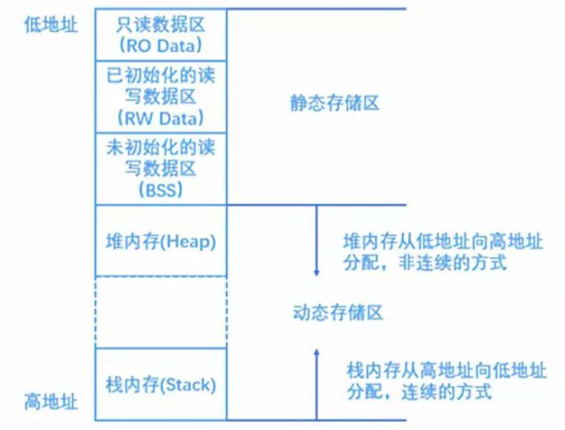
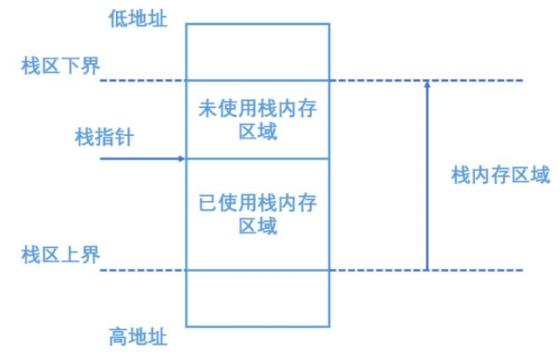
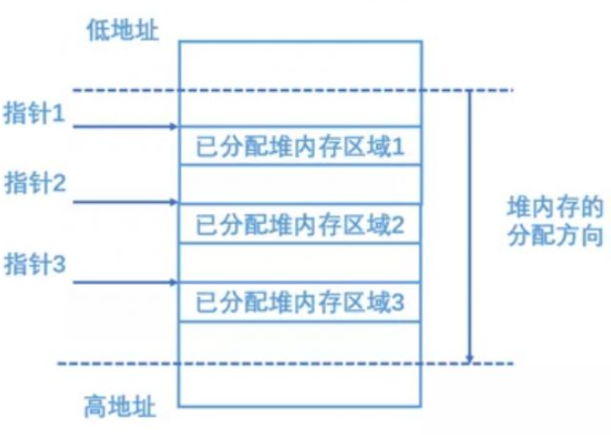

# C

[TOC]

## 说明

### 本文件的书写规范

- 函数书写规范：无论函数是否有参数，书写时均使用：`函数名()`表示，或者使用`xx函数`这种表述。例如：打印函数为`printf()`或者printf函数；主函数为`main()`，或者main函数

### 编译环境

学习C语言需要安装编辑、编译工具。一般使用**IDE**，指集成开发环境（*IDE*，Integrated Development Environment ）。是一个完整的软件，包括编辑器、编译器等，可以编写代码、编译、运行等。

- 编辑器：写代码的工具，仅仅是敲入代码。windows（记事本、notepad++、ultraedit等等）。Linux（nano，vi，gedit等等）
- 编译器：把代码翻译成程序，像GCC等，IDE中都有编译器

#### windows下

- dev-c++
- codeblocks
- Qt creator
- 等等

#### Linux下

- GCC（可以搭配多种编辑器，命令行编译、运行）
- Qt creator
- dev-c++

```note
注意：
1. 不同的环境可能产生不同的结果，但是不会太多。如果程序运行的结果和预期不一致，可以切换其他环境
2. 本教程使用的IDE主要是Dev-C++
```


## 基础部分

### 数据/变量的存储形式

程序中的数据或者变量存储在内存中，根据变量的类型，为这个变量分配相应大小的内存空间。例如：`int a = 10;`，在内存中找一个连续的4个字节的存储空间，把数据10储存进去，并且把这块空间起名叫做`a`（暂时这么理解），至于这个内存的地址是多少，是有一套分配方案的。

变量a占用的这块空间，就属于a了，不可以再分配给其他变量了，除非是a销毁了，释放了这块内存。


### 位运算


### typedef、 sizeof


### 优先级

#### *、()、[]（函数指针，指针函数，函数指针数组）

**指针函数**

*的优先级低于**（）** ，所以如下代码是一个指针函数，是函数，返回值是指针：

```c
int *funcp(int a,int b)
```

等同于：`int *(funcp)(int a,int b)`，返回值是`int *`，返回指针


**函数指针**

下面代码就不同了：

```c
int (*func)(int a,int b)
```

把`*func`强制括起来，这就不是函数，是指针了，指向了一个函数


**函数指针数组**

分析如下代码：`int (*pfun[2])(int x);`，`[]` 的优先级比 `*`的优先级高，所以pfun先与[2]结合，pfun是一个数组，包含2个元素。转换成类似 `int (*func)(int a,int b)` 的形式，是函数指针，指向函数。所以这个定义是，定义一个函数指针数组。是一个数组，数组元素是函数指针，每一个元素都可以指向一个函数


### 函数


#### 函数不可以返回栈中的指针

函数不可以返回栈中的指针，但是可以返回堆中的指针

**栈中**

```c
#include<stdio.h>

// 报错：函数返回了局部变量的地址
// [Warning] function returns address of local variable [-Wreturn-local-addr] 
char *pfunc()
{
	char p[] = "sdf"; // 指针p指向的地址是保存在栈中的
	return p;
}

int main()
{
	char *p = NULL;
	p = pfunc();

	printf("%s\n", p);
	return 0;	
}
```

这个例子会有警告，并且不会打印正确的内容。看下面的例子：

```c
#include<stdio.h>


char *pfunc()
{
	char *p = "sdf"; // 指针p指向的地址是保存在栈中的，但是Hello是字符串常量
	return p;
}

int main()
{
	char *p = NULL;
	p = pfunc();

	printf("%s\n", p);
	return 0;	
}
```

这个例子可以正确编译。把 `char p[] = "sdf";` 换成  `char *p = "sdf";`就没有问题了，因为这里的p虽然分配在栈上，但是此时的Hello是一个字符串常量，其存储在静态存储区。在调用GetStr函数结束时其也不会被销毁。

上面两个例子中，一个在栈中，一个在静态存储区：

- `char *p = "Hello";`：此处首先定义了一个指针变量p，编译器就会为指针变量开辟了栈空间。而此时并没有空间来存放Hello，所以Hello只能存储在静态区。
- `char p[] = "Hello";` ：此处首先定义一个数组p，因为未给出数组大小，所以此时数组大小未确定。然后把Hello保存在这个数组里，编译器就会为数组p开闭足够的栈空间来存储Hello。（具体的见**char *str与char str[]的区别**）


**堆中**

在函数内部使用malloc申请内存空间，把首地址赋值给一个指针，这个指针就是可以返回的。因为malloc申请的空间是在堆上，指针是在栈上的，但是指针指向的空间（指针中的内容）在堆中。

必须注意的是，使用malloc申请的空间必须手动free释放

```c
#include<stdio.h>
#include<stdlib.h>

// 报错：警告 

char *pfunc1()
{
	char *p = (char *)malloc(4); // 在堆中分配的，p指向的地址在堆中
	p[0] = 's'; 
	p[1] = 'd';
	p[2] = 'f';
	p[3] = 'g';

	return p;
}

int main()
{
	char *p = NULL;
	
	p = pfunc1();
	printf("%s\n", p);
	free(p);
	return 0;	
}
```


**函数返回栈中指针的方法**

- 把指针定义为全剧变量，因为全局变量存储在静态存储区，程序结束才会释放，但是这样会导致函数是不可重入的。

- 在GetStr函数中使用malloc申请动态内存，但使用完一定要记得使用free进行释放，否则会导致内存泄漏。

- 可以将变量p声明为static静态变量。但这也会导致函数是不可重入的:

  ```c
  char *pfunc()
  {
  	static char p[] = "sdf";
  	return p;
  }
  ```

  


### 指针


### 数组


### 复杂数据类型

#### 结构体

C结构体可以认为是一个数据包，或者是多个数据的集合，结构体中可以包含多种数据类型，但是不能有成员函数，不过可以使用函数指针实现“成员函数”的功能。


##### 结构体定义

关键字`struct`，模型如下：

```c
struct Animal
{
	各种数据类型
}; // 注意最后有个分号 ;
```


方法一：先定义结构体类型，再创建结构体变量

```c
#include<stdio.h>

// 定义结构体 
struct Animal
{
	int ia;
	char cb;
}; 

int main()
{
	struct Animal a;  // 创建结构体变量 

	return 0;
}
```


方法二：定义结构体时，直接创建结构体变量

```c
// 定义结构体 
struct Animal
{
	int ia;
	char cb;
}a, b;   // 定义构体时，就创建变量 

int main()
{
	a.ia = 10;
	printf("a.ia = %d\n", a.ia);	

	return 0;
}
```


方法三：定义结构体时，直接创建结构体变量，但是不设置结构体名

同方法二相比，方法三的缺点是，以后就不能在程序中创建这个结构体的变量了

```c
// 定义结构体，不设置名字 
struct
{
	int ia;
	char cb;
}a, b;   // 定义构体时，就创建变量 

int main()
{
	a.ia = 10;
	printf("a.ia = %d\n", a.ia);	

	return 0;
}
```


方法四：使用typedef给结构体起别名，以后就可以直接使用别名创建结构体变量，但是缺点是内容上不清晰，例如单独看到Animal，可能不知道是什么类型，而struct Animal ，一看就知道是结构体（linux内核源码中的说明），代码如下：

```c
#include<stdio.h>

// 使用typedef给结构体起别名 
typedef struct Animal 
{
	int ia;
	char cb;
}Animal;   // 定别名 

int main()
{
	struct Animal b;
	Animal a;
	
	return 0;
}
```


##### 结构体初始化

方法一：定义结构体变量时，多个元素一起赋值，代码如下：

```c
#include<stdio.h>

struct Animal 
{
	int ia;
	char cb;
};  

int main()
{
    // 定以时直接赋值
	struct Animal a = {1, 'q'}; 
	printf("%d, %c\n", a.ia, a.cb);
	
	return 0;
}
```


方法二：定义结构体变量时不赋值，然后单独赋值。修改某个成员时，直接修改即可

```c
#include<stdio.h>

struct Animal 
{
	int ia;
	char cb;
};  

int main()
{
	struct Animal a;
	a.ia = 1;
	a.cb = 'q';	 // 单独赋值
	
	printf("%d, %c\n", a.ia, a.cb);
	
	return 0;
}
```


方法三：使用指定初始化器（designated initializer），C99和C11中的特性

```c
#include<stdio.h>

struct Animal 
{
	int ia;
	char cb;
};  

int main()
{
    // 
	struct Animal a = {
		.ia = 1,   // 每个元素之间用逗号隔开， 
		.cb = 'q' // 最后一个后面没有逗号， 
	};

	printf("%d, %c\n", a.ia, a.cb);
	
	return 0;
}
```


##### 访问结构体变量

访问结构体变量的形式为`结构体变量名.成员`，使用的是点`.`


##### 结构体指针

当函数的参数是结构体时，使用结构体指针，如果传结构体，数据量大，传结构体指针只有4字节。结构体指针访问成员的形式为`结构体指针->成员`

```c
#include<stdio.h>

struct Animal 
{
	int ia;
	char cb;
};

void func(struct Animal *a)
{
	a->ia = 2;
	a->cb = 'w';	
}

int main()
{
	struct Animal a = {
		.ia = 1,
		.cb = 'q'
	};
	 
	struct Animal *b = &a;
	
	// 传递结构体指针 
	func(b);
	printf("%d, %c\n", a.ia, a.cb);
	
	return 0;
}
```


##### 结构体占用内存空间

C语言结构体所占内存大小，其实里面涉及到C语言内存对齐


##### 结构体“成员函数”

使用函数指针，代码如下：

```c
#include<stdio.h>

struct Animal 
{
	int (*pfunc)(int x, int y); // 函数指针
};  


int add(int a, int b)
{
	return a+b;	
}

int main()
{
	struct Animal a = {
		.pfunc = add   // 函数指针指向一个函数
	};

	int b = a.pfunc(1, 2); // 调用这个函数
	printf("%d\n", b);
	
	return 0;
}
```


##### 结构体位域操作

有些数据在存储时并不需要占用一个完整的字节，只需要占用一个或几个二进制位即可。例如开关只有通电和断电两种状态，用 0 和 1 表示足以，也就是用一个二进位。正是基于这种考虑，C语言又提供了一种叫做位域的数据结构，使用冒号`:`，`:`后面的数字用来限定成员变量占用的位数。`:`后面的数字限制，不能再根据数据类型计算长度，它们只占用bit

C语言标准还规定，只有有限的几种数据类型可以用于位域。在 ANSI C 中，这几种数据类型是 int、signed int 和 unsigned int（int 默认就是 signed int）。

```c
#include<stdio.h>

struct Animal 
{
	int a;
	unsigned b:2; // 取值范围有限，数据稍微大些就会发生溢出
	unsigned char c:4;
};  

int main()
{
	struct Animal a = {
		.a = 3,
		.b = 3,
		.c = 9
	};

	printf("%d\n", a.b);  // 3
	
	return 0;
}
```

C语言标准并没有规定位域的具体存储方式，不同的编译器有不同的实现，但它们都尽量压缩存储空间。位域的具体存储规则如下：

- 当相邻成员的类型相同时，如果它们的位宽之和小于类型的 sizeof 大小，那么后面的成员紧邻前一个成员存储，直到不能容纳为止；如果它们的位宽之和大于类型的 sizeof 大小，那么后面的成员将从新的存储单元开始，其偏移量为类型大小的整数倍。
-  当相邻成员的类型不同时，不同的编译器有不同的实现方案，GCC会压缩存储，而 VC/VS 不会。
- 如果成员之间穿插着非位域成员，那么不会进行压缩。


#### 联合体/共用体

一般的，每个变量都具有其独有的存储空间，使用`联合体`就可以在同一个内存空间中存储不同的数据类型。关键字是`union`。

**联合体定义**

定义形式如下：

```c
union 联合名
{
	成员表
};
```

成员表中含有若干成员，形式为：`类型说明符 成员名`。其占用的字节数与成员中最大数据类型占用的字节数。

定义方法一：先创建联合体类型，再定义联合体变量

```c
// 创建联合体模板union uName
union uName
{
    char cA;
    char cB;
};
// 使用该联合体模板创建两个变量a, b
union uName a,b;
```

然后就可以使用a,b这两个变量了


定义方法二：创建联合体结构类型时，直接创建变量

```c
union uName
{
    char cA;
    char cB;
}a, b;
```


方法三：省略联合体名

```c
union
{
    char cA;
    char cB;
}a, b;
```

省略联合体名的缺点是，后面不可以在使用这个联合体定义新的变量了


方法四：使用typedef

```c
typedef union uName
{
    char cA;
    char cB;
}union_uName;
union_uName a, b;
```

以后直接使用union_uName定义新的变量即可。这么做的的一个缺点是，如果名字起得不好，在后面就可能不知道a，b是什么类型了。参考linux内核源码的说明《[linux内核结构体的命名](https://www.kernel.org/doc/html/latest/translations/zh_CN/process/coding-style.html)》


**联合体初始化**

联合体的初始化与结构体不同，联合体只能存储一个值。联合体有三种初始化方法：

```c
union uName a;
a.Class = 10;
union uName b = a;		   /* 1、把一个联合初始化为另一个同类型的联合；*/
union uName c = {20};	   /* 2、初始化联合的第一个成员；*/
union uName d = {.cA = 30}; /* 3、根据C99标准，使用指定初始化器。*/
```


#### 枚举

一一列举的意思。有一些数据的取值有限的，可以把这些可能的结果列出来，并赋予新的名字，这样有助于提高代码的可读性。例如，一个星期有7天，完全可以一一列举出来。列举的时候可以使用宏定义也可以使用枚举类型`enum`。


枚举和宏定义对比：

- 枚举变量占用空间：和其中最大的变量空间一样
- 宏定义不占用空间，仅是字符串的替换


宏定义如下：

```c
#define MON  1
#define TUE  2
#define WED  3
#define THU  4
#define FRI  5
#define SAT  6
#define SUN  7
```


枚举如下：

```c
enum DAY
{
     MON=1, TUE, WED, THU, FRI, SAT, SUN
};
```

- enum是关键字，是必须的。
- DAY是枚举名，可有可无，这个名字是自己定义的
- 默认：后面是前一个+1，MON=1, TUE, WED, THU, FRI, SAT, SUN是枚举成员。
- 若上述定义中第一个成员MON不赋值的话，那么其默认为0。
- 若其他成员赋了初值，也是遵循“枚举成员的值是根据前一个成员的值递增1”这一规则

测试代码如下：

```c
#include<stdio.h>


enum T
{
	a,     // 0
	b = 3, // 3
	c,     // 4
	d = 6  // 6
};


int main()
{

	enum T e;
	
	e = a;
	printf("e = %d\n", e);
	
	e = b;
	printf("e = %d\n", e);
	
	e = c;
	printf("e = %d\n", e);
	
	e = d;
	printf("e = %d\n", e);

	return 0;
}
```

结果如下：

> e = 0
> e = 3
> e = 4
> e = 6


**枚举定义**

- 方法一：先定义类型，在定义变量。DAY是枚举名，相当于一个模板，可以使用这个模板去定义变量good_day，bad_day，定义的时候不要忘了enum。

  ```c
  enum DAY
  {
      MON=1, TUE, WED, THU, FRI, SAT, SUN
  };
  
  enum DAY good_day, bad_day;
  ```

- 方法二：定义类型时，直接定义变量。还可以继续定义变量

  ```c
  enum DAY
  {
     MON=1, TUE, WED, THU, FRI, SAT, SUN
  }good_day, bad_day;
  ```

- 方法三：省略枚举名字，缺点是不能再定义其他枚举变量了

  ```c
  enum
  {
     MON=1, TUE, WED, THU, FRI, SAT, SUN
  }good_day, bad_day;
  ```

- 方法四：使用typedef

  ```c
  typedef enum DAY
  {
     MON=1, TUE, WED, THU, FRI, SAT, SUN
  }DAY;
  
  DAY good_day, bad_day;
  ```

  


## 提高部分

### 大端模式和小端模式

- 大端模式（Big-Endian）：是指数据的高字节保存在内存的低地址中，而数据的低字节保存在内存的高地址中。 数据高在内存低

- 小端模式（Little-Endian）：是指数据的高字节保存在内存的高地址中，而数据的低字节保存在内存的低地址中。数据高在内存高


**区分大小端**

- 如果是PC机这样能够写程序、打印信息的设备可以直接写程序、打印测试。
- 如果是像单片机、ARM开发板，并且能够通过串口像PC机打印信息的，或者有板载LED指示灯的可以通过程序测试，并且打印信息
- 如果单片机、ARM开发板，没有串口、LED，可以通过软件仿真查看变量的地址。


在不知道机器是向下增长还是向上增长时，要先检测增长方向。测试程序如下：

```c
#include<stdio.h>

int main()
{
	int a = 0x12345678;
	
	char *cp = (char *)&a;
	
	printf("cp = %d,*cp = %0x\n", cp, *cp);
	cp++;
	printf("cp = %d,*cp+1 = %0x\n", cp, *cp);
	cp++;
	printf("cp = %d,*cp+2 = %0x\n", cp, *cp);
	cp++;
	printf("cp = %d,*cp+3 = %0x\n", cp, *cp);
	
	return 0;
}
```

> cp = 2293316, *cp = 78
>
> cp = 2293317, *cp +1 = 56
>
> cp = 2293318, *cp +2 = 34
>
> cp = 2293319,*cp +3 = 12

高字节0x12存储在高地址，本机为小端模式。


### 常用宏定义

宏定义#define，其一般形式为：`#define 宏名 字符串`，编译的过程中，宏名全部替换为字符串。例如：

```c
#define PI 3.14

int main()
{
	int a = 1;
	a = a +PI; // 替换为：a = a + 3.14
    
    return 0;
}

```


**防止一个头文件被重复包含**

头文件名字，`mymath.h`

```c
#ifndef MYMATH_H      
#define MYMATH_H
//**头文件内容*
#endif
```

 如果没有定义宏MYMATH_H，那么就定义它，并且做一些工作。如果定义了，就直接跳出。


**重新定义一些类型，防止由于各种平台和编译器的不同，而产生的类型字节数差异，方便移植。**

```c
typedef A B  定义B表示A类型

typedef unsigned char boolean; // Boolean value type. 
typedef unsigned long int uint32; // Unsigned 32 bit value 
typedef unsigned short uint16; // Unsigned 16 bit value
typedef unsigned char uint8; // Unsigned 8 bit value 
typedef signed long int int32; // Signed 32 bit value 
typedef signed short int16; // Signed 16 bit value 
typedef signed char int8; // Signed 8 bit value 
```

下面的不建议使用:

```c
typedef unsigned char byte; // Unsigned 8 bit value type.
typedef unsigned short word; // Unsinged 16 bit value type. 
typedef unsigned long dword; // Unsigned 32 bit value type. 
typedef unsigned char uint1;// Unsigned 8 bit value type. 
typedef unsigned short uint2; // Unsigned 16 bit value type. 
typedef unsigned long uint4; // Unsigned 32 bit value type.
typedef signed char int1; //Signed 8 bit value type. 
typedef signed short int2; // Signed 16 bit value type. 
typedef long int int4; // Signed 32 bit value type. 
typedef signed long sint31; // Signed 32 bit value 
typedef signed short sint15; // Signed 16 bit value 
typedef signed char sint7; // Signed 8 bit value 
```


**得到指定地址上的一个字节或字**

```c
#define MEM_B(x) ( *( (byte *) (x) ) )
#define MEM_W(x) ( *( (word *) (x) ) )
```

读取一个地址的数据，一个字节：`char a = MEM_B( x )`  。注意，这个x在代码中只是一个数字。我们理解为地址。

在程序中，我们使用把一个数字例如0x1234，认为是地址，但是计算机仅把它当作是一个数字，所以要把这个数字转换成地址，就是某个类型的指针。(byte *) (0x1234)，1234就是有个地址，再\*这个地址，就是取这个地址的值。


**求两个数最大值和最小值**

```c
define MAX( x, y ) ( ((x) > (y)) ? (x) : (y) )
define MIN( x, y ) ( ((x) < (y)) ? (x) : (y) )
```


### 函数指针、指针函数、函数指针数组

具体分析参考[优先级—*、()、[]（函数指针，指针函数，函数指针数组）]分


本节内容包括：

- 函数指针和指针函数的简单应用
- 函数指针实现“结构体函数”功能
- 更加方便的使用函数指针**typedef**
- 函数指针数组


**函数指针和指针函数的简单应用**

- 函数指针：本质是一个指针，指向的是一个函数，例如：`int (*pfun)(int x,int y);` 
- 指针函数：本质是一个函数，返回的是一个指针，例如：`int *funp(int x, int y){...}`

**简单应用**

代码如下：

```c
#include <stdio.h>

// 命名：第一个字母是返回类型
// 函数指针：funp 
// 指针函数：pfun 
// 这是函数
int fun(int x, int y)
{
    return x+y;
}

// 指针函数，是一个函数，返回一个指针，
int *funp(int x)
{
    // 在堆上申请一块内存，只能手动释放
    int *p = malloc(x*4); 
    printf("%d\n", p);
    return p; // 不要这么写...不要返回函数中创建的东西（在栈中，参考其他内容）
}

// 函数指针，是一个指针，指向函数，此时未指向一个具体的函数
int (*pfun)(int x,int y); 

int main()
{
    pfun = fun;  // 函数指针指向一个函数
    pfun(2,4);    // 调用这个函数，这个指针可以当作函数使用

    int *p = funp(1); // 指针函数，返回一个指针（地址）

    printf("%d\n", p);
    *p = 2;
    printf("%d\n", *p);

    return 0;
}

```


**C的“结构体函数”**

C的结构体struct不支持函数（C++类可以），但是可以使用函数指针在struct中实现“结构体函数”，让函数指针成员，指向某个函数即可。linux系统的驱动程序中的file_operation结构体如下：

```c
#include <stdio.h>

// 定义一个结构体
typedef struct A{

    int (*fun)(int x, int y); // 这是函数指针，指向一个函数
}A;

// 这是一个函数
int fun1(int x, int y)
{
    printf("%d,%d\n", x, y);
    return (x+y);
}

int main()
{
    A a = {
        .fun = fun1,  // 结构体中的函数指针赋值
    };

    int ret = a.fun(1,2); // 结构体中的函数指针调用指向的函数
    printf("%d\n", ret);

    return 0;
}
```


**使用typedef给函数指针加个名字**

如上，我们声明一个函数指针，正常方法是：`int (*pfun)(int a,int b)`，当我们命名很多个函数指针的时候，用上面的方法显得非常不方便，所以我们可以这样做：

```c
typedef int (*PF) (int a,int b);  // 把这个函数指针加个名字
...
PF pfun;                          // 定义一个函数指针
```

例如：

```c
#include<stdio.h>

// 函数指针，指向函数 
typedef int (*PF) (int a,int b);

int add(int a, int b)
{
	return a+b;
}

int main()
{
	PF pfun; // 定义一个函数指针
	pfun =  add; // 指向一个函数
	
	int sum = pfun(1,2);
	
	printf("sum = %d\n", sum); // 3
} 
```


**函数指针数组**

定义如：`int (*pfun[2])(int x);`表示这是一个函数指针数组，是一个数组，元素是函数指针，即每一个元素都是一个指针可以指向一个函数（类型要相同）。例子如下：

```c
#include<stdio.h>


int fun1(int x)
{
	printf("fun1\n");
	
	return x+1;
}
int fun2(int x)
{
	printf("fun2\n");
	return x+1;	
}

int main()
{
    // 定义函数指针数组方式一：先定义后赋值
	int (*pfun[2])(int x); // 先定义一个函数指针数组
	pfun[0] = fun1;  // 对函数指针数组赋值，指向函数
	pfun[1] = fun2;
    
	// 定义函数指针数组方式二：定义时，直接赋值
	//int (*pfun[2])(int x) = { fun1, fun2 }; 
  
    
	int a = pfun[0](1); // 通过函数指针数组调用函数
	int b = pfun[1](2);
	
	printf("a = %d, b = %d\n", a, b);
} 
```


**其他分析**

我们有时候看别人的代码时候，经常是一面懵逼，比如下面这个`void (*p)();`、`(*(void(*) ())0)();`

我记得我在以前的文章里面有谈到一个**右左原则**，从p开始看，往右走直到遇到）再往左走遇到(,(*p)我们就可以看出p是一个指针，继续分析往右走，遇到（）,说明p指向一个（void）的函数，往左走，知道p指向的函数返回值是void。

代码如下：

```c
#include<stdio.h>


void func()
{
	printf("void func()");
}


int main()
{
	void(*p)(); // 函数指针，参数void，返回值void 
	
	// &p：p是函数指针， &p 是这个指针的地址
	// (int *)&p：把这个地址转成指向int类型
	// *(int *)&p：向这个指针中写入数据 func的地址 
	*(int *)&p = (int)func; //  void func()转成 int func()
	
	// 或者*p();  
	(*p)(); // 调用p指向的函数 
	
	return 0;	
}
```


然后继续分析`(*(void(*) ())0)();`，如下：

- void (*)()  我们上面分析了这个是一个函数指针，只是把p去掉了而已。
- 把上面的`void (*)()`用PN代替，上面的表达式变成`(*(PN)0)();`PN后面有一个0，这个是让我们咋舌的地方，然后我们想一下`(char)a;`这样的表达式，所以`(PN)0`就是把0当成一个地址，强制转换为PN类型，用*这个钥匙取出这个地址区域的值。
- 把(*(PN)0)()替换成PM，原来的表达式变成PM()，这样大家看起来比较容易了吧，就是正常的函数调用。


### char *str与char str[]的区别

C语言中没有特定的字符串类型，常用以下两种方式定义字符串：

- 字符数组：`char str[] = "happy";` 字符串其字符是可以修改的。字符串保存在**全局数据区或栈区**，是可修改的
- 指向字符串的指针：`char *str = "happy";` 字符串其字符是不可以修改的。字符串保存在**常量区**，不可修改

示例代码如下：

```c
#include <stdio.h>

int main(void)
{
	char str1[20] = "hello";
	char *str2 = "hello";
	
	str1[0] = 'H';
	str2[0] = 'H';  // 编译会通过，运行会报错，不同平台错误可能不同
	
	printf("%s\n",str1);
	printf("%s\n",str2);
	
	return 0;
}
```


### 内存的分配方式

#### 栈

C语言程序需要载入内存才可以运行，其不同的数据保存在不同的区域。所使用的内存可以分成两类：

- 静态存储区
- 动态存储区：又分为栈区、堆区



各个区介绍：

- 静态存储区：包括只读数据区（RO Data）、已初始化读写数据区（RW Data）、未初始化读写读写数据区（BSS），这三类存储区都是在程序的编译-连接阶段确定的，且运行过程中是不会变化的，只有当程序退出的时候，静态存储区的内存才会被系统回收。它主要存放静态数据、全局数据和常量。
- 动态存储区：
  - 栈（Stack）内存区域，栈内存是由编译器管理的，它的用途是完成函数的调用。在执行函数时，函数内局部变量及函数参数的存储单元在栈上创建，函数调用结束时这些存储单元自动被释放。
  - 堆区：程序在运行时使用库函数为变量申请内存，在变量使用结束后再调用库函数释放内存。动态内存的生存期是由我们决定的，如果我们不释放内存，就会导致内存泄漏。


**栈的相关概念**

栈（Stack）可以存放函数参数、局部变量、局部数组等作用范围在函数内部的数据，它的用途就是完成函数的调用。

栈内存的使用很大的程度上依赖于处理器的硬件机制。在处理器中，有一个寄存器来表示当前栈指针的位置。通常在内存中分配一块区域，这块区域的上界（高内存地址）和下界（低内存地址）之间是可用的栈内存区域。栈内存如下图所示：



目前常见的体系结构和编译系统中，栈大多都是向下增长的（高地址往低地址）。在初始阶段，栈指针是指向栈区间的上界，随着栈使用量的增加，栈指针的值向低地址移动，即栈指针的值将变小。示例代码如下：

```c
#include<stdio.h>

int main()
{
	int a = 1;
	int b = 1;
	int c = 1;
	int d = 1;

	printf("addr of a = %d\n", &a);
	printf("addr of b = %d\n", &b);
	printf("addr of c = %d\n", &c);
	printf("addr of d = %d\n", &d);

	return 0;
}
```

执行结果如下：

> addr of a = 2293324
>
> addr of b = 2293320
>
> addr of c = 2293316
>
> addr of d = 2293312

变量的存储是从高地址往低地址的方向存储。


**其他**

- 函数在调用完成之后，栈指针将回到函数进入之前的位置。
- 在函数调用的过程中，每增加一个层次，栈空间就会被压入更多的内容
- 函数调用结束后，函数栈上的内容不能被其他函数使用（栈中的内容不能当作函数返回值）


**栈的先入后出**

栈有一个重要的特性：先放入的数据最后才能取出，后放入的数据优先能取出，即`先进后出（First In Last Out）原则`。放入数据常被称为`入栈或压栈（Push）`，取出数据被称为`出栈或弹出（Pop）`。在运用过程中，栈内存可能出现满栈和空栈两种情况，这是由处理器的体系结构决定的。就像一个有底的水桶，先放的放底下，后放的放上边，取的时候，先取上边的，后取下边的。


#### 堆

在一般的编译系统中，堆内存的分配方向和栈内存是相反的，即堆是向上生长的。栈内存利用的是处理器的硬件机制，而堆内存的处理使用的是库函数。堆内存的分配形式如下图：



可见，堆内存与栈内存的区别：栈内存只有一个入口点，就是栈指针，栈内存压栈和出栈都只能通过栈指针及其偏移量；而堆内存有多个入口点，每次分配得到的指针就是访问内存的入口，每个分配内存区域都可以被单独释放。

当频繁的分配和释放内存的过程中，将会出现如下情况：在两块已经分配的内存之间可能出现较小的未分配的内存区域，这些内存理论上可以被使用。但是由于它们的空间较小，不够连续内存的分配，因此当分配内存的时候，它们经常不能被使用。这种较小的内存就是**内存碎片**。


**内存的分配和释放**

库文件：stdlib.h，实现堆内存分配和释放：

```c
/* 分配内存空间 */
void *malloc(size_t size);
/* 释放内存空间 */
void free(void *ptr);
/* 分配内存空间 */
void *calloc(size_t num, size_t size);
/* 重新分配内存空间 */
void *realloc(void *ptr, size_t size);
```

- malloc函数：在malloc分配完内存之后，可以用得到的指针值是否为NULL来判断内存是否分配成功。按照C语言内存分配规则，如果内存分配成功，返回的是内存的地址；如果内存分配不成功，将返回NULL（0x0），表示一个无效的地址。malloc在分配内存的时候，是从低地址至高地址方向。但是，先分配的内存地址不一定比后分配的内存地址小。malloc 不会设置内存为零。

  ```c
  int main()
  {
  	int *p = NULL;
  	
      // 参数：内存块的大小，以字节为单位
      // 返回值：返回一个指针 ，指向已分配大小的内存。如果请求失败，则返回 NULL。
      
  	p = (int*)malloc(sizeof(int));
  	if ( NULL != p )
  	{
  		*p = 0x1234;
  		printf("p = %#x, *p = %x\n", (unsigned int)p, *p);
  		free(p);
  	}	
  
  	return 0;
  }
  ```

- calloc()：和malloc()很类似，主要区别是calloc()可以将分配好的内存区域的初始值全部设置为0，除此之外，calloc()和malloc()另外一个不同之处在于参数的个数，malloc只有一个参数，即要分配的内存字节数；calloc有两个参数，第一个是分配单元的大小，第二个是要分配的数目。从本质上，calloc使用两个参数和malloc使用一个并没有区别。 

  ```c
  int main()
  {
  	unsigned int *pa;
  	int i;
  	
  	// 参数： 要被分配的元素个数， 元素的大小
  	// 返回值：返回一个指针，指向已分配的内存。如果请求失败，则返回 NULL。 
  	pa = (unsigned int*)calloc(sizeof(unsigned int), 5);
  	if ( NULL != pa )
  	{
  		printf("<< colloc pa = %#x >>\n", (unsigned int)pa);
  		for ( i = 0; i < 5; i++ )
  		{
  			printf("pa[%d] = %d \n", i, pa[i]);
  		}
  			free(pa);
  	}
  
  	return 0;
  }
  ```

- realloc：realloc函数具有两个参数，一个是指向内存的地址指针，另一个是重新分配内存的大小，而返回值是指向所分配内存的指针。除此之外，realloc还具有两种功能：一是当指针为NULL的时候，作为malloc使用，分配内存；二是当重新分配内存大小为0的时候，作为free使用，释放内存。

  ```c
  int main()
  {
  
  	int *p;
  	int i;
  	
  	// 使用malloc获取一块内存6个int，检查是否申请成功
  	// 如果成功，一次赋值012345 
  	p = (int*)malloc(sizeof(int)*6);
  	if ( NULL != p )
  	{
  		for ( i = 0; i < 6; i++ )
  		{			
  			*(p + i) = i;
  		}
  	}
  	for ( i = 0; i < 6; i++ )
  	{
  		printf("p[%d] = %d \n", i, p[i]);
  	}
  	// 使用realloc重新分配内存大小 
  	// 参数：指针，大小
  	// 返回值是指向所分配内存的指针 
  	p = (int*)realloc(p, sizeof(int)*10);
  	if( NULL != p )
  	{
  		for ( i = 0; i < 10; i++ )
  		{
  			printf("p[%d] = %d\n", i, p[i]);
  		}
  		free(p);
  	}	
  
  	return 0;
  }
  ```


#### 内存对齐

内存对齐：编译器会对不足4字节的变量空间自动补齐为4个字节，以提高CPU的寻址效率（32位CPU以4个字节步长寻址的）

内存对齐是编译器的“管辖范围”。编译器为程序中的每个”数据单元“安排在适当的位置上，以便于能快速的找到每个“数据单元”。对于32bit的CPU，其寻址的步长为4个字节（即unsigned int 字节长度），这就是常说的“4字节对齐”。同理，对于64bit的CPU，就有“8字节对齐”。


**其他**

- 堆上开辟的内存没有释放，造成内存泄漏
- 野指针被使用或者释放：野指针是一个已经被释放的内存指针，它指向的位置已经被free或者realloc释放了，此时再使用该指针，就会导致程序的错误。
- 非法释放指针：
  - 非法释放静态存储区的内存
  - 非法释放栈上的内存
  - 非法释放堆上内存（重复释放）


### 可重入函数

主要用于 `多任务`环境中，一个 `可重入的函数`简单来说就是 `可以被中断的函数`，也就是说，可以在这个函数执行的任何时刻中断它，转入OS调度下去执行另外一段代码，而返回控制时不会出现什么错误；而不可重入的函数由于使用了一些系统资源，比如全局变量区，中断向量表等，所以它如果被中断的话，可能会出现问题，这 类函数是不能运行在多任务环境下的。

也可以这样理解，重入即表示重复进入，首先它意味着这个函数可以被中断，其次意味着它除了使用自己栈上的变量以外不依赖于任何环境（包括static），这样的函数就是purecode（纯代码）可重入，可以允许有该函数的多个副本在运行，由于它们使用的是分离的栈，所以不会互相干扰。如果确实需要访问全局变量（包括static），一定要注意实施互斥手段。可重入函数在并行运行环境中非常重要，但是一般要为访问全局变量付出一些性能代价。


**不可重入函数的缺点**

编写可重入函数时，若使用全局变量，则应通过关中断、信号量（即P、V操作）等手段对其加以保护。

说明：若对所使用的全局变量不加以保护，则此函数就不具有可重入性，即当多个进程调用此函数时，很有可能使有关全局变量变为不可知状态。


**保证函数的可重入性的方法**

在写函数时候尽量使用局部变量（例如寄存器、堆栈中的变量），对于要使用的全局变量要加以保护（如采取关中断、信号量等方法），这样构成的函数就一定是一个可重入的函数。

在实时系统的设计中，经常会出现多个任务调用同一个函数的情况。如果这个函数不幸被设计成为不可重入的函数的话，那么不同任务调用这个函数时可能修改其他 任务调用这个函数的数据，从而导致不可预料的后果。不可重入函数在实时系统设计中被视为不安全函数。

满足下列条件的函数多数是不可重入的：

- 函数体内使用了静态的数据结构；
- 函数体内调用了malloc()或者free()函数；
- 函数体内调用了标准I/O函数。标准io库很多实现都以不可重入的方式使用全局数据结构。
- 进行了浮点运算.许多的处理器/编译器中，浮点一般都是不可重入的 (浮点运算大多使用协处理器或者软件模拟来实现）。


**可重入函数与不可重入示例**

可重入函数如下：

```c
void strcpy(char *lpszDest, char *lpszSrc)
{    
    while(*lpszDest++=*lpszSrc++);    
    *dest=0;
}
```

不可重入函数1：

```c
char cTemp;//全局变量
void SwapChar1(char *lpcX, char *lpcY)
{   
    cTemp=*lpcX;   
    *lpcX=*lpcY;   
    lpcY=cTemp;   //访问了全局变量
}
```

不可重入函数2

```c
void SwapChar2(char *lpcX, char *lpcY)
{
    static char cTemp;  // 静态局部变量
    cTemp = *lpcX;
    *lpcX = *lpcY;
    lpcY = cTemp;     // 使用了静态局部变量
}
```


**如何编写可重入的函数**

在函数体内不访问那些全局变量，不使用静态局部变量，坚持只使用局部变量，写出的函数就将是可重入的。如果必须访问全局变量，记住利用互斥信号量来保护全局变量。


**如何将一个不可重入的函数改写成可重入的函数**

把一个不可重入函数变成可重入的唯一方法是用可重入规则来重写它。其实很简单，只要遵守了几条很容易理解的规则，那么写出来的函数就是可重入的：

- 不要使用全局变量。因为别的代码很可能覆盖这些变量值。
- 在和硬件发生交互的时候，切记执行类似disinterrupt()之类的操作，就是关闭硬件中断。完成交互记得打开中断，在有些系列上，这叫做“进入/退出核心”。
- 不能调用其它任何不可重入的函数。
- 谨慎使用堆栈。最好先在使用前先OSENTERKERNAL。


**一个不可重入的示例**

```c
unsigned int sum_int( unsigned int base )
{
    unsigned int index;
    static unsigned int sum = 0; // 注意，是static类型
    for (index = 1; index <= base; index++)
    	sum += index;
    return sum;
}
```

分析：所谓的函数是可重入的（也可以说是可预测的），即只要输入数据相同就应产生相同的输出。这个函数之所以是不可预测的，就是因为函数中使用了 static 变量，因为 static 变量的特征，这样的函数被称为：带“内部存储器”功能的的函数。因此如果需要一个可重入的函数，一定要避免函数中使用 static变量，这种函数中的static变量，使用原则是，能不用尽量不用。


### static用法

**定义局部函数**

局部函数，只能在函数所处的.c文件中调用，其他文件不可以调用这个函数。不需要在.h文件中声明。

`fun.h`文件：

```c
// fun.h
#ifndef FUN_H
#define FUN_H

int add(int x, int y);

#endif // FUN_H
```

`fun.c`文件：

```c
// fun.c

#include "fun.h"
#include <stdio.h>

static void printInfo(void);

int add(int x, int y)
{
   printInfo();
   return (x + y);
}

// 这个函数只会被fun.c中其他函数调用，不可被其他文件中的函数调用
static void printInfo(void)
{
    printf("you add a and b...\n");
}
```

这里要注意的是，如果`static`函数在调用他的函数上面，就可以直接实现函数；如果在调用他的函数下面，就要先在上面声明有这个函数，才可以。

`main.c`

```c
#include <stdio.h>
#include <stdlib.h>
#include "fun.h"

int main()
{
    int a = add(1, 2);
    printf("a = %d\n", a);

    return 0;
}
```

结果如下：

```
you add a and b...
a = 3
```

**定义函数中的静态变量**

函数中使用static定义的变量，不管函数被调用了几次，他只会初始化一次，在第n次调用这个函数时，这个变量的初值是第n-1次执行结束后的值，示例如下：

```c
#include <stdio.h>
#include <stdlib.h>

void fun()
{
    static int a = 1;
    printf("这个函数调用了 %d 次\n", a);

    a++;
}

int main()
{
    fun();
    fun();
    fun();
    fun();
    return 0;
}
```

执行结果如下：

```
这个函数调用了 1 次
这个函数调用了 2 次
这个函数调用了 3 次
这个函数调用了 4 次
```


## 待整理

### 指针

指针变量也是可以进行运算的，如指针变量对其自身加上某个整数或减去某个整数，这在内存上体现为：相对这个指针向后偏移多少个单位或向前偏移了多少个单位，这里的单位与指针变量的类型有关。在32bit环境下，int类型占4个字节，float占4字节，double类型占8字节，char占1字节。

以上就是关于C语言指针变量运算的一些总结：指针变量与整数相加相减是相对该指针指向的地址向后向前偏移多少个单位。**这里的单位不能认为总是1。**在32bit环境下，char类型指针的偏移单位才是1字节，int类型指针偏移单位是4字节，float类型指针偏移单位是4字节，double类型指针偏移单位是8字节。


### extern用法


