# 单片机系统设计

[TOC]

## 主要内容

单片机系统入门，了解单片机的常用的外设原理、使用，以及各种常用的电路、模块。

## IO口输入输出

### IO输出-点亮LED指示灯

IO输出高低电平，来控制LED的亮灭。

#### 硬件设计

LED指示灯原理图如下：

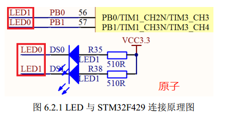

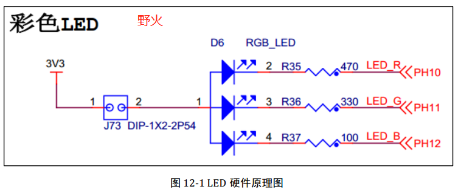

原子和野火开发板接线一样：MCU的IO口接LED负极，LED正极接VCC，同时要串接电阻，用来限流，防止电流过大烧坏LED。

- IO口低电平点亮LED
- IO口高电平熄灭LED

以后设计的时候仿照这个电路即可。

#### 软件设计

配置IO口为输出模式，输出高低电平即可

### IO输入-按键控制LED

IO设置为输入模式，检测按键是否按下

#### 硬件设计

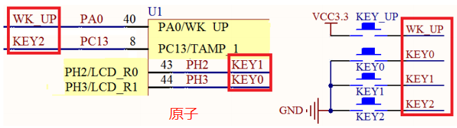

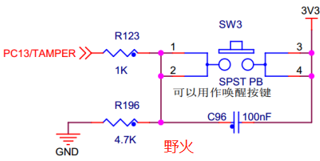

原子的设计：

- IO口接按键，按键接GND。检测到低电平，表示按键按下。IO要内部上拉。
- IO口接按键，按键接VCC。检测到高电平，表示按键按下。IO要内部下拉

野火的设计：IO接电阻，再接按键，再接VCC，同时IO有外部下拉电阻。IO检测到高电平，表示按键按下。（可以通过分析点2电压）电阻为了限流。

{:.bg-yellow-dark.text-white.p-2.box-shadow-large}

总结

野火的可能会更好一点，有个限流电阻。

#### 软件设计

配置IO口为输入模式，加上内部上下拉，检测按键按下的相应的电平，检测到的话代表按键按下了。这种属于一段时间内死循环检测，检测代码占据了CPU，除非有中断，否则不能干别的事，效率太低。

## 串口通信

单片机的串口功能比较多，像单线半双工，全双工、DMA等等。一般两个芯片之间的通信是全双工的，双方可以收也可以发。之前用过的AX12A数字舵机是单线半双工，但是我再STM32上没有实现，没有配置成功，最后找了一个转换电路实现了。

### 关于TTL电平

单片机的串口，一般都是TTL电平。串口信号可以和USB信号互转。

### 接线

两个芯片/模块之间的接线大致如下：

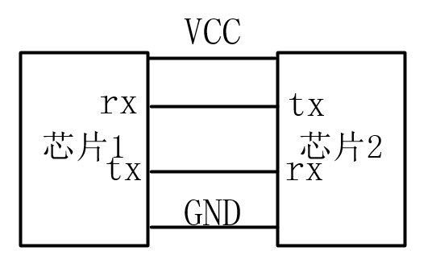

芯片/模块的电源要单独供电（有时候可能电不够），要共地，保证信号的标准。两颗芯片的收和发要接对

### 通信原理

串口通信原理是一次发送一个字节，一个字节有8bit，逐位发送。比如发送一个字符型数据20，转成二进制就是10100，不足8位的前边补0，即0001 0100，这8bit，按照从高位到地位（或者从地位到高位，具体的看数据手册），逐位发送，0就是低电平，1就是高电平。

整个发送流程是：数据线被拉低（或者拉高，表示起始位，有数据要开始传输了，具体的高和低那个是起始，记不清了），开始发送数据，8it发送完（如果设置了数据位是8bit），在发送停止位（也是一个高或者低电平的信号），即可。

数据的发送速度用波特率表示bps，每秒传输多少bit，常用的有115200等，表示115200bit/s，如果数据格式是8N1，即每次传输要传输10bit，1bit起始位、8bit数据位、0校验位、1停止位。所以每秒传输11520Byte（字节），即11.52K/s

### 软件设计

在软件中配置IO口为串口功能（复用）、在配置波特率等。

通信双方要保证通信格式相同，起始位是几位、数据位是几位、停止位是几位，这样才能保证不出错。一般可以设置成8N1，即：8位数据位、没有校验位、1个停止位。

## 外部中断

在IO口输入输出中，按键的检测是不断的检测按键是否按下。这样做的缺点是，占用资源，不能干别的事。本节使用外部中断，实现按键检测的功能，有按键按下，触发中断，执行按键任务

**中断**：CPU在执行A任务，此时因某些因素（按键、定时器等等）触发中断，执行中断任务（假设是B任务），此时A任务暂停，跳转执行B，等B执行完后，调回来继续执行A任务。串口接收数据，也是中断。中断是可以嵌套的，高优先级的中断可以打断低优先级的，高优先级的任务执行完后，再继续执行低优先级的任务。

**中断服务函数**：中断触发后，执行的函数。中断没到，就继续做原来是的事，中断到了，就停下原来的，执行中断任务，做完了就回去继续做原来的事。

### 软件设计

配置IO口为外部中断模式，高、低电平触发，或上升沿、下降沿触发，设置中断优先级，编写中断服务函数。

## 看门狗

看门狗启动后，相应的计时器就会倒数计时，然后触发中断，程序复位。看门狗启动后，要一定时间内往这个计数器中写入数值，防止重启（喂狗）

看门狗的时钟源是芯片内部的低速始终，即使外部时钟源发生了问题，也不影响使用。

## 定时器中断

单片机中都有定时器，以STM32为例，有高级定时器、通用定时器、系统定时器等等。一般使用通用定时器即可（之前用高级定时器TIM1，发PWM有点问题，好长时间才解决）。

- 系统定时器：没有IO，是芯片内部的，一般用做RTOS的时间基石、心跳等等。
- 高级、通用定时器：有外设IO，可以实现各种功能

定时器的基本功能：

- 输入捕获：比如检测接受到的PWM的高电平时间，之前做过飞控检测遥控器的信号
- 输出比较
- PWM生成：比较简单，配置好就行了
- 等等

### 定时器工作原理

定时器就是计数器，可以倒数、正数计数，根据设置的频率可以快可慢。时间到了就多相应的是事。

定时器还可以只用来定时，这时候IO，就用不到了。时间到了就出发中断，此时也要有中断服务函数。

### PWM原理

为计数器设置频率、设置计数量，再设置一个基数，计的数超过了这个基数就发出高电平，低于这个基数就低电平，如下图。

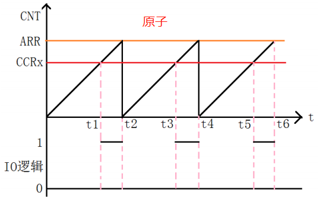

使用定时器生成PWM还是比较简单的，程序中配置好以后，只需要再写入基数就可以了，自动生成PWM波。

### 软件设计

开启定时器时钟、配置IO复用为TIM模式、初始化定时器参数（频率、计数等等），设置定时器的通道（某个IO）为PWM模式、是能IO、最后在程序中修改占空比。

## RTC实时时钟

RTC模块和时钟配置是在后备区域，即在系统复位或从待机模式唤醒后RTC的设置和时间维持不变，只要后备区域供电正常，那么RTC将可以一直运行。

## IIC通信

IIC通信只需要两根线：数据线SDA、时钟线SCL。芯片一般都会接GND，所以可以不用再做共地了。IIC是一主多从结构，一个主机上可以挂接很多个IIC设备，每个IIC设备的地址都不同

高速IIC总线一般可达400kbps。可以写成I2C

### 通信原理

I2C总线在传送数据过程中共有三种类型信号， 它们分别是：开始信号、结束信号和应答
信号。开始信号必须有，结束信号和应答信号可以没有。

- 开始信号：SCL为高电平时，SDA由高电平向低电平跳变，开始传送数据。
- 结束信号：SCL为高电平时，SDA由低电平向高电平跳变，结束传送数据。
- 应答信号：接收数据的IC在接收到8bit数据后，向发送数据的IC发出特定的低电平脉冲，表示已收到数据。CPU向受控单元发出一个信号后，等待受控单元发出一个应答信号，CPU接收到应答信号后，根据实际情况作出是否继续传递信号的判断。若未收到应答信号，由判断为受控单元出现故障。

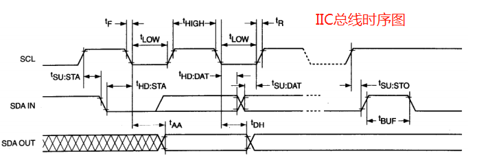

从这个时序图中可以看出具体的时序。没有数据传输时，SCL是保持低电平的，当SCL拉高后，才能决定是开始还是结束等。

以一个具体的例子来描述IIC通信的过程：在打球时，你想把球传给张三

1. 你：张三你在不在
2. 张三：我再（应答）
3. 你：我传给你，你接住
4. 张三：我接到了
5. 结束

在传输数据的具体过程中，也是像串口一样一位一位地传输

### 接线

不同的IIC设备的接线可能略有差别，下面这个是姿态检测模块JY901和单片机的IIC通信接线，数据线和时钟线都有上拉

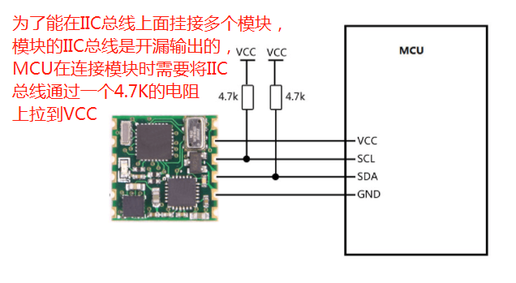

下面这个是原子开发板的接线

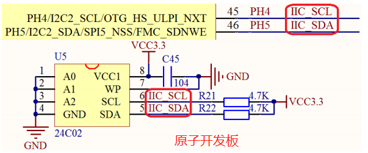

能看出来，接线都是在数据线和时钟线上拉了一个电阻，都接到了GND，算是共地了。

### OLED模块

OLED支持IIC通信，具体的要根据购买的模块的手册来做。

### 软件设计

像STM32的硬件IIC控制器设计的不是很稳定（可能是没有购买使用权限，自己做的一套），所以在STM32上使用IIC，主要是使用IO口模拟数据线和时钟线，这么做的好处还有**可移植**，移植性很强，重新配置引脚即可。

## SPI通信

SPI 是英语Serial Peripheral interface的缩写，是串行外围设备接口。芯片的管脚上只占用四根线

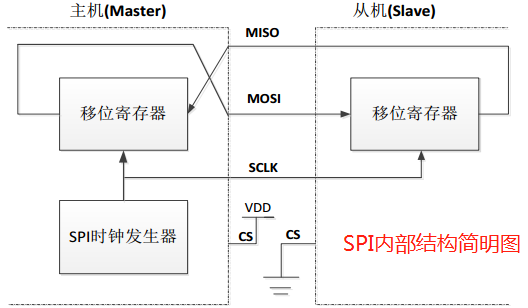

SPI接口一般使用4条线通信：

- MISO 主设备数据输入，从设备数据输出。
- MOSI 主设备数据输出，从设备数据输入。
- SCLK时钟信号，由主设备产生。
- CS从设备片选信号，由主设备控制。

### 软件设计

包括配置IO口，设置时钟极性、时钟相位、速度等等。

## 485通信

485是二线，半双工通信，多点通信，可以远距离传输、抗干扰能力强

### 原理

理想情况下RS485需要2个终端匹配电阻，其阻值要求等于传输电缆的特性阻抗（一般为20Ω）。没有特性阻抗的话，当所有的设备都静止或者没有能量的时候就会产生噪声，而且线移需要双端的电压差。没有终接电阻的话，会使得较快速的发送端产生多个数据信号的边缘，导致数据传输出错。

### 接线

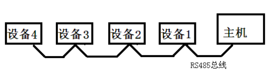

在上面的连接中，如果需要添加匹配电阻，我们一般在总线的起止端加入，也就是主机和设备4上面各加一个120Ω的匹配电阻。

## 单总线数据传输-DS18B20

一根线即可数传数据，具体的可以查看**DS18B20**手册

## 无线通信

可以无线通信的有：NRF24L01、WIFI、蓝牙、Zigbee等等

### 红外遥控

需要一个红外接收头和一个红外遥控器。具有抗干扰能力强，信息传输可靠，功耗低。红外线遥控不能穿强，所以不用担心控制到了邻家的设备，所以可以同频率。

红外遥控的编码目前广泛使用的是：NEC Protocol 的PWM(脉冲宽度调制)和Philips
RC-5 Protocol 的PPM(脉冲位置调制)。

### NRF24L01

可以使用SPI通信，具体要看模块的使用手册

### Zigbee

市面上有这个开发板，可以考虑买几个组网玩玩

## 屏幕显示

### TFTLCD（MCU屏）

FMC接口，即可变存储存储控制器，支持包括SRAM、SDRAM、NAND FLASH、NOR FLASH和PSRAM等存储器

高分辨率的屏（超过800*480），一般都没有MCU屏接口，而是使用RGB接口。

### LTDCLCD（RGB屏）

对于STM32F429来说，使用TFT LCD控制器来驱动，可以直接外接RGBLCD屏

### 触摸屏

分为电阻式和电容式，触摸屏是在普通屏幕上加了一层膜，并且加上电压，触碰屏幕时，这层膜可以感应到横纵方向上的电压变化，就可以确定这个触碰点的位置。所以其中也是有模数转换的。

有的屏幕是自带了触摸屏的

## SDRAM和内存管理

一般单片机内部自带SRAM，但是程序太大的话，可能就不够了，需要外接SDRAM（同步动态随机存储器）。STM32F429中，可以使用FMC接口来控制SDRAM。

系统上电后，把程序从Flash中拿到内存中运行，各种数据的修改不会影响Flash中的数据。系统掉电后，内存中的数据丢失，下次上电，继续从Flash中拿数据果来跑。

### 内存管理

有别人写好的代码，可以拿过来用，管理自己的内存

## DMA

DMA（Direct Memory Access，即直接存储器访问），DMA传输方式无需CPU直接控制传输，也没有中断处理方式那样保留现场和恢复现场的过程，通过硬件为RAM与I/O设备开辟一条直接传送数据的通路，能使CPU的效率大为提高。

像串口等，都可以使用DMA，就不用触发中断了，接收数据的话，直接放在特定的地方，使用时候直接那就行了。

### 软件设计

配置好引脚和参数即可

## ADC

ADC（Analog to Digital Converter，模拟信号转为数字信号），对于单片机来说，可以将IO口配置为ADC功能，然后IO口接到外部的具体变化的电压，就可以在单片机内部转成具体的数字信号了。或者使用高进度的A/D芯片来转换

## DAC

DAC（Digital toAnalog Converter，数字信号转为模拟信号），单片机把自己人认识的数字1，2，3等，转换为IO上对外输出的电压1V，3V等。可以使用高精度的D/A转换芯片

## SD卡

容量大、尺寸小，支持SPI/SDIO驱动，几个IO就可以使用

## NAND Flash

可以用来存储数据，STM32F429的FMC接口可以驱动NAND Flash

## 文件系统

使用文件系统来管理SD卡、NAND FLASH和SPI FLASH

### FATFS

FATFS是一个完全免费开源的FAT 文件系统模块，专门为小型的嵌入式系统而设计

## USB

## 网络通信

## RTOS

