# PCB

[TOC]

### 整体流程

#### 原理图和封装

原理图：就是元件的抽象图形，如下图。

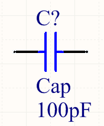

左右两个脚对应着实物的两个脚，但是对于复杂的元件不一定是完全的对应，这里还要看封装的形式，原理图只是起到示意性的作用。怎么绘制原理图，在集成库的中做示范。

封装：是一个原件的实物抽象模型，封装有大小等参数，和实物完全一至。一个元件一般只有一个原理图，当然为了绘制电路图方便可以画很多个，一个原理图对应一个或者多个封装，把封装添加到原理图中，这个原件就可以在PCB中使用了。封装库的制作在集成库中做示范。下图是一个0805的电容封装

#### 制作集成库 

集成库就是包含了很多元件的原理图和封装的库，后缀.IntLib。可以制作一个自己常用元件的集成库，把所有元件放在一个库，方便使用。以altium designer2013为例,，简称AD13，步骤如下：

1.  新建集成库工程，依次点击：File->New->Project->Integrated Libarary，后缀.LibPkg

2. 新建原理图库，依次点击：File->New->Library->Schematic Libarary，后缀.SchLib

3. 新建PCB库，依次点击：File->New->Library->PCB Libarary，后缀.PcbLib

4. 制作原理图库

   1. 选择原理图文件，并在软件左下方，把界面由Projects切换到SCH Library，或者在软件右下方点击SCH选择SCH Library，跳转到原理图界面，选择Add添加一个原理图。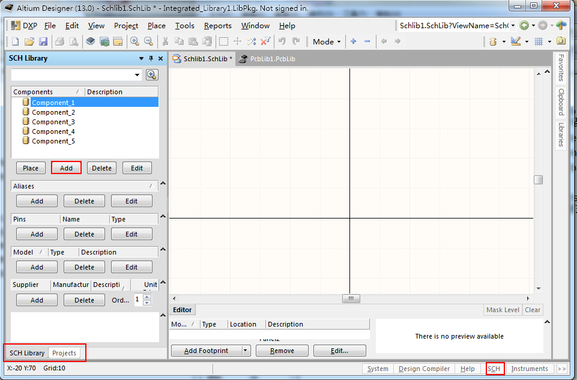

   2. 找到元件的数据手册，以为STM32F407VET6为例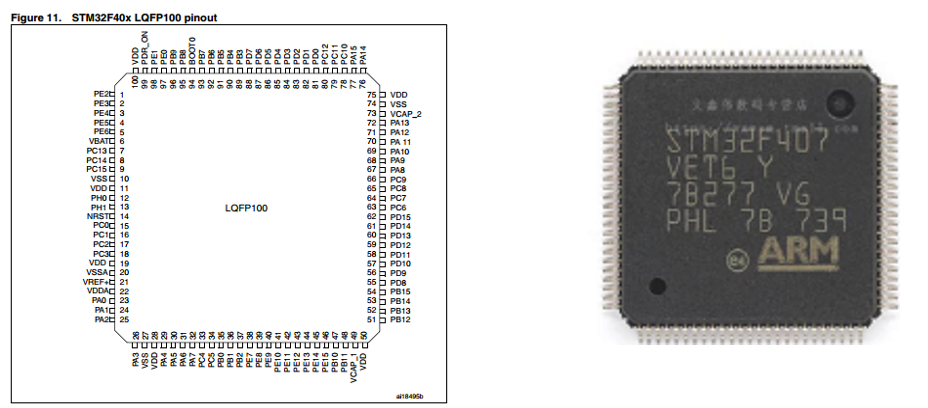

   3. 注意：一定要以为官方数据手册为准，其他参考资料为辅。这个四边的图就是实物图从1开始编号一直到100，每个编号都有一串字母对应，比如编号1的脚是PE2，记住这个脚就是PE2，可以当作IO口来用，或者可以复用为其他功能，类似PXX的，都是可以复用的。再比如14脚位NRST，这个是RESET复位的意思，这个就不能复用为其他功能，只能用来复位，这个N或者n是低电平有效的意思。

      ​       根据自己的板子功能，规划单片机100个引脚的复用功能，这个要查阅数据手册，或者用Cube MX图形化配置，推荐Cube。下面以PA2为例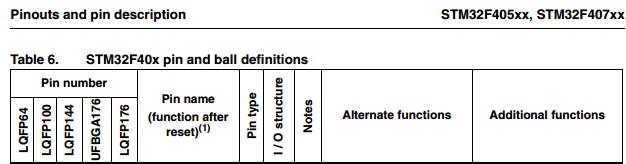

      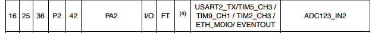

      从图中可以看出，这个PA2，在16脚的封装中是脚16，在100脚的封装中是25，可复用的功能为串口2的发送脚、定时器5的第3通道、定时器9的第1通道等等。在绘制原理图时候有两个方式 

      一、根据自己的需求把它设置为某一个，在确定了所有的功能之后，开始绘制原理图

      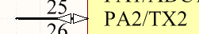

      每一个脚都有标注是PXX，和一个自己想要使用的功能 。

      二、把每一个脚的所有功能全部标注上，方便以后在做其他复用。

      这两个方法，推荐用二 制作一个显示完整的通用集成库，更好。但是有的人就喜欢简洁，只标注了PXX，复用的一个都没标注，再配合Cube，也能很好的达到目的，也可以。  

      夫

   4. Add一个元件，并且取名。先画一个矩形框，点击：Place->Rectangle，或者在右上角中

   5. 添加相关引脚，要和实物数量一致。点击邮件Place->Pin，或者在菜单栏点击Place都可以，然后会看到下图： 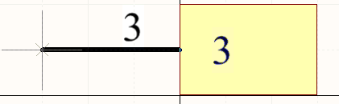

      仔细看这个脚左右两侧不一样，一侧带十字一侧不带，把带的一侧向外放，不带的一侧与矩形框相连接，在没有防止的时候可以按Tab键修改脚的编号和脚的名称，也可以缩短脚的长度，如果已经放置了，可以双击这个脚，在修改，Electrical Type 电气规则可以选择特定的，可以选择Passive，就是什么都行，这个在原理图规则检查中有用，用Passive就行，用I/O也行，如下图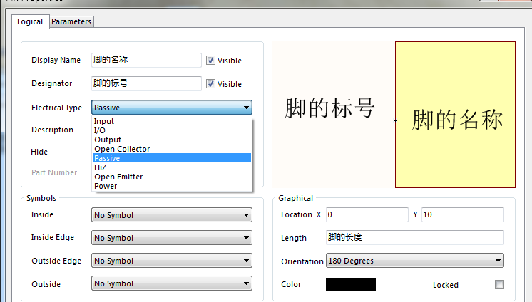

       最后得到完整的原理图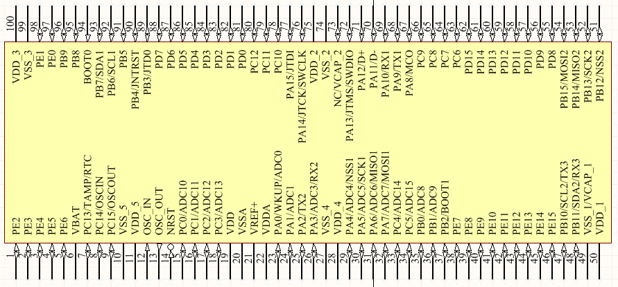

      再看一下正点原子探索者的原理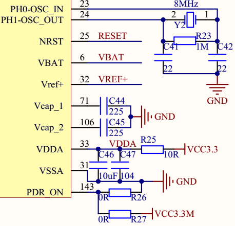

      在这个原理图中，把有关于电源的脚全部放在了一起，这样在画电路图时候，比较方便。那么按顺序和不按顺序有什么区别呢？不按顺序的话，脚不是对不上了么，不是的！！！上面说过了原理图并不是元件真正的样子，只是做示意性的。在PCB封装后做详细的解释，这里只需要记住：只要脚的编号和名字就应就行，不用管编号是否按顺序。 

   6. 制作PCB库：这个一般是吧别人做好复制到自己的库中的，如果没有的话，就只能自己画，在左侧的PCB Library界面，Components下，单击右键，选择Component Wizard，这个向导可以画一些简单的封装，或者选择Tools下的IPC Compliant Footprint Wizard，这个可以画更复杂的封装。 

   7. 关联原理图与封装 ：在原理图界面选择一个原理图，下面会有添加封装，把对应的添加进去即即可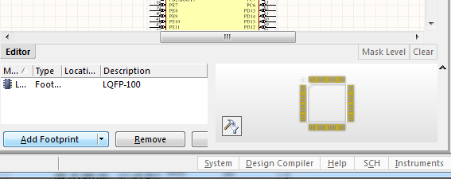

   8. 编译集成库工程，生成集成库：选择到Project界面，右键点击 xx.LibPkg 工程，选择第一个 Compile Integrated Libarary xx.LibPkg 有错误的画，会报错，没错误的话会生成集成库 

#### PCB流程

1. 新建PCB工程，点击：File->New->Project->PCB Project，后缀.ProPCB

2. 新建原理图文件，点击：File->New->Schematic ，后缀.SchDoc

3. 新建PCB文件，点击：File->New->PCB，后缀.PcbDoc

4. 在原理图文件中添加需要的集成库，点击：Libraries->Libraries，弹出界面，根据集成库坐在的路径选择即可。如果右侧没有Libraries，则在下方点击System勾选Libraries即可。如下图：

   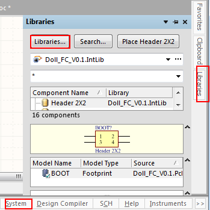

   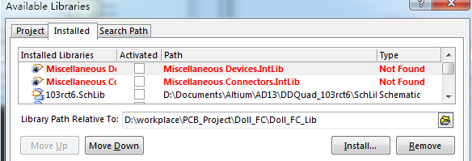

5. 绘制原理图，为了减少连接线，多用网络标号 

6. 生成PCB文件，原理图更新到PCB，点击菜单栏Design->Update PCB Document xxx.PcbDoc，如果没有这个选项，是工程建的不对，重建PCB工程。该过程会有校验，有错误需要改正。 

7. 布局与布线，原理图生成PCB文件后，看到的元件就是实际的元件，他们之间的大小关系，也是实际元件大小关系。根据相关规则和板子的使用方便，把各个元件放到“较好”的位置，开始布线。注意：为了布线简单方便，一定要慎重的摆放各个元件的位置，有人说，当确定了各个元件的位置后，就相当于布完了线70%的线，所以元件位置很重要。根据自己的经验和网上大神的经验总结几条： 

   1. 电源接口尽量放到边上，便于接插电源
   2. 主要或者脚较多的芯片尽量放到中央
   3. 有时候需要把芯片旋转45度，布线方便
   4. 滤波之类的电容尽量离芯片尽
   5. 布线少走弯路（少绕来绕去的），可以打过孔，
   6. 两层板，覆铜，一般是上下都是GND
   7. 铜时，有的地方覆不进去，添加过孔GND
   8. 不要使用自动布线，要手动布线
   9. 每一对vss和vdd都要很近的配一个滤波电容

   10.电源线要粗一点

   11.差分信号线要平行，少过孔，如果有过孔一起打过孔

   12.晶体与X1，X2 引脚之间的连线距离最短，必须小于**5mm**

8. 检验规则是否正确，点击菜单栏的Tools->Design Rule Check，在弹出的界面选择左下角的 Run Design Rule Check，然后会弹出一个新的文件 Design Rule Check - xxx.html，在AD13里面是直接打开的，根据错误和警告进行修正。 

9. 确定板子尺寸，选择 Keep-Out Layer 层，选择菜单的Place->Line 画出板子的四周边界线，线的颜色为粉色，注意颜色，不是这个颜色不对，或者看这个层的颜色 

   

   画一个密闭的边框，选中所有边框，点击菜单栏的Design->Board Shape->Define form selected objects，最后边界线外面为灰色，内部为黑色

   

10. 四角变圆弧，上面得到的板子的四个脚是直角，可以做成圆弧，以后在写 

11. 打安装孔，在 Keep-Out Layer ，放置一个圆（P-U），选中圆，T-V-T，双击圆内区域，勾选 Board Cutout即可，一般定位孔距离边界4~5mm，周围1.25mm不能防止元件，可加丝印示意。补泪滴，焊盘处连接更好，点击：Tools->Teardrop，下面是添加泪滴前后对比

    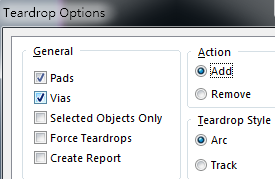

    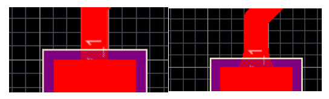

12. 覆铜，选择Bottom layer，选择菜单栏Place->Polygon Pour，或者 

    

    Fill Mode，覆铜类型没太研究过，第一个完全覆铜就行。信号是GND。同样操作覆Top layer。如果有的地方覆不进去，考虑移动布线，让出一点空隙，让铜过去。如果线路比较复杂、密集让不出来，在没进去的地方放置过孔信号GND，再不行就多放几个。

13. 矩阵过孔，覆铜之后，放置矩阵过孔，连接上下两层的GND，点击：Tools->Via Stitching->Stitching to Net 

    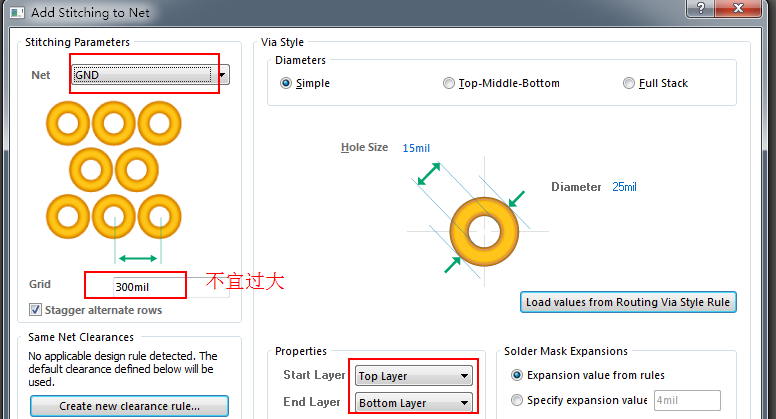

14. 覆铜之后，再一次检查，Tools->Design Rule Check，没问题后可以制板了

#### 经验积累

1. 两层板是指信号层是两层，上层和下层，一根信号线如果在一面走不过去了，可以通过过孔换到另一层。
2. 覆铜是指布线之后，在上层和下层中没有布线的位置覆上一层铜皮，增强抗干扰能力，一般这两层铜皮都是地。铜皮和走线之间有一个举例，可以自己设置。如果是自动布线，而且线多，可能会有的地方有一大片是覆不进去的，这时可以通过增加过孔的方法把铜覆进去。覆不进去的原因是：那一块是被信号线包死了的，地进不去。
3. 布线，不要走直角或者锐角，因为直角处可能铜线的料很少（或者其他的原因），如果就是直角了，那么可以考虑把这根信号线加粗，或者添加一块铜皮使得他变宽，变粗。
4. 走完线后，添加泪滴。
5. 覆铜之后，把上下两层的地都连接上，可以自己放置过孔，或者放置矩阵过孔，矩阵过孔不应该太密集。
6.                在每一个元件或者模块附近放一个旁路电容（104，0.1uf）,V和G之间，会使得这个模块工作性能更好。

7. 丝印层的标注不应该太小，看着和2.54mm的直插件的空差不多大即可，或者看3D图。

8. 在保证功能实现之后，原件位置，布线要合理，尽量统一、对称，看着美观。
9. 布线分两步，第一步摆放原件位置，第二步布线。在摆放原件位置后，就已经完成了70%的布线了，所以各个元件的位置很重要。布线的话，尽量不要拐太多的弯，不要走太多的过孔。
10. 待更新

#### 其他

- 芯片引脚的字母上有横下的，代表电平有效
- 网络标号有前缀n的，代表低电平有效