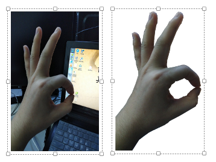
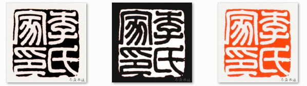
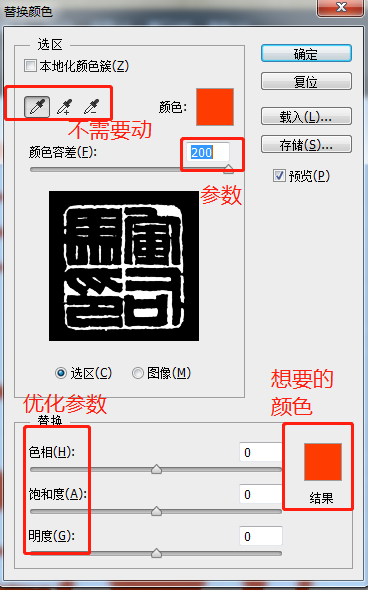

# PS处理

[TOC]

## 制作透明图片

透明图片是指图片中的某一个部分是透的，盖不住下面的背景的，使用美图秀秀。

把一个图片中需要透明的部分切除。美图秀秀为例，透明图就是把一个图片中某些地点的像素去掉，然后把这个图放在有给背景中去掉的那些像素就相当于洞，背景能透过来。效果就是这个图有些地方是透明的。在美图秀秀中，抠图，把想透明的地方扣住再反选，保存为透明背景。即可

## 颜色替换

在制作印稿的过过程中有时候需要设计不同颜色的文字和底色，如下：

使用PS实现，步骤如下：

- 打开PS，将图片导入，并且将图片放大，起码放大到填满PS窗口，Ctrl++（加号）
- 依次点击菜单栏的图像、调整、替换颜色，见到弹出窗口
- 开始颜色替换，在颜色替换窗口点击需要被替换的颜色，然后点击下方替换参数中的结构图标，选择想要的颜色。如果此时在替换颜色窗口中，图片显示的很小，鼠标点击不上，此时可以点击PS中的图片的部分（图片被放大了容易点）
- 依次修改需要替换的颜色，最后点击确定即可
- 优化参数很重要，有时候边缘部分不理想就修改颜色容差。如果是整理不理想，就修改色相、饱和度、明度即可

