

# 高中数学练习_集合

[TOC]

## 做题要点

关键字：

- 最多、至多：例如最多、至多2个，可能情况0个、1个、2个
- 最少、至少：例如最少、至少2个，可能情况2个、3个...，不可能是0、1个
- 仅有、恰有：例如仅有、恰有2个，只能是2个

约束范围：

- Z，R等集合约束

读题要点：

- 注意集合类型：点集、数集
- 注意元素的表示符号：是用x还是用的y

## 典型习题

### 0.集合概念

元素$a$与集合关系$A$：有且仅有$a \in A,a \notin A$二者之一

集合三要素：互异性、确定性、无序性

例1：下列语句能确定是一个集合的是(　　)

A．著名的科学家 B．留长发的女生 C．2010年广州亚运会比赛项目 D．视力差的男生

例1：“较大的数、注明数学家”等可以构成集合。（错误，不符合确定下性）

例2：$\lbrace \lbrace a,b,c \rbrace, \lbrace b,a,c \rbrace \rbrace  $是一个集合。（错，表面上看是一个集合的集合，集合的元素还是集合。但是不满无序性）

例3：设集合$A = \lbrace -2, 0, 4   \rbrace$,$B = \lbrace m, m^2   \rbrace$,则使$A \cup B=A$成立的$m$的值为（m=-2）

例4：已知集合$A=\lbrace m+2, 2m^2+m      \rbrace$ ,若$3 \in A$,则$m$的值为（-3/2）

例5：集合$\lbrace 1, a, \frac{b}{a} \rbrace= \lbrace 0, a^2, a+b  \rbrace$,则$a^{2021}+b^{2021}$的值为（-1）

例6：下列式子中，正确是有（1,2,4,6）：1)$\lbrace  a,b \rbrace\subseteq\lbrace  b,a\rbrace$；2)$\lbrace  a,b \rbrace=\lbrace  b,a \rbrace$；3)$\lbrace 0 \rbrace=\lbrace \varnothing \rbrace$；4) $0 \in\lbrace 0 \rbrace$；5)$\varnothing  \in \lbrace 0 \rbrace$；6)$\lbrace \varnothing \rbrace\subseteq \lbrace 0 \rbrace$

例5：$M=\lbrace 1,2,3,4,5,6,7\rbrace$,$N\neq \varnothing $，$N\subseteq M$,若$a\in N$,则$8-a \in N$,则满足条件的集合N的个数为（15）

例6：由$a^2,2－a,4$组成一个集合A，A中含有3个元素，则实数a的取值可以是(　6　)

例7：已知集合*A*是由$0，m，m^2－3m＋2$三个元素组成的集合，且$2 \in A$，则实数m为(　3　)

例8：由下列对象组成的集体属于集合的是   1 4   (填序号)

①不超过π的正整数；②本班中成绩好的同学；③高一数学课本中所有的简单题；④平方后等于自身的数．

### 1.直接用列举法给出集合，问集合之间的关系运算，交、并、补集的结果

题型描述：直接给出多个集合的列举描述形式（不含有未知数），问：它们之间的交集、并集、补集等运算之后得到的集合中的元素都有那些？

解法：直接运算，用笔勾画没有的元素和圈上有的元素。

例1：设全集$U=\lbrace 1,2,3,4,5,6  \rbrace$ ，集合$P = \lbrace 1,2,3,4 \rbrace$,$Q=\lbrace 3,4,5 \rbrace$，则$P \cup(\complement_UQ) = $

　　　　A.$\lbrace 1,2,3,4,6  \rbrace$ B.$\lbrace 1,2,3,4,5  \rbrace$  C.$\lbrace 1,2,5  \rbrace$  D.$\lbrace 1,2 \rbrace$ 

例2：设集合$A = \lbrace 0,2,4,6,8,10  \rbrace$,$B = \lbrace 4,8  \rbrace$,则$\complement_AB = $       C

　　　　A.$\lbrace 4,8  \rbrace$  B.$\lbrace  0,2,6 \rbrace$  C.$\lbrace  0,2,6,10 \rbrace$  D.$\lbrace  0,2,4,6,8,10 \rbrace$

例3：设集合$U= \lbrace 1,2,3,4,5,6  \rbrace$，$A=\lbrace 1,3,5  \rbrace$,$B = \lbrace 3,4,5  \rbrace$,则$\complement_U(A \cup B)$

　　　　A.$\lbrace 2,6  \rbrace$  B.$\lbrace 3,6  \rbrace$  C.$\lbrace 1,3,4,5  \rbrace$  D.$\lbrace 1,2,4,6  \rbrace$

例4：

例5：

例6：

例7：

例8：

### 2.使用描述法给出集合的表示，问集合之间的关系运算，交、并、补集的结果

题中的集合也可以是由各种等式、不等式给出，需要解不等式，确定范围，然后利用数轴确定范围，挖点与补点

例1：已知集合$A=\lbrace x \mid x^2+3x-10 \leqslant0 \rbrace$,集合$B = \lbrace x \mid x^2+x-12 =0 \rbrace$，则$A \cap B是多少？$（$\lbrace x \mid  4\leqslant x < 2  \rbrace$）

例2：设集合$A = \lbrace x \mid -2 \leqslant x \leqslant 2 \rbrace$ ,$Z$为整数集，则集合$A \cap Z$中元素的个数是   C

　　　　A.3  B.4   C.5   D.6

例3：设集合$A = \lbrace x \mid x^2-4x+3 <0  \rbrace$ ,$B = \lbrace x \mid 2x-3>0  \rbrace$ 则$A \cap B=$    D

　　　　A.$(-3,-\frac{3}{2})$    B.$(-3, \frac{3}{2}) $  C.$(1, \frac{3}{2}) $    D.$(\frac{3}{2}, 3) $

例4：设集合$A=\lbrace 1,2,3,4   \rbrace$,$B=\lbrace -1,0,2,3   \rbrace$,$C=\lbrace x \in Z \mid -1 \leqslant x<2  \rbrace$,则$(A \cup B)\cap C=$  ($\lbrace -1, 0, 1  \rbrace$)

例5：已知集合$A=\lbrace x\mid x^2-2x-8 = 0 \rbrace$,$B=\lbrace x\mid x^2+ax+a^2-12=0 \rbrace$,当$B \subseteq A$时，求实数a的取值范围（$a<-4$或$a=-2$或$a\geqslant 4$）

例6：已知集合$A =\lbrace  1,2,3  \rbrace$,$B = \lbrace x \mid (x+1)(x-2)<0, x \in Z   \rbrace$，则$A \cup B = $($A =\lbrace 0, 1,2,3  \rbrace$)

例7：已知集合$A=\lbrace x\mid x>a \rbrace$,$B=\lbrace x\mid x^2-3x+2>0 \rbrace$,若$A\subseteq B$，则实数a的取值范围是（$a \geqslant 2$）

例8：

### 3.不直接给出集合表示，而是使用不等式（方程）表示，需要解不等式确定

不等式涉及：一元一次不等式、一元二次不等式、分式不等式、绝对值不等式、高次不等式等等

例1：

例2：

例3：

例4：

例5：

例6：

例7：

例8：

### 4.子集、真子集个数

记住公式

例1：

例2：

例3：

例4：

例5：

例6：

例7：

例8：

### 5.集合由不等式表示，有参数，又有元素、集合之间的关系，问参数范围

例1：已知集合$A=\lbrace x \mid x^2-3x-10   \rbrace$, $B=\lbrace x \mid  m+1 \leqslant x  \leqslant 2m- 1)  \rbrace$，若$A \cap B=B$,则实数m的范围是（$\lbrace m \mid m \leqslant3  \rbrace$）

例2：设集合$A=\lbrace  1,2,4  \rbrace$,$A=\lbrace x \mid -4x+m = 0  \rbrace$,若$A\cap B = \lbrace  1  \rbrace$,则$B=$   （$\lbrace  1,3  \rbrace$）

例3：已知$A = \lbrace  x\leqslant  5  \rbrace$,$B = \lbrace  x \mid x>2a-1  \rbrace$,若$A \cup B = R$，求实数a的取值范围（$\lbrace a \mid a \leqslant 3 \rbrace$）

例4：已知集合$A = \lbrace x \mid x<a \rbrace$,$B = \lbrace x \mid 1\leqslant x <2 \rbrace$,且$A \cup(\complement_UB) = R$,则实数a的取值范围是多少？（$\lbrace a\mid  a \geqslant 2 \rbrace$）

例5：已知集合$A=\lbrace  x \mid mx^2-3x+2= 0  \rbrace$ ，若A中之多一个元素，求实数m的取值范围（$A=\lbrace m  \mid  m = 0或m\geqslant \frac{9}{8}     \rbrace$）

### 6.给出几个集合（直接或者间接），问它们之间存在那种关系（交集、并集、补集等等）

解法：各个选项间差异较大，一般一个一个排除

例1：已知集合$A = \lbrace x \mid x^2-x-2<0  \rbrace$ ,$A = \lbrace x \mid  -1<x<1  \rbrace$,则 B

　　　　A.$ A\subsetneqq B$      B.$ B\subsetneqq A$      C.$A=B$    D.$A \cap B = \varnothing$

### 未整理

1.集合{(*x*，*y*)|*y*＝2*x*－1}表示(　　)

A．方程*y*＝2*x*－1  B．点(*x*，*y*) C．平面直角坐标系中的所有点组成的集合 D．函数*y*＝2*x*－1图象上的所有点组成的集合

2.下列集合中，不同于另外三个集合的是(　　)

A．{*x*|*x*＝1}       B．{*y*|(*y*－1)2＝0}     C．{*x*＝1}              D．{1}

3.对于集合*A*、*B*，“*A*⊆*B*不成立”的含义是(　　)

A．*B*是*A*的子集  B．*A*中的元素都不是*B*中的元素  C．*A*中至少有一个元素不属于*B* D．*B*中至少有一个元素不属于*A*

4.集合*P*＝{*x*|*y*＝}，集合*Q*＝{*y*|*y*＝}，则*P*与*Q*的关系是(　　)

A．*P*＝*Q*               B．*P*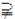*Q*    C．*P**Q*               D．*P*∩*Q*＝∅

5.满足条件{1,2}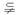*M*⊆{1,2,3,4,5}的集合*M*的个数是(　　)

A．3     B．6      C．7      D．8

6.下列命题：

①空集没有子集；②任何集合至少有两个子集；③空集是任何集合的真子集；④若∅*A*，则*A*≠∅.其中正确的个数是(　　)

A．0      B．1      C．2      D．3

8.已知*M*＝{*x*|*x*≥2，*x*∈**R**}，给定下列关系：①π∈*M*；②{π}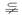*M*；③π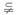*M*；④{π}∈*M*.其中正确的有________．(填序号)

9.已知集合*A*＝{*x*|1<*x*<2}，*B*＝{*x*|*x*<*a*}，若*A**B*，则实数*a*的取值范围是________．

11.已知集合*A*＝{*x*|－2≤*x*≤5}，*B*＝{*x*|*m*＋1≤*x*≤2*m*－1}．若*B*⊆*A*，求实数*m*的取值范围． *m*≤3.

12.已知集合*A*＝{*x*|1<*ax*<2}，*B*＝{*x*|－1<*x*<1}，求满足*A*⊆*B*的实数*a*的取值范围．*a*＝0或*a*≥2或*a*≤－2.

13.已知集合*A*{1,2,3}，且*A*中至少含有一个奇数，则这样的集合有___5_____个.

14.若集合*A*＝{*x*|*x*2＋*x*－6＝0}，*B*＝{*x*|*x*2＋*x*＋*a*＝0}，且*B*⊆*A*，求实数*a*的取值范围．   *a*>1/4或*a*＝－6.

已知全集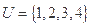,集合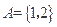,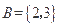,则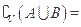( D )

A.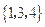     B.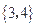     C.      D. 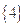

已知集合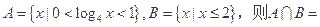D

A.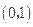    B.      C.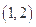      D. 

已知集合*A* = {*x*∈*R*| |*x*|≤2}, *A* = {*x*∈*R*| *x*≤1}, 则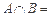 

(A) 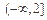 (B) [1,2]  (C) [2,2]  (D) [-2,1]

设常数,集合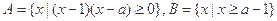,若,则的取值范围为( B )

(A)     (B)   (C)       (D) 

设全集为*R*, 函数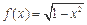的定义域为*M*, 则为D

(A) [-1,1]       (B) (-1,1)

(C)  (D) 

设集合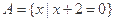,集合,则(  )

(A)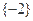    (B)     (C)    (D)【答案】A 

已知全集为,集合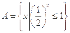,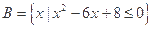,则(  )

A.        B. 

C.   D.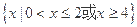

设集合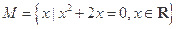,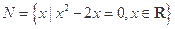,则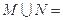(  )

A .        B.     C.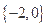     D.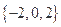

设整数,集合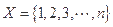.令集合

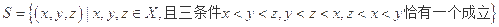,若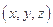和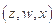都在中,则下列选项正确的是(  )

A . ,        B.,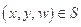      

C.,       D., 

