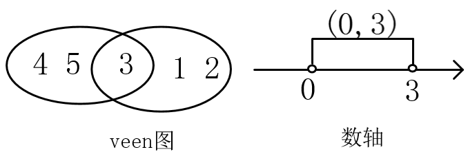

## 集合

### 集合的概念

**1.**集合的定义：一般地，把研究对象统称为**元素**，把一些元素组成的总体叫做**集合**(简称**集**)。通常，使用小写字母$a,b,c...$等表示元素，使用大写字母$A,B,C...$等表示集合。

集合的另一种表述：集合是指具有某种特定性质的具体的或抽象的对象汇总而成的集体。其中，构成集合的这些对象则称为该集合的元素。

常见数集

|            集合            |          描述          |        举例        |
| :------------------------: | :--------------------: | :----------------: |
| 正整数集：$N^{*}$或$N_{+}$ |  所有正整数组成的集合  |     1,2,3,4...     |
|   自然数(非负整数)：$N$    | 全体非负整数组成的集合 |     0,1,2,4...     |
|        整数集：$Z$         |   全体整数组成的集合   | ...，-1，0,1，.... |
|       有理数集：$Q$        |     全体有理数组成     |                    |
|        实数集：$R$         |      全体实数组成      |   有理数和无理数   |

**2.**元素与集合的关系：元素与集合的关系有且仅有属于和不属于两种，并且二者必居其一。不存在模棱两可，可能属于也可能不属于的情况(三要素的确定性)

- 属于：元素$a$属于集合$A$，符号表示为 $a\in A$，该符号具有方向性，左边是元素，右边是集合，例如$A\in a$是错误的表示形式
- 不属于：元素$a$不属于集合$A$，符号表示为$a\notin A$

**3.**集合的表示：使用花括号$\brace$表示集合，把元素写在里面，有多种表示形式

- 自然语言法：使用自然语言描述，例：高一二班全体同学

- 列举法：把集合的元素一一列举出来，并用花括号"$\brace$"括起来的表示集合的方法，元素之间使用逗号隔开，适用于元素个数少，且不好用数学语言(公式、表达式)描述的集合。例如：$\lbrace 1,2,10,11 \rbrace$

- 描述法：用集合所含元素的共同特征表示集合的方法。使用一个字母表示这个集合中的元素，再加上描述该元素的数学表达式(共同特征)，中间使用竖线隔开。一定要注意集合中那个符号是元素。例如：$\lbrace x\mid 1<x<2 \rbrace$，表示为全体大于1且小于2的实数。如果元素有其他约束，在表达式后面加上即可：$\lbrace x \mid 1<x<10, x\in Z \rbrace$表示1到10之间的整数

- 区间法：使用区间的形式表示，和描述法有些类似。例如，大于1且小于2的实数用描述法表示为$\lbrace x\mid 1<x<2 \rbrace$ ，使用区间法表示为$(1, 2)$

- 韦恩图($Venn \quad diagram$)：不太严格的意义下用以表示集合的一种草图。草图，用圈或方框等表示集合，点等表示集合中的元素。$Venn$图表示的元素一般是有限个的，如果元素个数无限且连续可以使用数轴法

- 数轴法：使用数轴表示，比描述法直观、清晰，在做多个集合之间的交、并、补集时，更好用

  

**4.**集合三要素

　　集合三要素指的是：任何一个集合，都要满足的条件(三条)。如果不满足(即使是一条)，那就不是集合。

- 确定性：指$a$要么属于$A$，要么不属于$A$。不存在模棱两可的情况，必有一个明确的判断依据。例如
  - 张三一米八，是高个子：错，没有明确高个子范围
  - 张三一米八，身高高于等于一米八的算是高个子，张三是高个子：对
- 互异性：集合中没有相同的元素。例如：$\lbrace 1,2,2 \rbrace$为错误的，因为有两个相同的元素
- 无序性：集合中元素的顺序对集合没有影响，一个集合的元素可以写成不同顺序。例如：$\lbrace 1,2,3 \rbrace$和$\lbrace 1 ,3,2 \rbrace$表示同一个集合。

**5.**集合的分类：看一个集合时，一定要注意元素类型是什么，是数还是点，还是其他的什么。元素用的那个符号表示的，约束是什么。集合可以根据元素的个数或元素的种类分类(或者其他因素)

- 根据元素个数分为：空集和非空集
  - 空集：不含有任何元素的集合，符号表示为：$\varnothing$(发音fai)
  - 非空集：集合中有元素的集合
- 根据元素种类可以分为：数集、点集等等

  - 数集：集合中的元素是数，例：$\lbrace 1,2,3,4 \rbrace$
  - 点集：集合中的元素是点，例：$\lbrace (1,2), (2,3) \rbrace$

注意：$\varnothing$和$\lbrace 0 \rbrace$是不同的集合

### 集合间的基本关系

**1.**子集：一般地，对于两个集合$A,B$,如果集合$A$中任意一个元素都是集合$B$中的元素，我们就说这两个集合有包含关系，称集合$A$为集合$B$的**子集**，记作：$A\subseteq B$(或$B\supseteq A$)。读作：$A$含于$B$或$B$包含$A$。

使用数学语言描述子集关系：${\forall}a\in A,$都有$a \in B，则A\subseteq B$，对$A$中任意元素，都属于$B$，则$A$是$B$的子集。

根据定义，有如下四种情况：

- $A$和$B$都非空，$A$是$B$的一部分
- $A$和$B$都非空，$A$与$B$相等
- $A$是空集，$B$不是空集
- $A$是空集，$B$也是空集

veen图表示如下（有空集情况未画出）：

子集的性质：

- $R \supseteq Q \supseteq Z \supseteq N \supseteq N^*$
- 空集是任何的子集，即$\varnothing \subseteq $任何集合
- 任何集合是它自身的子集，即$A \subseteq A$。
- 如果集合$A,B,C$，满足$A\subseteq B$，$B\subseteq C$,则有$A\subseteq C$,传递性

2.真子集：如果$A\subseteq B$，但是存在元素$x\in B$，且$x\notin A$，我们称集合$A$是集合$B$的**真子集**，记作：$ A\subsetneqq B$（或$B\supsetneqq A$）

- 集合$B$的元素必然比集合$A$的元素多。
- $ A\subsetneqq B \Rightarrow A\subseteq B$，$A$是$B$的真子集，$A$一定是$B$的子集
- $  A\subseteq B  \Rightarrow A\subsetneqq B$或$A=B$，$A$是$B$的子集，$A$要是$B$是真子集，要是$A=B$
- $A\subsetneqq B$且$A=B  \Rightarrow  A\subseteq B $，$A$是$B$的真子集且$A\neq B$,$A$一定是$B$的子集
- $R \supsetneqq Q \supsetneqq Z \supsetneqq N \supsetneqq N^*$ 

**3.**相等集合：$A、B$中的元素完全一样，则$A$与$B$相等，记作：$A=B$。严格表述为：$A$是$B$的子集，且$B$也是$A$的子集，则$A=B$

**4.**空集：空集是不含有任何元素的集合，有如下规定结论：

- 空集是任何集合的子集（空集是空集的子集）
- 空集是任何非空集合的真子集

5.**一些结论：**如果一个集合有n的元素，则

- 有$2^{n}$个子集（包括空集和自身）
- 有$2^{n}-1$个真子集（包括空集，不包括自身）
- 有$2^{n}-1$个非空子集（不包括空集，包括自身）
- 有$2^{n}-2$个非空真子集（不包括空集，不包括自身）

以上结论可以列举出，如下列出集合$\lbrace 1,2 \rbrace$的子集、真子集：

- 子集：$\varnothing$，$\lbrace 1 \rbrace$，$\lbrace 2 \rbrace$，$\lbrace 1,2 \rbrace$共4个
- 真子集：$\varnothing$，$\lbrace 1\rbrace$，$\lbrace 2 \rbrace$共3个，排除掉自己本身
- 非空子集：$\lbrace 1\rbrace$，$\lbrace 2\rbrace$，$\lbrace 1,2\rbrace$共３个，去掉空集
- 非空真子集：$\lbrace 1\rbrace$，$\lbrace 2\rbrace$共２个，排除掉自己本身和空集

### 集合的基本运算

**1.**并集：一般地，由所有属于集合A或属于集合B的元素所组成的集合，称为集合A与B的**并集**，记作：$A \cup B$，读作“A并B”。

即：$A \cup B=\lbrace x\mid x\in A, 或 x\in B\rbrace$

$venn$图表示如下（阴影区）：

一些结论如下：

- $A\cup B = B \cup A$（交换律）
- $(A\cup B )A\cap C = (A\cap C)\cup(B\cap C) $（分配率）
- $A\cup A= A$
- $A\cup \varnothing = \varnothing \cup A = A$
- 若$A\subseteq B$，则$A\cup B = B$
- 若$A\cup B = B$，则$A\subseteq B$

**2.**交集：一般地，由属于$A$且属于$B$的所有元素组成的集合，称为$A$与$B$的交集，记作：$A \cap B$，读作“A交B”，即：$A \cap B=\lbrace x \mid x\in A,$且$x\in B\rbrace$

$venn$图如下（阴影区）：

一些结论如下：

- $A \cap B = B \cap A$（交换律）
- $(A\cap B )A\cup C = (A\cup C)\cap(B\cup C) $（分配率）
- $A \cap A= A$
- $A\cap \varnothing = \varnothing \cap A = \varnothing$
- 若$A\subseteq B$，则$A \cap B = A$
- 若$A \cap B = A$，则$A\subseteq B$
- $A \cap B \subseteq A\cup B$

**3.**补集：一般地，如果一个集合含有我们所研究问题中所涉及的所有元素，那么就称这个集合为**全集**，通常记作$U$。对于一个集合$A$，由全集$U$中不属于$A$的所有元素组成的集合称为A相对于全集$U$的补集，简称为集合$A$的补集，记作：$\complement_UA$，即：$\complement_UA=\lbrace x\mid x\in U,且x\notin A\rbrace$，相当于在$U$中把$A$挖掉，剩下的部分即$A$相对于$U$的补集，$venn$图如下（阴影区）：

补集的一些结论如下：

- $(\complement_UA)\cap A = \varnothing$
- $(\complement_UA)\cup A = U$ 
- $\complement_UU = \varnothing$
- $\complement_U \varnothing = U$
- $\complement_U(\complement_UA) = A$
- $(\complement_UA)\cup(\complement_UB) = \complement_U(A\cap B)$
- $(\complement_UA)\cap(\complement_UB) = \complement_U(A\cup B)$
- $(\complement_UA)\cup(\complement_UA)\cup(\complement_UA)=\complement_U(A\cap B\cap C)$

4.其他相关结论：

- 容斥原理：多个集合之间的并集中元素的个数，要注意重复的要减去。对任意有限集合A、B、C，card(A)表示集合A中元素个数

  - $card(A\cup B)=card(A)+card(b)-card(A\cap B)$
  - $card(A\cup B\cup C)=card(A)+card(B)+card(C)$$-card(A\cap B)-card(A\cap C)$$-card(B\cap C)+$$card(A\cap $$B\cap C)$
