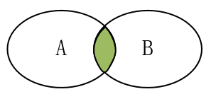
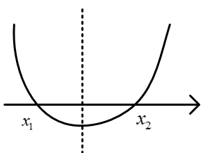
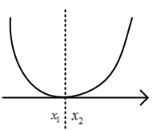
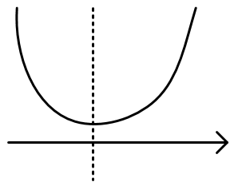

[TOC]

## 集合

### 集合的概念

**1.**集合的定义：一般地，把研究对象统称为**元素**(element)，把一些元素组成的总体叫做**集合**(简称**集**)。通常，使用小写字母$a,b,c...$等表示元素，使用大写字母$A,B,C...$等表示集合。

集合的另一种表述：集合是指具有某种特定性质的具体的或抽象的对象汇总而成的集体。其中，构成集合的这些对象则称为该集合的元素。

常见数集

|       集合       |                   描述                   |        举例        |
| :--------------: | :--------------------------------------: | :----------------: |
| $N^{*}$或$N_{+}$ |      正整数集：所有正整数组成的集合      |     1,2,3,4...     |
|       $N$        | 自然数(非负整数)：全体非负整数组成的集合 |     0,1,2,4...     |
|       $Z$        |        整数集：全体整数组成的集合        | ...，-1，0,1，.... |
|       $Q$        |         有理数集：全体有理数组成         |                    |
|       $R$        |           实数集：全体实数组成           |   有理数和无理数   |

**2.**元素与集合的关系：元素与集合的关系有且仅有属于和不属于两种，并且二者必居其一。不存在模棱两可，可能属于也可能不属于的情况(三要素的确定性)

- 属于：元素$a$属于集合$A$，符号表示为 $a\in A$，该符号具有方向性，左边是元素，右边是集合，例如$A\in a$是错误的表示形式
- 不属于：元素$a$不属于集合$A$，符号表示为$a\notin A$

**3.**集合的表示：使用花括号{}表示集合，把元素写在里面，有多种表示形式

- 自然语言：使用自然语言描述，例：高一二班全体同学
- 列举法：把每一个元素都写在花括号里面，元素之间使用逗号，隔开，适用于元素个数少，且不好用数学语言(公式、表达式)描述的集合。例如：$｛1,2,10,11｝$
- 描述法：使用一个字母表示这个集合中的元素，再加上描述该元素的数学表达式(共同特征)，中间使用竖线隔开。一定要注意集合中那个符号是元素。例如：$｛x\mid 1<x<2｝$，表示为全体大于1且小鱼2的实数。如果元素有其他约束，在表达式后面加上即可：$｛x\mid 1<x<10, x\in Z｝$表示1到10之间的整数
- 区间法：使用区间的形式表示，和描述法有些类似，$｛x\mid 1<x<2｝$ 表示为$(1, 2)$
- 韦恩图(Venn diagram)：不太严格的意义下用以表示集合的一种草图。草图，用圈/方框等表示集合，点等表示集合中的元素。Venn 图表示的元素一般是有限个的，如果元素个数无限且连续可以使用数轴法
- 数轴法：使用数轴表示

看一个集合时，要注意元素类型是什么，是数还是点，还是其他的什么。元素用的那个符号表示的，约束是什么

**4.**集合三要素

　　集合三要素指的是：任何一个集合，都要满足的条件(三条)。如果不满足(即使是一条)，那就不是集合。

- 确定性：指a要么属于A，要么不属于A。不存在模棱两可的情况，必有一个明确的判断依据。例如
  - 张三一米八，是高个子：错，没有明确高个子范围
  - 张三一米八，身高高于等于一米八的算是高个子，张三是高个子：对
- 互异性：集合中没有相同的元素。例如：$｛1,2,2｝$为错误的，因为有两个相同的元素
- 无序性：集合中元素的顺序对集合没有影响，一个集合的元素可以写成不同顺序。例如：$｛1,2,3｝$和$｛1,3,2｝$表示同一个集合。

**5.**集合的分类：集合可以根据元素的个数或元素的种类分类(或者其他因素)

- 根据元素个数分为：空集和非空集
  - 空集：不含有任何元素的集合，符号表示为：$\varnothing$(发音fai)
  - 非空集：集合中有元素的集合
- 根据元素种类可以分为：数集、点集等等

  - 数集：集合中的元素是数，例：$｛1,2,3,4｝$
  - 点集：集合中的元素是点，例：$｛（1,2）， （2,3）｝$

注意：$\varnothing$和$｛0｝$是不同的集合

### 集合间的基本关系

**1.**子集：一般地，对于两个集合A,B,如果集合A中任意一个元素都是集合B中的元素，我们就说这两个集合有包含关系，称集合A为集合B的子集，记作：$A\subseteq B$(或$B\supseteq A$)。读作：A含于B或B包含A。

使用数学语言描述子集关系：${\forall}a\in A,$都有$a \in B，则A\subseteq B$，对A中任意元素，都属于B，则A是B的子集。

根据定义，有两种情况：B中元素比A中多、A和B中元素完全一样(空集的情况见空集小节)，使用venn图表示如下：

其中：当$A\subseteq B$，A是B的子集，有以下三种可能情况：

- A和B都非空，A是B的一部分
- A和B都非空，A与B相等
- A是空集，B不是空集
- A是空集，B也是空集

$R \supseteq Q \supseteq Z \supseteq N \supseteq N^*$

子集的性质：

- 空集是任何的子集，即$\varnothing \subseteq $任何集合
- 任何集合是它自身的子集，即$A \subseteq A$。
- 如果集合A,B,C，满足$A\subseteq B$,$B\subseteq C$,则有$A\subseteq C$,传递性

2.真子集：如果$A\subseteq B$，但是存在元素$x\in B$，且$x\notin A$，我们称集合A是集合B的真子集，记作：$ A\subsetneqq B$（或$B\supsetneqq A$）

- 集合B的元素必然比集合A的元素多。
- $ A\subsetneqq B \Rightarrow A\subseteq B$，A是B的真子集，A一定是B的子集
- $  A\subseteq B  \Rightarrow A\subsetneqq B$或$A=B$，A是B的子集，A要是B是真子集，要是A=B
- $A\subsetneqq B$且$A=B  \Rightarrow  A\subseteq B $，A是B的真子集且A$\neq$B,A一定是B的子集
- $R \supsetneqq Q \supsetneqq Z \supsetneqq N \supsetneqq N^*$ 

**3.**相等集合：A、B中的元素完全一样，则A与B相等，记作：$A=B$。严格表述为：A是B的子集，且B也是A的子集，则$A=B$

**4.**空集的扩展：空集是不含有任何元素的集合，有如下规定结论：

- 空集是任何集合的子集（空集是空集的子集）
- 空集是任何非空集合的真子集

**一些结论：**

　　如果一个集合有n的元素，则：

- 有$2^{n}$个子集（包括空集和自身）
- 有$2^{n}-1$个真子集（包括空集，不包括自身）
- 有$2^{n}-1$个非空子集（不包括空集，包括自身）
- 有$2^{n}-2$个非空真子集（不包括空集，不包括自身）

　　以上结论可以列举出，如下列出集合$｛1,2｝$的子集、真子集：

- 子集：$\varnothing$，$｛1｝$，$｛2｝$，$｛1,2｝$共4个
- 真子集：$\varnothing$，$｛1｝$，$｛2｝$共3个，排除掉自己本身
- 非空子集：$｛1｝$，$｛2｝$，$｛1,2｝$共３个，去掉空集
- 非空真子集：$｛1｝$，$｛2｝$共２个，排除掉自己本身和空集

### 集合的基本运算

**1.**并集：一般地，由所有属于集合A或属于集合B的元素所组成的集合，称为集合A与B的并集，记作：$A \cup B$，读作“A并B”。

即：$A \cup B=\lbrace x\mid x\in A, 或 x\in B\rbrace$

venn图表示如下：

一些结论如下：

- $A\cup B = B \cup A$（交换律）
- $(A\cup B )A\cap C = (A\cap C)\cup(B\cap C) $（分配率）
- $A\cup A= A$
- $A\cup \varnothing = \varnothing \cup A = A$
- 若$A\subseteq B$，则$A\cup B = B$
- 若$A\cup B = B$，则$A\subseteq B$

**2.**交集：一般地，由属于A且属于B的所有元素组成的集合，称为A与B的交集，记作：$A \cap B$，读作“A交B”，即：$A \cap B=\lbrace x \mid x\in A,且x\in B\rbrace$

venn图如下：

一些结论如下：

- $A \cap B = B \cap A$（交换律）
- $(A\cap B )A\cup C = (A\cup C)\cap(B\cup C) $（分配率）
- $A \cap A= A$
- $A\cap \varnothing = \varnothing \cap A = \varnothing$
- 若$A\subseteq B$，则$A \cap B = A$
- 若$A \cap B = A$，则$A\subseteq B$
- $A \cap B \subseteq A\cup B$

**3.**补集：一般地，如果一个集合含有我们所研究问题中所涉及的所有元素，那么就称这个集合为全集，通常记作$U$。对于一个集合A，由全集$U$中不属于A的所有元素组成的集合称为A相对于全集$U$的补集，简称为集合A的补集，记作：$\complement_UA$，即：$\complement_UA=\lbrace x\mid x\in U,且x\notin A\rbrace$,

相当于在U中把A挖掉，剩下的部分即A相对于U的补集，venn图如下：

补集的一些结论如下：

- $(\complement_UA)\cap A = \varnothing$
- $(\complement_UA)\cup A = U$ 
- $\complement_UU = \varnothing$
- $\complement_U \varnothing = U$
- $\complement_U(\complement_UA) = A$
- $(\complement_UA)\cup(\complement_UB) = \complement_U(A\cap B)$
- $(\complement_UA)\cap(\complement_UB) = \complement_U(A\cup B)$
- $(\complement_UA)\cup(\complement_UA)\cup(\complement_UA)=\complement_U(A\cap B\cap C)$

其他相关结论：

- 容斥原理：多个集合之间的并集中元素的个数，要注意重复的要减去。对任意有限集合A、B、C，card(A)表示集合A中元素个数

  - $card(A\cup B)=card(A)+card(b)-card(A\cap B)$
  - $card(A\cup B\cup C)=card(A)+card(B)+card(C)-card(A\cap B)-card(A\cap C)-card(B\cap C)+card(A\cap B\cap C)$

### 一元二次方程解法

1.一元二次方程根的分布

- $ax^2+bx+c=0(a \neq 0)$有两个正根：满足一下三个条件
  - $\triangle >0$保证有两个实根
  - 对称轴在右侧
  - 若$a>0$开口向上,$f(0)>0$；或者$a<0$开口向下,$f(0)<0$
- $ax^2+bx+c=0(a \neq 0)$有两个正根,且均大于m：满足一下三个条件
  - $\triangle >0$保证有两个实根
  - $x_1+x_2>2m$或$-\frac{b}{2a}>m$保证对称轴在$x=m$右侧
  - $(x_1-m)(x_2-m)>0$保证差值同号，或者根据$a$的正负，和$f(m)$的正负确定也可以
- $ax^2+bx+c=0(a \neq 0)$有$m<x_1<x_2<n$,满足如下条件：
  - $\triangle >0$保证有两个实根
  - 对称轴在(m,n)之间
  - 若开口向上，则$f(m)>0,f(n)>0$

2.一元二次不等式：形如$ax^2+bx+c>0$或者$ax^2+bx+c<0(a \neq 0)$的不等式称为一元二次不等式，解一元二次不等式可以转化为一元二次方程$y=ax^2+bx+c(a \neq 0)$中y的取值范围（值域），即函数图像在y上面还是y轴下面。$y=ax^2+bx+c(a > 0)$的图像和不等式解集如下：

|                     |                        $\triangle >0$                        |                        $\triangle =0$                        |                        $\triangle <0$                        |
| ------------------- | :----------------------------------------------------------: | :----------------------------------------------------------: | :----------------------------------------------------------: |
| $y=ax^2+bx+c(a >0)$ |  |  |  |
| $y=0$               |                 两个不相等的实数根$x_1,x_2$                  |           两个相等的实数根$x_1=x_2=-\frac{b}{2a}$            |                           无实数根                           |
| $y>0$               |         解集为$\lbrace x \mid x>x_2或x<x_1  \rbrace$         |     解集为$\lbrace x \mid x \neq -\frac{b}{2a} \rbrace$      |                             $R$                              |
| $y<0$               |          解集为$\lbrace x \mid x_1<x<x_2  \rbrace$           |                      无解$\varnothing$                       |                      无解$\varnothing$                       |
| 最小值              |                     $y=f(-\frac{b}{2a})$                     |                     $y=f(-\frac{b}{2a})$                     |                     $y=f(-\frac{b}{2a})$                     |
|                     |                                                              |                                                              |                                                              |

说明：

- 若$a < 0$,则开口向下，相关结论取反也适用
- 若$y\leqslant 0,y\geqslant 0$，则x范围也相应取等号

### 绝对值不等式

1.公式法

- $\vert x \vert >a(a>0)$的解集为：$\lbrace x \mid x>a,或x<-a \rbrace$
- $\vert x \vert <a(a>0)$的解集为：$\lbrace x \mid -a<x<a \rbrace$
- $x^2>a(a>0)$的解集为：$\lbrace x \mid x>\sqrt{a},或x<-\sqrt{a} \rbrace$
- $x^2<a(a>0)$的解集为：$\lbrace x \mid -\sqrt{a}<x<\sqrt{a} \rbrace$

2.图像法：要掌握常见函数的图像

|            函数            | 图像 |
| :------------------------: | :--: |
|    $y = \vert x  \vert$    |      |
| $y = \vert x \pm a  \vert$ |      |
| $y =log_a \vert x  \vert$  |      |
| $y =\vert log_a x  \vert$  |      |
|   $y = \vert a^x  \vert$   |      |
|   $y =a^{\vert x \vert}$   |      |

3.其他绝对值等式和不等式

- $\vert f(x) \vert <g(x) $,则$-g(x)<f(x)<g(x)$
- 形如$y = \vert x-a \vert+\vert x+b \vert+\vert c-x \vert$的方程，要去绝对值化简，零点分段讨论
- 

### 分式不等式解法

1.形如$\frac{f(x)}{g(x)}>0$,表示分子分母同号（同正或同负）,则$f(x)>0$且$g(x)>0$，或$f(x)<0$且$g(x)<0$。其他符号与之类似

### 高次不等式

可以使用穿根法画出高次方程，进而解高次不等式，步骤如下：

- 化形：将原不等式化为形如$(x-x_1)(x-x_2)...(x-x_n)>0(<,\leqslant,\geqslant)$,注意要将所有x的系数化正数
- 求根：令不等号为等号求出各个根$x_1,x_2,...,x_n$,由小到大，在数轴上标出
- 穿根：画草图，从右上往左下（右到左，上到下）画曲线，经过各个根，若某个根为奇数重根，则穿透，重根为偶数则不穿（即传偶不穿）。画出的大致图像即为改高次不方程的大致图像，进而求不等式解集

例1：画出函数$f(x) = x(1-x)(x-2)^2(x-3)$的草图
