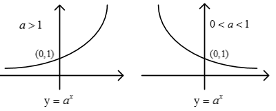
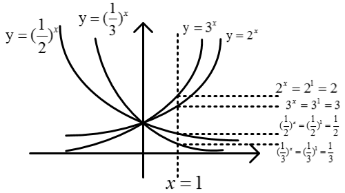
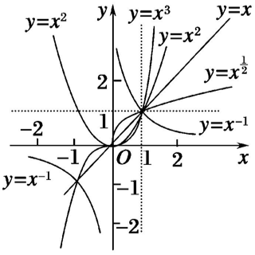

[TOC]

## 函数

### 函数基本概念

1.函数：设A，B是非空的数集，如果按照某种确定的对应关系$f$，使对于集合A中的任意一个数$x$，在集合B中都有唯一确定的数$f(x)$和它对应，那么就称$f:A\rightarrow B$为从集合A到集合B的一个函数，记作$y=f(x),x \in A$。

- 定义域：$x$叫做自变量，$x$的取值范围A叫做函数的定义域
- 值域：y是因变量，与$x$的值相对应的$y$值叫做函数值，函数值的集合$\lbrace f(x) \mid x \in A  \rbrace$叫做函数的值域
- $f(x)$叫做函数，$f(a)$是$x=a$时，函数$f(x)$的值，是一个常量
- 对应关系：A到B中，可以一对一、多对一，不可一对多，例如$x^2+y^2=1$不叫函数
- 函数的本质是一种对应关系
- 基本初等函数：幂函数、指数函数、对数函数、三角函数、反三角函数（高中不涉及）

2.函数三要素：定义域、值域、对应关系。

3.函数相等：三要素相同。其实只要定义域相同并且对应关系完全一致，就可以说两个函数相等（值域必然相同）

4.函数表示方法

- 解析法：数学表达式表示两个变量之间的关系（函数关系更清晰），例如：$y=x$
- 列表法：把两个量的对应值列成表格来表示函数关系
- 图像法：用图像表示两个变量之间的对应关系（直观的看到自变量与函数值的变化趋势）

5.分段函数：函数在定义域的不同子集上，因对应关系不同而分别用几个不同的式子来表示，分段函数虽然由几个部分组成，但它表示的仍是一个函数。

- 定义域：是各段定义域的并集
- 值域：是各段值域的并集

6.区间：表示数集中元素的范围，和用集合表示是等价的。圆括号表示取不到，开区间，但是无限接近。方括号表示可以取到，闭区间。

- $(a,b)$：表示数a到b中所有的数，$\lbrace x \mid a< x <  b  \rbrace$，不包括a和b，左开右开，开区间
- $[a,b]$：表示数a到b中所有的数，$\lbrace x \mid a\leqslant  x \leqslant   b  \rbrace$，包括a和b，左闭右闭，闭区间
- $(a,b]$：表示数a到b中所有的数，$\lbrace x \mid a< x \leqslant   b  \rbrace$，不包括a，包括b，左开右闭，半开半闭区间
- $[a,b)$：表示数a到b中所有的数，$\lbrace x \mid a\leqslant  x <  b  \rbrace$，包括a不包括b，左闭右开，半开半闭区间
- $[a,+\infty)$：$\lbrace x \mid x\geqslant  a   \rbrace$，$\infty$表示无穷大，$+\infty$表示正无穷大；$-\infty$表示负无穷大。无穷大不能是闭区间，是取不到的。可以理解为很大，比我们见到的任何一个数都大
- $(-\infty,+\infty)$：实数集

7.映射：设A，B是两个非空集合，如果按某一个确定的对应关系$f$，使对于集合A中的任意一个元素$x$，在集合B中都有唯一确定的元素y与之对应，那么就称对应$f:A\rightarrow B$为从集合A到集合B的一个映射。映射是有方向的。

- 函数和映射的区别：函数是非空数集，映射是非空集合即可
- 映射是函数的推广，函数是特殊的映射
- 映射可以多对一、一对一，不可一对多
- A中元素叫原象，B中元素叫象。映射中，A中元素不能有剩余，B中可以剩。即所有原象都有对应的象，而象不一定有原象
- 一一映射：一对一，A，B都不能剩
- A中元素m个，B中元素n个，从A到B的映射有$n^m$个

8.求函数定义域：需要注意各个部分的x的取值范围，注意：

- 分式中分母不为0
- 偶次方根内式子非负（大于等于0）
- 指数幂的指数为0时，底数不能为0，即$x^0$中，$x \neq 0$
- 当函数由有限个基本初等函数的和、差、积、商组成时，定义域是使各个式子都有意义的公共部分的集合
- 注意：凡是函数的定义域，都是指自变量的取值范围，而不是与x有关的式子的范围

9.值域：函数值的范围。求值域有换元法、分离常数法、反解法等等。要掌握常见函数的值域

10.函数的解析式：函数的两个变量之间的对应关系用一个数学表达式来表示

- 待定系数法
- 图像法
- 换元法或配凑法
- 解方程组
- 赋值法

### 函数的单调性与最值

1.单调性：函数在某个区间是增函数或是减函数，就说函数在这个区间具有单调性，这个区间叫单调区间。设函数$f(x)$在定义域$I$上，如果对于定义域内某个区间D上的任意两个自变量$x_1,x_2$

- 增函数：当$x_1<x_2$时，都有$f(x_1)<f(x_2)$,则$f(x)$在区间D上的增函数。x越大，函数值越大
- 减函数：当$x_1<x_2$时，都有$f(x_1)>f(x_2)$,则$f(x)$在区间D上的减函数。x越大，函数值越小

2.函数单调区间的定义：如果函数在区间D上是增函数，那么就说函数在这一区间具有严格的单调性，区间D叫做函数的单调区间。

- 当函数有多个增区间时，不能使用$"\cup"$连接，用$","$或"和"连接。
- 单调区间如果有多个，应分别写，不能用$"\cup"$，不能用“和”。只能用区间表示，不能用集合或不等式表示。

3.单调性判别：注意基本函数的单调性：幂函数、指数函数、对数函数、三角函数、反三角函数

- 定义法
- 如果函数是恒正或者恒负，可以做商再与1比较
- 函数在某区间上递增$\Longleftrightarrow$在区间上任取$x_1,x_2$,若$x_1<x_2$,则$f(x_1)<f(x_2)$$\Longleftrightarrow$$[f(x_1)]-f(x_2)]\cdot (x_1-x_2)>0$$\Longleftrightarrow$$\frac{f(x_1)-f(x_2)}{x_1-x_2}>0$
- 函数在某区间上递减，同上

4.最大值：一般地，设函数$y=f(x)$的定义域为$I$,如果存在实数M满足1)对于任意的$x \in I$,都有$f(x) \leqslant M$;2)存在$x_0 \in I$，使得$f(x_0) = M$,那么就称M是函数$y=f(x)$的最大值。最小值类似

5.一些结论：

5.一些结论：

- 函数$y=f(x)$与函数$y=-f(x)$单调性相反

- 函数$y=f(x)$与函数$y=f(x)+C$(C为常数)单调性相同
- 函数$y=cf(x)$,当$c>0$时，与函数$y=f(x)$单调性相同；当$c<0$时，与函数$y=f(x)$单调性相反
- 若函数$y=f(x)$在区间D上恒为正数或恒为负数，且具有单调性，则在D上$\frac{1}{f(x)}$与函数$y=f(x)$单调性相反
- 若函数$y=f(x) \geqslant 0$，则$y=\sqrt{f(x)}$与函数$y=f(x)$单调性相同
- 在公共定义域内，增函数+增函数=增函数，减函数+减函数=减函数，增函数-减函数=增函数，减函数-增函数=减函数
- 符合函数单调性：设$y=f(t)$,$t = g(x)$,则函数$y=f(g(x))$叫复合函数，单调性为“同增异减”，即内外两层复合函数单调性相同时，复合函数为增函数；单调性相反时，复合函数为减函数

### 函数的奇偶性、周期性

1.函数奇偶性：具有奇偶性的函数定义域关于原点对称，若不对称，则肯定非奇非偶。

- 偶函数：对于函数$f(x)$的定义域内任意一个$x$,都有$f(-x)=f(x)$
- 奇函数：对于函数$f(x)$的定义域内任意一个$x$,都有$f(-x)=-f(x)$

2.奇偶函数的性质：在做奇偶性概念判别问题时候，可以使用奇函数中的特例$y=x$和偶函数中的特例$y=x^2$做快速判别,性质如下：

- 偶函数：$f(-x)=f(x)$,定义域关于原点对称，图像关于y轴对称。满足$f(-x)=f(x)=f(\vert x \vert)$
- 奇函数：$f(-x)=-f(x)$,定义域关于原点对称，图像关于原点对称。若在原点处有定义，则必有$f(0)=0$(过原点)

- 若函数既满足奇函数定义，又满足偶函数的定义，则这个函数既是奇函数也是偶函数。有且只有一类函数，即$f(x)=0$
- 奇函数在两个对称区间上，具有相同的单调性；偶函数在两个对称区间，具有相反的单调性
- 在公共定义域关于原点对称条件下，奇偶函数运算结果函数，可以使用奇函数中的特例$y=x$和偶函数中的特例$y=x^2$做快速记忆：
  - 偶函数$\pm$偶函数=偶函数，偶函数$*$偶函数=偶函数
  - 奇函数$\pm$奇函数=奇函数，奇函数$*$奇函数=偶函数
  - 奇函数$*$偶函数=奇函数

3.周期性：函数具有周期性变化，对于函数在定义内，如果满足$f(x)=f(T+x)$,则函数$f(x)$是周期函数，$T$周期。在所有周期中，最小的正数T叫最小正周期。具有如下性质：

- $f(x+T)=T$,周期为$T$
- $-f(x)=f(x+a)$,周期为$2a$
- $f(x+a)=\pm \frac{1}{f(x)}$,周期为$2a$
- 若函数具有奇偶性，并且有一条非$x=0$的对称轴，那么定是周期函数

### 指数、指数幂的运算、指数函数

1.n次方根：一般地，如果$x^n=a$,那么x叫做a的n次方根，其中$n>1$,且$n \in N^*$

- $\sqrt[n]{a}$叫做根式，n叫根指数，a叫被开方数
- 平方根：若$x^2=a$,那么x叫做a的平方根。正数的平方根有2个，0的平方根是0，负数没有平方根
- 立方根：若$x^3=a$,那么x叫做a的立方根。正数有一个正的立方根，0的立方根是0，负数有一个负的立方根
- 所有实数都有唯一的奇次方根
- 负数没有偶次方根，0的任何次方根都是0，$\sqrt[0]{0}=0$
- 当n为奇数时，正数的n次方根是一个正数，负数的n次方根是一个负数，用$\sqrt[n]{a}$表示。例如$\sqrt[3]{8}=2$,$\sqrt[3]{-8}=-2$
- 当n为偶数时，正数的n次方根有两个，且互为相反数，用$\sqrt[n]{a}$表示，负数的n次方根用$-\sqrt[n]{a}$表示。例如$\sqrt[4]{16}=2$

2.根式运算性质：$\sqrt[n]{a}$叫做根式，a叫做被开方数，n叫做根指数

- $(\sqrt[n]{a})^n=a$
- $(\sqrt[n]{a})^n$：n为奇数时候，结果为a；n为偶数时，结果为$\vert a \vert$。$a>0$时，为a；$a<0$时，为$-a$

3.指数幂运算：

- 0的分数指数幂为0,0的负分数指数幂没有意义
- $a^{\frac{m}{n}}=\sqrt[n]{a^m}$,(其中$a>0,m,n \in N^*,n>1$)
- $a^{-\frac{m}{n}}=\frac{1}{a^{\frac{m}{n}}}$,(其中$a>0,m,n \in N^*,n>1$)
- $a^ra^s=a^{r+s}$,$\frac{a^r}{a^s}=a^{r-s}$($a>0,r,s\in Q$)
- $(a^r)^s=a^{rs}$,($a>0,r,s\in Q$)
- $(ab)^r=a^rb^r$,($a>0,b>0,r \in Q$)

4.指数函数：一般，形如$y=a^x$,($a>0,a \neq 1$)的函数叫做指数函数，其中，a叫做底数，x是自变量，函数的定义域是R。（$y=a^x+1$不叫指数函数）

5.指数函数的图像和性质

- 指数函数图像如下：

  

- 定义域：R

- 值域：$(0, +\infty)$

- 过定点：$(0,1)$

- 单调性：a>1时，在R上的增函数；0<a<1时，在R上的减函数

- 渐近线：$x$轴

- 图像画法：恒过定点$(0,1)$，根据a确定单调性，值域。同时要抓住三个关键点：$(1,a),(0,1),(-1,\frac{1}{a})$

- 指数函数的图像陡峭程度与底数大小的关系：有指数函数$y = 2^x$、$y = 3^x$、$y = {\frac{1}{2}}^x$、$y = {\frac{1}{3}}^x$,图像如下

  

  - 当底数$a>1$时，底数越大，越陡峭
  - 当底数$0<a<1$时，底数越小，越陡峭
  - 方法：可以画一个条$x=1$的直线，对应的是的$a^x=a^1=a$

- 指数函数$y=a^x$与$y={(\frac{1}{a})}^x(a>0,a \neq 1)$的图像关于y轴对称

- $y=a^x+a^{-x}$为偶函数；$y=a^x-a^{-x}$为奇函数

- $y=a^{\mid x  \mid}$为偶函数，图像如下：

- 

### 对数、对数的运算、对数函数

1.对数：一般地，有函数$a^x=N$($a>0,a \neq 1$),则数x叫做以a为底N的对数，记作$x=\log_aN (N>0)$，其中a叫做对数的底数，N叫做真数

- 底数的限制：$a>0,a \neq 1$,真数的限制：$N>0$(真数是这个指数函数的值域)
- 0和负数没有对数
- 常用对数：以10为底的对数$\log_{10}N$，简记为$\lg_{}N$
- 自然对数：以$e\approx 2.71828....$,为底的对数$\log_{e}N$,记作$\ln_{}N$

2.一些公式

- $\log_aa=1$，$\log_a1=0$
- 对数恒等式 $a^{\log_aN}=N$
- $\log_a{a^n}=n$
- 如果$a>0,a \neq 1,M>0,N>0$，则有如下公式：
  - $\log_a{M \cdot N}=\log_aM+\log_aN$,注意：$\log_a{10}=\log_a-2+\log_a-5$不成立
  - $\log_a{\frac{M}{N}}=\log_aM-\log_aN$
  - $\log_a{M^n}=n\log_aM$,注意$\log_a{-10^2}=2\log_a-10$不成立
- 换底公式：$\log_ab = \frac{\log_cb}{\log_ca}=\frac{1}{\log_ba}$$(a>0,a \neq 1,b>0,c>0,c \neq 1$),推论如下：
  - $\log_ab=\frac{1}{\log_ba}$,$\log_ab \log_ba=1$
  - $\log_{a^m}{b^n}=\frac{n}{m}\log_ab$

3.对数函数：一般地，把函数$y=\log_ax (a>0,a \neq 1)$,叫做对数函数，其中$x$是自变量，函数的定义域是$(0,+\infty)$

- 对数函数的概念与指数函数类似，都是形式定义，需要判别。如：$y=2\log_2x,y=\log_2{\frac{x}{5}}$都不是对数函数，可以称为对数型函数
- 对数函数$y=\log_ax $与指数函数$y=a^x(a>0,a \neq 1)$互为反函数。互为反函数的两个函数图像关于直线$y=x$对称
- $y = a^x$与$x=\log_ay$的图像是相同的，只是习惯用x表示自变量，y表示因变量，把$x = \log_ay$换成$y = \log_ax$,$y = \log_ax$才与$y = a^x$关于直线$y=x$对称，因为点$(a,b)$与点$(b,a)$关于直线$y=x$对称
- $y = \log_ax$与$y = \log_{\frac{1}{a}}x$关于x轴对称

4.对数函数的图像与性质

- 对数函数的图像如下：

  

- 定义域为$(0,+\infty)$,值域为$R$

- 图像过定点$(1,0)$

- 当$a>1$时，为增函数；当$a<1$时，为减函数

- $y=\log_ax $与$y=\log_{\frac{1}{a}}x $的图像关于x轴对称

- 渐近线：y轴

- 对数函数的图像陡峭程度与底数大小的关系：有对数函数$y=\log_2x$,$y=\log_3x$,$y=\log_{\frac{1}{2}}x$,$y=\log_{\frac{1}{3}}x$,图像如下：

  - 当底数a>1时，底数越大，图像越接近x轴
  - 当底数0<a<1时，底数越小，图像越接近x轴
  - 方法：画一条$y = 1$的直线，有$y=\log_ax=1,$则$x=a$

### 幂函数

1.幂函数：一般地，形如$y=x^\alpha$的函数叫做幂函数，其中x是自变量，$\alpha$是常数。注意，幂函数的的系数只能是1，底数只能是x，指数只能是常数，否则不能称之为幂函数

2.幂函数的图像与性质

- 在同一平面直角坐标系中，幂函数$y = x$,$y = x^2$,$y = x^3$,$y = x^{\frac{1}{2}}$,$y = x^{-1}$的图像如下图

  

- 一般幂函数的图像特征：

  - 所有幂函数在$(0,+\infty)$上都有定义，并且图像都经过点$(1,1)$；在第四象限一定没有图像，因为$x>0$时，y一定大于0
  - 当$\alpha>0$时,幂函数的图像通过原点，即图像一定经过点$(0,0),(1,1)$,并且在区间$[0,+\infty)$上是增函数。特别地，当$\alpha>1$时，幂函数的图像下凹；当$0<\alpha <1$时，幂函数的图像下凸
  - 当$\alpha < 0$时,幂函数的图像在区间$(0,+\infty)$上是减函数，不过$(0,0)$点,过点$(1,1)$

- 在第一象限，作直线$x=1$,则在直线$x=1$的右侧，幂指数越大，图像越高

### 反函数

1.反函数：一般来说，设函数$y=f(x)(x∈A)$的值域是C，若找得到一个函数$g(y)$在每一处$g(y)$都等于x，这样的函数$x= g(y)(y∈C)$叫做函数$y=f(x)(x∈A)$的反函数，记作$x=f^{-1}(y)$ 。反函数$x=f^{-1}(y)$的定义域、值域分别是函数$x=f^{-1}(y)$的值域、定义域。最具有代表性的反函数就是对数函数与指数函数。

可以理解为互为反函数的两个函数，其中一个定义域是另一个的值域，值域是另一个的定义域

2.反函数的性质

- 它们的图像关于$y = x$对称
- 若点$(x,y)$在$y=a^x$上，则点$(y,x)$在$y=\log_ax$上

3.一些函数的反函数

- 指数函数$y=a^x$与对数函数$y=\log_ax$

4.补充

- 求解析式时要反解
- x与y互换
- 反函数的定义域、值域与原函数的定义域、值域相反

例如：函数$y=x^2(x>2)$,反函数$x=\sqrt{y} \Rightarrow y = \sqrt x (x>4)$

### 方程的根与函数的零点

1.函数的零点：对于函数$y=f(x),$我们把使$f(x)=0$的实数x叫做函数$y=f(x)$的零点。零点是实数，是一个数，不是点

2.几个等价关系：方程$f(x)=0$有实根$\Longleftrightarrow$函数$y=f(x)$的图像与x轴有交点$\Longleftrightarrow$函数$y=f(x)$有零点

3.函数零点的判定(零点存在定理)：如果函数$y=f(x)$在区间$[a,b]$上的图像是连续不断的一条曲线，并且有$f(a)f(b)<0$,那么函数$y=f(x)$在区间$[a,b]$内有零点（至少一个），即存在$c \in (a,b)$,使$f(c)=0$,这个c就是方程的根

- 不能满足这个定理时，不能说就没有零点
- 满足这个条件，也可能不止一个零点
- 方程的“根”与函数的“零点”有关系，但是不是完全相同，不能混为一谈。例如方程$x^2-2x+1=0$有两个实根，但是函数$y=x^2-2x+1$只有一个零点

4.二分法求方程的近似解：对于区间$[a,b]$上连续不断且$f(a)f(b)<0$的函数$y=f(x)$，通过不断地把函数$f(x)$的零点所在的区间一分为二，使区间的两个端点逐步逼近零点，进而得到零点近似值的方法叫做二分法。给定精确度$\xi$，用二分法求函数$f(x)$的零点近似值的步骤如下：

- 确定区间$[a,b]$，验证$f(a)f(b)<0$,给定精确度$\xi$
- 求区间$(a,b)$的中点，
- 计算$f(c)$,若$f(c)=0$，则c就是函数的零点；若$f(a)f(c)<0$,则令$b=c$,此时零点$x_0 \in (a,c)$;若$f(c)f(b)<0$,则令$a=c$,此时零点$x_0 \in (c,b)$;
- 判断精确度是否达到了$\xi$,即若$\vert a-b \vert < \xi$,则得到零点近似值a(或b)；否则重复执行上面算法

### 函数模型及应用

### 函数的图像（平移、变换、伸缩、对称）

1.函数图像的作法：

- 描点法：列表、描点、连线

2.函数图像对称关系:

- $f(a+x)=f(a-x) \Rightarrow y=f(x)$关于直线$x=a$对称
- $f(a+x)=f(b-x) \Rightarrow y=f(x)$关于直线$x=\frac{a+b}{2}$对称。
- 若$2b=f(a+x)+f(a-x) \Rightarrow y=f(x)$关于$(a,b)$为中心对称
- $f(x)$和$f(1-x)$关于直线$x=\frac{1}{2}$对称

3.函数图像变换：平移变换、对称变换、拉伸变换等等

- 平移变换：向上或者下平移h个单位c

  - 水平平移h个单位：向左平移x变为x+h($y=f(x)$变为$y = f(x+h)$)，向右平移x变为x-h($y=f(x)$变为$y = f(x-h)$)，即左加右减（注意是x，不是带x的项）
    - 函数$y = x + 1$向左平移2个单位长度：$y = (x+2)+1=x+3$
    - 函数$y = x^2 + 1$向左平移2个单位长度：$y = (x+2)^2+1=x^2+4x+5$
    - 函数$y = -x^2+1$向左平移2个单位长度：$y=-(x+2)^2+1$
  - 上下平移h个单位：向上平移函数式+h($y=f(x)$变为$y=f(x)+h$)，向下平移函数式-h($y=f(x)$变为$y=f(x)-h$)，即上加下减
    - 函数$y = x + 1$向上平移2个单位长度：$y = x+1+2=x+3$
    - 函数$y = x^2 + 1$向上平移2个单位长度：$y = x^2 + 1+2=x^2+3$

- 对称变换：关于原点、x轴、y轴对称

  - 关于x轴对称：$y = f(x)$关于x轴对称为$y=-f(x)$,相当于把图像沿x轴上下翻折
  - 关于y轴对称：$y = f(x)$关于y轴对称为$y=f(-x)$,相当于把图像沿y轴左右翻折
  - 关于原点对称：$y = f(x)$关于原点对称为$y=-f(-x)$,相当于把图像沿x轴上下翻折，在沿y轴左右翻折

- 伸缩变换：拉伸与压缩

  - 拉伸变换：x变为原来的几倍形式，图像会被压缩或拉伸

  