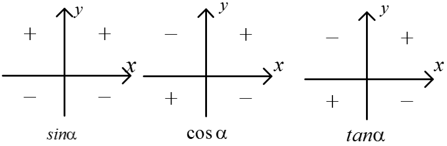
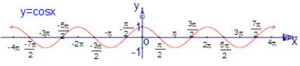
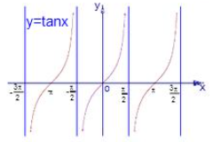

[TOC]

## 三角函数

### 任意角

1.任意角：分为正角、负角和零角

- 正角：按逆时针方向旋转形成的角
- 负角：按顺时针方向旋转形成的角
- 零角：一条射线没有作任何旋转的角

2.象限角与轴线角：平面直角坐标系被x,y轴分成四个部分，四个象限，第一象限、第二象限、第三象限、第四象限，角的终边在哪个象限，就叫哪个象限的角。终边落在坐标轴上的角叫轴线角

3.终边相同的角：所有与角$\alpha$终边相同的角（包括$\alpha$）,可以构成一个集合$\lbrace \beta \mid \beta=\alpha+k \cdot 360,k \in Z \rbrace$,即任一与角$\alpha$终边相同的角，都可以表示成角$\alpha$与整个周角的和

4.弧度制：长度等于半径长的弧所对的圆心角叫做1弧度的角，用符号$rad$表示，读作弧度，以弧度作为单位来度量角的单位制叫弧度制

- 正角的弧度是整数，负角的弧度是负数，零角的弧度数是0
- 角的弧度制的计算：$r$为弧所在圆的半径，$l$为弧长，$\alpha$为圆心角，有公式$\vert \alpha \vert = \frac{l}{r}$
  - $360^\circ = 2 \pi rad,180^\circ =  \pi rad$
  - $1^\circ = \frac{\pi}{180} rad \approx 0.01745rad$
  - $1 rad = (\frac{180}{\pi})^\circ \approx 57.30^\circ$
  - 常用角度和弧度：$30^\circ = \frac{\pi}{6}$,$45^\circ = \frac{\pi}{4}$,$60^\circ = \frac{\pi}{3}$,$90^\circ = \frac{\pi}{2}$,$120^\circ = \frac{2\pi}{3}$,$135^\circ = \frac{3\pi}{4}$,$150^\circ = \frac{5\pi}{6}$,$180^\circ = \pi$

### 任意角的三角函数

1.任意角的三角函数：设$\alpha$是一个任意角，他的终边与单位圆交于$P(x,y)$,那么

- y叫做$\alpha$的正弦，记作$sin \alpha$,即$sin \alpha = y$
- x叫做$\alpha$的余弦，记作$cos\alpha$,即$cos \alpha = x$
- $\frac{y}{x}$叫做$\alpha$的正切，记作$tan \alpha$,即$tan \alpha = \frac{y}{x}(x \neq 0)$

2.三角函数线：表示三角函数值的有向线段，线段的方向表示了三角函数值的正负，线段的长度表示了三角函数值的绝对值

- 终边相同的角同一三角函数的值相等

- 三角函数在各个象限的正负

  

3.同角三角函数的基本关系：可以在单位圆中，利用是三角函数线证明，有如下公式：

- $sin^2 \alpha +cos^2 \alpha=1$
- $tan \alpha = \frac{sin\alpha}{cos \alpha}$

4.三角函数的诱导公式：把一个复杂的式子化简,函数名不变，符号看象限，可以视$\alpha$为锐角，有如下公式：

- $\alpha$与$2k \pi+\alpha$
  - $sin(2k \pi+\alpha) = sin \alpha$
  - $cos(2k \pi+\alpha) = cos\alpha$
  - $tan(2k \pi+\alpha) = tan\alpha$
- $\alpha$与$-\alpha$
  - $sin(-\alpha)=-sin \alpha$
  - $cos(-\alpha)=cos\alpha$
  - $tan(-\alpha)=-tan\alpha$
- $\alpha$与$\pi +\alpha$
  - $sin(\pi+\alpha)=sin \alpha$
  - $cos(\pi+\alpha)=-cos\alpha$
  - $tan(\pi+\alpha)=tan\alpha$
- $\alpha$与$\pi- \alpha$
  - $sin(\pi-\alpha)=sin \alpha$
  - $cos(\pi-\alpha)=cos\alpha$
  - $tan(\pi-\alpha)=-tan\alpha$
- $\alpha$与$\alpha \pm \frac{k}{2}\pi$：“奇变偶不变(k)，符号看象限”，$\alpha$认为是锐角
  - $sin(\frac{\pi}{2}+\alpha)=cos\alpha$  ：k为1，$sin$变为$cos$，$\frac{\pi}{2}+\alpha$是钝角角(二象限)，$sin(\frac{\pi}{2}+\alpha)$值为正数，所以结果为$cos\alpha$，也是正数
  - $cos(\frac{\pi}{2}+\alpha)=-sin\alpha$ ：k为1，$cos$变为$sin$，$\frac{\pi}{2}+\alpha$是钝角(二象限)，$cos(\frac{\pi}{2}+\alpha)$值为负数，但$sin\alpha$为正数，所以要加负号，结果为$- sin\alpha$
  - $sin(\frac{\pi}{2}-\alpha)=cos\alpha$
  - $cos(\frac{\pi}{2}-\alpha)=sin\alpha$
  - $sin(\frac{3\pi}{2}+\alpha)=-cos\alpha$
  - $cos(\frac{3\pi}{2}+\alpha)=sin\alpha$
  - $sin(\frac{3\pi}{2}-\alpha)=-cos\alpha$
  - $cos(\frac{3\pi}{2}-\alpha)=-sin\alpha$

### 三角函数性质

1.正弦函数$y=sin x$ ：采用五点作图法描点，连线。五点的横坐标分别为$0,\frac{\pi}{2},\pi,\frac{3\pi}{2},2\pi$,对应的纵坐标分别为$0,1,0,1,0$,即点$(0,0),(\frac{\pi}{2},1),(\pi,1),(\frac{3\pi}{2},1),(2\pi,0)$,最终在整个实数域上的函数图像如下：

​	

正弦函数的性质：

- 为周期函数，周期为$2k\pi$，最小正周期为$2\pi$
- 定义域为R，值域为$[-1,1]$
- 最高点$(\frac{\pi}{2}+2k\pi,1)$,最低点$(\frac{3\pi}{2}+2k\pi,1)$，零点为$k\pi$（k均为整数）
- 奇函数，图像关于原点对称
- 单调增区间为$[-\frac{\pi}{2}+2k\pi,\frac{\pi}{2}+2k\pi]$,单调减区间为$[\frac{\pi}{2}+2k\pi,\frac{3\pi}{2}+2k\pi]$，其中k均为整数

2.余弦函数$y=cosx$  ：采用五点作图法描点，连线。五点的横坐标分别为$0,\frac{\pi}{2},\pi,\frac{3\pi}{2},2\pi$,对应的纵坐标分别为$1,0,1,0,1$,即点$(0,1),(\frac{\pi}{2},0),(\pi,1),(\frac{3\pi}{2},0),(2\pi,1)$,最终在整个实数域上的函数图像如下：

​	

余弦函数的性质：

- 为周期函数，周期为$2k\pi$，最小正周期为$2\pi$
- 定义域为R，值域为$[-1,1]$
- 最高点$(0+2k\pi,1)$,最低点$(\pi+2k\pi,1)$，零点为$\frac{\pi}{2}+k\pi$（k均为整数）
- 偶函数，图像关于y轴对称
- 单调增区间为$[-\pi+2k\pi,0+2k\pi]$,单调减区间为$[0+2k\pi,\pi+2k\pi]$，其中k均为整数

3.正切函数$y=tanx$ ：整个实数域上的函数图像如下：

​	

正切函数的性质：

- 为周期函数，周期为$k\pi$，最小正周期为$\pi$

- 定义域为$\lbrace x\mid x \in R，x\neq \frac{\pi}{2}+k\pi  \rbrace$，值域为$R$

- 零点为$0+k\pi$（k为整数）

- 奇函数，图像关于原点对称

- 单调增区间为$(-\frac{\pi}{2}+k\pi,\frac{\pi}{2}+k\pi)$,不存在单调减区间，但是“$y=tanx$在定义域上的增函数”是错误的，其中k均为整数

### 函数$y=Asin(\omega x+\phi)$的性质

1.函数$y=Asin(\omega x+\phi)$可以认为是由正弦函数$y=sin x$的图像经过伸缩、平移、倍增变换而来，其图像大致也是类似正弦图像的波动形式。假设$\omega >0,\phi>0$,有如下过程：

- 原正弦函数$y=sin x$，经过水平方向的伸缩变换（周期变换），得到$y=sin (\omega x)$,$x$倍增为$\omega x$，$x$轴压缩$\frac{1}{\omega}$倍
- 在上一步的伸缩变换基础上，做水平方向上的平移变换，得到$y=sin (\omega x+\phi)$,向左平移$\frac{\phi}{\omega}$个单位长度（左加右减，向左平移，x+ ；向右平移，x-）
- 在上一步平移变换的基础上，做垂直方向的伸缩变换(振幅变换)，将所有图像上有所的点纵坐标扩大A倍，即可得到$y=Asin(\omega x+\phi)$

$y=Asin(\omega x+\phi)$性质：

- 最大值为A,最小值为-A
- 单调增区间为不等式$-\frac{\pi}{2}+2k\pi <  \omega x+\phi< \frac{\pi}{2}+2k\pi$的解集；单调减区间为不等式$\frac{\pi}{2}+2k\pi <  \omega x+\phi< \frac{3\pi}{2}+2k\pi$的解集；
- 五点作图法：找$\omega x+\phi$分别等于$0,1,0,1,0$时的y值

### 恒等变换

1.两角和差公式

- $sin(\alpha+\beta) = sin \alpha cos \beta +cos \alpha sin \beta$
- $sin(\alpha-\beta) = sin \alpha cos \beta -cos \alpha sin \beta$
- $cos(\alpha+\beta) = cos\alpha cos \beta -cos \alpha cos\beta$
- $cos(\alpha-\beta) = cos\alpha cos \beta +cos \alpha cos\beta$
- $tan(\alpha+\beta) =\frac{ tan\alpha +tan \beta}{1- tan\alpha tan \beta}$
- $tan(\alpha-\beta) =\frac{ tan\alpha -tan \beta}{1+ tan\alpha tan \beta}$

2.二倍角公式

- $sin 2\alpha = 2sin \alpha cos \alpha$
- $cos 2\alpha = cos^2 \alpha- sin^2 \alpha=2cos^2 \alpha-1=1-2sin^2 \alpha$
- $tan 2\alpha = \frac{2tan \alpha}{1-tan^2 \alpha}$
- 降幂公式：$cos^2 \alpha=\frac{1+cos 2\alpha}{2}$,$sin^2 \alpha=\frac{1-cos 2\alpha}{2}$
- $(sin \alpha +cos \alpha)^2=1+sin 2\alpha$
- 半角公式：$sin \frac{\alpha}{2}=\pm \sqrt{\frac{1-cos \alpha}{2}}$,$cos \frac{\alpha}{2}=\pm \sqrt{\frac{1+cos \alpha}{2}}$,$tan \frac{\alpha}{2}=\pm \sqrt{\frac{1-cos \alpha}{1+cos \alpha}}$
- $sin \alpha cos \beta=\frac{1}{2}[sin(\alpha+\beta)+sin(\alpha-\beta)]$
- $sin \alpha+ sin \beta=2sin\frac{\alpha+\beta}{2}cos\frac{\alpha+\beta}{2}$
- $cos \alpha sin\beta=\frac{1}{2}[sin(\alpha+\beta)-sin(\alpha-\beta)]$
- $cos \alpha cos\beta=\frac{1}{2}[cos(\alpha+\beta)+cos(\alpha-\beta)]$
- $sin \alpha sin\beta=-\frac{1}{2}[cos(\alpha+\beta)-cos(\alpha-\beta)]$

### 解三角形

1.正弦定理：在一个三角形中，各个边和它所对的角的正弦值的比相等，在一个三角形中，角A,B,C的对边为a,b,c,则有：$\frac{a}{sinA}=\frac{b}{sinB}=\frac{c}{sinC}=2R$,其中R为三角形外接圆半径

- $a:b:c=sinA:sinB:sinC$
- $\frac{a}{sinA}=\frac{b}{sinB}=\frac{c}{sinC}=2R=\frac{a+b+c}{sinA+sinB+sinC}$

2.余弦定理：三角形中，任何一边的平方等于其他两边的平方和减去这两边与它们夹角的余弦的积的两倍，即：

- $a^2=b^2+c^2-2bccosA$,$cosA=\frac{b^2+c^2-a^2}{2bc}$
- $b^2=a^2+c^2-2accosA$
- $a^2=b^2+c^2-2bccosA$

3.面积公式：$S=\frac{1}{2}absinC=\frac{1}{2}acsinB=\frac{1}{2}bcsinA$

海伦公式$S=\sqrt{p(p-a)(p-b)(p-c)},p=\frac{1}{2}(a+b+c)$

4.应用：

- 坡度：斜面与地平面所成的角
- 还有俯角、仰角、方位角、视角

