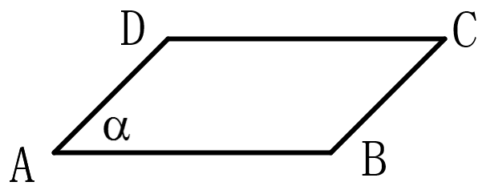
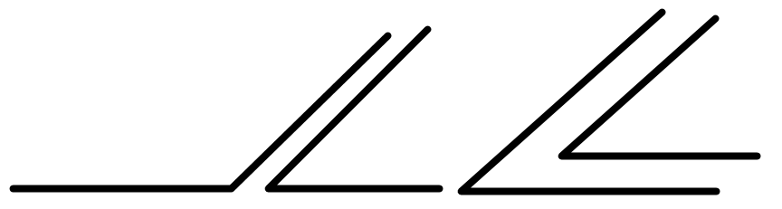
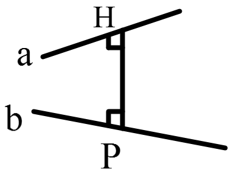
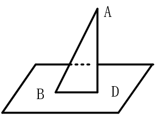
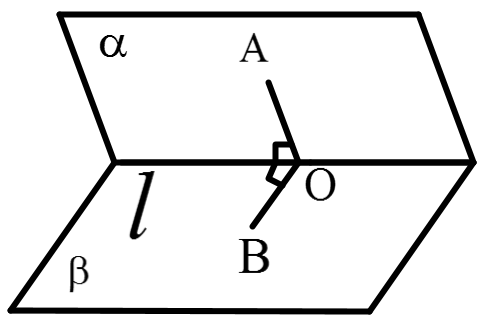

[TOC]

## 立体几何

### 常见几何体

1.棱柱：有两个面相互平行，其余各面都是四边形，并且每相邻两个四边形的公共边，都相互平行，由这些面所围成的多面体叫棱柱。这两个相互平行的面叫做棱柱的底面，简称底；其余各面叫做棱柱的侧面；相邻侧面的公共边叫做棱柱的侧棱；侧面与底面的公共顶点叫做棱柱的顶点。

棱柱分类：

- 按照底面多边形的形状可以为分三棱柱、四棱柱、五棱柱等；
- 按照侧棱与底面是否垂直分为直棱柱和斜棱柱。直棱柱每条侧棱垂直底面

正棱柱：底面为正多边形的直棱柱叫正棱柱。底面为正三角形的直棱柱称为正三棱柱，底面为正方形的直棱柱称为正四棱柱(正方体为正四棱柱，但是正四棱柱不一定是正方体)

正棱柱一定是直棱柱，而直棱柱不一定是正棱锥

棱柱有如下性质：

- 侧棱都平行且相等，侧面是平行四边形。直棱柱的侧面是矩形
- 两个底面与平行于底面的截面是全等的多边形
- 过不相邻的两条侧棱的截面是平行四边形

2.常见四棱柱的关系：$\lbrace 四棱柱 \rbrace \supset \lbrace 平行六面体 \rbrace \supset  
 \lbrace 直平行六面体 \rbrace \supset \lbrace 长方体 \rbrace \supset \lbrace 正方体 \rbrace$

平行六面体：底面为平行四边形的四棱柱，长方体是底面为矩形的平行六面体

3.棱锥：有一个面是多边形，其余各面都有一个公共顶点的三角形，由这些面所围成的多面体叫做棱锥

- 正棱锥：底面是正多边形，顶点在底面上的射影是底面正多边形的中心
- 正四面体：各棱长均相等的四面体（三棱锥又称四面体）

4.棱台：用一个平行于棱锥底面的平面去截棱锥，底面与截面之间的部分，这样的多面体叫做棱台。棱台的上下底面平行且相似，侧棱的延长线交于一点（原圆锥的顶点）

5.旋转体的形成

| 几何图形 |  旋转图形  |          旋转轴          |
| :------: | :--------: | :----------------------: |
|   圆柱   |    矩形    |     任一边所在的直线     |
|   圆锥   | 直角三角形 |   任一直角边所在的直线   |
|   圆台   |  直角梯形  | 垂直于底边的腰所在的直线 |
|    球    |    半圆    |      直径所在的直线      |

### 直观图和三视图

1.几何体的直观图：使用斜二测画法画出几何体的直观图，步骤如下：

- 在已知图形中，取相互垂直的x轴和y轴，两轴相交于点O，画直观图时，把它们画成对应的${x}',{y}'$轴，两轴交于点${O}'$，且使$\angle {x}'{O}'{y}'=45^\circ$或$135^\circ$，他们确定的平面表示水平面
- 已知图形中平行于x轴或y轴的线段，在直观图中分别画成平行于${x}',{y}'$轴的线段
- 已知图形中平行于x轴的线段，在直观图中保持原长度不变；平行于y轴的线段，长度为原来的一半

三变三不变：

- 变：坐标轴的夹角改变；与y轴平行的线段长度变为原来的一半；图形改变
- 不变：平行性不变；与x轴平行的线段长度不变；相对位置不变

原图形面积$S_原$与直观图面积$S_{直观}$关系：$S_{直观}=\frac{\sqrt{2}}{4}S_原$

空间图形：

- x轴与y轴夹角$45^\circ$，z轴与x轴垂直
- 与x轴平行的长度不变；与y轴平行的长度减半；与z轴平行的长度不变

2.投影：由于光的照射，在不透明物体后面的屏幕上可以留下这个物体的影子，这种现象叫做投影

- 中心投影：光由一点向外散射形成的投影
- 平行投影：一束平行光线照射下形成的投影。投影线正对着投影面时，叫正投影；否则叫斜投影
- 正投影：平行投影时，投影线正对投影面时，叫正投影。否则叫斜投影

3.三视图：空间几何体的三视图是用正投影得到的，这种投影下与投影面平行的平面图形留下的影子与这个平面图形的形状和大小是完全相同的，三视图包括正视图、侧视图、俯视图（三图即可确定几何体）。

- 正视图：从前向后正投影
- 左视图：从左向右投影
- 俯视图：从上向下投影

画三视图的规则：正侧一样高、正俯一样长、侧俯一样宽。画三视图时，能看见的轮廓线和棱用实线表示，不能看见的轮廓线和棱用虚线表示，即“眼见为实，不见为虚，有线必画，重合画一”

三视图的排列规则：侧视图在正视图的右边，俯视图在正视图的下边，要求“长对正、高平齐、宽相等”

常见旋转体的三视图：

- 球：球的三视图都是半径相等的圆
- 圆锥：水平放置时，正视图和侧视图都是全等的等腰三角形
- 圆台：水平放置时，正视图和侧视图都是全等的等腰梯形
- 圆柱：水平放置时，正视图和侧视图都是全等的矩形

### 空间几何体的表面积与体积

1.棱柱

　　$S_{直棱柱侧面}=lh$，($l$为底面多边形周长，$h$为高)

　　$S_{表}=S_{侧}+2S_{底}$

　　$V=Sh$，($S$为底面多边形的周长，$h$为高)

2.棱锥

　　$V=\frac{1}{3}Sh$，($S$为底面面积，$h$为高)

3.棱台

　　$V=\frac{h}{3}({S}'+\sqrt{S{S}'}+S)$，($S、{S}'$分别为上、下底面的面积，$h$为高)

4.圆柱

　　$V=Sh$,($S$为底面面积，$h$为高)

　　$S_侧=2\pi rh$,($r$为底面半径，$h$为高，展开后是一个矩形)

　　$S_表=S_侧＋2S_底=2\pi rh+2\pi r^2=2\pi r(r+h)$

5.圆锥

　　$V=\frac{1}{3}Sh$,($S$为底面面积，$h$为高)

　　$S_侧=\pi rl$,($r$为底面半径，$l$为母线,展开后是一个扇形)

　　$S_表=S_侧+S_底=\pi rl + \pi r^2=\pi r(r+l)$

6.圆台

　　$S_侧=\pi r(x+l)-\pi {r}'x=\pi ({r}'l+rl)=\pi ({r}'+r)l$，(${r}',r$分别为上、下底面半径，$l$为母线长，使用割补法，圆台上面补出一个小圆锥，构成一个大圆锥)

7.球

　　$V=\frac{4}{3}\pi R^3$,(R为球的半径)

　　$S_表=4\pi R^2$

### 空间点、直线、平面之间的位置关系

1.平面：理想化的绝对平、没有薄厚、无限延展的一个面。画法如下，

记为：平面$\alpha$、平面$ABCD$

2.点、线、面关系：点M，直线$l$，平面$\alpha$，有

- 点与直线：点在直线上$M \in l$，点不在直线上$M \notin l$
- 点与面：点在面内$M \in \alpha$，点不在面内$M \notin  \alpha$
- 直线与面：直线在面内$l \subset \alpha$，直线不在面内$l \not\subset  \alpha$

3.平面性质

- 公理1：如果一条直线上的两点在一个平面内，那么这条直线在此平面内。符号表示为$A \in l,B \in l,且A \in \alpha,B \in \alpha ,\Rightarrow l \subset \alpha$，(点A和点B在直线上，点A和点B也在平面内，那么直线在平面内)

  用来判断一条直线是否在某个平面内

- 公理2：过不在同一直线的三点，有且只有一个平面(判断点、线共面的依据)

  - 推论1：过一条直线和直线外一点，有且只有一个平面
  - 推论2：过两条相交直线有且只有一个平面
  - 推论3：过两条平行直线有且只有一个平面

- 公理3：如果两个不重合的平面有一个公共点，那么它们有且只有一条过该点的公共直线，符号表示为$P \in \alpha,且P \in \beta \Rightarrow \alpha \cap \beta=l,且P \in l$（三线共点或三点共线的依据）

- 公理4：平行于同一条直线的两条直线相互平行

4.空间中两直线的位置关系

- 共面：共面又分为平行和相交

- 异面：不同在任何一个平面内

  没有公共点的两条直线平行或异面

5.等角定理：在空间中，若一个角的两边和另一个角的两边对应平行，那么这两个角相等或互补

6.异面直线

- 异面直线所成的角：设$a,b$是两条异面直线，经过空间任何一点O作直线${a}'//a,{b}'//b$,把${a}',{b}'$所成的锐角(或直角)叫做异面直线$a,b$所成的角(或夹角)。即把异面直线平行到共面，夹角范围是$(0,\frac{\pi}{2}]$

- 异面直线距离：与异面直线$a,b$都垂直相交的公垂线段的长。如下图，$HP \bot a,HP \bot b$,所以HP为页面直线$a,b$的距离

  

7.空间直线与平面、平面与平面的位置关系

- 直线与平面的位置关系：相交、平行、直线在平面内三种
  - 直线在平面内：有无数个公共点
  - 直线与平面相交：有且只有一个公共点
  - 直线与平面平行：没有公共点
- 平面与平面的位置关系：平行、相交两种
  - 平行：没有公共点
  - 相交：一条公共直线

### 直线与平面平行的判定、性质

- 直线在平面内记作$l \subset  \alpha$
- 直线在平面外，有直线与平面相交和平行两种

直线与平面平行的判定：平面外一条直线与此平面内的一条直线平行，则该直线与此平面平行，即“线线平行”$\Rightarrow $“线面平行”。符号表示：$b \not\subset \alpha,$$a \subset \alpha,$且$a//b \Rightarrow b// \alpha$

直线与平面平行的性质如下：

- 若一条直线与一个平面平行，则这条直线与该平面没有交点，这条直线与平面内的任一条直线的关系为平行或异面
- 线面平行的性质定理：一条直线与一个平面平行，则过这条直线的任一平面与此平面的交线与该直线平行，即线面平行$\Rightarrow $线线平行，符号表示为$a// \alpha,a \subset \beta,\alpha \cap \beta=b \Rightarrow a//b$
- 平面外的两条平行线中的一条平行于这个平面，则另一条也平行于这个平面

### 平面与平面平行的判定、性质

面面平行的判定：一个平面内的两条相交直线，与另一个平面平行，则这两个平面相互平行。符号表示为：$a \subset \alpha,b \subset \alpha,a\cap b=P,a // \beta,b // \beta,$$\Rightarrow \alpha // \beta$

面面平行的性质：

- 如果两个平面平行，则其中一个平面内的任意一条直线平行于另一个平面。符号表示为$\alpha // \beta,a \subset \alpha,\Rightarrow a // \beta$
- 如果两个平行平面同时和第三个平面相交，那么它们的交线平行。符号表示为$\alpha // \beta,\alpha \cap \gamma=a,\beta\cap \gamma=b$$\Rightarrow a//b$
- 在空间中，同时平行于一个平面的两个平面相互平行，$\alpha // \beta,\alpha // \gamma,\Rightarrow \beta//\gamma$
- 过平面外一点，有且只有一个平面与已知平面平行
- $\alpha // \beta,a // \alpha,a \not\subset \beta,\Rightarrow a//\beta$

线线平行证明：

- 定义法：在同一个平面内没有公共点的两条直线平行
- 平行公理：平行于同一条直线的两条直线平行
- 线面平行的性质定理：线面平行，线平行于过该线的平面与原平面的交线
- 面面平行性质定理：面面平行，有第三个面与这两个面相交，两条交线平行
- 线面垂直的性质定理：两条直线都垂直于一个平面，这两条直线平行

### 直线与平面垂直的判定、性质

1.线面垂直：若直线$l$与平面$\alpha$内的任意一条直线都垂直，则直线$l$与平面$\alpha$相互垂直

2.线面垂直判定：一条直线与一个平面内的两条相交直线都垂直，则该直线与此平面垂直。符号表示为$a,b \subset \alpha,a \cap b=O,l \bot a,l \bot b$$\Rightarrow  l \bot \alpha$

3.线面垂直的性质：

- 若线面垂直，则这条直线与平面内的任一条直线都垂直
- 性质定理：垂直于同一个平面对两条直线平行，即$a \bot \alpha,b \bot \alpha$$\Rightarrow  a // b$
- 垂直于同一条直线的两个平面相互平行
- 两条平行线中，垂直于一个平面，则另一条也垂直于这个平面

### 直线与平面所成的角

1.斜线：与平面相交但不垂直的直线，叫做这个平面的斜线，交点为斜足(B)。BD为斜线在平面上的射影，AB称为斜线段，AD称为垂线段

2.线面角：平面的一条斜线和它在平面上的射影所形成的锐角，叫做这条直线和这个平面所组成的角(线面角转成线线角)

- 线面垂直时：成角为$90^\circ$
- 线面平行或直线在平面内时，直线与平面组成的角为$0^\circ$,所以成角的范围是$[0^\circ,90^\circ]$

3.摄影长定理：过平面外一点向平面所引的斜线段和垂线段中：

- 射影相等的两条斜线段相等
- 射影线较长的斜线段较长
- 相等的斜线段射影也相等
- 斜线中，垂线段最短

4.最小角定理：斜线和平面所成的角是这条斜线和这个平面内直线所成的所有角中最小的角

5.三垂线定理：在平面内的一条直线，如果与该平面的一条斜线的射影垂直，那么这条直线也和这条斜线垂直。

逆定理：平面内的一条直线，如果与平面内的一条斜线垂直，那么也和这条斜线的射影垂直

6.求线面角：

- 定义法：由线面角的定义做出线面角，归到直角三角形中求解
- 体积法：利用几何体的体积求出点到面的距离，利用解直角三角形求解

### 平面与平面垂直的判定、性质

1.二面角：从一条直线出发的两个半平面所组成的图形叫做二面角，这条直线叫做二面角的棱，这两个半平面叫二面角的面，棱为$l$,面为$\alpha, \beta$的二面角记作:$\alpha-l-\beta$。

二面角还可以表示为：$\alpha-AB-\beta$,$P-l-Q$,$P-AB-Q$

二面角的平面角：二面角的大小，可以用他的平面角来度量，在二面角的棱上任取一点O，以点O为垂足，在两个半平面内分别作垂直与棱的射线OA和OB，则射线OA和OB的角$\angle AOB$叫做二面角的平面角，范围是$[0,\pi]$

2.一般地，两个平面相交，如果他们所成的二面角是直二面角，就说这两个平面相互垂直

3.面面垂直的判定：一个平面过另一个平面的垂线，则这两个平面垂直。符号表示为$l\bot \alpha,l \subset \beta \Rightarrow \alpha \bot \beta$

证明面面垂直时，一般方法是先从现有的直线中寻找平面的垂线，若没有这样的直线，则可通过作辅助线来解决（有理论依据，不能随意添加）

4.面面垂直性质定理：两个平面垂直，则一个平面内垂直于交线的直线与另一个平面垂直。符号表示为$\alpha \bot \beta, l \subset \beta,\alpha \cap\beta=a,l \bot a$$\Rightarrow l \bot \alpha$

5.其他定理：

- 当PA=PB=PC时，O是$\triangle ABC$的外心，O是P在平面ABC上的射影
- 三面关系：PA与$\alpha$所成的角为$\theta_1$,AM与射影OA成角$\theta_2$,AM与AP成角$\theta$,则有$\cos \theta=\cos \theta_1 \cdot \cos \theta_2$

### 空间向量及其运算(理)

1.空间直角坐标系：以空间一点O为原点，建立三条两两垂直的数轴，x轴、y轴、z轴，这就建立了一个空间直角坐标系Oxyz。其中点O叫做坐标原点，x轴、y轴、z轴叫做坐标轴，通过每两个坐标轴的平面叫做坐标平面。有以下注意事项：

- 画空间直角坐标系Oxyz时，一般使$\angle xOy=135^\circ$,$\angle yOz=90^\circ$
- 一般地，在所给的几何图形中，如果有三条两两垂直的直线，则可以这三条直线分别为x轴、y轴、z轴建立空间直角坐标系；如果有竖直的直线与某个平面垂直，则在竖直的直线上建立z轴，在垂面内过垂足取两条相互垂直的x轴、y轴建立坐标系
- 要建立右手直角坐标系，当右手拇指指向x轴正方向，食指指向y轴正方向，终止指向z轴正方向

2.空间一点坐标：空间一点M的坐标用有序实数组(x,y,z)来表示，有序数组(x,y,z)叫做点M的空间直角坐标系中的坐标，记作$M(x,y,z)$。其中x叫做点M的横坐标，y叫做M的纵坐标，z叫做M的竖坐标。

3.空间中两点的距离公式：设点$A(x_1,y_1,z_1)$,$B(x_2,y_2,z_2)$,$\vert AB \vert= \sqrt{(x_1-x_2)^2+(y_1-y_2)^2+(z_1-z_2)^2}$,特别的点$P(x,y,z)$与坐标原点O之间的距离为$\vert OP \vert=\sqrt{x^2+y^2+z^2}$

4.线段中点的坐标公式：设点$A(x_1,y_1,z_1)$,$B(x_2,y_2,z_2)$,则线段AB的中点坐标为$(\frac{x_1+x_2}{2},\frac{y_1+y_2}{2},\frac{z_1+z_2}{2})$

5.空间向量的有关概念：空间向量有些概念和平面向量的概念相同，如下：

- 共线向量：如果表示空间向量的有向线段所在的直线相互平行或重合，则这些向量叫做共线向量或平行向量，记作$\pmb{a}//\pmb{b}$($\pmb{a}//\pmb{b}$与直线$a//b $不同)
- 向量与平面平行：如果向量$\pmb{a}$所在直线平行于平面$\alpha$或在平面$\alpha$内，则向量$\pmb{a}$平行于面$\alpha$，记作$\pmb{a}// \alpha$($\pmb{a}// \alpha$与$a// \alpha$不同)
- 共面向量：平行于同一个平面的向量，叫做共面向量

6.空间向量基本定理：

- 共线向量定理：对空间任意两个向量$\pmb{a},\pmb{b}(\pmb{b} \neq 0)$,$\pmb{a}// \pmb{b}$的充要条件是存在实数$\lambda$，使$\pmb{a}=\lambda \pmb{b}$利用此定理可以证明线线平行
- 共面向量定理：如果两个向量$\pmb{a},\pmb{b}$,不共线，则向量$\pmb{p}$与向量$\pmb{a},\pmb{b}$共面的充要条件是存在唯一的有序实数对(x,y)，使$\pmb{p}=x\pmb{a}+y\pmb{b}$,利用此定理可以证明线面平行
  - 推论1：空间一点P位于平面内ABC内的充要条件是存在有序实数对(x,y)，是$\vec{AP}=x\vec{AB}+y\vec{AC}$
  - 推论2：已知空间任一点O和不共线的三点A，B，C，点P与A，B，C，三点共面的充要条件是存在三个有序实数x,y,z，使$\vec{OP}=x\vec{OA}+y\vec{OB}+y\vec{OC}$,且$x+y+z=1$
- 空间向量基本定理：如果三个向量$\pmb{a},\pmb{b},\pmb{c}$不共面，那么对空间中任一向量$\pmb{p}$，都存在有序实数x,y,z，使$\pmb{p}=x\pmb{a}+y\pmb{b}+y\pmb{c}$，我们把$\lbrace\pmb{a},\pmb{b},\pmb{c} \rbrace$叫做空间的一个基底

- 推论1：设$O,A,B,C$是不共面的四个点，则对空间任意一点P都存在唯一的三个有序实数组x,y,z，使$\vec{OP}=x\vec{OA}+y\vec{OB}+y\vec{OC}$
- 空间向量的数量积的定义、性质、运算与平面向量相同
- 空间向量坐标的计算：设$\pmb{a}=(x_1,y_1,z_1),\pmb{b}=(x_2,y_2,z_2)$
  - $\pmb{a}\pm\pmb{b} = (x_1 \pm x_2,y_1\pm y_2,z_1\pm z_2)$
  - $\pmb{a}\cdot\pmb{b} =x_1x_2+y_1y_2+z_1z_2$
  - $\vert \pmb{a} \vert=\sqrt{\pmb{a}\cdot\pmb{a}}=\sqrt{x_1^2+y_1^2+z_1^2}$
  - $\cos <\pmb{a},\pmb{b}>=\frac{\pmb{a}\cdot\pmb{b}}{\vert \pmb{a} \vert \vert \pmb{b} \vert}=\frac{x_1x_2+y_1y_2+z_1z_2}{\sqrt{x_1^2+y_1^2+z_1^2}\cdot\sqrt{x_2^2+y_2^2+z_2^2}}$
  - $\lambda \pmb{a}=(\lambda x_1,\lambda y_1,\lambda z_1)$
  - $\pmb{a}//\pmb{b}(\pmb{b} \neq 0) \Leftrightarrow x_1=\lambda x_2,z_1=\lambda z_2,z_1=\lambda z_2 (\lambda \in R)$,与平面向量相同，但是不能化为一个等式
  - $\pmb{a} \bot \pmb{b} \Leftrightarrow x_1x_2+y_1y_2+z_1z_2=0$

### 立体几何中的向量方法

1.直线的方向向量和平面的法向量：

- 直线的方向向量：直线$l$上的向量$\pmb{e}$或与$\pmb{e}$共线的向量叫做直线$l$的方向向量，显然一条直线的方向向量有无数个，通常取直线上两个特殊点得到直线的方向向量
- 平面的法向量：如果表示向量$\pmb{n}$的有向线段所在的直线垂直于平面$\alpha$，则称这个向量垂直于平面$\alpha$，记作$\pmb{n}\bot \alpha$,此时向量$\pmb{n}$叫做平面$\alpha$的法向量。若能找到平面的垂线，则从垂线上取两个特殊的点就得到平面的一个法向量，若没有平面的垂线，则通过列方程组的方法求出平面的法向量的坐标。设$\pmb{a},\pmb{b}$是平面$\alpha$内不共线的向量，$\pmb{n}$是平面$\alpha$的法向量，则求法向量的方程组为$\pmb{n} \cdot \pmb{a}=0,\pmb{n} \cdot \pmb{b}=0$

2.利用空间向量证明空间中的位置关系：

- 平行关系：线线平行、线面平行
  - 线线平行：如果不重合的直线a和直线b的方向向量分别为$\pmb{a},\pmb{b}$,则$a//b \Leftrightarrow \pmb{a}=\lambda \pmb{b}(\lambda \neq 0)$
  - 线面平行：设直线$l$的方向向量为$\pmb{a}$,平面$\alpha$的法向量为$\pmb{n}$,则$l//\alpha \Leftrightarrow \pmb{n} \cdot \pmb{a}=0$；根据线面平行的判定定理，要证明一条直线和一个平面平行，可以在平面内找一个向量已知直线的方向向量是共线向量，由线线平行判定线面品行；根据共面向量定理，证明一条直线和一个平面平行，只要证明这条直线的方向向量能够用平面内的两个不共线的向量线性表示即可：如$\vec{EF}=x\vec{AB}+y\vec{AC}$， $EF \not\subset 平面ABC，$则知EF//平面ABC
  - 面面平行：如果不重合的两个平面$\alpha, \beta$的法向量分别为$\pmb{n_1},\pmb{n_2},$则$\alpha//\beta\Leftrightarrow \pmb{n_1} // \pmb{n_2}\Leftrightarrow \pmb{n_1}=\lambda \pmb{n_2}$；根据面面平行的判定定理，只要转化成相应的相应的线面平行、线线平行即可
- 垂直关系：线线垂直、线面垂直、面面垂直
  - 线线垂直：如果不重合的直线a,b的方向向量分别为$\pmb{a},\pmb{b}$,则$\pmb{a} \bot\pmb{b}$$\Leftrightarrow \pmb{a}\cdot\pmb{b}=0$
  - 线面垂直：如果直线a的方向向量为$\pmb{a}$,平面$\alpha$的法向量为$\pmb{n}$,则$\pmb{a} \bot \alpha \Leftrightarrow \pmb{a} // \pmb{n}$；如果直线a的方向向量为$\pmb{a}$,$\pmb{e_1},\pmb{e_2}$是平面$\alpha$的两个不共向量，则$\pmb{a} \bot \alpha \Leftrightarrow $$\pmb{a}\cdot\pmb{e_1}=0$且$\pmb{a}\cdot\pmb{e_2}=0$
  - 面面垂直：如果不重合的平面$\alpha,\beta$的法向量分别为$\pmb{n_1},\pmb{n_2}$,则$\alpha \bot \beta$$\Leftrightarrow \pmb{n_1}\cdot\pmb{n_2}=0$；根据面面垂直的判定定理转换为证明相应线面垂直、线线垂直 

