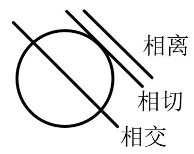
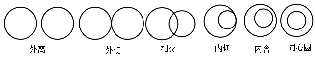

[TOC]

## 直线与圆

### 直线与方程

1.直线的倾斜角：当直线$l$与x轴相交时，取x轴作为基准，x轴正向与直线$l$向上方向组成的角$\alpha$叫做直线的倾斜角,规定如下：

- 当直线$l$与x轴重合时，倾斜角$\alpha=0^\circ$
- 当直线$l$与x轴垂直时，倾斜角$\alpha=90^\circ$
- 倾斜角范围：$0^\circ \leqslant  \alpha <180^\circ$

2.直线的斜率：把一条直线的倾斜角$\alpha$的正切值叫做这条直线的斜率，即$k= \tan \alpha (\alpha \neq \frac{\pi}{2})$。若经过两点$A(x_1,y_1),B(x_2,y_2)$的直线的斜率的公式为$k=\frac{y_2-y_1}{x_2-x_1}$或$k=\frac{y_1-y_2}{x_1-x_2}$,所以有如下结论：

- 当$ \alpha = 0$时，$ k = 0$,直线平行于x轴
- 当$0^\circ <  \alpha < 90^\circ$时，$ k > 0$，$\alpha$越大，斜率越大
- 当$ \alpha = 90^\circ$时，$ k$不存在，直线与y轴平行，与x轴垂直
- 当$90^\circ <  \alpha < 180^\circ$时，$ k < 0$
- 任何直线都有唯一倾斜角，但不是都有斜率

3.两条直线的位置关系：平行与垂直

- 平行：对于两条不重合的直线$l_1,l_2$,其斜率分别为$k_1,k_2$,有$l_1 // l_2$等价于$k_1=k_2$
- 垂直：对于两条直线$l_1,l_2$都有斜率，且分别为$k_1,k_2$,则有$l_1 \bot l_2$等价于$k_1k_2=-1$

4.直线与方程

- 点斜式：有直线的斜率$k$和直线上一点$(x_0,y_0)$,有直线方程为$y-y_0=k(x-x_0)$。当直线与y轴平行(与x轴垂直)，方程为$x=x_0$；当直线与y轴垂直(与x轴平行)，方程为$y = y_0$

- 斜截式：直线斜率$k$,且与y轴的交点为$(0,b)$,则直线的方程为$y-b=k(x-0)$,即$y = kx+b$。当直线与y轴平行时，$k$不存在不能用此公式

- 两点式：直线过点$(x_0,y_0),(x_1,y_1)(x_1 \neq x_2,y_1 \neq y_2)$,则直线方程为$\frac{y-y_1}{y_2-y_1}=\frac{x-x_1}{x_2-x_1}$,当直线斜率为0或不存在时，此公式不适用

- 截距式：对x的截距就是y=0时，x的值；对y的截距就是x=0时,y的值。截距就是直线与坐标轴的交点的横（纵）坐标。当对x轴的截距为$a$,对y轴的截距为$b$时，直线方程为$\frac{x}{a}+\frac{y}{b}=1$。不能表示过原点和与坐标轴平行或重合的直线

- 一般式：把$x,y$的二元一次方程$Ax+By+C=0$(A,B不能同时为0)，叫做直线的一般式方程。一般按照含x项、含y、常数项排列。无特殊说明时，最好写成一般式。

  $l_1:A_1x+B_1y+C_1=0,l_2:A_2x+B_2y+C_2=0$。

  - 当$l_1 // l_2:$$\frac{A_1}{B_1}=\frac{A_2}{B_2}$或$A_1B_2=A_2B_1$或$A_1B_2-A_2B_1=0$且$\frac{B_1}{C_1}\neq\frac{B_2}{C_2}$或$B_1C_2 \neq B_2C_1$，即：$\frac{A_1}{B_1}=\frac{A_2}{B_2} \neq \frac{C_1}{C_2}$

    当$\frac{B_1}{C_1} = \frac{B_2}{C_2}$,直线重合，即：$\frac{A_1}{B_1}=\frac{A_2}{B_2} = \frac{C_1}{C_2}$

  - 当$l_1 \bot l_2:$$\frac{A_1}{B_1}\frac{A_2}{B_2}=-1$或$A_1A_2+B_1B_2=0$，即：

  - $l_1,l_2$相交：$\frac{A_1}{B_1} \neq \frac{A_2}{B_2}$或$A_1B_2 \neq A_2B_1$(斜率不相等)

4.中点坐标式：点$A(x_1,y_1),B(x_2,y_2)$的中点坐标为$(x_0,y_0)$,且$x_0=\frac{x_1+x_2}{2},y_0=\frac{y_1+y_2}{2}$

5.两条直线的交点坐标：两条直线方程组成的方程组的解集（点集），$l_1:A_1x+B_1y+C_1=0,l_2:A_2x+B_2y+C_2=0$,解方程组
$$
\left\{\begin{matrix}
 &A_1x+B_1y+C_1=0 \\ 
 & A_2x+B_2y+C_2=0
\end{matrix}\right.
$$

- 唯一解：相交
- 无穷解：重合
- 无解：平行

6.两点间的距离：点$A(x_1,y_1),B(x_2,y_2)$间的距离为$\vert AB \vert = \sqrt{(x_2-x_1)^2+(y_2-y_1)^2}$

7.点到直线的距离：点$P(x_0,y_0)$到直线$Ax+By+C=0$的距离为$d = \frac{\vert Ax_0+By_0+C \vert}{\sqrt{A^2+B^2}}$

8.两条平行直线之间的距离：有平行直线$l_1:A_1x+B_1y+C_1=0,l_2:A_2x+B_2y+C_2=0$($C_1 \neq C_2$),则$l_1,l_2$之间的距离为$d = \frac{\vert C_2-C_1 \vert}{\sqrt{A^2+B^2}}$

9.对称性：有直线$Ax+By+C=0$，点$(x_0,y_0)$

- 直线、点关于x轴对称：$Ax-By+C=0$，$(x_0,-y_0)$
- 直线、点关于y轴对称：$-Ax+By+C=0$或$Ax-By-C=0$，$(-x_0,y_0)$
- 直线、点关于原点对称：$-Ax-By+C=0$或$Ax+By-C=0$，$(-x_0,-y_0)$
- 直线关于某点$(x_0,y_0)$对称的直线：$Ax+By+C_0=0(C_0 \neq C)$，点$(x_0,y_0)$到两条直线的距离相等，解出$C_0$
- 点关于直线$y = x$对称的点为$(y_0, x_0)$
- 点关于直线$y = -x$对称的点为$(-y_0, -x_0)$
- 某点$(x_0,y_0)$关于直线$Ax+By+C=0$对称的点$P_1(x_1,y_1)$：两个点到直线的距离相等；两点组成的直线和原直线垂直，斜率成绩为-1；两个点的中点位于直线上

### 圆与方程

1.圆的方程

- 圆的定义：平面内到定点的距离等于定长的点的集合。定点称为圆心，定圆的位置。动点和定点之间的定长距离为半径，定圆的大小
- 圆的标准方程：$(x-a)^2+(y-b)^2=R^2$，其中$(a,b)$为圆心的坐标，$R$为半径。当圆心为原点时，圆的方程为$x^2+y^2=R^2$。展开后是一个二元二次方程，且$x^2,y^2$系数相同（若不同，则肯定不是一个圆）
- 圆的一般方程：将标准方程展开，即$x^2+y^2+Dx+Ey+F=0$,变为标准方程为$(x+\frac{D}{2})^2+(y+\frac{E}{2})^2=\frac{D^2+E^2-4F}{4}$,圆心坐标$(-\frac{D}{2},-\frac{E}{2})$,半径$R=\frac{1}{2}\sqrt{D^2+E^2-4F}$
  - $D^2+E^2-4F>0$表示一个圆
  - $D^2+E^2-4F=0$表示一个点
  - $D^2+E^2-4F<0$不表示任何图形
- 轨迹法求圆的方程步骤：
  - 建立直角坐标系
  - 设点：设定点$C(a,b)$，动点$P(x,y)$,距离为$r$(限制条件)
  - 代入：$\sqrt{(x-a)^2+(x-b)^2}=r(r>0)$
  - 化简：$(x-a)^2+(x-b)^2=r^2(r>0)$

2.直线与圆的位置关系：根据交点个数分为相离、相切、相交，联立直线与圆的方程，判断解的个数（交点的个数），就可以确定位置

- 相离：直线与圆无交点$\Leftrightarrow$方程组无解$\Leftrightarrow$圆心到直线距离大于半径

- 相切：直线与圆仅有一个交点$\Leftrightarrow$方程组解唯一$\Leftrightarrow$圆心到直线距离等于半径

- 相交：直线与圆有两个交点$\Leftrightarrow$方程组解有两组$\Leftrightarrow$圆心到直线距离小于半径

  

3.圆与圆的位置关系：外离、外切、相交、内切、内含、同心圆，设圆心为$O_1、O_2$，半径为$R_1,R_2$($R_1>R_2$)有：

- 外离：圆心距离大于半径之和，无交点，即$\vert O_1O_2\vert> R_1+R_2$，4条公切线

- 外切：圆心距离等于半径之和，仅一个交点，即$\vert O_1O_2\vert = R_1+R_2$，3条公切线

- 相交：圆心距离小于半径之和，有两个交点，即$\vert O_1O_2\vert < R_1+R_2$，2条公切线

- 内切：圆心距离等于半径之差，仅一个交点，即$\vert O_1O_2\vert> R_1-R_2$，1条公切线

- 内含：圆心距离小于半径之差，即$\vert O_1O_2\vert> R_1-R_2$

- 同心圆：圆心距离为0，即$\vert O_1O_2\vert = 0$

  

关于两圆位置关系，在使用代数法时，如果方程组没有解（两圆没有交点）并不能推出外离，可能是内含

4.方程与交点计算：有直线$l:Ax+By+C=0$,圆$C_1:x^2+y^2+D_1x+E_1y+F_1=0$,$C_2:x^2+y^2+D_2x+E_2y+F_2=0$

- 过圆$C_1,C_2$的交点的直线方程：可以用两圆方程相减得到。即$(D_1-D_2)x+(E_1-E_2)y+F_1-F_2=0$
- 过圆$C_1,C_2$的交点的圆的方程：引入一个参数$\lambda$,$(x^2+y^2+D_1x+E_1y+F_1)+\lambda (x^2+y^2+D_2x+E_2y+F_2)=0$,确定了参数$\lambda$的值，该圆的方程即确定了

5.弦长公式：直线与圆相交时，两个交点之间的线段称为弦长，弦长$=\sqrt{1+k^2}\sqrt{(x_1+x_2)^2-4x_1x_2}$,推导过程如下：设直线方程为$y=kx+b$,与圆有交点$A(x_1,y_1),B(x_2,y_2)$,则弦长为$\vert AB \vert$,$\vert AB \vert = \sqrt{(x_1-x_2)^2+(y_1-y_2)^2}$,在把$y_1,y_2$用$x_1,x_2$表示，最终有如上的弦长公式。使用时，联立直线、圆的方程，消元(y)，得到关于$x$的一元二次方程，在使用韦达定理$x_1x_2=\frac{c}{a},x_1+x_2=-\frac{b}{a}$

