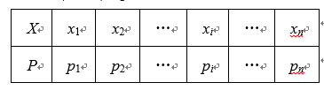
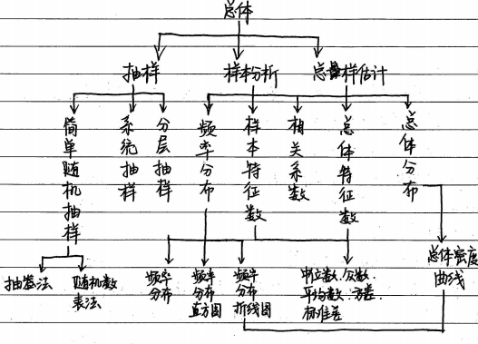
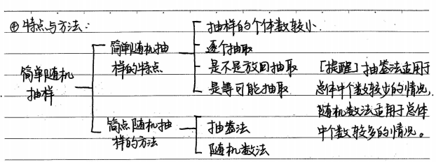
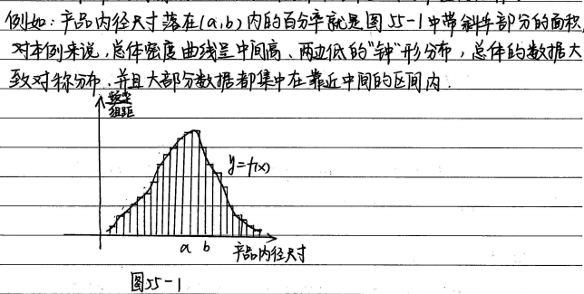
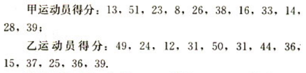
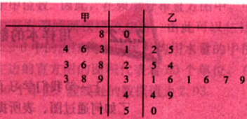

[TOC]

## 概率与统计

### 基本概念

1.确定事件和随机事件：

- 确实事件：
  - 必然事件：在条件S下，一定会发生的事件，概率为1
  - 不可能事件：在条件S下，一定不会发生的事件，概率为0
- 随机事件：在条件S下可能发生也可能不发生的事件。

2.频数、频率、概率：在相同的条件S下重复n次试验，观察某一事件A是否出现

- 频数：称n次试验中事件A出现的次数$n_A$为事件A出现的频数
- 频率：称事件A出现的比例$f_n(A)＝\frac{A_n}{n}$为事件A出现的频率
- 概率：由于事件A发生的频率$f_n(A)$随着试验次数的增加稳定于某个常数，在它附近摆动，就把这个常数叫做事件A的概率，记作$P(A)$，在$[0,1]$之间。其实是用频率$f_n(A)$来估计概率$P(A)$

频率与概率的区别与联系：随机事件的频率，指此事件发生的次数$n_A$与试验总次数n的比值$\frac{n_A}{n}$，它具有一定的稳定性，总在某个常数附近摆动，且随着试验次数的不断增多，这种摆动幅度越来越小。我们把这个常数叫做随机事件的概率，概率从数量上反映了随机事件发生的可能性的大小。频率在大量重复试验的前提下可以近似地作为这个事件的概率

2.事件关系与运算

- 包含关系：事件A与事件B,如果A发生，则B一定发生，这时称事件B包含事件A（或事件A包含于事件B），记作$B\supseteq A$（或$A\supseteq B$）
- 事件互斥：若$A\cap B$为不可能事件(A，B不同时发生)，则称事件A与事件B互斥，即$A\cap B=\emptyset  \Rightarrow$A与B互斥。互斥事件有三种可能是结果，1)A发生，B不发生;2)A不发生，B发生;3)A不发生，B也不发生
- 事件对立：若若$A\cap B$为不可能事件，$A\cup B$为必然事件(A，B不同时发生，但至少有1个发生)，则称事件A与事件B为对立事件。对立事件只有两种可能，1)A发生，B不发生;2)A不发生，B发生
- 并事件：若某事件发生当且仅当事件A或事件B发生，则称此事件为事件A与事件B的并事件（或和事件）
- 交事件：若某事件发生当且仅当事件A且事件B发生，则称此事件为事件A与事件B的交事件（或积事件）

事件中常见词语的含义：

- A，B中至少有一个发生的事件为A∪B
- A，B都发生的事件为AB
- A，B都不发生的事件为$\bar A \bar B$ 
- A，B恰有一个发生的事件为$A \bar B \cup \bar AB$
- A，B至多一个发生的事件为$A \bar B \cup \bar AB \cup \bar A\bar B$

3.概率的基本性质

- 如果事件A与事件B为互斥事件，则$P(A \cup B)=P(A)+P(B)$

- 如果事件A与事件B为对立事件，$P(A \cup B)=P(A)+P(B)=1$

- 若$A \subseteq B$,则$P(A)\leqslant P(B)$

4.条件概率：事件A发生的条件下，事件B发生的概率为$P(B \mid A) = \frac{n(AB)}{n(A)}=\frac{P(AB)}{P(A)}$

- $0 \leqslant P(B|A)\leqslant 1$
- 如果B和C是两个互斥事件，则$P(B \cup C \mid A)＝P(B \mid A)＋P(C \mid A)$

5.概率的一般加法公式：$P(A \cup C B)＝P(A)＋P(B)－P(A \cap B)$中

6.独立事件：设A，B为两个事件，如果$P(AB)＝P(A)P(B)$，则称事件A与事件B相互独立,性质如下：

- $P(B\mid A)＝P(B)，P(A\mid B)＝P(A)，P(AB)＝P(A)P(B)$
- A与$\bar B$，$\bar A$与B，$\bar A$与$\bar B$也都相互独立

### 古典概型

1.基本事件：一次实验可能出现的每一个结果，性质如下：

- 任何两个基本事件是互斥的
- 任何事件（除不可能事件）都可以表示成基本事件的和

2.古典概型：具有有限性和等可能性的概率模型称为古典概率模型（古典概型）

- 有限性：试验中所有可能出现的基本事件只有有限个
- 等可能性：每个基本事件出现的可能性相等

3.古典概型的概率计算：如果一次试验中的等可能基本事件有n个，那么每一个等可能基本事件发生的概率都是$\frac{1}{n}$,如果某个事件包含了m个等可能的基本事件，那么发生的概率是$\frac{m}{n}$,具体公式表示为：事件A发生的概率为$P(A)=\frac{A所包含的基本事件的个数}{总的基本事件个数}$

### 几何概型

1.几何概率模型：如果每个事件发生的概率只与构成该事件区域的长度（面积或体积）成比例，则称这样的概率模型为几何概率模型，简称几何概型。几何概型的概率公式：$P(A)=\frac{构成事件A的区域长度(面积、体积)}{实验的全部结果所构成的区域长度(面积、体积)}$，具有以下特点：

- 试验中所有可能出现的结果（基本事件）有无限多个
- 每个基本事件出现的可能性相等
- 几何概型中，线段的端点、图形的边框是否包含在事件之内不影响所求结果
- 易混淆几何概型与古典概型，两者共同点是基本事件的发生是等可能的，不同之处是几何概型中基本事件的个数是无限的，古典概型中基本事件的个数是有限的
- 

### 摸球、抽签的概率问题

1.抽样：有放回和无放回

- 有放回：拿出来一个球后，不放回去，继续拿。拿出来的那个球，下次还可能被拿出来
- 无放回：拿出来一个球后，放回去，继续拿。拿出来的球，不会再被拿到（相同的球除外）

### 二项分布

1.独立重复试验：在相同条件下重复做的n次试验，称为n次独立重复试验，$A_i(i＝1，2，…，n)$表示第i次试验结果，则$P(A_1A_2A_3…A_n)＝P(A_1)P(A_2)…P(A_n)$

2.二项分布：在n次独立重复试验中，用X表示事件A发生的次数，设每次试验中事件A发生的概率是p，此时称随机变量X服从二项分布，记作$X～B(n,p)$，并称p为成功概率，

- 在n次独立重复试验中，事件A恰好发生k次的概率为$P(X＝k)＝C_n^kp^k(1-p)^{n-k}(k＝0，1，2，…，n)$
- $E(X)＝np$
- $D(X)＝np(1-p)$

### 超几何分布

1.在含有M件次品的N件产品中，任取n件，其中恰有X件次品，则$P(X＝k)＝ ，k＝0，1，2，…，m$，其中$m＝min{M，n}$，且$n≤N，M≤N，n，M，N∈N*$，即如果随机变量X的分布列具有下表形式,则称随机变量*X*服从超几何分布

- 若X服从参数为N，M，n的超几何分布，则$E(X)＝\frac{nM}{N}$

### 正态分布

1.正态曲线的特点：

- 曲线位于x轴上方，与x轴不相交
- 曲线是单峰的，它关于直线*x*＝*μ*对称
- 曲线在*x*＝*μ*处达到峰值
- 曲线与*x*轴之间的面积为1
- 当*σ*一定时，曲线随着*μ*的变化而沿*x*轴平移
- 当*μ*一定时，曲线的形状由*σ*确定．*σ*越小，曲线越“瘦高”，表示总体的分布越集中；*σ*越大，曲线越“矮胖”，表示总体的分布越分散

2.正态分布的三个常用数据

- $P(\mu -\sigma＜X\leqslant \mu+\sigma ) \approx 0.6827$
- $P(\mu-2\sigma＜X\leqslant\mu+2\sigma)≈0.9545$
- $P(\mu-3\sigma＜X\leqslant \mu+3\sigma)≈0.9973$

### 离散型随机变量

1.离散型随机变量：随着试验结果变化而变化的变量称为随机变量。所有取值都可以一一列出的随机变量称为离散型随机变量（相对的是连续型随机变量）

2.离散型随机变量分布列：分布列表示法有列表法、等式法($P(\xi_i = x_i)=P_i,i=1,2,3,...,n$)、图像法等。若离散型随机变量X可能取的不同值为$x_1,x_2,...,x_n$，X取每一个值$x_i(i＝1,2,…,n)$的概率$P(X＝x_i)＝p_i$,下表称为离散型随机变量X的概率分布列，简称为*X*的分布列，有时为了表达简单，也用等式$P(X＝x_i)＝p_i(i＝1,2,…,n)$表示X的分布列

分布列性质如下：

- $P_i \geqslant 0,i = 1,2,3,...,n$
- $ \sum_{i=1}^{n} P_i = 1$

一般地，离散型随机变量在某一范围内取值的概率等于它取这个范围内各个值的概率之和

3.离散型随机变量X的均值与方差

- 均值$E(X)$：反映了离散型随机变量取值的平均水平,是一个实数,由X的分布列唯一确定。$E(X)=x_1p_1+x_2p_2+...+x_np_n$
- 方差$D(X)$：刻画了随机变量X与其均值$E(X)$的平均偏离程度。$D(X)= \frac{1}{n}\sum_{i=1}^{n} (x_i-E(X))$
- 标准差：方差的算术平方根$\sqrt{D(X)}$，是样本数据到平均数的一种距离，一般用s表示，考察的是样本数据的分散程度

均值和方差的性质：

- $E(aX＋b)＝aE(X)＋b(a，b为常数)$
- $D(aX＋b)＝a^2D(X)(a，b为常数)$

### 统计

1.总体、个体、样本、容量

- 总体：考查对象的某一数值指标的全体构成的集合看作是总体
- 个体：构成总体的对象叫做个体
- 样本：从总体中抽出一部分对象所组成的集合叫样本
- 容量：样本中对象的个数称为样本容量

2.简单随机抽样：一般地，设一个总体含有N个个体，从中逐个不放回的抽取n个个体作为样本$(n \leqslant N)$,若每次抽取时，总体内的各个个体被抽到的机会都相等，就把这种抽样方法叫简单随机抽样

最简单的随机抽样有：抽签法（抓阄发）、随机数法

从一个总体为N中抽出容量为n的样本，每个个体被抽到的概率为$\frac{n}{N}$,

3.系统抽样：当总体中的个体数较多时，将总体分为均衡的几个部分，然后按照预先定出的规则，从每一部分抽取1个个体，得到所需要的样本，这种抽样方法叫系统抽样，也叫等距抽样。特点如下：

- 适用于元素个数很多且均衡的总体
- 各个个体被抽到的机会相等
- 总体分组后，在起始部分采取的是简单随机抽样
- 若总体容量N能被样本n整除，则抽样间隔为$k=\frac{N}{n}$,若总体容量N不能被样本容量n整除，可随机地从总体中剔除余数，再按系统抽样的方法抽样

系统抽样步骤：编号-分段-确定起始的个体号-抽取样本

- 编号：先将总体的N个个体编号，有时可直接利用自身个体所带的号码，如学号、门牌号
- 分段：确定分段间隔k，对编号进行分段，当$\frac{N}{n}$是整数时，取$k=\frac{N}{n}$
- 确定起始的个体号：在第一段用简单随机抽样确定第一个个体编号i$(i \leqslant k)$
- 抽取样本：按照一定的规则抽取样本，通常是将i加上间隔k得到第二个个体编号（i+k），再加上k得到第三个个体编号（i+2k），依次进行下去，直到获取整个样本。

4.分层抽样：当已知总体由差异明显的几个部分组成，常将总体分成几部分，然后按照各部分所占的比例进行抽样，这种抽样叫分层抽样，其所成的各部分叫做层

利用分层抽样时，每一层按照它在总体中所占的比例进行抽取

5.用样本估计总体

- 频率分布：样本中所有数据（或数据组）的频数和样本容量的比就是该数据的频率，所有数据的频率的分布变化规律叫做频率分布，可用频率分布表、频率分布折线图、茎叶图、频率分布直方图来表示

- 频率分布折线图：连接频率分布直方图中各个小长方形上端的中点，就可以得到频率分布折线图

- 总体密度曲线：若样本容量很大，所分组数较多，图中表示的频率分布就越接近于总体在各个小组内所取的个数与总数比值的大小，设想若样本容量呢不断增大，分组的组距不断缩小，则频率分布直方图实际上是越来越接近于总体分布，他可以用一条光滑曲线$y=f(x)$来描绘，此曲线叫总体密度曲线。精确地反映了一个总体在各个区域内取值的规律，例如：
  
  - 
  
- 茎叶图：表示数据的两个突出优点，其一是统计图上没有原始数据的损失，所有信息都可以从这个茎叶图中得到；其二是在比赛时随时记录，方便纪录与表示。例子如下，茎是指中间的数，叶就是从茎的旁边生长出来的数，中间的数字表达得分的十位数，旁边的数字分别表示两个人得分的个位数

  

  

6.众数、中位数、平均数、方差、标准差

- 众数：在一组数据中，出线次数最多的数据叫做这组数据的众数
- 中位数：将一组数据按大小依次排序，把处在中间位置的一个数据（或中间两个数据的平均数）叫做这组数据的中位数
- 平均数：如果有几个数$x_1,x_2,...,x_n$,那么$\overline x=\frac{x_1+x_2+...+x_n}{n}$叫这几个数的平均数；如果在几个数中，$x_1$出现$f_1$次，$x_2$出现$f_2$次...$x_n$出现$f_n$次，这里$f_1+f_2+...+f_n=n$，那么$\overline x= \frac{1}{n}(x_1f_1+x_2f_2+...+x_nf_n)$叫做这几个数的加权平均值

7.标准差与方差：标准差用来考察样本数据的分散程度大小，是样本数据到平均数的一种平均距离，一般用S表示，方差用$S^2$表示。设一组数据$x_1,x_2,...,x_n$，则$S^2=\frac{1}{n}[(x_1-\overline x)^2+(x_2-\overline x)^2+...+(x_n-\overline x)^2]$

8.相关关系与函数关系

- 相同点：两者均是指两个变量的关系

- 不同点：1）函数关系是一种确定的关系，如匀速直线直线运动中时间与路程S的关系。相关关系是一种非确定的关系，如一块农田的水稻产量与施肥量之间的关系。事实上，函数关系是两个非随机应变的关系，而相关关系是非随机与随机变量的关系；2）函数关系是一种因果关系，而相关关系不一定是因果关系，也可能是伴随关系，例如有人发现对于在校儿童，鞋的大小与阅读能力有很强的相关关系，然而学会新词并不能使脚变大，而是涉及第三个因素——年龄，当儿童大一点，他们的阅读能力会提高，而且由于长大，脚也会比变大

9.散点图：散点组成的图，可以看出数据变化的趋势。

10.回归直线：散点图中的点分布从整体上看大致在一条直线附近，就称这两个变量之间具有线性相关关系，这条直线叫回归直线，回归直线的方程叫回归方程

11.最小二乘法：求回归直线的方法，使得样本数据的点到它的距离的平方和最小

10.相关性：正相关、负相关

