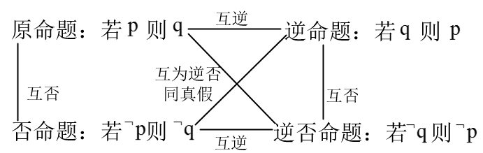

[TOC]

## 常用逻辑用语

1.命题及其关系：在数学中，我们把语言、符号或式子表达的，可以判断真假的陈述句叫做命题。判断为真的语句叫真命题，判断为假的语句叫假命题。“若p，则q”表示p为条件，q为结论

2.四种命题：原命题、否命题，逆命题，逆否命题。设原命题为若p，则q

- 原命题：若p，则q
- 逆命题：若q，则p（因果互换）
- 否命题：若$\neg p$,则$\neg q$（对原命题的题设和结论都否定）
- 逆否命题：若$\neg q$,则$\neg p$

真假性：原命题与逆否命题同真假；否命题与逆命题同真假

3.充分条件与必要条件：有“若p，则q”为真命题，是指由p通过推理可以的得出q，这时说p可推出q，记作$p\Rightarrow q$。并且说p是q的充分条件，q是p的必要条件。

例如$x>a^2+b^2 \Rightarrow x > 2ab$,就说$x>a^2+b^2$是$x>2ab$的充分条件，$x>2ab$是$x>a^2+b^2$的必要条件

- $p \Rightarrow q, q  \nRightarrow p$,则p是q的充分不必要条件（q的充分不必要条件是p）
- $p \nRightarrow q, q  \Rightarrow p$,则p是q的必要不充分条件（q的必要不充分条件是p）
- $p \nRightarrow q, q  \nRightarrow p$,则p是q的既不充分也不必要条件

4.充要条件：是充分必要条件的简称，指既有$p \Rightarrow q$,又有$q \Rightarrow p$,记作$p\Leftrightarrow q$,此时说p是q的充分必要条件，显示q也是p的充分必要条件。即，若$p\Leftrightarrow q$,则p，q互为充要条件

5.逻辑联结语

- 且：符号$\land$,都为真结果才为真，$p\land q$,一假则假，全真则真
- 或：符号$\lor$,只要有一个真结果结果就为真，$p\lor q$,一真则真，全假则假

6.量词：全称量词和存在量词

- 全称量词：符号$\forall$，表示所有的、任意一个。带有全称量词的命题为全称命题，例如$\forall x\in A,P(x)$成立
- 存在量词：符号$\exists$,表示存在一个、至少一个。带有存在量词的命题为特称命题。例如$\exists x_0 \in A,P(x)$成立

7.含有一个量词的命题否定

- 否命题：对原命题的题设和结论都否定
- 命题的否定：值否定命题的结论
- 量词互换，即$\forall,\exists$互换

