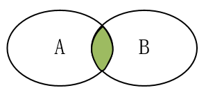

# 高中数学_笔记

[TOC]

## 集合

### 集合的概念

**1.**集合的定义

　　一般地，把研究对象统称为**元素**(element)，把一些元素组成的总体叫做**集合**(简称**集**)。通常，使用小写字母a,b,c...等表示元素，使用大写字母A,B,C...等表示集合。

集合的另一种表述：集合是指具有某种特定性质的具体的或抽象的对象汇总而成的集体。其中，构成集合的这些对象则称为该集合的元素

常见数集

|       集合       |                   描述                   |        举例        |
| :--------------: | :--------------------------------------: | :----------------: |
| $N^{*}$或$N_{+}$ |      正整数集：所有正整数组成的集合      |     1,2,3,4...     |
|       $N$        | 自然数(非负整数)：全体非负整数组成的集合 |     0,1,2,4...     |
|       $Z$        |        整数集：全体整数组成的集合        | ...，-1，0,1，.... |
|       $Q$        |         有理数集：全体有理数组成         |                    |
|       $R$        |           实数集：全体实数组成           |   有理数和无理数   |

**2.**元素与集合的关系

　　元素与集合的关系有且仅有属于和不属于两种，并且二者必居其一。不存在模棱两可，可能属于也可能不属于的情况(三要素的确定性)

- 属于：元素a属于集合A，符号表示为 $a\in A$，该符号具有方向性，左边的元素，右边是集合，例如$A\in a$是错误的表示形式
- 不属于：元素a不属于集合A，符号表示为$a\notin A$

**3.**集合的表示

使用花括号{}表示集合：

- 自然语言：使用自然语言描述，例：高一二班全体同学
- 列举法：把每一个元素都写在花括号里面，元素之间使用逗号，隔开，适用于元素个数少，且不好用数学语言(公式、表达式)描述的集合。例如：$｛1,2,10,11｝$
- 描述法：使用一个字母表示这个集合中的元素，再加上描述该元素的数学表达式(共同特征)，中间使用竖线隔开。例如：$｛x\mid 1<x<2｝$，表示为全体大于1且小鱼2的实数。如果元素有其他约束，在表达式后面加上即可：$｛x\mid 1<x<10, x\in Z｝$表示1到10之间的整数
- 区间法：使用区间的形式表示，和描述法有些类似，$｛x\mid 1<x<2｝$ 表示为$(1, 2)$
- 韦恩图(Venn diagram)：不太严格的意义下用以表示集合的一种草图。草图，用圈/方框等表示集合，点等表示集合中的元素。Venn 图表示的元素一般是有限个的，如果元素个数无限且连续可以使用数轴法
- 数轴法：使用数轴表示

列举一些描述法：

- $A = \lbrace x  \mid   f(x) = 0\rbrace$：表示方程$f(x) = 0 $的解集

- $A = \lbrace x  \mid  y = f(x)\rbrace$：表示方程$y= f(x) $的x的范围（定义域）

- $A = \lbrace y  \mid  y = f(x)\rbrace$：表示方程$y= f(x)$的y的范围（值域）

- $A = \lbrace (x, y)\mid y = f(x) \rbrace$：表示方程$y= f(x)$的图像上所有的点

**4.**集合三要素

　　集合三要素指的是：任何一个集合，都要满足的条件(三条)。如果不满足(即使是一条)，那就不是集合。

- 确定性：指a要么属于A，要么不属于A。不存在模棱两可的情况，必有一个明确的判断依据。例如
  - 张三一米八，是高个子：错，没有明确高个子范围
  - 张三一米八，身高高于等于一米八的算是高个子，张三是高个子：对
- 互异性：集合中没有相同的元素。例如：$｛1,2,2｝$为错误的，因为有两个相同的元素
- 无序性：集合中元素的顺序对集合没有影响，一个集合的元素可以写成不同顺序。例如：$｛1,2,3｝$和$｛1,3,2｝$表示同一个集合。

**5.**集合的分类：集合可以根据元素的个数或元素的种类分类(或者其他因素)

- 根据元素个数分为：空集和非空集
  - 空集：不含有任何元素的集合，符号表示为：$\varnothing$(发音fai)
  - 非空集：集合中有元素的集合
- 根据元素种类可以分为：数集、点集等等

  - 数集：集合中的元素是数，例：$｛1,2,3,4｝$
  - 点集：集合中的元素是点，例：$｛（1,2）， （2,3）｝$

注意：$\varnothing$和$｛0｝$是不同的集合

### 集合间的基本关系

**1.**子集：一般地，对于两个集合A,B,如果集合A中任意一个元素都是集合B中的元素，我们就说这两个集合有包含关系，称集合A为集合B的**子集**，记作：$A\subseteq B$(或$B\supseteq A$)。读作：A含于B或B包含A。

　　使用数学语言描述子集关系：${\forall}a\in A,都有a \in B，则A\subseteq B$，对A中任意元素，都属于B，则A是B的子集。

　　根据定义，有两种情况：B中元素比A中多、A和B中元素完全一样，使用venn图表示如下：

其中：A可以是空集。当$A\subseteq B$，A是B的子集，有以下三种可能情况：

- A和B都非空，A是B的一部分
- A和B相同(相等、同一集合)，所以有“任何一个集合都是它自身的子集”
- A是空集

任何集合是它自身的子集。

如果集合A,B,C，满足$A\subseteq B$,$B\subseteq C$,则有$A\subseteq C$,传递性

2.真子集：如果$A\subseteq B$，但是存在元素$x\in B$，且$x\notin A$，我们称集合A是集合B的真子集，记作：$ A\subsetneqq B$（或$B\supsetneqq A$）

　　集合B的元素必然比集合A的元素多。

**3.**相等集合：A、B中的元素完全一样，则A与B相等，记作：$A=B$。严格表述为：A是B的子集，且B也是A的子集，则$A=B$

**4.**空集的扩展：空集是不含有任何元素的集合，有如下规定结论：

- 空集是任何集合的子集（空集是空集的子集）
- 空集是任何非空集合的真子集

**一些结论：**

　　如果一个集合有n的元素，则：

- 有$2^{n}$个子集（包括空集和自身）
- 有$2^{n}-1$个真子集（包括空集，不包括自身）
- 有$2^{n}-1$个非空子集（不包括空集，包括自身）
- 有$2^{n}-2$个非空真子集（不包括空集，不包括自身）

　　以上结论可以列举出，如下列出集合$｛1,2｝$的子集、真子集：

- 子集：$\varnothing$，$｛1｝$，$｛2｝$，$｛1,2｝$共4个
- 真子集：$\varnothing$，$｛1｝$，$｛2｝$共3个，排除掉自己本身
- 非空子集：$｛1｝$，$｛2｝$，$｛1,2｝$共３个，去掉空集
- 非空真子集：$｛1｝$，$｛2｝$共２个，排除掉自己本身和空集

### 集合的基本运算

**1.**并集：一般地，由所有属于集合A或属于集合B的元素所组成的集合，称为集合A与B的并集，记作：$A \cup B$，读作“A并B”。

即：$A \cup B=\lbrace x\mid x\in A, 或 x\in B\rbrace$

venn图表示如下：

一些结论如下：

- $A\cup B = B \cup A$（交换律）
- $(A\cup B )A\cap C = (A\cap C)\cup(B\cap C) $（分配率）
- $A\cup A= A$
- $A\cup \varnothing = \varnothing \cup A = A$
- 若$A\subseteq B$，则$A\cup B = B$
- 若$A\cup B = B$，则$A\subseteq B$

**2.**交集：一般地，由属于A且属于B的所有元素组成的集合，称为A与B的交集，记作：$A \cap B$，读作“A交B”，即：$A \cap B=\lbrace x \mid x\in A,且x\in B\rbrace$

venn图如下：

一些结论如下：

- $A \cap B = B \cap A$（交换律）
- $(A\cap B )A\cup C = (A\cup C)\cap(B\cup C) $（分配率）
- $A \cap A= A$
- $A\cap \varnothing = \varnothing \cap A = \varnothing$
- 若$A\subseteq B$，则$A \cap B = A$
- 若$A \cap B = A$，则$A\subseteq B$
- $A \cap B \subseteq A\cup B$

**3.**补集：一般地，如果一个集合含有我们所研究问题中所涉及的所有元素，那么就称这个集合为全集，通常记作$U$。对于一个集合A，由全集$U$中不属于A的所有元素组成的集合称为A相对于全集$U$的补集，简称为集合A的补集，记作：$\complement_UA$，即：$\complement_UA=\lbrace x\mid x\in U,且x\notin A\rbrace$,

就是在U中把A挖掉，剩下的部分，venn图如下：

一些结论如下：

- $(\complement_UA)\cap A = \varnothing$
- $(\complement_UA)\cup A = U$ 
- $\complement_UU = \varnothing$
- $\complement_U \varnothing = U$
- $\complement_U(\complement_UA) = A$
- $(\complement_UA)\cup(\complement_UB) = \complement_U(A\cap B)$
- $(\complement_UA)\cap(\complement_UB) = \complement_U(A\cup B)$
- $(\complement_UA)\cup(\complement_UA)\cup(\complement_UA)=\complement_U(A\cap B\cap C)$

**其他相关结论**

- 一般地，对任意两个有限集合A、B，有：$card(A\cup B)=card(A)+card(b)-card(A\cap B)$，card(A)表示集合A中元素个数

- 一般地，对任意两个有限集合A、B，有：

  $card(A\cup B\cup C)=card(A)+card(B)+card(C)-card(A\cap B)-card(A\cap C)-card(B\cap C)+card(A\cap B\cap C)$

### 一元二次方程解法

形如$ax^2+bx+c>0$或者$ax^2+bx+c<0(a \neq 0)$的不等式称为一元二次不等式，解一元二次不等式可以转化为一元二次方程$y=ax^2+bx+c(a \neq 0)$中y的取值范围（值域），即函数图像在y上面还是y轴下面。$y=ax^2+bx+c(a > 0)$的图像和不等式解集如下：

|                     |                        $\triangle >0$                        |                        $\triangle =0$                        |                        $\triangle <0$                        |
| ------------------- | :----------------------------------------------------------: | :----------------------------------------------------------: | :----------------------------------------------------------: |
| $y=ax^2+bx+c(a >0)$ |  |  |  |
| $y=0$               |                 两个不相等的实数根$x_1,x_2$                  |           两个相等的实数根$x_1=x_2=-\frac{b}{2a}$            |                           无实数根                           |
| $y>0$               |         解集为$\lbrace x \mid x>x_2或x<x_1  \rbrace$         |     解集为$\lbrace x \mid x \neq -\frac{b}{2a} \rbrace$      |                             $R$                              |
| $y<0$               |          解集为$\lbrace x \mid x_1<x<x_2  \rbrace$           |                      无解$\varnothing$                       |                      无解$\varnothing$                       |
| 最小值              |                     $y=f(-\frac{b}{2a})$                     |                     $y=f(-\frac{b}{2a})$                     |                     $y=f(-\frac{b}{2a})$                     |
|                     |                                                              |                                                              |                                                              |

说明：

- 若$a < 0$,则开口向下，相关结论取反也适用
- 若$y\leqslant 0,y\geqslant 0$，则x范围也相应取等号

### 绝对值不等式

1.公式法

- $\vert x \vert >a(a>0)$的解集为：$\lbrace x \mid x>a,或x<-a \rbrace$
- $\vert x \vert <a(a>0)$的解集为：$\lbrace x \mid -a<x<a \rbrace$
- $x^2>a(a>0)$的解集为：$\lbrace x \mid x>\sqrt{a},或x<-\sqrt{a} \rbrace$
- $x^2<a(a>0)$的解集为：$\lbrace x \mid -\sqrt{a}<x<\sqrt{a} \rbrace$

2.图像法：要掌握常见函数的图像

|            函数            | 图像 |
| :------------------------: | :--: |
|    $y = \vert x  \vert$    |      |
| $y = \vert x \pm a  \vert$ |      |
| $y =log_a \vert x  \vert$  |      |
| $y =\vert log_a x  \vert$  |      |
|   $y = \vert a^x  \vert$   |      |
|   $y =a^{\vert x \vert}$   |      |

## 函数

### 函数基本概念

1.函数：设A，B是非空的数集，如果按照某种确定的对应关系$f$，使对于集合A中的任意一个数$x$，在集合B中都有唯一确定的数$f(x)$和它对应，那么就称$f:A\rightarrow B$为从集合A到集合B的一个函数，记作$y=f(x),x \in A$。

- 定义域：$x$叫做自变量，$x$的取值范围A叫做函数的定义域
- 值域：与$x$的值相对应的$y$值叫做函数值，函数值的集合$\lbrace f(x) \mid x \in A  \rbrace$叫做函数的值域
- $x$叫做自变量，y是因变量
- $f(x)$叫做函数，$f(a)$是$x=a$时，函数$f(x)$的值，是一个常量
- 对应关系：A到B中，可以一对一、多对一，不可一对多，例如$x^2+y^2=1$不叫函数
- 函数的本质是一种对应关系
- 基本初等函数：幂函数、指数函数、对数函数、三角函数、反三角函数（高中不涉及）

2.函数三要素：定义域、值域、对应关系

3.函数表示方法

- 解析法：数学表达式表示两个变量之间的关系（函数关系更清晰），例如：$y=x$
- 列表法：把两个量的对应值列成表格来表示函数关系
- 图像法：用图像表示两个变量之间的对应关系（直观的看到自变量与函数值的变化趋势）

4.分段函数：函数在定义域的不同子集上，因对应关系不同而分别用几个不同的式子来表示，分段函数虽然由几个部分组成，但它表示的仍是一个函数。

- 定义域：是各段定义域的并集
- 值域：是各段值域的并集

5.函数相等：三要素相同。其实只要定义域相同并且对应关系完全一致，就可以说两个函数相等（值域必然相同）

6.区间：表示数集中元素的范围，和用集合表示是等价的。圆括号表示取不到，开区间，但是无限接近。方括号表示可以取到，闭区间。

- $(a,b)$：表示数a到b中所有的数，$\lbrace x \mid a< x <  b  \rbrace$，不包括a和b。左开右开
- $[a,b]$：表示数a到b中所有的数，$\lbrace x \mid a\leqslant  x \leqslant   b  \rbrace$，包括a和b。左闭右闭
- $(a,b]$：表示数a到b中所有的数，$\lbrace x \mid a< x \leqslant   b  \rbrace$，不包括a,包括b。左开右闭
- $[a,b)$：表示数a到b中所有的数，$\lbrace x \mid a\leqslant  x <  b  \rbrace$，包括a不包括b。左闭右开
- $[a,+\infty)$：$\lbrace x \mid x\geqslant  a   \rbrace$，$\infty$表示无穷大，$+\infty$表示正无穷大；$-\infty$表示负无穷大。无穷大不能是闭区间，是取不到的。可以理解为很大，比我们见到的任何一个数都大
- $(-\infty,+\infty)$：实数集

7.映射：设A，B是两个非空集合，如果按某一个确定的对应关系$f$，使对于集合A中的任意一个元素$x$，在集合B中都有唯一确定的元素y与之对应，那么就称对应$f:A\rightarrow B$为从集合A到集合B的一个映射。映射是有方向的。

- 函数和映射的区别：函数是非空数集，映射是非空集合即可
- 映射是函数的推广，函数是特殊的映射
- 映射可以多对一、一对一，不可一对多
- A中元素叫原象，B中元素叫象。映射中，A中元素不能有剩余，B中可以剩。即所有原象都有对应的象，而象不一定有原象
- 一一映射：一对一，A，B都不能剩
- A中元素m个，B中元素n个，从A到B的映射有$n^m$个

8.求函数定义域：需要注意各个部分的x的取值范围，注意：

- 分式中分母不为0
- 偶次方根内式子非负（大于等于0）
- 指数幂的指数为0时，底数不能为0，即$x^0$中，$x \neq 0$
- 当函数由有限个基本初等函数的和、差、积、商组成时，定义域是使各个式子都有意义的公共部分的集合
- 注意：凡是函数的定义域，都是指自变量的取值范围，而不是与x有关的式子的范围

9.值域：函数值的范围。求值域有换元法、分离常数法、反解法等等。要掌握常见函数的值域

10.函数的解析式：函数的两个变量之间的对应关系用一个数学表达式来表示

- 待定系数法
- 图像法
- 换元法或配凑法
- 解方程组
- 赋值法

### 函数的单调性

1.单调性：函数在某个区间是增函数或是减函数，就说函数在这个区间具有单调性。设函数$f(x)$在定义域$I$上，如果对于定义域内某个区间D上的任意两个自变量$x_1,x_2$

- 增函数：当$x_1<x_2$时，都有$f(x_1)<f(x_2)$,则$f(x)$在区间D上的增函数。x越大，函数值越大
- 减函数：当$x_1<x_2$时，都有$f(x_1)>f(x_2)$,则$f(x)$在区间D上的减函数。x越大，函数值越小

2.函数单调区间的定义：如果函数在区间D上是增函数，那么就说函数在这一区间具有严格的单调性，区间D叫做函数的单调区间。

- 当函数有多个增区间时，不能使用$"\cup"$连接，用$","$或"和"连接。
- 单调区间如果有多个，应分别写，不能用$"\cup"$，不能用“和”。只能用区间表示，不能用集合或不等式表示。

3.单调性判别：注意基本函数的单调性：幂函数、指数函数、对数函数、三角函数、反三角函数

- 定义法
- 如果函数是恒正或者恒负，可以做商再与1比较
- 函数在某区间上递增$\Longleftrightarrow$在区间上任取$x_1,x_2$,若$x_1<x_2$,则$f(x_1)<f(x_2)$$\Longleftrightarrow$$[f(x_1)]-f(x_2)]\cdot (x_1-x_2)>0$$\Longleftrightarrow$$\frac{f(x_1)-f(x_2)}{x_1-x_2}>0$
- 函数在某区间上递减，同上

4.一些结论：

- 函数$y=f(x)$与函数$y=-f(x)$单调性相反

- 函数$y=f(x)$与函数$y=f(x)+C$(C为常数)单调性相同
- 函数$y=cf(x)$,当$c>0$时，与函数$y=f(x)$单调性相同；当$c<0$时，与函数$y=f(x)$单调性相反
- 若函数$y=f(x)$在区间D上恒为正数或恒为负数，且具有单调性，则在D上$\frac{1}{f(x)}$与函数$y=f(x)$单调性相反
- 若函数$y=f(x) \geqslant 0$，则$y=\sqrt{f(x)}$与函数$y=f(x)$单调性相同
- 在公共定义域内，增函数+增函数=增函数，减函数+减函数=减函数，增函数-减函数=增函数，减函数-增函数=减函数
- 符合函数单调性：设$y=f(t)$,$t = g(x)$,则函数$y=f(g(x))$叫复合函数，单调性为“同增异减”，即内外两层复合函数单调性相同时，复合函数为增函数；单调性相反时，复合函数为减函数

### 函数的奇偶性、周期性

1.函数奇偶性：具有奇偶性的函数定义域关于原点对称，若不对称，则肯定非奇非偶。

- 偶函数：对于函数$f(x)$的定义域内任意一个$x$,都有$f(-x)=f(x)$
- 奇函数：对于函数$f(x)$的定义域内任意一个$x$,都有$f(-x)=-f(x)$

2.奇偶函数的性质：在做奇偶性概念判别问题时候，可以使用奇函数$x$和偶函数$x^2$做快速判别

- 偶函数：$f(-x)=f(x)$,定义域关于原点对称，图像关于y轴对称
- 奇函数：$f(-x)=-f(x)$,定义域关于原点对称，图像关于原点对称。

- 若奇函数在原点处有定义，则必有$f(0)=0$(过原点)
- 若函数既满足奇函数定义，又满足偶函数的定义，则这个函数既是奇函数也是偶函数。有且只有一类函数，即$f(x)=0$
- 偶函数满足$f(-x)=f(x)=f(\vert x \vert)$
- 奇函数在两个对称区间上，具有相同的单调性；偶函数在两个对称区间，具有相反的单调性
- 如果定义域不关于原点对称，那么肯定不存在奇偶性
- 在公共定义域关于原点对称条件下，奇偶函数运算结果函数，可以使用奇函数$x$和偶函数$x^2$做快速记忆
  - 偶函数$\pm$偶函数=偶函数，偶函数$*$偶函数=偶函数
  - 奇函数$\pm$奇函数=奇函数，奇函数$*$奇函数=偶函数
  - 奇函数$*$偶函数=奇函数

3.周期性：函数具有周期性变化，对于函数在定义内，如果满足$f(x)=f(T+x)$,则函数$f(x)$是周期函数，$T$周期。在所有周期中，最小的正数T叫最小正周期。具有如下性质：

- $f(x+T)=T$,周期为$T$
- $-f(x)=f(x+a)$,周期为$2a$
- $f(x+a)=\pm \frac{1}{f(x)}$,周期为$2a$
- 若函数具有奇偶性，并且有一条非$x=0$的对称轴，那么定是周期函数

### 指数、指数幂的运算、指数函数

1.n次方根：一般地，如果$x^n=a$,那么x叫做a的n次方根，其中$n>1$,且$n \in N^*$

- 平方根：若$x^2=a$,那么x叫做a的平方根。正数的平方根有2个，0的平方根是0，负数没有平方根
- 立方根：若$x^3=a$,那么x叫做a的立方根。正数有一个正的立方根，0的立方根是0，负数有一个负的立方根
- 即当n为奇数时，$x=\sqrt[n]{a}$(a可正可负，x与a同号)；当n为偶数时，$x=\pm \sqrt[n]{a}$(a>0)

2.根式运算性质：$\sqrt[n]{a}$叫做根式，a叫做被开方数，n叫做根指数

- $(\sqrt[n]{a})^n=a$
- $(\sqrt[n]{a})^n$：n为奇数时候，结果为a；n为偶数时，结果为$\vert a \vert$。$a>0$时，为a；$a<0$时，为$-a$

3.指数幂运算：

- 0的分数指数幂为0,0的负分数指数幂没有意义
- $a^{\frac{m}{n}}=\sqrt[n]{a^m}$,(其中$a>0,m,n \in N^*,n>1$)
- $a^{-\frac{m}{n}}=\frac{1}{a^{\frac{m}{n}}}$,(其中$a>0,m,n \in N^*,n>1$)
- $a^ra^s=a^{r+s}$,$\frac{a^r}{a^s}=a^{r-s}$($a>0,r,s\in Q$)
- $(a^r)^s=a^{rs}$,($a>0,r,s\in Q$)
- $(ab)^r=a^rb^r$,($a>0,b>0,r \in Q$)

4.指数函数：一般，形如$y=a^x$,($a>0,a \neq 1$)的函数叫做指数函数，其中，a叫做底数，x是自变量，函数的定义域是R。（$y=a^x+1$不叫指数函数）

5.指数函数的图像和性质

- 指数函数图像如下：

  

- 定义域：R

- 值域：$(0, +\infty)$

- 过定点：$(0,1)$

- 单调性：a>1时，在R上的增函数；0<a<1时，在R上的减函数

- 图像画法：横过定点，单调性，值域。同时要抓住三个关键点：$(1,a),(0,1),(-1,\frac{1}{a})$

- 指数函数的图像陡峭程度与底数大小的关系：有指数函数$y = 2^x$、$y = 3^x$、$y = {\frac{1}{2}}^x$、$y = {\frac{1}{3}}^x$,图像如下

  

  - 当底数$a>1$时，底数越大，越陡峭
  - 当底数$0<a<1$时，底数越小，越陡峭
  - 方法：可以画一个条$x=1$的直线，对应的是的$a^x=a^1=a$

- 指数函数$y=a^x$与$y={(\frac{1}{a})}^x(a>0,a \neq 1)$的图像关于y轴对称

- $y=a^x+a^{-x}$为偶函数；$y=a^x-a^{-x}$为奇函数

- $y=a^{\mid x  \mid}$为偶函数，图像如下：

### 对数、对数的运算、对数函数

1.对数：一般地，有函数$a^x=N$($a>0,a \neq 1$),则数x叫做以a为底N的对数，记作$x=\log_aN$，其中a叫做对数的底数，N叫做真数

- 底数的限制：$a>0,a \neq 1$,真数的限制：$N>0$(真数是这个指数函数的值域)
- 0和负数没有对数
- 常用对数：以10为底的对数$\log_{10}N$，简记为$\lg_{}N$
- 自然对数：以$e\approx 2.71828....$,为底的对数$\log_{e}N$,记作$\ln_{}N$

2.一些公式

- $\log_aa=1$，$\log_a1=0$
- 对数恒等式 $a^{\log_aN}=N$
- $\log_a{a^n}=n$
- 如果$a>0,a \neq 1,M>0,N>0$，则有如下公式：
  - $\log_a{M \cdot N}=\log_aM+\log_aN$,注意：$\log_a{10}=\log_a-2+\log_a-5$不成立
  - $\log_a{\frac{M}{N}}=\log_aM-\log_aN$
  - $\log_a{M^n}=n\log_aM$,注意$\log_a{-10^2}=2\log_a-10$不成立
- 换底公式：$\log_ab = \frac{\log_cb}{\log_ca}$$(a>0,a \neq 1,b>0,c>0,c \neq 1$),推论如下：
  - $\log_ab=\frac{1}{\log_ba}$,$\log_ab \log_ba=1$
  - $\log_{a^m}{b^n}=\frac{n}{m}\log_ab$

3.对数函数：一般地，把函数$y=\log_ax (a>0,a \neq 1)$,叫做对数函数，其中$x$是自变量，函数的定义域是$(0,+\infty)$。

- 对数函数的概念与指数函数类似，都是形式定义，需要判别。如：$y=2\log_2x,y=\log_2{\frac{x}{5}}$都不是对数函数，可以称为对数型函数
- 对数函数$y=\log_ax $与指数函数$y=a^x(a>0,a \neq 1)$互为反函数。互为反函数的两个函数图像关于直线$y=x$对称
- $y = a^x$与$x=\log_ay$的图像是相同的，只是习惯用x表示自变量，y表示因变量，把$x = \log_ay$换成$y = \log_ax$,$y = \log_ax$才与$y = a^x$关于直线$y=x$对称，因为点$(a,b)$与点$(b,a)$关于直线$y=x$对称

4.对数函数的图像与性质

- 对数函数的图像如下：

  

- 定义域为$(0,+\infty)$,值域为$R$

- 图像过定点$(1,0)$

- 当$a>1$时，为增函数；当$a<1$时，为减函数

- $y=\log_ax $与$y=\log_{\frac{1}{a}}x $的图像关于x轴对称

- 对数函数的图像陡峭程度与底数大小的关系：有对数函数$y=\log_2x$,$y=\log_3x$,$y=\log_{\frac{1}{2}}x$,$y=\log_{\frac{1}{3}}x$,图像如下：

  - 当底数a>1时，底数越大，图像越接近x轴
  - 当底数0<a<1时，底数越小，图像越接近x轴
  - 方法：画一条$y = 1$的直线，有$y=\log_ax=1,$则$x=a$

### 幂函数

1.幂函数：一般地，形如$y=x^\alpha$的函数叫做幂函数，其中x是自变量，$\alpha$是常数。注意，幂函数的的系数只能是1，底数只能是x，指数只能是常数，否则不能称之为幂函数

2.幂函数的图像与性质

- 在同一平面直角坐标系中，幂函数$y = x$,$y = x^2$,$y = x^3$,$y = x^{\frac{1}{2}}$,$y = x^{-1}$的图像如下图

  

- 一般幂函数的图像特征：
  - 所有幂函数在$(0,+\infty)$上都有定义，并且图像都经过点$(1,1)$；在第四象限一定没有图像，因为$x>0$时，y一定大于0
  - 当$\alpha>0$时,幂函数的图像通过原点，即图像一定经过点$(0,0),(1,1)$,并且在区间$[0,+\infty)$上是增函数。特别地，当$\alpha>1$时，幂函数的图像下凹；当$0<\alpha <1$时，幂函数的图像下凸
  - 当$\alpha < 0$时,幂函数的图像在区间$(0,+\infty)$上是减函数，不过$(0,0)$点,过点$(1,1)$
  
- 在第一象限，作直线$x=1$,则在直线$x=1$的右侧，幂指数越大，图像越高

### 反函数

1.反函数：一般来说，设函数$y=f(x)(x∈A)$的值域是C，若找得到一个函数$g(y)$在每一处$g(y)$都等于x，这样的函数$x= g(y)(y∈C)$叫做函数$y=f(x)(x∈A)$的反函数，记作$x=f^{-1}(y)$ 。反函数$x=f^{-1}(y)$的定义域、值域分别是函数$x=f^{-1}(y)$的值域、定义域。最具有代表性的反函数就是对数函数与指数函数。

可以理解为互为反函数的两个函数，其中一个定义域是另一个的值域，值域是另一个的定义域

2.反函数的性质

- 它们的图像关于$y = x$对称
- 若点$(x,y)$在$y=a^x$上，则点$(y,x)$在$y=\log_ax$上

3.一些函数的反函数

- 指数函数$y=a^x$与对数函数$y=\log_ax$

### 函数的图像（平移、变换、拉伸压缩）

1.函数图像的作法：

- 描点法：列表、描点、连线

2.函数图像变换

- 平移变换：向上或者下平移h个单位
- 对称变换：关于原点、x轴、y轴对称
- 翻折变换：x上方翻到下方，或者下方翻到上方；y轴翻折
- 压缩变换：
- 拉伸变换：

### 方程的根与函数的零点

1.函数的零点：对于函数$y=f(x),$我们把使$f(x)=0$的实数x叫做函数$y=f(x)$的零点。零点是实数，是一个数，不是点

2.几个等价关系：方程$f(x)=0$有实根$\Longleftrightarrow$函数$y=f(x)$的图像与x轴有交点$\Longleftrightarrow$函数$y=f(x)$有零点

3.函数零点的判定(零点存在定理)：如果函数$y=f(x)$在区间$[a,b]$上的图像是连续不断的一条曲线，并且有$f(a)f(b)<0$,那么函数$y=f(x)$在区间$[a,b]$内有零点，即存在$c \in (a,b)$,使$f(c)=0$,这个c就是方程的根

- 不能满足这个定理时，不能说就没有零点
- 满足这个条件，也可能不止一个零点
- 方程的“根”与函数的“零点”有关系，但是不是完全相同，不能混为一谈。例如方程$x^2-2x+1=0$有两个实根，但是函数$y=x^2-2x+1$只有一个零点

4.二分法求方程的近似解：对于区间$[a,b]$上连续不断且$f(a)f(b)<0$的函数$y=f(x)$，通过不断地把函数$f(x)$的零点所在的区间一分为二，使区间的两个端点逐步逼近零点，进而得到零点近似值的方法叫做二分法。给定精确度$\xi$，用二分法求函数$f(x)$的零点近似值的步骤如下：

- 确定区间$[a,b]$，验证$f(a)f(b)<0$,给定精确度$\xi$
- 求区间$(a,b)$的中点，
- 计算$f(c)$,若$f(c)=0$，则c就是函数的零点；若$f(a)f(c)<0$,则令$b=c$,此时零点$x_0 \in (a,c)$;若$f(c)f(b)<0$,则令$a=c$,此时零点$x_0 \in (c,b)$;
- 判断精确度是否达到了$\xi$,即若$\vert a-b \vert < \xi$,则得到零点近似值a(或b)；否则重复执行上面算法

### 一元二次方程根的分布 

## 三角函数

### 基本概念

## 平面向量

### 平面向量的概念及其线性运算

#### 相关概念       

**1.**向量：既有大小，又有方向的量。向量的大小叫向量的长度（或模），使用两个$\vert$夹住。例如向量$\pmb{a}$的长度/模为$\vert \pmb{a} \vert$,向量$\vec{AB}$的长度/模为$\vert\vec{AB} \vert$

数量：只有大小没有方向

- 向量的例子：速度、力
- 数量的例子：质量、长度

**2.**零向量：长度为零的向量，方向是任意的。记作$\pmb{0}$,可以理解为一个点。零向量平行(共线)于任一向量

**3.**单位向量：长度为1个单位的向量，非零向量$\pmb{a}$的单位向量为$\pm \frac{\pmb{a}}{\vert\pmb{a} \vert}$,单位向量不一定是相等的

**4.**平行向量：方向相同或相反的非零向量

**5.**共线向量：方向相同或相反的非零向量又叫共线向量，即$\pmb{a}// \pmb{b}$。平行向量也称为共线向量，两个概念之间没有区别

**6.**相等向量：长度相等且方向相同的向量。向量只有相等和不等，不能比较大小

**7.**相反向量：长度相等且方向相反的向量。零向量的相反向量为零向量，$\pmb{a}$的相反向量为$-\pmb{a}$，$\vec{AB}$的相反向量为$-\vec{BA}$

**8.**向量的表示：几何表示法、字母表示法、坐标法

- 几何表示法：用有向线段表示向量的三个要素（起点、方向、长度）。例如起始点是A点，终止点是B点，则这个向量表示为$\vec{AB}$
- 字母表示法：使用小写a,b,c..等字母,在字母上加上一个箭头,或者加粗，表示一个向量，例如：$\pmb{a}、\pmb{b}$。
- 坐标法：使用平面向量的坐标表示法

**9.**向量的平移：向量平行移动不改变这个向量，仍是原向量。只有大小或者方向改变了，向量才变化。

10.向量是自由的：同9。所以空间中任意两个都可以移动为相交形式（共面）

#### 向量的线性运算

**1.**加法：求两个向量和的运算，满足交换律和结合律，$\pmb{a} + \pmb{b} =\pmb{b} +\pmb{a}$；$(\pmb{a} + \pmb{b}) +\pmb{c}= \pmb{a} + (\pmb{b} +\pmb{c})$。两个向量相加有三种情况:

- 首尾连接：三角形法则。补上一条边，构成三角形，和为补的这条线段坐标是的向量，方向为一个首指向另一个尾。如果是几何表示法，则结果为第一个向量的首指向最后一个向量的尾，例如：$\vec{AB}+\vec{BC}=\vec{BC}$，如果是多个都是首尾连接，也满足这个形式

- 首首连接：平行四边形法则。以这两个向量为邻边做一个平行四边形，对角线即为这两个向量的和向量（与首点连接的对角线）

- 非首尾，也非首首连接：移动其中一个向量与另一个成为首尾连接，或者首首连接的形式

  

三角形法则和平行四边形法则，本质上可以相互转化（注意上面的向量$\vec{AB}$不是没有箭头，是画图工具不能输入箭头）

**2.**减法：两个向量的差，即一个加上另一个向量的相反向量，$\pmb{a}-\pmb{b} = \pmb{a}+(-\pmb{b})$。使用三角形法则。指向性：共起点、连终点，减号后边的向量指向减号前边的向量，例如：$\vec{AB}-\vec{AC}=\vec{CB}$

**3.**数乘：实数$\lambda $与向量$\pmb{a}$乘积的运算，$\lambda \pmb{a}$仍为向量，有如下性质：

- $ \vert \lambda  \pmb{a} \vert$ = $ \vert   \lambda  \vert   \vert \pmb{a} \vert$
- $ \lambda (\mu  \pmb{a} )$ = $ (\lambda \mu)   \pmb{a} $
- $ (\lambda +\mu  )\pmb{a} $ = $\lambda \pmb{a} +\mu \pmb{a}$
- $ \lambda (\pmb{a}+\pmb{b}) $=$ \lambda \pmb{a}+\lambda \pmb{b}$
- $\lambda  \pmb{a} $，当$\lambda >0$时，$\lambda  \pmb{a} $的方向与$\pmb{a}$的方向相同；当$\lambda <0$时，$\lambda \pmb{a}$的方向与$\pmb{a}$的方向相反；当$\lambda =0$时，$\lambda \pmb{a} =\pmb{0}$，也是向量，零向量

常用结论：

- $\Delta ABC$中：
  - D为BC中点，则$\vec{AD} = \frac{1}{2}(\vec{AB} +\vec{AC} )$(构造一个平行四边形)

  - 重心：中线的交点，重心到顶点的距离是到相应边上中点距离的两倍，即：$\vec{PG} = \frac{1}{3}(\vec{PA}+\vec{PB}+\vec{PC})\Leftrightarrow$G为重心。当$\vec{PA}+\vec{PB}+\vec{PC} = \pmb{0}$$\Leftrightarrow$P为重心。当

  - $\vert \vec{PA}  \vert =\vert  \vec{PB}  \vert =\vert  \vec{PC}  \vert $$\Leftrightarrow$P为外心

    
- 由向量加法、减法的集合意义，可得向量不等式：$\vert  \vert  \pmb{a}\vert - \vert \pmb{b}\vert \vert \leqslant \vert  \pmb{a} \pm \pmb{b}  \vert  \leqslant \vert  \pmb{a} \vert  + \vert  \pmb{b}\vert $

#### 共线向量定理

定理：向量$ \pmb{a}$($\pmb{a} \neq \pmb{0}$)与$\pmb{b}$共线，当且仅当有唯一一个实数$\lambda$,使$\pmb{b}=\lambda \pmb{a}$。

说明：

- 定理中限定了$ \pmb{a} \neq \pmb{0}$，因为如果$\pmb{a} = \pmb{0}$:

  - 当$ \pmb{b} \neq \pmb{0}$,$ \pmb{a}$与$\pmb{b}$共线，但是$\lambda$不存在

  - 当$\pmb{b} =\pmb{0}$,$ \pmb{a}$与$\pmb{b}$共线，这时$\lambda$不唯一

    因此要限定$ \pmb{a} \neq \pmb{0}$的目的是保证$\lambda$存在且唯一

- $\pmb{a} // \pmb{b}\Leftrightarrow \pmb{b}=\lambda \pmb{a}($$\pmb{a} \neq\pmb{0}$)，是判断两个向量共线的主要依据；证明三点共线问题，可用向量共线解决，但是要注意向量共线与三点共线的区别联系，当两向量共线且有公共点时，才能得出三点共线

- 三点共线的等价关系，一下条件均是等价的(要会证明，或者记住结论)

  - A、P、B三点共线
  - $ \vec{AP} = t\vec{AB}(t \neq0)$
  - $\vec{OP}=(1-t)\vec{OA}+t\vec{OB}$(O为平面内异域A、P、B的任一点，$t \neq 0$)
  - $\vec{OP}=x\vec{OA}+y\vec{OB}$(O为平面内异于A、P、B的任一点，$x+y = 1,x \in R,y \in R,x \neq 0,y \neq 0$)

### 平面向量基本定理及坐标表示

**1.**平面向量基本定理：如果$ \pmb{e_1},\pmb{e_2}$,是同一平面内的两个不共线向量，那么对于这一平面内的任意向量$\pmb{a}$,有且只有一对实数$\lambda_1,\lambda_2$,使$\pmb{a} = \lambda_1  \pmb{e_1}+\lambda_2  \pmb{e_2}$，不共线的向量叫做基底$ \pmb{e_1},\pmb{e_2}$

- 基底向量是不共线向量，所以都是非零向量
- 同一平面内任意两个不共线向量都可以作为基底，即同一平面内基底不唯一
- 基底确定后，平面内任一向量的表示都是唯一的

**2.**平面向量的坐标表示：在平面直角坐标系中，分别取x轴和y轴方向相同的两个单位向量$ \pmb{i}, \pmb{j}$作为基底，对于平面内的一个向量$  \pmb{a}$,由平面向量基本定理可知，有且只有一对实数x,y使得$ \pmb{a}= x  \pmb{i}+y \pmb{j}$，则有序数对$(x,y)$,叫做向量$\pmb{a}$的坐标，记作：$ \pmb{a}= (x, y)$，这个式子叫做向量$\vec{a}$的坐标表示

- 平面向量的坐标表示建立向量的几何运算与代数运算之间的关系

**3.**坐标计算：

- 已知点$A(x_1,y_1),B(x_2,y_2)$,则$\vec{AB}=(x_2-x_1,y_2-y_1)$
- 已知$\pmb{a}=(x_1,y_1),\pmb{b}=(x_2,y_2)$,则$\pmb{a}\pm\pmb{b}=(x_2\pm x_1,y_1\pm y_2)$
- $\lambda \pmb{a}= (\lambda x_1,\lambda y_1)$

### 平面向量的数量积

1.向量夹角的定义：已知两个非零向量$\pmb{a}$和$\pmb{b}$,作$\vec{OA} = \pmb{a}$,$\vec{OB} = \pmb{b}$，则$\angle AOB=\theta(0^\circ \leqslant \theta \leqslant 180^\circ )$叫做向量$\pmb{a}$与$\pmb{b}$的夹角。

- 当$\theta = 0^\circ$时，$\pmb{a}$与$\pmb{b}$同向
- 当$\theta = 180^\circ$时，$\pmb{a}$与$\pmb{b}$反向
- 当$\theta = 90^\circ$时，$\pmb{a}$与$\pmb{b}$垂直，记作：$\pmb{a}\perp\pmb{b}$

注意：求解向量夹角时，必须把两向量平移到共起点，如$\Delta ABC$中，$\vec{AB}$与$\vec{BC}$的夹角不是B，而是B的补角

**2.**数量积：已知两个非零向量$\pmb{a}$与$\pmb{b}$，把$\vert \pmb{a}\vert\vert\pmb{b}\vert \cos \theta$叫做$\vec{a}$与$\vec{b}$的数量积(或内积，结果是一个数)，记作$\pmb{a} \cdot  \pmb{b}=\vert \pmb{a}\vert\vert\pmb{b}\vert \cos \theta$,其中$\cos\theta$是$\pmb{a}$$与$$\pmb{b}$的夹角

- 规定：零向量与任一向量的数量积为0（数0，而非零向量）
- $0^\circ \leqslant \theta<90^\circ$时，$\pmb{a}\cdot \pmb{b}>0$
- $0^\circ=90^\circ$时，$\pmb{a}\cdot \pmb{b}=0$
- $90^\circ < \theta\leqslant 180^\circ$时，$\pmb{a}\cdot \pmb{b}<0$

**3.**数量积的几何意义：$\vert\pmb{b}\vert \cos \theta$叫做向量$\pmb{b}$在$\pmb{a}$方向上的**投影**(结果是一个数)。$\vert\pmb{b}\vert \cos \theta   = \frac{\pmb{a} \cdot  \pmb{b} }{\vert\pmb{a}\vert} $，注意正负

**4.**数量积的运算

- $\pmb{a} \cdot  \pmb{b}  = \pmb{b} \cdot  \pmb{a}$（交换律）
- $(\lambda \pmb{a}) \cdot  \pmb{b}  =\lambda (\pmb{a}\cdot  \pmb{b})  = \pmb{a} \cdot  (\lambda  \pmb{b})$（结合律）
- $(\pmb{a} +\pmb{b} )\cdot  \pmb{c}  = \pmb{a} \cdot \pmb{c}+\pmb{b} \cdot \pmb{c} $（分配律）
- 若$\pmb{a} 、\pmb{b}、 \pmb{c} $是非零向量，且$\pmb{a} \cdot  \pmb{c}  = \pmb{b} \cdot  \pmb{c} $,不能得到$\pmb{a} =\pmb{b}  $,数量积不满足消去律
- $(\pmb{a} \cdot \pmb{b} )\cdot  \pmb{c}  \neq \pmb{a} \cdot ( \pmb{b} \cdot  \pmb{c}) $,数量积不满足结合律
- $(\pmb{a} \pm\pmb{b} )^2  = \pmb{a}^2+\pmb{b}^2 \pm 2\pmb{a}\pmb{b}$
- $(\pmb{a} +\pmb{b})(\pmb{a} -\pmb{b}) = \pmb{a}^2-\pmb{b}^2$

**5.**数量积性质：设$\pmb{a}$与$\pmb{b}$为非零向量，$\theta$是$\pmb{a}$与$\pmb{b}$的夹角，则

- $\pmb{a} \cdot  \pmb{b} =0$ 等价于 $\pmb{a}\perp\pmb{b}$ （解决垂直问题）
- 当$\pmb{a}$与$\pmb{b}$同向时，$\pmb{a} \cdot  \pmb{b}=\vert \pmb{a}\vert\vert\pmb{b}\vert $；当$\pmb{a}$与$\pmb{b}$反向时，$\pmb{a} \cdot  \pmb{b}=-\vert \pmb{a}\vert\vert\pmb{b}\vert $   （解决长度问题）
- $\pmb{a} \cdot  \pmb{a} = \pmb{a}^2=  \vert\pmb{a} \vert^2$ 等价于 $\vert\pmb{a} \vert = \sqrt{\pmb{a} \cdot  \pmb{a} }   $
- $ \cos \theta  = \frac{\pmb{a} \cdot \pmb{b} }{\vert \pmb{a}\vert \vert \pmb{b}\vert}$      （解决角度问题）
- $-\vert\pmb{a}\vert \vert\pmb{b}\vert  \leqslant \pmb{a} \cdot  \pmb{b} \leqslant \vert\pmb{a}\vert \vert\pmb{b}\vert $,当$\pmb{a}$与$\pmb{b}$共线时取“=”。其中，当$\pmb{a}$与$\pmb{b}$共线且同向时，$\pmb{a} \cdot  \pmb{b}=\vert \pmb{a}\vert\vert\pmb{b}\vert $；当$\pmb{a}$与$\pmb{b}$共线且反向时，$\pmb{a} \cdot  \pmb{b}=-\vert \pmb{a}\vert\vert\pmb{b}\vert  $   （解决数量积的范围和最值问题）

**6.**数量积的坐标表示：已知非零向量$\pmb{a} = (x_1,y_1)$,$\pmb{b} = (x_2,y_2)$

- $\pmb{a} \cdot  \pmb{b}  = x_1x_2+y_1y_2$

- $ \cos \theta  = \frac{x_1x_2+y_1y_2} {\sqrt{(x_1^2+y_1^2)   }\sqrt{(x_2^2+y_2^2)   }}$ $\theta $为$\pmb{a}$与$\pmb{b}$的夹角

- $\vert \pmb{a} \vert  = \sqrt{x_1^2+y_1^2}$

- 若$\pmb{a} \perp\pmb{b}$，则$\pmb{a} \cdot  \pmb{b} =\vert \pmb{a}\vert\vert\pmb{b}\vert \cos 0^\circ = x_1x_2+y_1y_2=0$

- $\pmb{a}//\pmb{b}$等价于$\pmb{a} = \lambda \pmb{b}(\pmb{b} \neq \pmb{0})$等价于$x_1y_2-x_2y_1=0$等价于$x_1y_2=x_2y_1$等价于$\frac{x_1}{x_2} = \frac{y_1}{y_2}$等价于$\frac{x_1}{y_1} = \frac{x_2}{y_2}$

  

## 数系的扩充与复数的引入

### 基本概念

1.虚数单位：$i$,虚数单位$i$可以与实数进行四则运算，在进行四则运算时，原有的加法、乘法运算律仍成立。规定$i^2=-1$

2.复数的定义：形如$a+bi(a,b \in R)$的数叫做复数。其中，a叫实部，b叫虚部

3.复数集：全体复数构成的集合，复数集$C= \lbrace a+bi \mid a,b \in R \rbrace$

4.复数的分类：复数表示为$z=a+bi(a,b \in R)$，a叫实部，b叫虚部

- $b=0$时，$z=a$，为实数
- $b\neq0$时，$z=a+bi$，为虚数
  - $a = 0$，$z=bi$，为纯虚数
  - $a\neq 0$，$z=a+bi$，为非纯虚数

5.复数相等：$a+bi=c+di$等价于$a=c$且$b=d$

6.复数大小：只有当两个复数都是实数时，才能比较大小

7.复平面：使用直角坐标系来表示复数的平面。然后就可以使用坐标的形式表示复数了。实轴、虚轴：复平面内，x轴叫实轴；y轴叫虚轴。实轴上的点都表示实数，除原点外虚轴上的点都表示纯虚数

8.复数的几何表示：复数$z=a+bi$，与复平面内的点$Z(a,b)$一一对应，与平面向量$\vec{OZ}$一一对应

9.复数的模：向量$\vec{OZ}$的模叫做复数$z=a+bi$的模，记作$\vert z \vert$或者$\vert a+bi \vert$。即$\vert z \vert$$=\vert a+bi \vert =$$r=\sqrt{a^2+b^2}$$(r\geqslant 0,a,b\in R)$

10.$\vert z \vert$的几何意义：令$z=x+yi(x,y \in R)$，则$\vert z \vert=\sqrt{x^2+y^2}$,则$\vert z \vert$几何意义就是$z$到原点的距离。同理$\vert z_1-z_2\vert$的几何意义就是复平面内复数$z_1,z_2$两点之间的距离

11.复数的四则运算：有$z_1=a+bi,z_2=c+di,a,b,c,d\in R$

- 加减法：$z_1+z_2=(a+c)+(b+d)i$,$z_1-z_2=(a-c)+(b-d)i$，即实部之间相加减，虚部之间相加减
- 乘法：$z_1\cdot z_2=(a+bi)(c+di)=(ac-bd)+(ad+bc)i$，即正常展开即可。注意需要把$i^2=-1$代入进去，合并同类项
- 除法：$\frac{z_1}{z_2}=\frac{a+bi}{c+di}=\frac{(a+bi)(c-di)}{(c+di)(c-di)}=\frac{ac+bd}{c^2+d^2}+\frac{bc-ad}{c^2+d^2}i$，即把分母中的$i$配成$i^2=-1$

12.共轭复数：当两个复数的实部相等，虚部互为相反数时，这两个复数互为共轭复数。$a+bi$与$a-bi$互为共轭负数。$z$的共轭复数记为$\overline z$ 

- $z$=$\overline z$等价于$z$是实数
- $z \cdot \overline z=\vert z\vert ^2$

13.一些结论：

- $(1\pm i)^2=\pm 2i$,$\frac{1+i}{1-i}=i$，$\frac{1-i}{1+i}=-i$
- $i^{4n}=1$,$i^{4n+1}=i$,$i^{4n+2}=-1$,$i^{4n+3}=-i(n \in N^*)$
- $i^{4n}+i^{4n+1}+i^{4n+2}+i^{4n+3}=0(n \in N^*)$
- 模的运算的性质：$\vert z \vert^2=\vert \overline z \vert^2=z\cdot \overline z$，$\vert z_1\cdot z_2 \vert =\vert z_1 \vert\vert z_2 \vert$，$\vert\frac{z_1}{z_2}\vert=\frac{\vert z_1 \vert}{\vert z_2 \vert}$
- $\overline{z_1+z_2}=\overline z_1+ \overline z_2$

## 立体几何

### 常见几何体

1.棱柱：有两个面相互平行，其余各面都是四边形，并且每相邻两个四边形的公共边，都相互平行，由这些面所围成的多面体叫棱柱。这两个相互平行的面叫做棱柱的底面，简称底；其余各面叫做棱柱的侧面；相邻侧面的公共边叫做棱柱的侧棱；侧面与底面的公共顶点叫做棱柱的顶点。

棱柱分类：

- 按照底面多边形的形状可以为分三棱柱、四棱柱、五棱柱等；
- 按照侧棱与底面是否垂直分为直棱柱和斜棱柱。直棱柱每条侧棱垂直底面

正棱柱：底面为正多边形的直棱柱叫正棱柱。底面为正三角形的直棱柱称为正三棱柱，底面为正方形的直棱柱称为正四棱柱(正方体为正四棱柱，但是正四棱柱不一定是正方体)

正棱柱一定是直棱柱，而直棱柱不一定是正棱锥

棱柱有如下性质：

- 侧棱都平行且相等，侧面是平行四边形。直棱柱的侧面是矩形
- 两个底面与平行于底面的截面是全等的多边形
- 过不相邻的两条侧棱的截面是平行四边形

2.常见四棱柱的关系：$\lbrace 四棱柱 \rbrace$$\supset$$\lbrace 平行六面体 \rbrace$$\supset$$\lbrace 直平行六面体 \rbrace$$\supset$$\lbrace 长方体 \rbrace$$\supset$$\lbrace 正方体 \rbrace$

平行六面体：底面为平行四边形的四棱柱，长方体是底面为矩形的平行六面体

3.棱锥：有一个面是多边形，其余各面都有一个公共顶点的三角形，由这些面所围成的多面体叫做棱锥

- 正棱锥：底面是正多边形，顶点在底面上的射影是底面正多边形的中心
- 正四面体：各棱长均相等的四面体（三棱锥又称四面体）

4.棱台：用一个平行于棱锥底面的平面去截棱锥，底面与截面之间的部分，这样的多面体叫做棱台。棱台的上下底面平行且相似，侧棱的延长线交于一点（原圆锥的顶点）

5.旋转体的形成

| 几何图形 |  旋转图形  |          旋转轴          |
| :------: | :--------: | :----------------------: |
|   圆柱   |    矩形    |     任一边所在的直线     |
|   圆锥   | 直角三角形 |   任一直角边所在的直线   |
|   圆台   |  直角梯形  | 垂直于底边的腰所在的直线 |
|    球    |    半圆    |      直径所在的直线      |

### 直观图和三视图

1.几何体的直观图：使用斜二测画法画出几何体的直观图，步骤如下：

- 在已知图形中，取相互垂直的x轴和y轴，两轴相交于点O，画直观图时，把它们画成对应的${x}',{y}'$轴，两轴交于点${O}'$，且使$\angle {x}'{O}'{y}'=45^\circ$或$135^\circ$，他们确定的平面表示水平面
- 已知图形中平行于x轴或y轴的线段，在直观图中分别画成平行于${x}',{y}'$轴的线段
- 已知图形中平行于x轴的线段，在直观图中保持原长度不变；平行于y轴的线段，长度为原来的一半

三变三不变：

- 变：坐标轴的夹角改变；与y轴平行的线段长度变为原来的一半；图形改变
- 不变：平行性不变；与x轴平行的线段长度不变；相对位置不变

原图形面积$S_原$与直观图面积$S_{直观}$关系：$S_{直观}=\frac{\sqrt{2}}{4}S_原$

空间图形：

- x轴与y轴夹角$45^\circ$，z轴与x轴垂直
- 与x轴平行的长度不变；与y轴平行的长度减半；与z轴平行的长度不变

2.投影：由于光的照射，在不透明物体后面的屏幕上可以留下这个物体的影子，这种现象叫做投影

- 中心投影：光由一点向外散射形成的投影
- 平行投影：一束平行光线照射下形成的投影。投影线正对着投影面时，叫正投影；否则叫斜投影
- 正投影：平行投影时，投影线正对投影面时，叫正投影。否则叫斜投影

3.三视图：空间几何体的三视图是用正投影得到的，这种投影下与投影面平行的平面图形留下的影子与这个平面图形的形状和大小是完全相同的，三视图包括正视图、侧视图、俯视图（三图即可确定几何体）。

- 正视图：从前向后正投影
- 左视图：从左向右投影
- 俯视图：从上向下投影

画三视图的规则：正侧一样高、正俯一样长、侧俯一样宽。画三视图时，能看见的轮廓线和棱用实线表示，不能看见的轮廓线和棱用虚线表示，即“眼见为实，不见为虚，有线必画，重合画一”

三视图的排列规则：侧视图在正视图的右边，俯视图在正视图的下边，要求“长对正、高平齐、宽相等”

常见旋转体的三视图：

- 球：球的三视图都是半径相等的圆
- 圆锥：水平放置时，正视图和侧视图都是全等的等腰三角形
- 圆台：水平放置时，正视图和侧视图都是全等的等腰梯形
- 圆柱：水平放置时，正视图和侧视图都是全等的矩形

### 空间几何体的表面积与体积

1.棱柱

　　$S_{直棱柱侧面}=lh$，($l$为底面多边形周长，$h$为高)

　　$S_{表}=S_{侧}+2S_{底}$

　　$V=Sh$，($S$为底面多边形的周长，$h$为高)

2.棱锥

　　$V=\frac{1}{3}Sh$，($S$为底面面积，$h$为高)

3.棱台

　　$V=\frac{h}{3}({S}'+\sqrt{S{S}'}+S)$，($S、{S}'$分别为上、下底面的面积，$h$为高)

4.圆柱

　　$V=Sh$,($S$为底面面积，$h$为高)

　　$S_侧=2\pi rh$,($r$为底面半径，$h$为高，展开后是一个矩形)

　　$S_表=S_侧＋2S_底=2\pi rh+2\pi r^2=2\pi r(r+h)$

5.圆锥

　　$V=\frac{1}{3}Sh$,($S$为底面面积，$h$为高)

　　$S_侧=\pi rl$,($r$为底面半径，$l$为母线,展开后是一个扇形)

　　$S_表=S_侧+S_底=\pi rl + \pi r^2=\pi r(r+l)$

6.圆台

　　$S_侧=\pi r(x+l)-\pi {r}'x=\pi ({r}'l+rl)=\pi ({r}'+r)l$，(${r}',r$分别为上、下底面半径，$l$为母线长，使用割补法，圆台上面补出一个小圆锥，构成一个大圆锥)

7.球

　　$V=\frac{4}{3}\pi R^3$,(R为球的半径)

　　$S_表=4\pi R^2$

### 空间点、直线、平面之间的位置关系

1.平面：理想化的绝对平、没有薄厚、无线延展的一个面。画法如下，

记为：平面$\alpha$、平面$ABCD$

2.点、线、面关系：点M，直线$l$，平面$\alpha$，有

- 点与直线：点在直线上$M \in l$，点不在直线上$M \notin l$
- 点与面：点在面内$M \in \alpha$，点不在面内$M \notin  \alpha$
- 直线与面：直线在面内$l \subset \alpha$，直线不在面内$l \not\subset  \alpha$

3.平面性质

- 公理1：如果一条直线上的两点在一个平面内，那么这条直线在此平面内。符号表示为$A \in l,B \in l,且A \in \alpha,B \in \alpha ,\Rightarrow l \subset \alpha$，(点A和点B在直线上，点A和点B也在平面内，那么直线在平面内)

  用来判断一条直线是否在某个平面内

- 公理2：过不在同一直线的三点，有且只有一个平面(判断点、线共面的依据)

  - 推论1：过一条直线和直线外一点，有且只有一个平面
  - 推论2：过两条相交直线有且只有一个平面
  - 推论3：过两条平行直线有且只有一个平面

- 公理3：如果两个不重合的平面有一个公共点，那么它们有且只有一条过该点的公共直线，符号表示为$P \in \alpha,且P \in \beta \Rightarrow \alpha \cap \beta=l,且P \in l$（三线共点或三点共线的依据）

- 公理4：平行于同一条直线的两条直线相互平行

4.空间中两直线的位置关系

- 共面：共面又分为平行和相交

- 异面：不同在任何一个平面内

  没有公共点的两条直线平行或异面

5.等角定理：在空间中，若一个角的两边和另一个角的两边对应平行，那么这两个角相等或互补

6.异面直线

- 异面直线所成的角：设$a,b$是两条异面直线，经过空间任何一点O作直线${a}'//a,{b}'//b$,把${a}',{b}'$所成的锐角(或直角)叫做异面直线$a,b$所成的角(或夹角)。即把异面直线平行到共面，夹角范围是$(0,\frac{\pi}{2}]$

- 异面直线距离：与异面直线$a,b$都垂直相交的公垂线段的长。如下图，$HP \bot a,HP \bot b$,所以HP为页面直线$a,b$的距离

  

7.空间直线与平面、平面与平面的位置关系

- 直线与平面的位置关系：相交、平行、直线在平面内三种
  - 直线在平面内：有无数个公共点
  - 直线与平面相交：有且只有一个公共点
  - 直线与平面平行：没有公共点
- 平面与平面的位置关系：平行、相交两种
  - 平行：没有公共点
  - 相交：一条公共直线

### 直线与平面平行的判定、性质

- 直线在平面内记作$l \subset  \alpha$
- 直线在平面外，有直线与平面相交和平行两种

直线与平面平行的判定：平面外一条直线与此平面内的一条直线平行，则该直线与此平面平行，即“线线平行”$\Rightarrow $“线面平行”。符号表示：$b \not\subset \alpha,$$a \subset \alpha,$且$a//b \Rightarrow b// \alpha$

直线与平面平行的性质如下：

- 若一条直线与一个平面平行，则这条直线与该平面没有交点，这条直线与平面内的任一条直线的关系为平行或异面
- 线面平行的性质定理：一条直线与一个平面平行，则过这条直线的任一平面与此平面的交线与该直线平行，即线面平行$\Rightarrow $线线平行，符号表示为$a// \alpha,a \subset \beta,\alpha \cap \beta=b$$\Rightarrow $$a//b$
- 平面外的两条平行线中的一条平行于这个平面，则另一条也平行于这个平面

### 平面与平面平行的判定、性质

面面平行的判定：一个平面内的两条相交直线，与另一个平面平行，则这两个平面相互平行。符号表示为：$a \subset \alpha,b \subset \alpha,a\cap b=P,a // \beta,b // \beta,$$\Rightarrow \alpha // \beta$

面面平行的性质：

- 如果两个平面平行，则其中一个平面内的任意一条直线平行于另一个平面。符号表示为$\alpha // \beta,a \subset \alpha,\Rightarrow a // \beta$
- 如果两个平行平面同时和第三个平面相交，那么它们的交线平行。符号表示为$\alpha // \beta,\alpha \cap \gamma=a,\beta\cap \gamma=b$$\Rightarrow a//b$
- 在空间中，同时平行于一个平面的两个平面相互平行，$\alpha // \beta,\alpha // \gamma,\Rightarrow \beta//\gamma$
- 过平面外一点，有且只有一个平面与已知平面平行
- $\alpha // \beta,a // \alpha,a \not\subset \beta,\Rightarrow a//\beta$

线线平行证明：

- 定义法：在同一个平面内没有公共点的两条直线平行
- 平行公理：平行于同一条直线的两条直线平行
- 线面平行的性质定理：线面平行，线平行于过该线的平面与原平面的交线
- 面面平行性质定理：面面平行，有第三个面与这两个面相交，两条交线平行
- 线面垂直的性质定理：两条直线都垂直于一个平面，这两条直线平行

### 直线与平面垂直的判定、性质

1.线面垂直：若直线$l$与平面$\alpha$内的任意一条直线都垂直，则直线$l$与平面$\alpha$相互垂直

2.线面垂直判定：一条直线与一个平面内的两条相交直线都垂直，则该直线与此平面垂直。符号表示为$a,b \subset \alpha,a \cap b=O,l \bot a,l \bot b$$\Rightarrow  l \bot \alpha$

3.线面垂直的性质：

- 若线面垂直，则这条直线与平面内的任一条直线都垂直
- 性质定理：垂直于同一个平面对两条直线平行，即$a \bot \alpha,b \bot \alpha$$\Rightarrow  a // b$
- 垂直于同一条直线的两个平面相互平行
- 两条平行线中，垂直于一个平面，则另一条也垂直于这个平面

### 直线与平面所成的角

1.斜线：与平面相交但不垂直的直线，叫做这个平面的斜线，交点为斜足(B)。BD为斜线在平面上的射影，AB称为斜线段，AD称为垂线段

2.线面角：平面的一条斜线和它在平面上的射影所形成的锐角，叫做这条直线和这个平面所组成的角(线面角转成线线角)

- 线面垂直时：成角为$90^\circ$
- 线面平行或直线在平面内时，直线与平面组成的角为$0^\circ$,所以成角的范围是$[0^\circ,90^\circ]$

3.摄影长定理：过平面外一点向平面所引的斜线段和垂线段中：

- 射影相等的两条斜线段相等
- 射影线较长的斜线段较长
- 相等的斜线段射影也相等
- 斜线中，垂线段最短

4.最小角定理：斜线和平面所成的角是这条斜线和这个平面内直线所成的所有角中最小的角

5.三垂线定理：在平面内的一条直线，如果与该平面的一条斜线的射影垂直，那么这条直线也和这条斜线垂直。

逆定理：平面内的一条直线，如果与平面内的一条斜线垂直，那么也和这条斜线的射影垂直

6.求线面角：

- 定义法：由线面角的定义做出线面角，归到直角三角形中求解
- 体积法：利用几何体的体积求出点到面的距离，利用解直角三角形求解

### 平面与平面垂直的判定、性质

1.二面角：从一条直线出发的两个半平面所组成的图形叫做二面角，这条直线叫做二面角的棱，这两个半平面叫二面角的面，棱为$l$,面为$\alpha, \beta$的二面角记作:$\alpha-l-\beta$。

二面角还可以表示为：$\alpha-AB-\beta$,$P-l-Q$,$P-AB-Q$

二面角的平面角：二面角的大小，可以用他的平面角来度量，在二面角的棱上任取一点O，以点O为垂足，在两个半平面内分别作垂直与棱的射线OA和OB，则射线OA和OB的角$\angle AOB$叫做二面角的平面角，范围是$[0,\pi]$

2.一般地，两个平面相交，如果他们所成的二面角是直二面角，就说这两个平面相互垂直

3.面面垂直的判定：一个平面过另一个平面的垂线，则这两个平面垂直。符号表示为$l\bot \alpha,l \subset \beta$$\Rightarrow$$\alpha \bot \beta$

证明面面垂直时，一般方法是先从现有的直线中寻找平面的垂线，若没有这样的直线，则可通过作辅助线来解决（有理论依据，不能随意添加）

4.面面垂直性质定理：两个平面垂直，则一个平面内垂直于交线的直线与另一个平面垂直。符号表示为$\alpha \bot \beta, l \subset \beta,\alpha \cap\beta=a,l \bot a$$\Rightarrow$$l \bot \alpha$

5.其他定理：

- 当PA=PB=PC时，O是$\triangle ABC$的外心，O是P在平面ABC上的射影
- 三面关系：PA与$\alpha$所成的角为$\theta_1$,AM与射影OA成角$\theta_2$,AM与AP成角$\theta$,则有$\cos \theta=\cos \theta_1 \cdot \cos \theta_2$

### 空间向量及其运算(理)

1.空间直角坐标系：以空间一点O为原点，建立三条两两垂直的数轴，x轴、y轴、z轴，这就建立了一个空间直角坐标系Oxyz。其中点O叫做坐标原点，x轴、y轴、z轴叫做坐标轴，通过每两个坐标轴的平面叫做坐标平面。有以下注意事项：

- 画空间直角坐标系Oxyz时，一般使$\angle xOy=135^\circ$,$\angle yOz=90^\circ$
- 一般地，在所给的几何图形中，如果有三条两两垂直的直线，则可以这三条直线分别为x轴、y轴、z轴建立空间直角坐标系；如果有竖直的直线与某个平面垂直，则在竖直的直线上建立z轴，在垂面内过垂足取两条相互垂直的x轴、y轴建立坐标系
- 要建立右手直角坐标系，当右手拇指指向x轴正方向，食指指向y轴正方向，终止指向z轴正方向

2.空间一点坐标：空间一点M的坐标用有序实数组(x,y,z)来表示，有序数组(x,y,z)叫做点M的空间直角坐标系中的坐标，记作$M(x,y,z)$。其中x叫做点M的横坐标，y叫做M的纵坐标，z叫做M的竖坐标。

3.空间中两点的距离公式：设点$A(x_1,y_1,z_1)$,$B(x_2,y_2,z_2)$,$\vert AB \vert= \sqrt{(x_1-x_2)^2+(y_1-y_2)^2+(z_1-z_2)^2}$,特别的点$P(x,y,z)$与坐标原点O之间的距离为$\vert OP \vert=\sqrt{x^2+y^2+z^2}$

4.线段中点的坐标公式：设点$A(x_1,y_1,z_1)$,$B(x_2,y_2,z_2)$,则线段AB的中点坐标为$(\frac{x_1+x_2}{2},\frac{y_1+y_2}{2},\frac{z_1+z_2}{2})$

5.空间向量的有关概念：空间向量有些概念和平面向量的概念相同，如下：

- 共线向量：如果表示空间向量的有向线段所在的直线相互平行或重合，则这些向量叫做共线向量或平行向量，记作$\pmb{a}//\pmb{b}$($\pmb{a}//\pmb{b}$与直线$a//b $不同)
- 向量与平面平行：如果向量$\pmb{a}$所在直线平行于平面$\alpha$或在平面$\alpha$内，则向量$\pmb{a}$平行于面$\alpha$，记作$\pmb{a}// \alpha$($\pmb{a}// \alpha$与$a// \alpha$不同)
- 共面向量：平行于同一个平面的向量，叫做共面向量

6.空间向量基本定理：

- 共线向量定理：对空间任意两个向量$\pmb{a},\pmb{b}(\pmb{b} \neq 0)$,$\pmb{a}// \pmb{b}$的充要条件是存在实数$\lambda$，使$\pmb{a}=\lambda \pmb{b}$利用此定理可以证明线线平行
- 共面向量定理：如果两个向量$\pmb{a},\pmb{b}$,不共线，则向量$\pmb{p}$与向量$\pmb{a},\pmb{b}$共面的充要条件是存在唯一的有序实数对(x,y)，使$\pmb{p}=x\pmb{a}+y\pmb{b}$,利用此定理可以证明线面平行
  - 推论1：空间一点P位于平面内ABC内的充要条件是存在有序实数对(x,y)，是$\vec{AP}=x\vec{AB}+y\vec{AC}$
  - 推论2：已知空间任一点O和不共线的三点A，B，C，点P与A，B，C，三点共面的充要条件是存在三个有序实数x,y,z，使$\vec{OP}=x\vec{OA}+y\vec{OB}+y\vec{OC}$,且$x+y+z=1$
- 空间向量基本定理：如果三个向量$\pmb{a},\pmb{b},\pmb{c}$不共面，那么对空间中任一向量$\pmb{p}$，都存在有序实数x,y,z，使$\pmb{p}=x\pmb{a}+y\pmb{b}+y\pmb{c}$，我们把$\lbrace\pmb{a},\pmb{b},\pmb{c} \rbrace$叫做空间的一个基底

- 推论1：设$O,A,B,C$是不共面的四个点，则对空间任意一点P都存在唯一的三个有序实数组x,y,z，使$\vec{OP}=x\vec{OA}+y\vec{OB}+y\vec{OC}$
- 空间向量的数量积的定义、性质、运算与平面向量相同
- 空间向量坐标的计算：设$\pmb{a}=(x_1,y_1,z_1),\pmb{b}=(x_2,y_2,z_2)$
  - $\pmb{a}\pm\pmb{b} = (x_1 \pm x_2,y_1\pm y_2,z_1\pm z_2)$
  - $\pmb{a}\cdot\pmb{b} =x_1x_2+y_1y_2+z_1z_2$
  - $\vert \pmb{a} \vert=\sqrt{\pmb{a}\cdot\pmb{a}}=\sqrt{x_1^2+y_1^2+z_1^2}$
  - $\cos <\pmb{a},\pmb{b}>=\frac{\pmb{a}\cdot\pmb{b}}{\vert \pmb{a} \vert \vert \pmb{b} \vert}=\frac{x_1x_2+y_1y_2+z_1z_2}{\sqrt{x_1^2+y_1^2+z_1^2}\cdot\sqrt{x_2^2+y_2^2+z_2^2}}$
  - $\lambda \pmb{a}=(\lambda x_1,\lambda y_1,\lambda z_1)$
  - $\pmb{a}//\pmb{b}(\pmb{b} \neq 0) \Leftrightarrow x_1=\lambda x_2,z_1=\lambda z_2,z_1=\lambda z_2 (\lambda \in R)$,与平面向量相同，但是不能化为一个等式
  - $\pmb{a} \bot \pmb{b} \Leftrightarrow x_1x_2+y_1y_2+z_1z_2=0$

### 立体几何中的向量方法

1.直线的方向向量和平面的法向量：

- 直线的方向向量：直线$l$上的向量$\pmb{e}$或与$\pmb{e}$共线的向量叫做直线$l$的方向向量，显然一条直线的方向向量有无数个，通常取直线上两个特殊点得到直线的方向向量
- 平面的法向量：如果表示向量$\pmb{n}$的有向线段所在的直线垂直于平面$\alpha$，则称这个向量垂直于平面$\alpha$，记作$\pmb{n}\bot \alpha$,此时向量$\pmb{n}$叫做平面$\alpha$的法向量。若能找到平面的垂线，则从垂线上取两个特殊的点就得到平面的一个法向量，若没有平面的垂线，则通过列方程组的方法求出平面的法向量的坐标。设$\pmb{a},\pmb{b}$是平面$\alpha$内不共线的向量，$\pmb{n}$是平面$\alpha$的法向量，则求法向量的方程组为$\pmb{n} \cdot \pmb{a}=0,\pmb{n} \cdot \pmb{b}=0$

2.利用空间向量证明空间中的位置关系：

- 平行关系：线线平行、线面平行
  - 线线平行：如果不重合的直线a和直线b的方向向量分别为$\pmb{a},\pmb{b}$,则$a//b \Leftrightarrow \pmb{a}=\lambda \pmb{b}(\lambda \neq 0)$
  - 线面平行：设直线$l$的方向向量为$\pmb{a}$,平面$\alpha$的法向量为$\pmb{n}$,则$l//\alpha \Leftrightarrow \pmb{n} \cdot \pmb{a}=0$；根据线面平行的判定定理，要证明一条直线和一个平面平行，可以在平面内找一个向量已知直线的方向向量是共线向量，由线线平行判定线面品行；根据共面向量定理，证明一条直线和一个平面平行，只要证明这条直线的方向向量能够用平面内的两个不共线的向量线性表示即可：如$\vec{EF}=x\vec{AB}+y\vec{AC}$， $EF \not\subset 平面ABC，$则知EF//平面ABC
  - 面面平行：如果不重合的两个平面$\alpha, \beta$的法向量分别为$\pmb{n_1},\pmb{n_2},$则$\alpha//\beta\Leftrightarrow \pmb{n_1} // \pmb{n_2}$$\Leftrightarrow$$\pmb{n_1}=\lambda \pmb{n_2}$；根据面面平行的判定定理，只要转化成相应的相应的线面平行、线线平行即可
- 垂直关系：线线垂直、线面垂直、面面垂直
  - 线线垂直：如果不重合的直线a,b的方向向量分别为$\pmb{a},\pmb{b}$,则$\pmb{a} \bot\pmb{b}$$\Leftrightarrow \pmb{a}\cdot\pmb{b}=0$
  - 线面垂直：如果直线a的方向向量为$\pmb{a}$,平面$\alpha$的法向量为$\pmb{n}$,则$\pmb{a} \bot \alpha \Leftrightarrow \pmb{a} // \pmb{n}$；如果直线a的方向向量为$\pmb{a}$,$\pmb{e_1},\pmb{e_2}$是平面$\alpha$的两个不共向量，则$\pmb{a} \bot \alpha \Leftrightarrow $$\pmb{a}\cdot\pmb{e_1}=0$且$\pmb{a}\cdot\pmb{e_2}=0$
  - 面面垂直：如果不重合的平面$\alpha,\beta$的法向量分别为$\pmb{n_1},\pmb{n_2}$,则$\alpha \bot \beta$$\Leftrightarrow \pmb{n_1}\cdot\pmb{n_2}=0$；根据面面垂直的判定定理转换为证明相应线面垂直、线线垂直 

## 补充知识

### 1.三角形的心

五心是指三角形的重心、外心、内心、垂心、旁心。（旁心不作了解）

- 重心：三条中线的交点，只有一个
- 外心：三边垂直平分线的交点，到三个顶点的距离相等，外接圆的圆心，只有一个
- 内心：三条内角平分线的交点，到三边距离相等，内切圆的圆心，只有一个
- 垂心：三角形三条高线的交点，锐角三角形的垂心在三角形内；直角三角形的垂心在直角的顶点；钝角三角形的垂心在三角形外。只有一个
- 旁心：三角形的一条内角平分线与其他两个角的外角平分线交于的点，旁切圆的圆心(与三角形的一边及其他两边的延长线都相切的圆)，旁心有三个。

### 2.

- 当PA=PB=PC时，则O是$\triangle ABC$的外心。O是P在平面上的射影
- 当$PA \bot BC,PB \bot AC,PC \bot AB$时，则O是$\triangle ABC$的垂心。O是P在平面上的射影
- 当PA,PB,PC两两相互垂直时，则$PA \bot BC,PB \bot AC,PC \bot AB$
- 若P到AB,BC,AC的距离相等，则O是$\triangle ABC$的内心或旁心（即O到$\triangle ABC$各边的距离相等）
- 若PAB,PBC,PAC与平面ABC所成的角相等，则O是$\triangle ABC$的内心
- 若$\angle PAC = \angle PAB$,则AP在平面ABC内的射影在$\angle CAB$的角平分线上
- 若PA,PB,PC与平面ABC所成的角相等，那么O是$\triangle ABC$的外心。O是P在平面上的射影
- 三面角定理

