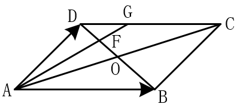
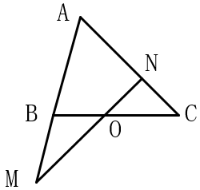
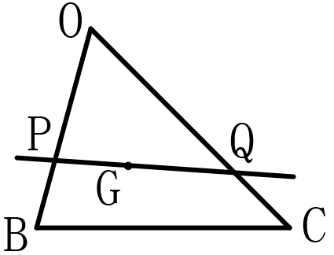
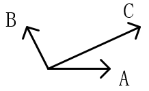
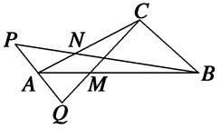

# 高中数学练习_向量

[TOC]

## 做题关键词

***.**如果题中有一个点P，要注意点P，可能的位置。如果没有限定，则自己画个即可。如果有限定，要确定准确

- 点与图形。在$\triangle ABC$内有一点D，和在$\triangle ABC$所在平面内有一点D，这两种表述是不同的。
  - 前者是点D在三边之内，且不能在边上
  - 后者是在哪都可以
- 点在向量上所在直线上。需要注意向量的方向和长度
  - 点D满足在$\vec{AB} = 2\vec{AD}$，那么点D必然在线段AB上，且是线段AB二等分点
  - 点D满足在$\vert \vec{AB} \vert= 2\vert\vec{AD}\vert$，则点D可能在线段AB上，也可能在射线BA上

## 1.基本概念题(向量的基本概念)

　　需要注意的事，零向量方向是任意的，与任一向量平行。

**1.**判断下列描述的对错，说明理由

- 若向量$\pmb{a}$与$\pmb{b}$同向，且$\vert \pmb{a} \vert > \vert \pmb{b} \vert$,则$\pmb{a}>\pmb{b}$      （错。向量有大小也有方向，不能直接进行比较大小，只能比较长度的大小）
- 若向量$\vert\pmb{a}\vert =\vert \pmb{b}\vert$，则$\pmb{a}$与$\pmb{b}$的长度相等且方向相同或相反  （错。长度相等，并不能确定方向信息）
- 对于任意向量$\vert\pmb{a}\vert =\vert \pmb{b}\vert$，若$\pmb{a}$与$\pmb{b}$方向相同，则$\pmb{a}=\pmb{b}$  （对。长度相等，方向相同，就是相等向量）
- 因为零向量方向不确定，所以零向量与任一向量都不平行  （错。零向量与任意向量都平行）
- 若向量$\pmb{a}$与$\pmb{b}$平行，则向量$\pmb{a}$与$\pmb{b}$方向相同或者方向相反  （错。零向量）

2.判断下列命题的正误：

- 若向量$\pmb{a}$，$\pmb{b}$共线，则向量$\pmb{a}$，$\pmb{b}$所在的直线平行      （错）
- 若向量$\pmb{a}$，$\pmb{b}$所在的直线为异面直线，则向量$\pmb{a}$，$\pmb{b}$一定不共面    （错）
- 若三个向量$\pmb{a}$，$\pmb{b}$，$\pmb{c}$两两共面，则向量$\pmb{a}$，$\pmb{b}$，$\pmb{c}$，共面；  （错）
- 已知空间的三个向量$\pmb{a}$，$\pmb{b}$，$\pmb{c}$，则对于空间的任意一个向量总$\pmb{p}$存在实数*x*，*y*，*z*使得$\pmb{a}=x\pmb{a}+y\pmb{b}+z\pmb{c}$   （错）

3.化简$\vec{AC}-\vec{BD}+\vec{CD}-\vec{AB}$得          （D）

　　A.$\vec{AB}$  A.$\vec{DA}$  A.$\vec{BC}$  A.$\vec{0}$  

4.设$\pmb{a}_0,\pmb{b}_0$分别是$\pmb{a},\pmb{b}$方向的单位向量，则下列结论中，正确的是   （C）

　　A.$\pmb{a}_0=\pmb{b}_0$  B.$\pmb{a}_0 \cdot\pmb{b}_0=1$  C.$\vert\pmb{a}_0\vert+\vert\pmb{b}_0\vert=2$  C.$\vert\pmb{a}_0+\pmb{b}_0\vert=2$

## 2.一个向量用两外几个向量的表示(不带参数)

方法：找一个合适的三角形，将这个向量往目标向量上转化。有时候可能需要找两个三角形，转化两次。合适的三角形特征是，边与目标向量有关的。

　　此类题难度不大，按照题意，一步一步的转化即可。注意：

- 关于图形：如果题中给出图形，就用题中图形。如果没有给出，就需要自己画，画的原则是，满足题意，不能和题意有矛盾。
  - 如果有点，要准确的确定点的位置，几等分点等等
  - 可能还需要用到三角形相似的理论

**1.**设D为$\triangle ABC$所在的平面内一点，$\vec{BC}=3\vec{CD}$,则        (A)

**A.**$\vec{AD} = -\frac{1}{3}\vec{AB}+\frac{4}{3}\vec{AC}$    **B.**$\vec{AD} = \frac{1}{3}\vec{AB}-\frac{4}{3}\vec{AC}$   

**C.**$\vec{AD} = \frac{4}{3}\vec{AB}+\frac{1}{3}\vec{AC}$     **D.**$\vec{AD} = \frac{4}{3}\vec{AB}-\frac{1}{3}\vec{AC}$

**2.** 如图，平行四边形$ABCD$中，若$\vec{AB}=\pmb{a}$,$\vec{AD}=\pmb{b}$,设AC与BD相交于点O，F是线段OD的中点，AF的延长线交DC于点G，试用$\pmb{a}$与$\pmb{b}$表示$\vec{AG}$

**3.**已知点M是$\triangle ABC$的边BC的中点，点E在边AC上，且$\vec{EC} =2\vec{AE}$，则向量$\vec{EM}=$

A.$\frac{1}{2}\vec{AC}+\frac{1}{3}\vec{AB}$  B.$\frac{1}{2}\vec{AC}+\frac{1}{6}\vec{AB}$  C.$\frac{1}{6}\vec{AC}+\frac{1}{2}\vec{AB}$  D.$\frac{1}{6}\vec{AC}+\frac{3}{2}\vec{AB}$

4.设M为平行四边形ABCD对角线的交点，O为平行四边形ABCD所在平面对的任意一点，则$\vec{OA}+\vec{OB}+\vec{OD}+\vec{OD}$等于               （D）

　　A.$\vec{OM}$   B.$2\vec{OM}$   C.$3\vec{OM}$    D.$4\vec{OM}$

5.在等腰梯形ABCD中，$\vec{AB}=-2\vec{CD}$，M为BC的中点，则$\vec{AM}=$                （B）

　　A.$\frac{1}{2}\vec{AB}+\frac{1}{2}\vec{AD}$   B.$\frac{3}{4}\vec{AB}+\frac{1}{2}\vec{AD} $  C.$\frac{3}{4}\vec{AB}+\frac{1}{4}\vec{AD} $  D.$\frac{1}{2}\vec{AB}+\frac{3}{4}\vec{AD}$

6.已知O,A,B,C为同一个平面内的四个点，若$2\vec{AC}+\vec{CB}=\pmb{0}$,则向量$\vec{OC}$等于      （C）

　　A.$\frac{2}{3}\vec{OA}-\frac{1}{3}\vec{OB}$  B.$-\frac{1}{3}\vec{OA}+\frac{2}{3}\vec{OB} $  C.$2\vec{OA}-\vec{OB} $  D.$-\vec{OA}+2\vec{OB}$

## 3.一个向量用另外几个向量的表示(带参数，求参数相关)

　　带参数，一般是求参数之间的关系，或者确定参数的具体值

　　方法：在一个向量等式中有两个未知数时，可用等号两遍对应系数相等来确定参数的范围

1.在$\triangle ABC$中，点M、N满足$\vec{AM}=2\vec{MC}$,$\vec{BN}=3\vec{NC}$，若$\vec{MN}=x\vec{AB}+y\vec{AC}$,则$x、y$分别为   （$\frac{1}{2},-\frac{1}{6}$）

2.已知向量$\vec{AB}$与$\vec{AC}$的夹角为$120^\circ$,且$\vert \vec{AB}\vert =3$,$\vert \vec{AC}\vert =2$,若$\vec{AP}=\lambda \vec{AB}+\vec{AC}$，且$\vec{AP}\perp\vec{BC}$，则实数$\lambda$的值为         （$\frac{7}{12}$）

**3.**如图所示，在$\triangle ABC$中，点O是BC的中点，过点O的直线分别交直线AB、AC于不同的两点M、N，若$\vec{AB}=m\vec{AM}$，$\vec{AC}=m\vec{AN}$，则m+n的值是多少

**4.**如图，经过$\triangle OBC$的重心G的直线与OA、OB分别交于点P、Q，设$\vec{OP} = m\vec{OB}$,$\vec{OQ} = n\vec{OC}$,$m,n \in R$,则$\frac{1}{m}+\frac{1}{n}$的值为多少

5.如图，已知平面内有三个向量$\vec{OA},\vec{OB},\vec{OC}$，其中$\vec{OA},\vec{OB}$的夹角为$120^\circ$,$\vec{OA},\vec{OC}$的夹角为$30^\circ$,且$\vert \vec{OA}\vert=\vert \vec{OB}\vert=1$，$\vert \vec{OC}\vert=2\sqrt{3}$,若$\vec{OC}=\lambda\vec{OA}+\mu\vec{OB}(\lambda,\mu \in R)$,则$\lambda+\mu=$  （6）

6.在梯形ABCD中，AB//CD，AB=2CD，M、N分别为CD、BC的中点，若$\vec{AB} = \lambda \vec{AM}+\mu\vec{AN}$,则$\lambda+\mu$等于多少

## 4.计算两个向量的数量积

　　一般不好直接计算，需要将向量转化用其他向量表示，在进行计算

1.已知等边三角形$\triangle ABC$的边长为2，若$\vec{BC}=3\vec{BE}$，$\vec{AD}=\vec{DC}$，则$\vec{BD} \cdot  \vec{AE}=?$

2.在平行四边形ABCD中，$AP\perp BD$，垂足为P，且AP=3，则$\vec{AP}\cdot  \vec{AC}$

3.平行四边形ABCD，$\vert \vec{AB} \vert=6$,$\vert \vec{AD} \vert=4$,若点M、N满足$\vec{BM}=3\vec{MC}$，$\vec{DN}=2\vec{NC}$，则$\vec{AM} \cdot  \vec{NM}=$                (9)

4.已知在直角$\triangle ABC$中，斜边AB的长为6，M、N是斜边AB上距离为4的两点，且$\vec{MA}+\vec{NB}=\pmb{0}$，那么$\vec{CM} \cdot \vec{CN}=$                （5）

5.已知正方向ABCD的边长为2，E为CD的中点，则$\vec{AE}\cdot\vec{BD}=$      (2)

## 5.向量坐标的相关计算

### 5.1带参数的平行、垂直，确定参数

方法：不管多么复杂，只要将平行和垂直两边的向量化成一个坐标形式即可，然后再用相关的公式。

- $复杂向量1//复杂向量2$,转危化$(x_1,y_1)//(x_2,y_2)$，再用$\frac{x_1}{y_1}=\frac{x_2}{y_2}$,或$\frac{x_1}{x_2}=\frac{y_1}{y_2}$，或$x_1y_2=x_2y_1$,解出参数的值
- $复杂向量1\perp复杂向量2$，转危化$(x_1,y_1)\perp(x_2,y_2)$，再用$x_1x_2+y_1y_2=0$,解出参数的值

1.已知向量$\pmb{a} = (m,4)$,$\pmb{b} = (3,-2)$,且$\pmb{a}//\pmb{b}$,则m=           （-6）

2.已知向量$\pmb{a} = (3,1)$,$\pmb{b} = (x,3)$,且$\pmb{a}\perp\pmb{b}$,则$x=$       （1）

3.已知向量$\pmb{a} = (1,m)$,$\pmb{b} = (3,-2)$,且$(\pmb{a}+\pmb{b})\perp\pmb{b}$,则m=    (8)

4.设向量$\pmb{a} = (x, x+1)$,$b = (1,2)$,且$\pmb{a}\perp \pmb{b}$,则$x$=           ($-\frac{2}{3}$)

5.已知向量$\pmb{a} = (1, -1)$,$\pmb{b} = (6, -4)$,若$\pmb{a}\perp(t\pmb{a}+\pmb{b})$,则实数t的值为 （-5）

6.设向量$\pmb{a}  = (2,4)$与向量$\pmb{a}  = (x,6)$共线，则实数$x$=        (3)

7.设$\pmb{a} = (1,2)$,$\pmb{b} = (1,1)$,$\pmb{c}=\pmb{a}+k\pmb{b}$,若$\pmb{b}\perp\pmb{c}$,则实数k的值等于   （$-\frac{3}{2}$）

### 5.2点、向量的坐标

1.若向量$\vec{AB} = (1,2)$,$\vec{BC} = (3,4)$,则$\vec{AC} =$        ( (4,6))

2.若$\vec{OA}=(2,8),\vec{OB}=(-7,2)$,则$\frac{1}{3}\vec{AB}=$     （(-3,-2)）

3.设向量$\pmb{a} = (m,1)$,$\pmb{b} = (1,2)$,且$\vert \pmb{a} + \pmb{b} \vert ^2= \vert \pmb{a}  \vert ^2 + \vert + \pmb{b} \vert ^2$,则m=   （-2）

4.已知向量$\vec{BA} = (\frac{1}{2},\frac{\sqrt{3}}{2})$,$\vec{BC} = (\frac{\sqrt{3}}{2},\frac{1}{2})$,则$\angle ABC=$    $30^\circ$

5.已知非零向量$\pmb{m}$,$\pmb{n}$满足$4 \vert \pmb{m} \vert = 3\vert \pmb{n} \vert$,$\cos<\pmb{m},\pmb{n}> = \frac{1}{3}$,若$\pmb{n}\perp(t\pmb{m}+\pmb{n})$,则 实数t的值为             （-4）

7.已知向量$\pmb{a}=(1,\sqrt{3})$,$\pmb{b}=(\sqrt{3},1)$,则$\pmb{a}$与$\pmb{b}$夹角的大小为      （$\frac{\pi}{6}$）

11.设$\pmb{a}$与$\pmb{b}$不平行，向量$\lambda \pmb{a}+\pmb{b}$与$\pmb{a}+2\pmb{b}$平行，则实数$\lambda$=   ($\frac{1}{2}$)

12.已知点$A=(0,1)$,$B=(3,2)$,向量$\vec{AC} = (-4,-3)$,则向量$\vec{BC}=$ (-7,-4)

14.已知向量$\pmb{a} = (1,2)$,$\pmb{b} = (3,1)$,则$\pmb{b}-\pmb{a}=$     ((2,-1))

15.向量$\pmb{a} = (1,1)$,$\pmb{b} = (1,-2)$,则$(2\pmb{a}+\pmb{b}) \cdot \pmb{a}$=         (1)

16.已知向量$\pmb{a} = (2,1)$,$\pmb{b} = (1,-2)$,若$m\pmb{a}+n\pmb{b}=(9,-8)(m,n \in R)$,则$m-n$的值为            （-3）

18.在下列向量组中，可以把向量$\pmb{a}=(3,2)$表示出来的是          （B）

　　A.$\pmb{e_1} = (0,0),\pmb{e_2} = (1,2)$  B.$\pmb{e_1} = (-1,2),\pmb{e_2} = (5,-2)$ C.$\pmb{e_1} = (3,5),\pmb{e_2} = (6,10)$   D.$\pmb{e_1} = (2,-3),\pmb{e_2} = (-2,3)$

19.已知点$A(1,3)$,$B(4,-1)$,则与向量$\vec{AB}$同方向的单位向量为   （）

　　A.$(\frac{3}{5},-\frac{4}{5})$  B.$(\frac{4}{5},-\frac{3}{5})$  C.$(-\frac{3}{5},\frac{4}{5})$   D.$(-\frac{4}{5},\frac{3}{5})$

20.设向量$\pmb{a} = (1,2m)$,$\pmb{b} = (m+1,1)$,$\pmb{c} = (2,m)$,若$(\pmb{a}+\pmb{c})\perp\pmb{b}$,则$\vert\pmb{a}\vert$ =  ($\sqrt{2}$)

21.在四边形ABCD中，$\vec{AC} = (1,2)$,$\vec{BD} = (-4,2)$，则该四边形的面积为             （5）

22.在平面直角坐标系$xOy$中，已知四边形ABCD为平行四边形，$\vec{AB} = (1,-2)$,$\vec{AD} = (2,1)$,则$\vec{AD}\cdot \vec{AC} =$           （5）

23.已知向量$\pmb{a} = (1,\sqrt{3})$,$\pmb{b} = (3,m)$,若向量$\pmb{a}、\pmb{b}$夹角为$\frac{\pi}{6}$,则实数m=      (\sqrt{3}) 

24.若平面向量$\pmb{a} = (-1,2)$与$\pmb{b}$的夹角是$180^\circ$，且$\vert \pmb{b} \vert=3\sqrt{5}$,则$\pmb{b}$的坐标为      （(3,-6)）

25.设向量$\pmb{a} = (m,1)$,$\pmb{a} = (2,-3)若满足$$\pmb{a}//\pmb{b}$,则m=             ($-\frac{2}{3}$)

26.在平面直角坐标系$xOy$中，点$A(1,3)$,$B(-2,k)$,若向量$\vec{OA}\perp\vec{AB}$,则实数k=    (4)

27.设向量$\pmb{a} = (-1,2)$,$\pmb{b} = (m,1)$,如果向量$\pmb{a}+2\pmb{b}$与$\pmb{a}-2\pmb{b}$平行，那么$\pmb{a}$与$\pmb{b}$的数量积等于    （$\frac{5}{2}$）

28.已知$\pmb{a}=(1,2)$,$\pmb{b}=(\lambda,1)$,$\pmb{c}=(3,3)$,且$(2\pmb{a}-3\pmb{b})\perp\pmb{c}$,则$\lambda=$             (1)

29.已知$\pmb{a}=(2,3)$,$\pmb{b}=(x,-2)$,且$\pmb{a}$与$2\pmb{a}-\pmb{b}$共线，则实数$x$的值为        （$-\frac{4}{3}$）

30.已知$\pmb{a}=(1,1)$,$\pmb{b}=(-2,-2)$,$\pmb{c}=k\pmb{a}+\pmb{b}(k \in R)$,且$\pmb{c}$与$\pmb{a}$的夹角为$\frac{\pi}{4}$,则k =     (2)

31.已知$\pmb{a}=(4,3)$,$\pmb{b}=(-2,1)$,如果向量$\pmb{a}+\lambda\pmb{b}$与$\pmb{b}$垂直，那么$\vert2\pmb{a}-\lambda b\vert$的值为         （$5\sqrt{5}$）

32.在平面直角坐标系$xOy$中，已知$\vec{OA}=(-1,t),\vec{OB}=(2,2)$,若$\angle ABO=90^\circ$,则实数$t$的值为  （5）

33.已知向量$\pmb{a}=(1,0)$，$\pmb{b}=(1,1)$，则

　　I )与$2\pmb{a}+b$同向的单位向量的坐标表示为多少    （$(\frac{3\sqrt{10}}{10},\frac{\sqrt{10}}{10})$）

　　II)向量$b-3\pmb{a}$与$\pmb{a}$的夹角的余弦值为             （$-\frac{2}{5}\sqrt{5}$）  

35.向量$\pmb{a},\pmb{b}$中，若$\pmb{a}=(4,-3)$,$\vert\pmb{b}\vert=1$,且$\pmb{a}\cdot\pmb{b}=5$，则$\pmb{b}=$   （($\frac{4}{5}$,$-\frac{3}{5}$)）

36.$\pmb{a}=(1,2),\pmb{b}=(-3,2)$,当k为何值时，$k\pmb{a}+\pmb{b}$与$\pmb{a}-3\pmb{b}$垂直？$k\pmb{a}+\pmb{b}$与$\pmb{a}-3\pmb{b}$平行？平行时同向还是反向？ （19；$-\frac{1}{3}$,反向）

37.若$\pmb{\alpha},\pmb{\beta}$是一组基底，向量$\gamma=x\alpha+y\beta (x，y\in R)$,则称(x，y)为向量$\gamma在基$底$\alpha,\beta$下的坐标，现已知向量$\pmb{a}$在基底$\pmb{p}=(1,-1),\pmb{q}=(2,1)$下的坐标为(－2,2)，则$\pmb{a}$在另一组基底$\pmb{m}=(-1,1),\pmb{n}=(1,2)$下的坐标为	 （(0,2)）

## 6.数量积、模、投影、夹角、平行、垂直小题计算

1.已知$\vec{e_1},\vec{e_2}$是平面单位向量，且$\vec{e_1}\cdot \vec{e_2}=\frac{1}{2}$,若平面向量$\pmb{b}$满足$\pmb{b}\cdot \pmb{e_1}=\pmb{b}\cdot \pmb{e_2}=1$,则$\vert\pmb{b}\vert=$              （$\frac{2\sqrt{3}}{3}$）

2.已知向量$\pmb{a},\pmb{b}$满足$\vert\pmb{a}\vert=1$,$\pmb{b}=(2,1)$,且$\lambda \pmb{a}+ \pmb{b}= \pmb{0}(\lambda \in R)$,则$\vert\lambda\vert=$      ($\sqrt{5}$)

3.已知单位向量$\pmb{e_1},\pmb{e_2}$的夹角为$\alpha$,且$\cos \alpha=\frac{1}{3}$,若向量$\pmb{a}=3\pmb{e_1}-2\pmb{e_2}$,则$\vert\pmb{a}\vert=$   （3）

4.已知两个非零向量$\pmb{a},\pmb{b}$满足$\pmb{a}\cdot(\pmb{a}-\pmb{b})=0$,且$2\vert \pmb{a}\vert = \vert \pmb{b}\vert$,则$<\pmb{a},\pmb{b}>=$      ($60^\circ$)

5.已知非零向量$\pmb{a},\pmb{b}$的夹角为$\frac{\pi}{3}$,且$\vert\pmb{b}\vert=1$,$\vert\pmb{b}-2\pmb{a}\vert=1$,则$\vert\pmb{a}\vert=$         （$\frac{1}{2}$）

6.已知单位向量$\pmb{m},\pmb{n}$的夹角为$60^\circ$,记$\pmb{a}=\pmb{n}-\pmb{m}$,$\pmb{b}=2\pmb{m}$,则向量$\pmb{a},\pmb{b}$的夹角为    （$120^\circ$）

7.已知向量$\vert\pmb{a}\vert=1$,$\vert\pmb{b}\vert=2$,$<\pmb{a},\pmb{b}>=\frac{\pi}{3}$,则$\vert\pmb{a}+\pmb{b}\vert=$   ($\sqrt{7}$)

8.已知向量$\pmb{a},\pmb{b}$的夹角为$\frac{3\pi}{4}$,$\vert\pmb{a}\vert=\sqrt{2}$,$\vert\pmb{b}\vert=2$,则$\pmb{a}\cdot(\pmb{a}-2\pmb{b})=$    （6）

9.已知向量$\pmb{a},\pmb{b}$满足$(\pmb{a}+2\pmb{b})(\pmb{a}-\pmb{b})=-6$,且$\vert \pmb{a} \vert=1,\vert \pmb{b} \vert=2$,则向量$\pmb{a},\pmb{b}$的夹角为  （$\frac{\pi}{3}$）

10.已知非零向量$\pmb{a},\pmb{b}$满足$\vert\pmb{b}\vert=4\vert\pmb{a}\vert$,且$\pmb{a}\perp(2\pmb{a}+\pmb{b})$,则向量$\pmb{a},\pmb{b}$的夹角为      （$\frac{2\pi}{3}$）

11.设向量$\pmb{a},\pmb{b}$满足$\vert\pmb{a}+\pmb{b}\vert=\sqrt{10}$,$\vert\pmb{a}-\pmb{b}\vert=\sqrt{6}$,则$\pmb{a}\cdot\pmb{b}=$        （1）

12.在$\triangle ABC$中，AB=2,AC=3,$\vec{AB} \cdot \vec{BC}=1$,则BC=             （$\sqrt{3}$）

13.已知向量$\pmb{a},\pmb{b}$的夹角为$45^\circ$,且$\vert\pmb{a}\vert=1$,$\vert2\pmb{a}-\pmb{b}\vert = \sqrt{10}$,则$\vert\pmb{b}\vert=$    （$3\sqrt{2}$）

14.若非零向量$\pmb{a},\pmb{b}$满足$\vert\pmb{a}\vert = \vert3\pmb{b}\vert=\vert\pmb{a}+2\pmb{b}\vert$,则向量$\pmb{a},\pmb{b}$夹角的余弦值为    （$-\frac{1}{3}$）

16.若$\vert\pmb{a}\vert=3,\vert\pmb{b}\vert=2$,且$\pmb{a},\pmb{b}$的夹角为$60^\circ$,则$\vert \pmb{a}-\pmb{b}\vert=$    （$\sqrt{7}$）

17.已知向量$\pmb{a},\pmb{b}$的夹角为$60^\circ$，$\vert\pmb{b}\vert=4$,$(\pmb{a}+2\pmb{b})\cdot(\pmb{a}-3\pmb{b})=-7$,则$\vert\pmb{a}\vert=$   （6）

18.$\vert\pmb{a}\vert=3,\vert\pmb{b}\vert=4$，向量$\pmb{a}+\frac{3}{4}\pmb{b}$与$\pmb{a}-\frac{3}{4}\pmb{b}$的位置关系为    （A）

　　A.垂直   B.平行   C.夹角为$\frac{\pi}{3}$  D.不平行也不垂直

19.已知$\pmb{i},\pmb{j}$为互相垂直的单位向量，$\pmb{a} = \pmb{i}-2\pmb{j}，$$\pmb{b} = \pmb{i}+\lambda \pmb{j}$，且$\pmb{i},\pmb{j}$的夹角为锐角，则实数$\lambda$的取值范围是                     （$(-\infty,-2)\cup(-2,\frac{1}{2})$）

20.已知向量$\pmb{a},\pmb{b},\pmb{c}$中任意两个都不共线，并且$\pmb{a}+\pmb{b}$与$\pmb{c}$共线，$\pmb{b}+\pmb{c}$与$\pmb{a}$共线，则$\pmb{a}+\pmb{b}\pmb{c}$等于         （D）

　　A.$\pmb{a}$    B.$\pmb{b}$    C.$\pmb{c}$    D.$\pmb{0}$

21.已知A,B,C是圆O上不同的三点，线段CO与线段AB交于点D，若$\vec{OC}=\lambda\vec{OA}+\mu\vec{OB}(\lambda>0,\mu>0)$,则$\lambda+\mu$的取值范围是           （B）

　　A.(0,1)   B.(1,$+\infty$)   C.(1,$\sqrt{2}$)   D.(0,$\sqrt{2}$)

22.已知平面上不共线的四点O，A，B，C，若$\vec{OA}+2\vec{OC}=3\vec{OB}$，则$\frac{\vert\vec{BC}\vert}{\vert\vec{AB}\vert}$的值为        （$\frac{1}{2}$）

23.已知$\vert \vec{a} \vert = 8$,$\vec{e}$为单位向量，$\vec{a}$与$\vec{e}$的夹角为$150^\circ$,则$\vec{a}$在$\vec{e}$方向上的投影为多少

24.已知$\vert \vec{a} \vert = 6$，$\vert \vec{b} \vert =3$，$\vec{a} \cdot  \vec{b}=-12$,则向量$\vec{a}$在$\vec{b}$方向上的投影为   （-4）

25.设向量$\pmb{a},\pmb{b}$满足$\vert\pmb{a}\vert=\vert\pmb{b}\vert=1$,$\vert3\pmb{a}-2\pmb{b}\vert=\sqrt{7}$,求a，b夹角的大小（$\frac{\pi}{3}$）

## 7.三点共线、三角形重心、面积、三角形、四边形的形状问题

**1.**若点O是$\triangle ABC$所在平面内的一点，且满足$\vert\vec{OB}-\vec{OC}\vert = \vert\vec{OB}+\vec{OC}-2\vec{OA}\vert $,则$\triangle ABC$的形状为？  （直角三角形）

2.已知点A、B、C为圆O上的三点，若$\vec{AO}=\frac{1}{2}(\vec{AB}+\vec{AC})$，则$\vec{AB}$与$\vec{AC}$的夹角为        （$90^\circ$）

3.O是平面上一定点，A,B,C是平面上不共线的三个点，动点P满足：$\vec{OP}=\vec{OA}+\lambda(\frac{\vec{AB}}{\vert \vec{AB} \vert}+\frac{\vec{AC}}{\vert \vec{AC} \vert})$,且$\lambda \in[0,+\infty)$,则P的轨迹一定通过$\triangle ABC$的               （B）

　　A.外心   B.内心  C.重心  D.垂心

4.设$\pmb{a},\pmb{b}$是两个不共线向量，$\vec{AB}=2\pmb{a}+p\pmb{b}$,$\vec{BC}=\pmb{a}+\pmb{b}$,$\vec{CD}=\pmb{a}-2\pmb{b}$若A，B，D三点共线，则实数p的值为           （-1）

5.设两个非零向量$\pmb{e_1},\pmb{e_2}$不共线，如果$\vec{AB}=2\pmb{e_1}+3\pmb{e_2}$,$\vec{BC}=6\pmb{e_1}+23\pmb{e_2}$,$\vec{CD}=4\pmb{e_1}-8\pmb{e_2}$,求证：A,B,D三点共线

6.设两个非零向量$\pmb{e_1},\pmb{e_2}$不共线，已知$\vec{AB}=2\pmb{e_1}+k\pmb{e_2}$,$\vec{CB}=\pmb{e_1}+3\pmb{e_2}$,$\vec{CD}=2\pmb{e_1}-\pmb{e_2}$,若A,B,D共线，求k的值      （-8）

7.已知A,B,C是平面上不共线的三点，O是$\triangle ABC$的重心，动点P满足$\vec{OP}=\frac{1}{3}(\frac{1}{2}\vec{OA}+\frac{1}{2}\vec{OB}+2\vec{OC})$，则点P一定为三角形ABC的 　（Ｄ）
　　A．AB边中线的中点　　B．AB边中线的三等分点(非重心)　　C．重心　　D．AB边的中点

8.若点M是$\triangle ABC$所在平面内的一点，且满足$5\vec{AM}=\vec{AB}+3\vec{AC}$，则$\triangle ABM$与$\triangle ABC$的面积比为           （$\frac{3}{5}$）	

9.如图所示，在$\triangle ABC$中，在AC上取一点N，使得$\vec{AN}=\frac{1}{3}\vec{AC}$，在AB上取一点M，使得$\vec{AM}=\frac{1}{3}\vec{AB}$，在BN的延长线上取点P，使得$\vec{NP}=\frac{1}{2}\vec{BN}$，在CM的延长线上取点Q，使得$\vec{MQ}=\lambda\vec{CM}$时，$\vec{AP}=\vec{QA}$，试确定$\lambda$的值 （$\frac{1}{2}$）

10.已知点G是$\triangle ABO$的重心，M是AB边的中点。(1)求$\vec{GA}+\vec{GB}+\vec{GO}$；(2)若PQ过$\triangle ABO$的重心G，且$\vec{OA}=\pmb{a}$，$\vec{OB}=\pmb{b}$,$\vec{OP}=m\pmb{a}$,$\vec{OQ}=n\pmb{b}$,求证：$\frac{1}{m}+\frac{1}{n}=3$

## 8.取值范围、不等式、最值问题

1.在$\triangle ABC$中，$A=120^\circ$,$\vec{AB} \cdot \vec{AC}=-1$，则$\vert\vec{BC}\vert$的最小值是          （$\sqrt{6}$）

2.已知向量$\pmb{a}=(\sin\theta,1)$,$\pmb{b}=(1,\cos\theta)$,$-\frac{\pi}{2}<\theta<\frac{\pi}{2}$,求$\vert\pmb{a}+\pmb{b}\vert$的最大值   （$\sqrt{2}+1$）  

3.设$\vec{OA}=(1,-2)$，$\vec{OB}=(a,-1)$,$\vec{OC}=(-b,0)$,$a>0,b>0$，O为坐标原点，若A，B，C三点共线，则$\frac{1}{a}+\frac{2}{b}$的最小值为    （8）

4.若$\vec{AB}=8，\vec{AC}=5$,则$\vec{BC}$的取值范围是多少      （[3,13]）

5.平面上不共线三点A,B,C,若$\vec{AB}=8，\vec{AC}=5$,则$\vec{BC}$的取值范围是多少      （(3,13)）

6.在直角梯形ABCD中，$\angle A＝90^\circ,\angle B＝30^\circ$，$AB=2\sqrt{3},BC=2$,点E在线段CD上，若$\vec{AE}=\vec{AD}+\mu\vec{AB},$则$\mu$的取值范围是    （[$0，\frac{1}{2}$]）

## 9.与其他部分结合问题

1.已知$A(-1,\cos \theta),B(\sin \theta,1)$,若$\vert\vec{OA}+\vec{OB}\vert=\vert\vec{OA}-\vec{OB}\vert$(O为坐标原点)，则锐角$\theta=$    ($\frac{\pi}{4}$)

2.已知正方行ABCD的边长为1，点E是AB边上的动点，则$\vec{DE} \cdot \vec{CB}$的值、$\vec{DE} \cdot \vec{DC}$的最大值分别为           （1,1）

3.已知向量$\pmb{a}=(\cos\theta,\sin\theta),\pmb{b}=(\sqrt{3},-1)$,则$\vert2\pmb{a}-\pmb{b}\vert$的最大值、最小值分别为     （4,0）

4.在$\triangle ABC$中，角A，B，C所对的边分别为a，b，c，设向量$\pmb{p}=(a+c,b),\pmb{q}=(b-a,c-a)$,若$\pmb{p}//\pmb{q}$,则角C的大小为   （$60^\circ$）

5.在平面直角坐标系中，O为坐标原点，已知向量$\pmb{a}=(2,1)$，A(1,0)，B($\cos \theta$，t)。(1)若$\pmb{a}=\vec{AB}$，且$\vert\vec{AB}\vert=\sqrt{5}\vert\vec{OA}\vert$，求向量$\vec{OB}$的坐标；(2)若$\pmb{a}=\vec{AB}$，求$y=\cos^2\theta-\cos\theta+t^2$的最小值。  （(-1,-1),$-\frac{1}{5}$）

6.在$\triangle ABC$中，角A，B，C所对的边分别为a，b，c，已知$\pmb{m} = (\cos\frac{3A}{2},\sin\frac{3A}{2}),\pmb{n}  = (\cos\frac{A}{2},\sin\frac{A}{2})$,且满足$\vert\pmb{m}\vert +\vert\pmb{n}\vert ＝\sqrt3$。(1)求角A的大小；(2)若$\vert\vec{AC}\vert+\vert\vec{AB}\vert=3\vert\vec{BC}\vert$,，试判断△ABC的形状。       （$\frac{\pi}{3}$，直角三角形）

## 10.其它类型

1.设$A_1,A_2,A_3,A_4$是平面直角坐标系中两两不同的四点，若$\vec{A_1A_3}=\lambda \vec{A_1A_2}(\lambda \in R)$，$\vec{A_1A_4}=\mu\vec{A_1A_2}(\mu\in R)$,且$\frac{1}{\lambda}+\frac{1}{\mu}=2$，则称$A_3,A_4$调和分割$A_1,A_2$,已知平面上的点C，D调和分割点A，B，则下列说法正确的是（D）	
　　A．C可能是线段AB的中点　B．D可能是线段AB的中点  C．C、D可能同时在线段AB上  D．C、D不可能同时在线段AB的延长线上

## *.特殊方法解题（慎重使用）

#### 重要说明：

*.在平时做练习中，禁止使用特殊方法做小题，必须要使用相关的公式来推导、计算出结果。在完之后，可以使用特殊方法计算结果，验证答案是否准确。

*.在考试时，优先使用特殊方法，快速准确的解出答案。但是要注意，特殊方法，“特殊”的选择要准确

1.特殊图形法

　　例如：题中有三角形，但是没有说具体是什么三角形，并且通过题中条件也不能确定三角形的种类，那么我们可以选择一种特殊的三角形，例如：直角三角形，等边三角形，再使用相应性质来快速的解出此题

　　方法来源：集合和元素的概念，一个偶数集合，那单拿出数字2，也是偶数，也符合这个偶数集合中元素的所有特征。

2.极限法

　　例如：动直线过一定点，那么我们取这个直线的某种特殊位置，来解题

#### 例题

**1.**如图所示，在$\triangle ABC$中，点O是BC的中点，过点O的直线分别交直线AB、AC于不同的两点M、N，若$\vec{AB}=m\vec{AM}$，$\vec{AC}=m\vec{AN}$，则m+n的值是多少

**2.**如图，经过$\triangle ABC$的重心G的直线与OA、OB分别交于点P、Q，设$\vec{OP} = m\vec{OA}$,$\vec{OQ} = n\vec{OB}$,$m,n \in R$,则$\frac{1}{m}+\frac{1}{n}$的值为多少

