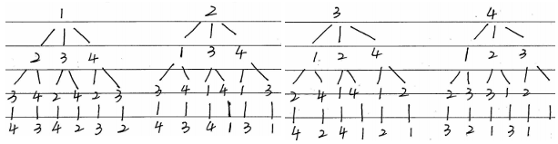

# 高中数学练习_概率与统计

[TOC]

### 1.列举出基本事件，再求概率

要点：根据不同的情况，选择合适的列举方法

例1：一个盒子中装有10个完全相同的球，分别标记号码1,2,3,...,10,从中任取一个球，观察球的号码，写出这个试验的基本事件

解：一一列举，基本事件有10个，$A_1= \lbrace 1 \rbrace,A_2= \lbrace 2 \rbrace,...,A_{10}= \lbrace 10 \rbrace$

例2：袋子中有两个白球和两个黑球，这四个球除了颜色外完全相同，4个人顺序依次从中摸出一球，求基本事件的总数

解：使用树状图列举，把两个白球和两个黑球依次编号1,2,3,4，于是所有可能解果如下：

共有24个基本事件

### 2.古典概型求概率的步骤

设事件，确定基本事件总数，在确定目标事件包含的基本事件数，做比求概率

例1：袋中有大小、形状相同的红、黑球各一个，现在依次有放回地随机摸取3次，每次摸取一个球。问：1）一共有多少种不同的情况，请列出；2）若摸到红球时得2分，摸到黑球得1分，求3次摸球总分为5的概率

解：1）基本事件有8中，分别为(红，红，红)、(红，红，黑)、(红，黑，红)、(红，黑，黑)、(黑，红，红)、(黑，黑，红)、(黑，红，黑)、(黑，黑，黑)。（如果不能列清楚，可以考虑使用树状图）

2）记“3次摸球总分为5”为事件A，事件A包含的基本事件为(红，红，黑)、(红，黑，红)、(黑，红，红)共3个，而基本事件总数为8，所以$P(A)=\frac{3}{8}$

### 3.放回取样与不放回取样

要点：放回与不放回的基本事件总数是不同的

例1：一个盒子中装有完全相同的10个小球，分别标记了1,2,3,...,10这10个数，随机地抽取两个小球，如果：1）小球是放回的；2）小球是不放回的，求两个小球上的数字为相邻整数的概率

解：记事件“两个小球上的数字为相邻整数”为事件A，可能的结果有(1,2)、(2,1)、(2,3)、(3,2)、...、(9,10)、(10,9)共18种

1）如果小球是不放回的，按抽取顺序纪律结果$(x,y)$，则x有10中种可能，y有9种可能，共有90种，所以$P(A)=\frac{18}{90}=\frac{1}{5}$

2）如果小球是放回的，按抽取顺序纪律结果$(x,y)$，则x有10中种可能，y有10种可能，共有100种，所以$P(A)=\frac{18}{100}=\frac{9}{50}$

