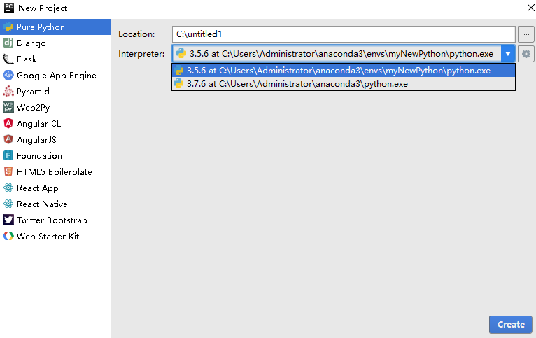

# Python开发相关的配置

[TOC]


## Python开发环境配置

### windows下

#### 开发环境

windows下可以使用anaconda和pycharm开发python程序。

- anaconda：仅用anaconda就可以进行python的学习和相关开发。anaconda可以在[清华大学开源软件镜像站](https://mirror.tuna.tsinghua.edu.cn/help/anaconda/)下载，或者直接[在这里下载](https://mirrors.tuna.tsinghua.edu.cn/anaconda/archive/)，使用清华镜像站的好处是下载速度快，稳定。
  - 安装：anaconda安装比较简单，一直下一步即可，其中有PATH可以勾选的，可以不勾选（目前不勾选没发生什么问题），装好之后在开始搜索“anaconda”，会有如下相关工具列表：
    - spyder：用来编写python代码，运行、调试等等，同时包含了ipython。如果有多个环境，可以在各个环境中都安装一个spyder。
    - Anaconda Prompt：类似windows的cmd，是用来管理conda相关包的，进来后提示：(base) C:\Users\zhang>，其中base是指当前的环境
    - Anaconda Navigator：图形化查看conda中的虚拟环境，各个环境中的库等，进去后点击environment后，会看到一个自带的虚拟环境base，包含了很多库，还可以新建其他虚拟环境，在Anaconda Prompt中的(base)就是指这个环境，如果要操作其他环境，后面会有说明
    - Jupyter Notebook：也可以写python代码，没怎么用过
    - ipython：是一个类似解释器的环境，可以直接写python代码，使用起来很方便，在Anaconda Prompt中，直接敲入 ipython，回车即可启动
  - 软件包：anaconda自带了很多软件，像spyder编辑器、ipyhton
- anaconda和pycharm：单独使用anaconda和spyder不太好切换环境（不同版本的python），在新建一个环境后，要在这个环境下再安装一个spyder，然后启动这个spyder，才能使用这个环境。使用pycharm就可以避免这个问题，pycharm可以直接基于anaconda中的某个环境新建工程。但是在开发pyqt程序时，需要使用一个插件把ui文件转换成py文件，就需要使用pycharm下的插件，不知道spyder中或使用命令行能都编译

#### 新建虚拟环境

在anaconda下可以建立多个虚拟环境，可以设置不同的python版本，各个环境之间只安装需要的库。当某一个环境配置好了之后，会在目录 `C:\Users\Administrator\anaconda3\envs\`下（根据的自己安装时候设置的路径找），以后可以把这个环境文件夹拷贝给其他人，只要她们把环境文件夹放在`envs`下即可。

1. 查看当前具有的环境

   打开`Anaconda Prompt (anaconda3)`，输入如下

   ```
   conda info --env
   ```

   我的结果如下：

   ```
   (base) C:\Users\Administrator>conda info --env
   # conda environments:
   #
   base           *  C:\Users\Administrator\anaconda3
   myNewPython     C:\Users\Administrator\anaconda3\envs\myNewPython
   
   (base) C:\Users\Administrator>
   ```

   结论：

   - (base) 是指，当前所处的环境，base是指anaconda自带的默认环境
   - 这里有两个环境，一个是base，一个是myNewPython，同时给出了路径

2. 新建环境

   输入如下命令：

   ```
   conda create --name 环境名字 python=版本号
   ```

   其中可以指定python的版本号，例如：

   ```
   conda create --name myNewPython python=3.5
   ```

   新建了一个名字叫“myNewPython”、python版本是3.5 的环境。再次查看环境，即可看到新的环境。或者使用pycharm新建工程时，可以看到这个环境

   

   新建好一换个环境后，会默认直接进入到这个环境中（如果没有，还需自己切换），查看这个环境下的库：

   ```
   pip list
   ```

   结果如下：

   ```
   (myNewPython) C:\Users\Administrator>pip list
   Package      Version
   ------------ ---------
   certifi      2018.8.24
   numpy        1.18.5
   pip          10.0.1
   setuptools   40.2.0
   wheel        0.35.1
   wincertstore 0.2
   You are using pip version 10.0.1, however version 20.2.4 is available.
   You should consider upgrading via the 'python -m pip install --upgrade pip' command.
   
   (myNewPython) C:\Users\Administrator>
   ```

   可以看到，这个新的环境下，库很少，只有几个重要的库，其中pip目录可以用来安装其他新的库，例如安装numpy：

   ```
   pip install numpy
   ```

3. 切换到目标环境

   使用activate命令，如下：

   ```
   activate myNewPython
   ```

   结果如下：

   ```
   (myNewPython) C:\Users\Administrator>
   ```

4. 安装需要的库

   使用命令`pip install xxx`，`xxx`是库的名字，可能需要的库如下：

   - ipython：和python解释器功能差不多
   - numpy：
   - spyder：这个spyder启动后，默认的事本环境，而不是base
   - 其他...

5. 验证库是否安装

   启动ipython，输入`import  xxx` 回车即可，如果安装好了，就不会报错

6. 撒旦法


#### spyder中切换不同的Py版本

在目标环境中安装一个spyder即可：

```
pip install spyder
```


#### PyCharm中创建工程

pycharm中可以创建基于不同环境的工程，选择需要的。

1. 新建-工程

   可以看到，有anaconda自带的Python版本，同时这里面有很多的第三方库，例如numpy的等等。还有自己新建的，是3.5版本（之前新建的）。

   如果看不到自己新建的，就在anaconda的安装目录下（大概是`anaconda3\envs`），找到新建的库，选择即可。

   

2. 查看当前工程的Python版本

   ```python
   import sys
   
   print("Python Version {}".format(str(sys.version).replace('\n', '')))
   ```

   结果如下：

   > Python Version 3.5.6 |Anaconda, Inc.| (default, Aug 26 2018, 16:05:27) [MSC v.1900 64 bit (AMD64)]


### Linux下（Ubuntu为例）

在uUbuntu中，也可以使用anaconda中的spyder，或者使用anaconda和pycharm联合开发，也可以仅安装pip，使用pip管理各种库，然后安装虚拟环境管理工具，管理各个虚拟环境。

使用anaconda或者pycharm的部分和windows下差不多，就不写了。主要是介绍一个使用pip和虚拟环境管理工具，使用sublime编辑器，编写python代码

```tip
注意：
这里要说一下的是，如果使用虚拟机中的ubuntu，是不识别显卡的，所以在安装深度学习框架时，安装CPU版本即可
```

1. 安装虚拟环境工具virtualenv、virtualenvwrapper

   在ubuntu中，安装：

   ```shell
   sudo apt install virtualenv
   sudo apt install virtualenvwrapper
   ```

   安装完成之后，进入home目录，输入命令`ls -al`查看是否出现`.virtualenv`s目录，如果没有则手动创建`.virtualenvs`目录，以后新建的环境都会在这个目录下，新安装的库在相应的环境下。

   ```
   mkdir .virtualenvs
   ```

   如果没有权限就加上sudo

   ```tip
   注意：
   环境下不要放工程代码，在其他位置创建工程代码文件夹
   ```

2. 安装Python环境中可以支持虚拟环境的模块

   安装pip：

   ```
   sudo apt update
   sudo apt install python3-pip
   ```

   看当前pip版本

   ```shell
   pip3 --version
   ```

   查看shell管理的相关包

   ```shell
   pip3 list
   ```

   安装虚拟环境工具

   ```
   pip3 install virtualenv
   pip3 install virtualenvwrapper
   ```

   不知道和第一步是否冲突，但是这么做没毛病，如果在安装过程中报如下错误：

   ```
   E: Could not get lock /var/lib/dpkg/lock - open (11: Resource temporarily unavailable) 
   E: Unable to lock the administration directory (/var/lib/dpkg/), is another process using it? 
   ```

   就使用`rm -rf`删除`/var/lib/dpkg/lock - open`

3. 修改配置文件，配置虚拟管理目录

   进入home目录，输入命令ls -al，找到.bashrc文件，修改.bashrc文件。在.bashrc文件末尾添加两行：

   ```shell
   export WORKON_HOME=$HOME/.virtualenvs
   source /usr/share/virtualenvwrapper/virtualenvwrapper.sh
   ```

   启用配置文件：

   ```
   source ~/.bashrc
   ```

4. 查看当前所有环境

   输入`workon`，再按`Tab` 键，就会弹出所有的环境，如果想要选中一个，后边加上名字就可以了

5. 安装不同版本的python

   ```
   sudo apt-get install python3.7
   ```

   如果是3.6版本，那就是python3.6。如果有错误，就相应的修改，安装位置默认如下：

   > /usr/bin/python3.7

6. 新建基于不同版本的环境

   ```
   mkvirtualenv -p /usr/bin/python3.7 py37
   ```

   使用`-p`参数指定python版本（路径），名字为py37的环境。在`.virtualenvs`下有`py37`生成，然后在本级的目录下创建`py37`文件夹，把代码放到这里，不会影响`.virtualenvs`下的`py37`，以后在安装其他包，会在`.virtualenvs/py37`下。

7. 测试环境python版本

   新建一个py文件，位置随意，代码如下：

   ```python
   import sys
    
   print ("Python Version {}".format(str(sys.version).replace('\n', '')))
   ```

   进入改虚拟环境，并且执行该文件：

   ```
   zyl@book:~$ workon 
   demo1    py37     py38     py_envs  
   zyl@book:~$ workon py37
   (py37) zyl@book:~$ ls
   Documents  Music     Public  Templates
   Desktop  Downloads  Pictures  py37    snap  Videos
   (py37) zyl@book:~$ cd py37
   (py37) zyl@book:~/py37$ python test.py 
   Python Version 3.7.5 (default, Nov  7 2019, 10:50:52) [GCC 8.3.0]
   (py37) zyl@book:~/py37$ 
   ```

   注意：这里的python命令是，本环境下的python版本，是`/usr/bin/python3.7`

8. 其他操作：

   - 创建虚拟环境：mkvirtualenv 虚拟环境名称
   - 创建虚拟环境(指定python版本)： mkvirtualenv -p python 虚拟环境名称
   - 查看所有虚拟环境：            workon+2次tab键
   - 使用虚拟环境：               workon 虚拟环境名称
   - 退出虚拟环境：               deactivate
   - 删除虚拟环境（必须先退出虚拟环境内部才能删除当前虚拟环境）: rmvirtualenv 虚拟环境名称
   - 查看虚拟环境中安装的包：              pip freeze  或者 pip list
   - 收集当前环境中安装的包及其版本：       pip freeze > requirements.txt
   - 在部署项目的服务器中安装项目使用的模块： pip install -r requirements.txt

```tip
注意，可能存在的问题：
1. 安装虚拟工具失败：使用rm删除相关报错文件
2. pip install xx失败：可能是网络不好，重试几次
```


### 安装第三方库

可以在线安装，页可以选择离线安装第三方库，需要下载`.whl`文件，以opencv为例（anaconda没有自带），

- 在线安装：`pip install xxx`
- 离线安装：`pip install xxx.whl`，xxx.whl是下载好的离线包

下载第三方库的网站：

- https://www.lfd.uci.edu/~gohlke/pythonlibs/
- https://pypi.org/

**下载离线安装包**

我的Python版本是3.7，搜索如下：

> opencv_python‑4.4.0‑cp37‑cp37m‑win_amd64.whl
> opencv_python‑4.4.0‑cp37‑cp37m‑win32.whl

根据自己的系统，选择对应的下载，我的是64位，选择第一个，下载好whl文件

#### windows下

把下载的`opencv_python‑4.4.0‑cp37‑cp37m‑win_amd64.whl`文件复制到`F:\ProgramData\Anaconda3\Scripts`目录下（自己的安装的路径）

打开`Anaconda Prompt`窗口，执行如下命令：

```
pip install opencv_python‑4.4.0‑cp37‑cp37m‑win_amd64.whl
```

或者不进入这个目录，在执行的时候，使用绝对路径指定这个文件。

安装其他库类似。

#### linux(Ubuntu)下

如果在ubuntu下，也可以使用pip在线安装，`workon`选择目标虚拟环境，`pip install xx`， xx为包的名字。


